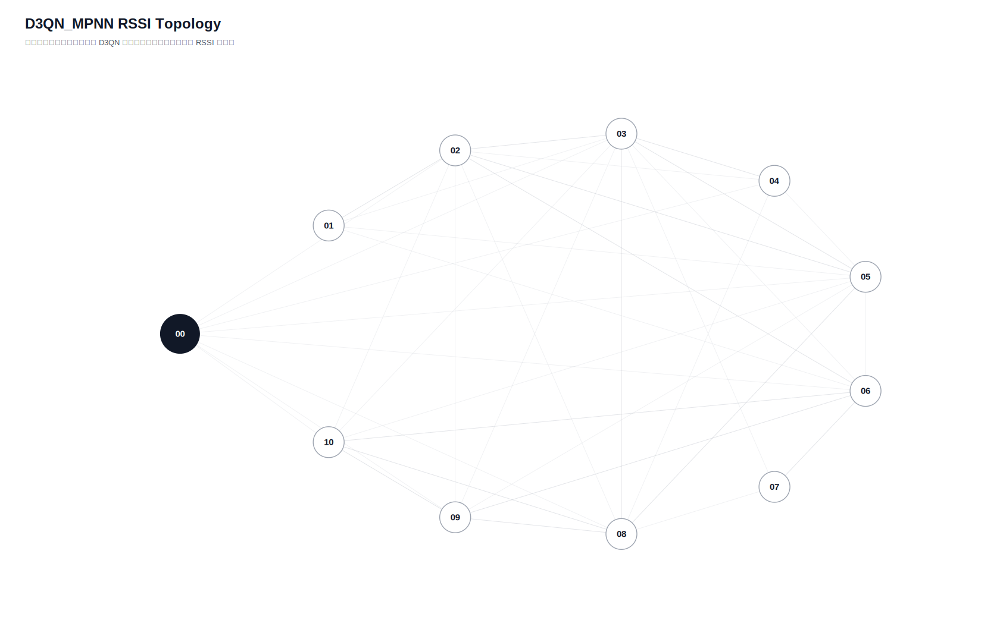

# D3QN_MPNN 真实硬件测试汇总报告

- 日志目录：`app/广播组网上位机/app/logs/d3qn_hw/第1次测试`
- 算法：`D3QN_MPNN`
- 推理策略：`纯D3QN，无Dijkstra fallback，无规则兜底`
- 目标：平均延时约 `150ms`，丢包率 `6%~8%`；若未达标，以真实硬件结果为准。
- Checkpoint：`/home/sueiny/rk3506_linux6.1_v1.2.0/app/广播组网上位机/app/checkpoints/d3qn_mpnn/latest.pt`
- 节点：`01, 02, 03, 04, 05, 06, 07, 08, 09, 10`
- 地址说明：CLI 按十六进制地址解析，因此目标 `10` 表示地址 `0x10`。
- 总发送：`1800`，成功：`0`，失败/timeout：`1800`，总丢包率：`100.00%`
- 端到端平均延时：`n/a`，P95：`n/a`，最小/最大：`n/a` / `n/a`
- 时延抖动均值：`n/a`，时延标准差：`n/a`
- D3QN 路由失败次数：`1800`

## 拓扑图

## 测试结果

| 出发点 | 目标点 | 路径 | D3QN动作 | 成功/发送 | 丢包率 | 点到点平均 | P95 | 推理平均 | D3QN总耗时 | 重采 | 切换 | 最弱 RSSI |
|---|---|---|---:|---:|---:|---:|---:|---:|---:|---:|---:|---:|
| `01` | `02` | `` | `None` | `0/20` | `100.00%` | `n/a` | `n/a` | `14.8ms` | `n/a` | `6` | `20` | `None` |
| `01` | `03` | `` | `None` | `0/20` | `100.00%` | `n/a` | `n/a` | `27.0ms` | `n/a` | `6` | `20` | `None` |
| `01` | `04` | `` | `None` | `0/20` | `100.00%` | `n/a` | `n/a` | `30.0ms` | `n/a` | `6` | `20` | `None` |
| `01` | `05` | `` | `None` | `0/20` | `100.00%` | `n/a` | `n/a` | `28.2ms` | `n/a` | `6` | `20` | `None` |
| `01` | `06` | `` | `None` | `0/20` | `100.00%` | `n/a` | `n/a` | `25.4ms` | `n/a` | `6` | `20` | `None` |
| `01` | `07` | `` | `None` | `0/20` | `100.00%` | `n/a` | `n/a` | `14.2ms` | `n/a` | `6` | `20` | `None` |
| `01` | `08` | `` | `None` | `0/20` | `100.00%` | `n/a` | `n/a` | `21.7ms` | `n/a` | `6` | `20` | `None` |
| `01` | `09` | `` | `None` | `0/20` | `100.00%` | `n/a` | `n/a` | `29.1ms` | `n/a` | `6` | `20` | `None` |
| `01` | `10` | `` | `None` | `0/20` | `100.00%` | `n/a` | `n/a` | `27.9ms` | `n/a` | `6` | `20` | `None` |
| `02` | `01` | `` | `None` | `0/20` | `100.00%` | `n/a` | `n/a` | `30.1ms` | `n/a` | `6` | `20` | `None` |
| `02` | `03` | `` | `None` | `0/20` | `100.00%` | `n/a` | `n/a` | `23.7ms` | `n/a` | `6` | `20` | `None` |
| `02` | `04` | `` | `None` | `0/20` | `100.00%` | `n/a` | `n/a` | `29.6ms` | `n/a` | `6` | `20` | `None` |
| `02` | `05` | `` | `None` | `0/20` | `100.00%` | `n/a` | `n/a` | `40.1ms` | `n/a` | `6` | `20` | `None` |
| `02` | `06` | `` | `None` | `0/20` | `100.00%` | `n/a` | `n/a` | `33.2ms` | `n/a` | `6` | `20` | `None` |
| `02` | `07` | `` | `None` | `0/20` | `100.00%` | `n/a` | `n/a` | `31.3ms` | `n/a` | `6` | `20` | `None` |
| `02` | `08` | `` | `None` | `0/20` | `100.00%` | `n/a` | `n/a` | `40.4ms` | `n/a` | `6` | `20` | `None` |
| `02` | `09` | `` | `None` | `0/20` | `100.00%` | `n/a` | `n/a` | `40.4ms` | `n/a` | `6` | `20` | `None` |
| `02` | `10` | `` | `None` | `0/20` | `100.00%` | `n/a` | `n/a` | `36.7ms` | `n/a` | `6` | `20` | `None` |
| `03` | `01` | `` | `None` | `0/20` | `100.00%` | `n/a` | `n/a` | `31.0ms` | `n/a` | `6` | `20` | `None` |
| `03` | `02` | `` | `None` | `0/20` | `100.00%` | `n/a` | `n/a` | `26.5ms` | `n/a` | `6` | `20` | `None` |
| `03` | `04` | `` | `None` | `0/20` | `100.00%` | `n/a` | `n/a` | `42.1ms` | `n/a` | `6` | `20` | `None` |
| `03` | `05` | `` | `None` | `0/20` | `100.00%` | `n/a` | `n/a` | `45.9ms` | `n/a` | `6` | `20` | `None` |
| `03` | `06` | `` | `None` | `0/20` | `100.00%` | `n/a` | `n/a` | `30.7ms` | `n/a` | `6` | `20` | `None` |
| `03` | `07` | `` | `None` | `0/20` | `100.00%` | `n/a` | `n/a` | `18.9ms` | `n/a` | `6` | `20` | `None` |
| `03` | `08` | `` | `None` | `0/20` | `100.00%` | `n/a` | `n/a` | `35.7ms` | `n/a` | `6` | `20` | `None` |
| `03` | `09` | `` | `None` | `0/20` | `100.00%` | `n/a` | `n/a` | `33.1ms` | `n/a` | `6` | `20` | `None` |
| `03` | `10` | `` | `None` | `0/20` | `100.00%` | `n/a` | `n/a` | `17.1ms` | `n/a` | `6` | `20` | `None` |
| `04` | `01` | `` | `None` | `0/20` | `100.00%` | `n/a` | `n/a` | `22.6ms` | `n/a` | `6` | `20` | `None` |
| `04` | `02` | `` | `None` | `0/20` | `100.00%` | `n/a` | `n/a` | `31.0ms` | `n/a` | `6` | `20` | `None` |
| `04` | `03` | `` | `None` | `0/20` | `100.00%` | `n/a` | `n/a` | `29.5ms` | `n/a` | `6` | `20` | `None` |
| `04` | `05` | `` | `None` | `0/20` | `100.00%` | `n/a` | `n/a` | `41.7ms` | `n/a` | `6` | `20` | `None` |
| `04` | `06` | `` | `None` | `0/20` | `100.00%` | `n/a` | `n/a` | `44.3ms` | `n/a` | `6` | `20` | `None` |
| `04` | `07` | `` | `None` | `0/20` | `100.00%` | `n/a` | `n/a` | `16.3ms` | `n/a` | `6` | `20` | `None` |
| `04` | `08` | `` | `None` | `0/20` | `100.00%` | `n/a` | `n/a` | `21.7ms` | `n/a` | `6` | `20` | `None` |
| `04` | `09` | `` | `None` | `0/20` | `100.00%` | `n/a` | `n/a` | `26.9ms` | `n/a` | `6` | `20` | `None` |
| `04` | `10` | `` | `None` | `0/20` | `100.00%` | `n/a` | `n/a` | `22.9ms` | `n/a` | `6` | `20` | `None` |
| `05` | `01` | `` | `None` | `0/20` | `100.00%` | `n/a` | `n/a` | `23.9ms` | `n/a` | `6` | `20` | `None` |
| `05` | `02` | `` | `None` | `0/20` | `100.00%` | `n/a` | `n/a` | `30.0ms` | `n/a` | `6` | `20` | `None` |
| `05` | `03` | `` | `None` | `0/20` | `100.00%` | `n/a` | `n/a` | `34.1ms` | `n/a` | `6` | `20` | `None` |
| `05` | `04` | `` | `None` | `0/20` | `100.00%` | `n/a` | `n/a` | `35.9ms` | `n/a` | `6` | `20` | `None` |
| `05` | `06` | `` | `None` | `0/20` | `100.00%` | `n/a` | `n/a` | `26.9ms` | `n/a` | `6` | `20` | `None` |
| `05` | `07` | `` | `None` | `0/20` | `100.00%` | `n/a` | `n/a` | `18.2ms` | `n/a` | `6` | `20` | `None` |
| `05` | `08` | `` | `None` | `0/20` | `100.00%` | `n/a` | `n/a` | `27.3ms` | `n/a` | `6` | `20` | `None` |
| `05` | `09` | `` | `None` | `0/20` | `100.00%` | `n/a` | `n/a` | `37.9ms` | `n/a` | `6` | `20` | `None` |
| `05` | `10` | `` | `None` | `0/20` | `100.00%` | `n/a` | `n/a` | `20.9ms` | `n/a` | `6` | `20` | `None` |
| `06` | `01` | `` | `None` | `0/20` | `100.00%` | `n/a` | `n/a` | `29.8ms` | `n/a` | `6` | `20` | `None` |
| `06` | `02` | `` | `None` | `0/20` | `100.00%` | `n/a` | `n/a` | `33.8ms` | `n/a` | `6` | `20` | `None` |
| `06` | `03` | `` | `None` | `0/20` | `100.00%` | `n/a` | `n/a` | `37.2ms` | `n/a` | `6` | `20` | `None` |
| `06` | `04` | `` | `None` | `0/20` | `100.00%` | `n/a` | `n/a` | `28.7ms` | `n/a` | `6` | `20` | `None` |
| `06` | `05` | `` | `None` | `0/20` | `100.00%` | `n/a` | `n/a` | `23.5ms` | `n/a` | `6` | `20` | `None` |
| `06` | `07` | `` | `None` | `0/20` | `100.00%` | `n/a` | `n/a` | `31.6ms` | `n/a` | `6` | `20` | `None` |
| `06` | `08` | `` | `None` | `0/20` | `100.00%` | `n/a` | `n/a` | `26.4ms` | `n/a` | `6` | `20` | `None` |
| `06` | `09` | `` | `None` | `0/20` | `100.00%` | `n/a` | `n/a` | `22.2ms` | `n/a` | `6` | `20` | `None` |
| `06` | `10` | `` | `None` | `0/20` | `100.00%` | `n/a` | `n/a` | `22.2ms` | `n/a` | `6` | `20` | `None` |
| `07` | `01` | `` | `None` | `0/20` | `100.00%` | `n/a` | `n/a` | `51.6ms` | `n/a` | `6` | `20` | `None` |
| `07` | `02` | `` | `None` | `0/20` | `100.00%` | `n/a` | `n/a` | `34.6ms` | `n/a` | `6` | `20` | `None` |
| `07` | `03` | `` | `None` | `0/20` | `100.00%` | `n/a` | `n/a` | `19.0ms` | `n/a` | `6` | `20` | `None` |
| `07` | `04` | `` | `None` | `0/20` | `100.00%` | `n/a` | `n/a` | `30.8ms` | `n/a` | `6` | `20` | `None` |
| `07` | `05` | `` | `None` | `0/20` | `100.00%` | `n/a` | `n/a` | `23.9ms` | `n/a` | `6` | `20` | `None` |
| `07` | `06` | `` | `None` | `0/20` | `100.00%` | `n/a` | `n/a` | `38.4ms` | `n/a` | `6` | `20` | `None` |
| `07` | `08` | `` | `None` | `0/20` | `100.00%` | `n/a` | `n/a` | `27.6ms` | `n/a` | `6` | `20` | `None` |
| `07` | `09` | `` | `None` | `0/20` | `100.00%` | `n/a` | `n/a` | `20.8ms` | `n/a` | `6` | `20` | `None` |
| `07` | `10` | `` | `None` | `0/20` | `100.00%` | `n/a` | `n/a` | `24.9ms` | `n/a` | `6` | `20` | `None` |
| `08` | `01` | `` | `None` | `0/20` | `100.00%` | `n/a` | `n/a` | `25.3ms` | `n/a` | `6` | `20` | `None` |
| `08` | `02` | `` | `None` | `0/20` | `100.00%` | `n/a` | `n/a` | `35.7ms` | `n/a` | `6` | `20` | `None` |
| `08` | `03` | `` | `None` | `0/20` | `100.00%` | `n/a` | `n/a` | `20.6ms` | `n/a` | `6` | `20` | `None` |
| `08` | `04` | `` | `None` | `0/20` | `100.00%` | `n/a` | `n/a` | `19.6ms` | `n/a` | `6` | `20` | `None` |
| `08` | `05` | `` | `None` | `0/20` | `100.00%` | `n/a` | `n/a` | `25.1ms` | `n/a` | `6` | `20` | `None` |
| `08` | `06` | `` | `None` | `0/20` | `100.00%` | `n/a` | `n/a` | `25.6ms` | `n/a` | `6` | `20` | `None` |
| `08` | `07` | `` | `None` | `0/20` | `100.00%` | `n/a` | `n/a` | `31.0ms` | `n/a` | `6` | `20` | `None` |
| `08` | `09` | `` | `None` | `0/20` | `100.00%` | `n/a` | `n/a` | `24.3ms` | `n/a` | `6` | `20` | `None` |
| `08` | `10` | `` | `None` | `0/20` | `100.00%` | `n/a` | `n/a` | `20.2ms` | `n/a` | `6` | `20` | `None` |
| `09` | `01` | `` | `None` | `0/20` | `100.00%` | `n/a` | `n/a` | `16.3ms` | `n/a` | `6` | `20` | `None` |
| `09` | `02` | `` | `None` | `0/20` | `100.00%` | `n/a` | `n/a` | `24.9ms` | `n/a` | `6` | `20` | `None` |
| `09` | `03` | `` | `None` | `0/20` | `100.00%` | `n/a` | `n/a` | `25.9ms` | `n/a` | `6` | `20` | `None` |
| `09` | `04` | `` | `None` | `0/20` | `100.00%` | `n/a` | `n/a` | `33.6ms` | `n/a` | `6` | `20` | `None` |
| `09` | `05` | `` | `None` | `0/20` | `100.00%` | `n/a` | `n/a` | `20.7ms` | `n/a` | `6` | `20` | `None` |
| `09` | `06` | `` | `None` | `0/20` | `100.00%` | `n/a` | `n/a` | `18.2ms` | `n/a` | `6` | `20` | `None` |
| `09` | `07` | `` | `None` | `0/20` | `100.00%` | `n/a` | `n/a` | `23.3ms` | `n/a` | `6` | `20` | `None` |
| `09` | `08` | `` | `None` | `0/20` | `100.00%` | `n/a` | `n/a` | `21.1ms` | `n/a` | `6` | `20` | `None` |
| `09` | `10` | `` | `None` | `0/20` | `100.00%` | `n/a` | `n/a` | `24.2ms` | `n/a` | `6` | `20` | `None` |
| `10` | `01` | `` | `None` | `0/20` | `100.00%` | `n/a` | `n/a` | `38.5ms` | `n/a` | `6` | `20` | `None` |
| `10` | `02` | `` | `None` | `0/20` | `100.00%` | `n/a` | `n/a` | `32.0ms` | `n/a` | `6` | `20` | `None` |
| `10` | `03` | `` | `None` | `0/20` | `100.00%` | `n/a` | `n/a` | `28.1ms` | `n/a` | `6` | `20` | `None` |
| `10` | `04` | `` | `None` | `0/20` | `100.00%` | `n/a` | `n/a` | `22.9ms` | `n/a` | `6` | `20` | `None` |
| `10` | `05` | `` | `None` | `0/20` | `100.00%` | `n/a` | `n/a` | `24.5ms` | `n/a` | `6` | `20` | `None` |
| `10` | `06` | `` | `None` | `0/20` | `100.00%` | `n/a` | `n/a` | `29.9ms` | `n/a` | `6` | `20` | `None` |
| `10` | `07` | `` | `None` | `0/20` | `100.00%` | `n/a` | `n/a` | `25.0ms` | `n/a` | `6` | `20` | `None` |
| `10` | `08` | `` | `None` | `0/20` | `100.00%` | `n/a` | `n/a` | `23.1ms` | `n/a` | `6` | `20` | `None` |
| `10` | `09` | `` | `None` | `0/20` | `100.00%` | `n/a` | `n/a` | `30.6ms` | `n/a` | `6` | `20` | `None` |

## 指标总结对比

| 指标 | 当前值 | 单位 | 说明 |
|---|---:|---|---|
| 算法计算延时 | `28.2ms` | ms | 上位机用 D3QN 算出路径的平均耗时 |
| 指令下发延时 | `n/a` | ms | 当前硬件无中间节点时间戳，用 SEND 到 ACK 总时延近似 |
| 端到端实际传输平均延时 | `n/a` | ms | 现有统计总 ACK 时延 |
| 全局平均丢包率 | `100.00%` | ratio | 总 timeout / 总发送 |
| D3QN 路由失败次数 | `1800` | count | 无候选路径、checkpoint 缺失或模型输入不匹配 |
| 单路径平均跳数 | `0` | hops | 各目标最终路径跳数平均值 |
| 平均单跳传输耗时 | `n/a` | ms/hop | 端到端平均延时 / 跳数折算 |
| RSSI 实时波动范围 | `47` | dB | 当前拓扑边 RSSI 最大值减最小值 |
| RSSI 标准差 | `14.0463` | dB | 当前拓扑边 RSSI 标准差 |
| 时延抖动均值 | `n/a` | ms | 相邻成功 ACK 延时差值均值 |
| 时延标准差 | `n/a` | ms | 成功 ACK 延时标准差 |

## 文件

- [`测试指标汇总.xlsx`](测试指标汇总.xlsx)
- [`拓扑图.txt`](拓扑图.txt)
- [`原始串口日志.log`](原始串口日志.log)
- `原始JSON数据/model_decisions.jsonl`
- `原始JSON数据/d3qn_state.json`

## 来源说明

| 来源 | 含义 |
|---|---|
| `real_rssi` | 由 RSSI_REQ 和 RSSI_REPORT 得到 |
| `real_ack` | 由真实 ACK 成功/timeout 统计得到 |
| `default` | 当前硬件不可直接测量，使用默认值占位 |
| `derived` | 由真实测试记录派生计算得到 |
| `derived_from_rssi` | 训练环境中容量、延时、丢包等不可测字段由真实 RSSI 分段派生 |
