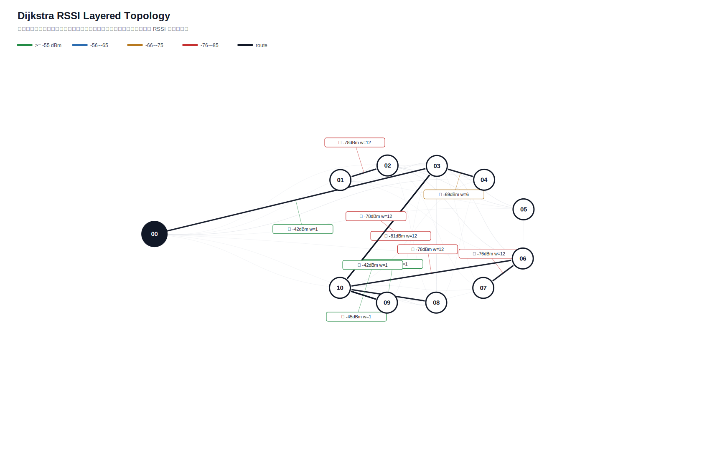

# Dijkstra 真实硬件测试汇总报告

- 生成时间：2026-05-29T01:42:31
- 日志目录：`app/广播组网上位机/app/logs/dijkstra_hw/第1次测试`
- 测试对象：网关 `00`，目标节点 `01, 02, 03, 04, 05, 06, 07, 08, 09, 10`
- 地址说明：CLI 按十六进制地址解析，因此目标 `10` 表示地址 `0x10`。
- 丢包率目标：`4%~6%`，ACK timeout：`2.0s`，是否达标：`否`
- 算法模式：`baseline_dijkstra`
- 最优参数组合：`interval=0.5s, rssi_requests=5, route_mode=baseline_dijkstra`
- 发包间隔：`0.5s`
- 总发送：`1800`，成功：`1501`，失败/timeout：`299`，总丢包率：`16.61%`
- 总体成功 ACK 延时：平均 `84.9ms`，最小 `0.0ms`，最大 `1912.3ms`，P95 `401.4ms`

## 拓扑图

文本拓扑文件：[`拓扑图.txt`](拓扑图.txt)

Excel 汇总文件：[`测试指标汇总.xlsx`](测试指标汇总.xlsx)

## 测试结果

| 出发点 | 目标点 | 路径 | 成功/发送 | 丢包率 | 点到点平均 | P95 | 网关到源 | 网关到目标 | 总延时 | 重采 | 最弱 RSSI |
|---|---|---|---:|---:|---:|---:|---:|---:|---:|---:|---:|
| `01` | `02` | `00 -> 02 -> 01 -> 02` | `14/20` | `30.00%` | `336.6ms` | `1404.0ms` | `101.0ms` | `802.7ms` | `701.7ms` | `2` | `-79` |
| `01` | `03` | `00 -> 02 -> 01 -> 03` | `20/20` | `0.00%` | `94.8ms` | `392.8ms` | `702.9ms` | `101.2ms` | `0.0ms` | `0` | `-79` |
| `01` | `04` | `00 -> 02 -> 01 -> 03 -> 04` | `20/20` | `0.00%` | `75.3ms` | `301.1ms` | `101.0ms` | `101.0ms` | `0.0ms` | `0` | `-79` |
| `01` | `05` | `00 -> 02 -> 01 -> 05` | `20/20` | `0.00%` | `40.2ms` | `301.5ms` | `201.4ms` | `101.0ms` | `0.0ms` | `0` | `-82` |
| `01` | `06` | `00 -> 02 -> 01 -> 02 -> 06` | `19/20` | `5.00%` | `26.4ms` | `401.3ms` | `502.1ms` | `101.0ms` | `0.0ms` | `0` | `-80` |
| `01` | `07` | `00 -> 02 -> 01 -> 02 -> 06 -> 07` | `19/20` | `5.00%` | `100.5ms` | `402.8ms` | `301.6ms` | `201.1ms` | `0.0ms` | `0` | `-80` |
| `01` | `08` | `00 -> 02 -> 01 -> 09 -> 08` | `19/20` | `5.00%` | `95.0ms` | `1403.6ms` | `100.9ms` | `101.0ms` | `0.1ms` | `0` | `-79` |
| `01` | `09` | `00 -> 02 -> 01 -> 09` | `18/20` | `10.00%` | `239.6ms` | `1103.5ms` | `602.3ms` | `201.3ms` | `0.0ms` | `0` | `-79` |
| `01` | `10` | `00 -> 02 -> 01 -> 09 -> 10` | `18/20` | `10.00%` | `44.6ms` | `401.3ms` | `101.5ms` | `101.0ms` | `0.0ms` | `0` | `-79` |
| `02` | `01` | `00 -> 03 -> 02 -> 01` | `17/20` | `15.00%` | `71.3ms` | `502.1ms` | `502.0ms` | `101.2ms` | `0.0ms` | `1` | `-78` |
| `02` | `03` | `00 -> 02 -> 03` | `17/20` | `15.00%` | `17.7ms` | `100.6ms` | `100.8ms` | `100.9ms` | `0.1ms` | `1` | `-79` |
| `02` | `04` | `00 -> 02 -> 03 -> 04` | `20/20` | `0.00%` | `40.2ms` | `100.8ms` | `301.7ms` | `100.9ms` | `0.0ms` | `0` | `-79` |
| `02` | `05` | `00 -> 02 -> 05` | `20/20` | `0.00%` | `65.3ms` | `300.8ms` | `401.8ms` | `101.1ms` | `0.0ms` | `0` | `-85` |
| `02` | `06` | `00 -> 02 -> 03 -> 06` | `18/20` | `10.00%` | `94.2ms` | `1294.8ms` | `100.9ms` | `100.9ms` | `0.0ms` | `0` | `-80` |
| `02` | `07` | `00 -> 02 -> 03 -> 06 -> 07` | `18/20` | `10.00%` | `111.5ms` | `501.6ms` | `301.4ms` | `101.0ms` | `0.0ms` | `0` | `-80` |
| `02` | `08` | `00 -> 02 -> 10 -> 08` | `20/20` | `0.00%` | `90.4ms` | `301.3ms` | `602.6ms` | `101.0ms` | `0.0ms` | `0` | `-79` |
| `02` | `09` | `00 -> 02 -> 10 -> 09` | `17/20` | `15.00%` | `76.7ms` | `702.3ms` | `101.4ms` | `201.4ms` | `100.0ms` | `0` | `-79` |
| `02` | `10` | `00 -> 02 -> 10` | `16/20` | `20.00%` | `169.4ms` | `1907.1ms` | `100.9ms` | `101.0ms` | `0.1ms` | `0` | `-79` |
| `03` | `01` | `00 -> 02 -> 03 -> 02 -> 01` | `20/20` | `0.00%` | `110.4ms` | `301.4ms` | `100.9ms` | `101.1ms` | `0.2ms` | `0` | `-79` |
| `03` | `02` | `00 -> 03 -> 02` | `15/20` | `25.00%` | `214.0ms` | `1504.3ms` | `101.0ms` | `502.2ms` | `401.3ms` | `1` | `-78` |
| `03` | `04` | `00 -> 03 -> 04` | `20/20` | `0.00%` | `20.1ms` | `200.5ms` | `101.0ms` | `100.9ms` | `0.0ms` | `0` | `-69` |
| `03` | `05` | `00 -> 03 -> 00 -> 05` | `19/20` | `5.00%` | `15.9ms` | `100.4ms` | `409.3ms` | `101.0ms` | `0.0ms` | `0` | `-74` |
| `03` | `06` | `00 -> 03 -> 00 -> 06` | `13/20` | `35.00%` | `169.9ms` | `1304.6ms` | `100.7ms` | `101.0ms` | `0.2ms` | `1` | `-60` |
| `03` | `07` | `00 -> 03 -> 00 -> 06 -> 07` | `17/20` | `15.00%` | `135.8ms` | `1404.4ms` | `101.1ms` | `201.3ms` | `100.2ms` | `0` | `-76` |
| `03` | `08` | `00 -> 03 -> 09 -> 08` | `16/20` | `20.00%` | `138.1ms` | `1404.8ms` | `101.0ms` | `100.8ms` | `0.0ms` | `0` | `-44` |
| `03` | `09` | `00 -> 03 -> 00 -> 10 -> 08 -> 09` | `14/20` | `30.00%` | `21.5ms` | `100.4ms` | `1505.9ms` | `100.9ms` | `0.0ms` | `1` | `-60` |
| `03` | `10` | `00 -> 03 -> 04 -> 10` | `14/20` | `30.00%` | `57.3ms` | `601.8ms` | `101.0ms` | `101.1ms` | `0.0ms` | `1` | `-83` |
| `04` | `01` | `00 -> 04 -> 00 -> 02 -> 01` | `18/20` | `10.00%` | `27.9ms` | `401.8ms` | `1204.2ms` | `101.2ms` | `0.0ms` | `0` | `-79` |
| `04` | `02` | `00 -> 04 -> 03 -> 02` | `13/20` | `35.00%` | `100.3ms` | `1002.7ms` | `101.0ms` | `301.3ms` | `200.3ms` | `2` | `-78` |
| `04` | `03` | `00 -> 04 -> 03` | `16/20` | `20.00%` | `106.6ms` | `1103.4ms` | `100.8ms` | `201.2ms` | `100.4ms` | `1` | `-55` |
| `04` | `05` | `00 -> 04 -> 03 -> 05` | `20/20` | `0.00%` | `20.1ms` | `100.4ms` | `201.6ms` | `100.9ms` | `0.0ms` | `0` | `-81` |
| `04` | `06` | `00 -> 04 -> 00 -> 06` | `15/20` | `25.00%` | `133.9ms` | `905.7ms` | `1204.4ms` | `201.3ms` | `0.0ms` | `1` | `-60` |
| `04` | `07` | `00 -> 04 -> 06 -> 07` | `14/20` | `30.00%` | `107.4ms` | `501.5ms` | `101.1ms` | `502.3ms` | `401.3ms` | `2` | `-76` |
| `04` | `08` | `00 -> 04 -> 03 -> 08` | `18/20` | `10.00%` | `55.7ms` | `400.8ms` | `602.1ms` | `101.1ms` | `0.0ms` | `0` | `-85` |
| `04` | `09` | `00 -> 04 -> 09` | `18/20` | `10.00%` | `50.2ms` | `300.9ms` | `101.0ms` | `201.0ms` | `100.1ms` | `0` | `-55` |
| `04` | `10` | `00 -> 04 -> 09 -> 10` | `19/20` | `5.00%` | `132.1ms` | `905.0ms` | `100.9ms` | `100.8ms` | `0.0ms` | `0` | `-55` |
| `05` | `01` | `00 -> 05 -> 02 -> 01` | `17/20` | `15.00%` | `76.5ms` | `598.6ms` | `100.9ms` | `100.8ms` | `0.0ms` | `0` | `-83` |
| `05` | `02` | `00 -> 05 -> 00 -> 02` | `15/20` | `25.00%` | `13.4ms` | `100.5ms` | `1906.5ms` | `101.0ms` | `0.0ms` | `1` | `-79` |
| `05` | `03` | `00 -> 05 -> 03` | `17/20` | `15.00%` | `112.2ms` | `1605.7ms` | `502.7ms` | `100.8ms` | `0.0ms` | `0` | `-74` |
| `05` | `04` | `00 -> 05 -> 03 -> 04` | `19/20` | `5.00%` | `21.1ms` | `200.7ms` | `n/a` | `n/a` | `n/a` | `0` | `-74` |
| `05` | `06` | `00 -> 05 -> 03 -> 06` | `17/20` | `15.00%` | `112.2ms` | `603.7ms` | `100.9ms` | `301.3ms` | `200.4ms` | `0` | `-80` |
| `05` | `07` | `00 -> 05 -> 03 -> 06 -> 07` | `18/20` | `10.00%` | `117.1ms` | `501.1ms` | `602.4ms` | `205.9ms` | `0.0ms` | `0` | `-80` |
| `05` | `08` | `00 -> 05 -> 08` | `18/20` | `10.00%` | `78.0ms` | `401.1ms` | `101.0ms` | `201.3ms` | `100.3ms` | `0` | `-74` |
| `05` | `09` | `00 -> 05 -> 09` | `18/20` | `10.00%` | `61.3ms` | `301.3ms` | `301.5ms` | `101.0ms` | `0.0ms` | `0` | `-74` |
| `05` | `10` | `00 -> 05 -> 08 -> 10` | `18/20` | `10.00%` | `105.9ms` | `1303.8ms` | `301.7ms` | `101.0ms` | `0.0ms` | `0` | `-74` |
| `06` | `01` | `00 -> 03 -> 06 -> 03 -> 02 -> 01` | `13/20` | `35.00%` | `123.4ms` | `1103.3ms` | `1107.3ms` | `101.0ms` | `0.0ms` | `2` | `-80` |
| `06` | `02` | `00 -> 03 -> 06 -> 03 -> 02` | `16/20` | `20.00%` | `169.0ms` | `1605.1ms` | `502.6ms` | `101.1ms` | `0.0ms` | `0` | `-80` |
| `06` | `03` | `00 -> 02 -> 06 -> 03` | `9/20` | `55.00%` | `223.8ms` | `1912.3ms` | `100.9ms` | `100.9ms` | `0.0ms` | `3` | `-80` |
| `06` | `04` | `00 -> 02 -> 06 -> 03 -> 04` | `19/20` | `5.00%` | `73.9ms` | `401.6ms` | `100.9ms` | `402.1ms` | `301.2ms` | `0` | `-80` |
| `06` | `05` | `00 -> 02 -> 06 -> 03 -> 00 -> 05` | `19/20` | `5.00%` | `26.0ms` | `300.5ms` | `1305.6ms` | `201.4ms` | `0.0ms` | `0` | `-80` |
| `06` | `07` | `00 -> 03 -> 06 -> 07` | `7/20` | `65.00%` | `30.0ms` | `209.4ms` | `100.9ms` | `100.9ms` | `0.0ms` | `4` | `-80` |
| `06` | `08` | `00 -> 03 -> 06 -> 08` | `16/20` | `20.00%` | `25.0ms` | `200.7ms` | `101.1ms` | `100.9ms` | `0.0ms` | `1` | `-80` |
| `06` | `09` | `00 -> 03 -> 06 -> 09` | `18/20` | `10.00%` | `27.9ms` | `300.4ms` | `101.4ms` | `101.2ms` | `0.0ms` | `0` | `-80` |
| `06` | `10` | `00 -> 03 -> 06 -> 08 -> 10` | `18/20` | `10.00%` | `122.7ms` | `1203.2ms` | `101.0ms` | `201.2ms` | `100.2ms` | `0` | `-80` |
| `07` | `01` | `00 -> 03 -> 06 -> 07 -> 06 -> 02 -> 01` | `18/20` | `10.00%` | `72.4ms` | `401.4ms` | `101.0ms` | `502.4ms` | `401.4ms` | `0` | `-80` |
| `07` | `02` | `00 -> 03 -> 06 -> 07 -> 06 -> 02` | `19/20` | `5.00%` | `163.7ms` | `1203.8ms` | `101.0ms` | `100.9ms` | `0.0ms` | `0` | `-80` |
| `07` | `03` | `00 -> 03 -> 02 -> 01 -> 06 -> 07 -> 00 -> 03` | `16/20` | `20.00%` | `507.2ms` | `1897.5ms` | `108.6ms` | `2006.1ms` | `1897.5ms` | `1` | `-81` |
| `07` | `04` | `00 -> 03 -> 02 -> 01 -> 06 -> 07 -> 00 -> 04` | `20/20` | `0.00%` | `40.6ms` | `300.7ms` | `100.8ms` | `101.1ms` | `0.3ms` | `0` | `-81` |
| `07` | `05` | `00 -> 03 -> 02 -> 01 -> 06 -> 07 -> 05` | `20/20` | `0.00%` | `40.1ms` | `200.2ms` | `301.4ms` | `101.0ms` | `0.0ms` | `0` | `-81` |
| `07` | `06` | `00 -> 06 -> 07 -> 06` | `12/20` | `40.00%` | `326.1ms` | `1504.9ms` | `401.8ms` | `n/a` | `n/a` | `1` | `-76` |
| `07` | `08` | `00 -> 06 -> 07 -> 08` | `13/20` | `35.00%` | `61.7ms` | `200.3ms` | `401.7ms` | `n/a` | `n/a` | `0` | `-82` |
| `07` | `09` | `00 -> 06 -> 07 -> 09` | `15/20` | `25.00%` | `60.2ms` | `200.7ms` | `401.7ms` | `301.5ms` | `0.0ms` | `0` | `-76` |
| `07` | `10` | `00 -> 06 -> 07 -> 10` | `13/20` | `35.00%` | `54.0ms` | `200.6ms` | `301.3ms` | `301.5ms` | `0.2ms` | `0` | `-82` |
| `08` | `01` | `00 -> 08 -> 03 -> 02 -> 01` | `14/20` | `30.00%` | `28.7ms` | `200.4ms` | `301.8ms` | `101.0ms` | `0.0ms` | `1` | `-82` |
| `08` | `02` | `00 -> 08 -> 03 -> 02` | `13/20` | `35.00%` | `77.1ms` | `802.3ms` | `n/a` | `n/a` | `n/a` | `0` | `-82` |
| `08` | `03` | `00 -> 08 -> 03` | `16/20` | `20.00%` | `56.4ms` | `902.3ms` | `201.3ms` | `100.8ms` | `0.0ms` | `0` | `-82` |
| `08` | `04` | `00 -> 03 -> 08 -> 00 -> 04` | `15/20` | `25.00%` | `6.7ms` | `100.3ms` | `101.2ms` | `100.9ms` | `0.0ms` | `1` | `-85` |
| `08` | `05` | `00 -> 03 -> 08 -> 00 -> 05` | `20/20` | `0.00%` | `150.9ms` | `301.1ms` | `100.9ms` | `101.1ms` | `0.1ms` | `0` | `-85` |
| `08` | `06` | `00 -> 09 -> 08 -> 09 -> 06` | `15/20` | `25.00%` | `140.5ms` | `1404.2ms` | `201.4ms` | `201.3ms` | `0.0ms` | `1` | `-52` |
| `08` | `07` | `00 -> 10 -> 08 -> 09 -> 06 -> 07` | `13/20` | `35.00%` | `54.0ms` | `401.4ms` | `n/a` | `n/a` | `n/a` | `1` | `-76` |
| `08` | `09` | `00 -> 03 -> 08 -> 09` | `15/20` | `25.00%` | `26.8ms` | `200.5ms` | `100.9ms` | `101.3ms` | `0.5ms` | `1` | `-85` |
| `08` | `10` | `00 -> 03 -> 08 -> 10` | `18/20` | `10.00%` | `89.2ms` | `401.3ms` | `100.9ms` | `101.0ms` | `0.1ms` | `0` | `-85` |
| `09` | `01` | `00 -> 03 -> 08 -> 09 -> 10 -> 00 -> 04 -> 02 -> 01` | `19/20` | `5.00%` | `84.6ms` | `501.6ms` | `101.0ms` | `101.1ms` | `0.1ms` | `0` | `-85` |
| `09` | `02` | `00 -> 03 -> 08 -> 09 -> 10 -> 00 -> 04 -> 02` | `18/20` | `10.00%` | `89.2ms` | `702.2ms` | `101.0ms` | `101.0ms` | `0.0ms` | `0` | `-85` |
| `09` | `03` | `00 -> 09 -> 03` | `9/20` | `55.00%` | `122.7ms` | `1104.3ms` | `n/a` | `n/a` | `n/a` | `2` | `-78` |
| `09` | `04` | `00 -> 09 -> 03 -> 04` | `17/20` | `15.00%` | `11.8ms` | `100.4ms` | `401.9ms` | `101.1ms` | `0.0ms` | `0` | `-78` |
| `09` | `05` | `00 -> 09 -> 05` | `17/20` | `15.00%` | `0.0ms` | `0.2ms` | `402.1ms` | `100.9ms` | `0.0ms` | `0` | `None` |
| `09` | `06` | `00 -> 09 -> 06` | `17/20` | `15.00%` | `100.3ms` | `1203.5ms` | `301.5ms` | `201.3ms` | `0.0ms` | `0` | `None` |
| `09` | `07` | `00 -> 09 -> 06 -> 07` | `18/20` | `10.00%` | `61.3ms` | `601.6ms` | `510.1ms` | `100.9ms` | `0.0ms` | `0` | `-76` |
| `09` | `08` | `00 -> 09 -> 08` | `17/20` | `15.00%` | `47.2ms` | `401.8ms` | `301.5ms` | `100.7ms` | `0.0ms` | `0` | `-44` |
| `09` | `10` | `00 -> 09 -> 10` | `16/20` | `20.00%` | `25.1ms` | `200.6ms` | `301.4ms` | `100.9ms` | `0.0ms` | `0` | `-45` |
| `10` | `01` | `00 -> 10 -> 02 -> 01` | `20/20` | `0.00%` | `105.2ms` | `401.4ms` | `703.0ms` | `402.0ms` | `0.0ms` | `0` | `-78` |
| `10` | `02` | `00 -> 10 -> 02` | `15/20` | `25.00%` | `13.4ms` | `100.5ms` | `101.1ms` | `201.3ms` | `100.2ms` | `0` | `None` |
| `10` | `03` | `00 -> 10 -> 03` | `15/20` | `25.00%` | `0.0ms` | `0.3ms` | `201.2ms` | `100.9ms` | `0.0ms` | `0` | `-78` |
| `10` | `04` | `00 -> 10 -> 03 -> 04` | `16/20` | `20.00%` | `25.1ms` | `100.8ms` | `201.5ms` | `101.1ms` | `0.0ms` | `0` | `-78` |
| `10` | `05` | `00 -> 10 -> 09 -> 05` | `13/20` | `35.00%` | `23.1ms` | `300.5ms` | `n/a` | `n/a` | `n/a` | `0` | `-42` |
| `10` | `06` | `00 -> 10 -> 06` | `17/20` | `15.00%` | `34.6ms` | `287.4ms` | `101.0ms` | `101.2ms` | `0.2ms` | `0` | `-78` |
| `10` | `07` | `00 -> 03 -> 10 -> 06 -> 07` | `14/20` | `30.00%` | `86.1ms` | `403.4ms` | `1409.6ms` | `201.3ms` | `0.0ms` | `1` | `-81` |
| `10` | `08` | `00 -> 03 -> 10 -> 08` | `19/20` | `5.00%` | `47.5ms` | `301.0ms` | `502.4ms` | `100.9ms` | `0.0ms` | `0` | `-81` |
| `10` | `09` | `00 -> 03 -> 10 -> 09` | `18/20` | `10.00%` | `84.0ms` | `401.7ms` | `100.9ms` | `100.9ms` | `0.0ms` | `0` | `-81` |

## 指标总结对比

| 指标 | 当前值 | 单位 | 说明 |
|---|---:|---|---|
| 算法计算延时 | `0.9ms` | ms | 网关/上位机算出 Dijkstra 路由路径的耗时 |
| 指令下发延时 | `84.9ms` | ms | 当前硬件无中间节点时间戳，第一版用 SEND 到 ACK 总延时近似记录 |
| 端到端实际传输平均延时 | `84.9ms` | ms | 现有统计总 ACK 时延 |
| 全局平均丢包率 | `16.61%` | ratio | 总 timeout / 总发送 |
| 单路径平均跳数 | `2.7` | hops | 各目标最终路径跳数平均值 |
| 平均单跳传输耗时 | `36.1ms` | ms/hop | 端到端平均延时 / 跳数折算 |
| RSSI 实时波动范围 | `47` | dB | 当前拓扑边 RSSI 最大值减最小值 |
| RSSI 标准差 | `14.2048` | dB | 当前拓扑边 RSSI 标准差 |
| 时延抖动均值 | `133.5ms` | ms | 相邻成功 ACK 延时差值均值 |
| 时延标准差 | `224.0ms` | ms | 成功 ACK 延时标准差 |

## 完整指标汇总

| 出发点 | 目标点 | 路径 | 算法计算延时 | 指令下发延时 | 端到端实际传输平均延时 | 节点丢包率 | 全局平均丢包率 | 路由跳数 | 单路径平均跳数 | 平均单跳传输耗时 | RSSI 实时波动 | 时延抖动变化 |
|---|---|---|---:|---:|---:|---:|---:|---:|---:|---:|---|---|
| `01` | `02` | `00 -> 02 -> 01 -> 02` | `0.9ms` | `336.6ms` | `336.6ms` | `30.00%` | `16.61%` | `3` | `2.7` | `112.2ms` | `min -85 / max -38 / range 47dB / std 14.2048` | `节点 186.7ms / 全局 133.5ms` |
| `01` | `03` | `00 -> 02 -> 01 -> 03` | `0.9ms` | `94.8ms` | `94.8ms` | `0.00%` | `16.61%` | `3` | `2.7` | `31.6ms` | `min -85 / max -38 / range 47dB / std 14.2048` | `节点 208.0ms / 全局 133.5ms` |
| `01` | `04` | `00 -> 02 -> 01 -> 03 -> 04` | `0.9ms` | `75.3ms` | `75.3ms` | `0.00%` | `16.61%` | `4` | `2.7` | `18.8ms` | `min -85 / max -38 / range 47dB / std 14.2048` | `节点 51.7ms / 全局 133.5ms` |
| `01` | `05` | `00 -> 02 -> 01 -> 05` | `0.9ms` | `40.2ms` | `40.2ms` | `0.00%` | `16.61%` | `3` | `2.7` | `13.4ms` | `min -85 / max -38 / range 47dB / std 14.2048` | `节点 74.3ms / 全局 133.5ms` |
| `01` | `06` | `00 -> 02 -> 01 -> 02 -> 06` | `0.9ms` | `26.4ms` | `26.4ms` | `5.00%` | `16.61%` | `4` | `2.7` | `6.6ms` | `min -85 / max -38 / range 47dB / std 14.2048` | `节点 190.5ms / 全局 133.5ms` |
| `01` | `07` | `00 -> 02 -> 01 -> 02 -> 06 -> 07` | `0.9ms` | `100.5ms` | `100.5ms` | `5.00%` | `16.61%` | `5` | `2.7` | `20.1ms` | `min -85 / max -38 / range 47dB / std 14.2048` | `节点 154.0ms / 全局 133.5ms` |
| `01` | `08` | `00 -> 02 -> 01 -> 09 -> 08` | `0.9ms` | `95.0ms` | `95.0ms` | `5.00%` | `16.61%` | `4` | `2.7` | `23.8ms` | `min -85 / max -38 / range 47dB / std 14.2048` | `节点 121.7ms / 全局 133.5ms` |
| `01` | `09` | `00 -> 02 -> 01 -> 09` | `0.9ms` | `239.6ms` | `239.6ms` | `10.00%` | `16.61%` | `3` | `2.7` | `79.9ms` | `min -85 / max -38 / range 47dB / std 14.2048` | `节点 119.1ms / 全局 133.5ms` |
| `01` | `10` | `00 -> 02 -> 01 -> 09 -> 10` | `0.9ms` | `44.6ms` | `44.6ms` | `10.00%` | `16.61%` | `4` | `2.7` | `11.2ms` | `min -85 / max -38 / range 47dB / std 14.2048` | `节点 130.7ms / 全局 133.5ms` |
| `02` | `01` | `00 -> 03 -> 02 -> 01` | `0.9ms` | `71.3ms` | `71.3ms` | `15.00%` | `16.61%` | `3` | `2.7` | `23.8ms` | `min -85 / max -38 / range 47dB / std 14.2048` | `节点 117.2ms / 全局 133.5ms` |
| `02` | `03` | `00 -> 02 -> 03` | `0.9ms` | `17.7ms` | `17.7ms` | `15.00%` | `16.61%` | `2` | `2.7` | `8.9ms` | `min -85 / max -38 / range 47dB / std 14.2048` | `节点 208.0ms / 全局 133.5ms` |
| `02` | `04` | `00 -> 02 -> 03 -> 04` | `0.9ms` | `40.2ms` | `40.2ms` | `0.00%` | `16.61%` | `3` | `2.7` | `13.4ms` | `min -85 / max -38 / range 47dB / std 14.2048` | `节点 51.7ms / 全局 133.5ms` |
| `02` | `05` | `00 -> 02 -> 05` | `0.9ms` | `65.3ms` | `65.3ms` | `0.00%` | `16.61%` | `2` | `2.7` | `32.7ms` | `min -85 / max -38 / range 47dB / std 14.2048` | `节点 74.3ms / 全局 133.5ms` |
| `02` | `06` | `00 -> 02 -> 03 -> 06` | `0.9ms` | `94.2ms` | `94.2ms` | `10.00%` | `16.61%` | `3` | `2.7` | `31.4ms` | `min -85 / max -38 / range 47dB / std 14.2048` | `节点 190.5ms / 全局 133.5ms` |
| `02` | `07` | `00 -> 02 -> 03 -> 06 -> 07` | `0.9ms` | `111.5ms` | `111.5ms` | `10.00%` | `16.61%` | `4` | `2.7` | `27.9ms` | `min -85 / max -38 / range 47dB / std 14.2048` | `节点 154.0ms / 全局 133.5ms` |
| `02` | `08` | `00 -> 02 -> 10 -> 08` | `0.9ms` | `90.4ms` | `90.4ms` | `0.00%` | `16.61%` | `3` | `2.7` | `30.1ms` | `min -85 / max -38 / range 47dB / std 14.2048` | `节点 121.7ms / 全局 133.5ms` |
| `02` | `09` | `00 -> 02 -> 10 -> 09` | `0.9ms` | `76.7ms` | `76.7ms` | `15.00%` | `16.61%` | `3` | `2.7` | `25.6ms` | `min -85 / max -38 / range 47dB / std 14.2048` | `节点 119.1ms / 全局 133.5ms` |
| `02` | `10` | `00 -> 02 -> 10` | `0.9ms` | `169.4ms` | `169.4ms` | `20.00%` | `16.61%` | `2` | `2.7` | `84.7ms` | `min -85 / max -38 / range 47dB / std 14.2048` | `节点 130.7ms / 全局 133.5ms` |
| `03` | `01` | `00 -> 02 -> 03 -> 02 -> 01` | `0.9ms` | `110.4ms` | `110.4ms` | `0.00%` | `16.61%` | `4` | `2.7` | `27.6ms` | `min -85 / max -38 / range 47dB / std 14.2048` | `节点 117.2ms / 全局 133.5ms` |
| `03` | `02` | `00 -> 03 -> 02` | `0.9ms` | `214.0ms` | `214.0ms` | `25.00%` | `16.61%` | `2` | `2.7` | `107.0ms` | `min -85 / max -38 / range 47dB / std 14.2048` | `节点 186.7ms / 全局 133.5ms` |
| `03` | `04` | `00 -> 03 -> 04` | `0.9ms` | `20.1ms` | `20.1ms` | `0.00%` | `16.61%` | `2` | `2.7` | `10.0ms` | `min -85 / max -38 / range 47dB / std 14.2048` | `节点 51.7ms / 全局 133.5ms` |
| `03` | `05` | `00 -> 03 -> 00 -> 05` | `0.9ms` | `15.9ms` | `15.9ms` | `5.00%` | `16.61%` | `3` | `2.7` | `5.3ms` | `min -85 / max -38 / range 47dB / std 14.2048` | `节点 74.3ms / 全局 133.5ms` |
| `03` | `06` | `00 -> 03 -> 00 -> 06` | `0.9ms` | `169.9ms` | `169.9ms` | `35.00%` | `16.61%` | `3` | `2.7` | `56.6ms` | `min -85 / max -38 / range 47dB / std 14.2048` | `节点 190.5ms / 全局 133.5ms` |
| `03` | `07` | `00 -> 03 -> 00 -> 06 -> 07` | `0.9ms` | `135.8ms` | `135.8ms` | `15.00%` | `16.61%` | `4` | `2.7` | `33.9ms` | `min -85 / max -38 / range 47dB / std 14.2048` | `节点 154.0ms / 全局 133.5ms` |
| `03` | `08` | `00 -> 03 -> 09 -> 08` | `0.9ms` | `138.1ms` | `138.1ms` | `20.00%` | `16.61%` | `3` | `2.7` | `46.0ms` | `min -85 / max -38 / range 47dB / std 14.2048` | `节点 121.7ms / 全局 133.5ms` |
| `03` | `09` | `00 -> 03 -> 00 -> 10 -> 08 -> 09` | `0.9ms` | `21.5ms` | `21.5ms` | `30.00%` | `16.61%` | `5` | `2.7` | `4.3ms` | `min -85 / max -38 / range 47dB / std 14.2048` | `节点 119.1ms / 全局 133.5ms` |
| `03` | `10` | `00 -> 03 -> 04 -> 10` | `0.9ms` | `57.3ms` | `57.3ms` | `30.00%` | `16.61%` | `3` | `2.7` | `19.1ms` | `min -85 / max -38 / range 47dB / std 14.2048` | `节点 130.7ms / 全局 133.5ms` |
| `04` | `01` | `00 -> 04 -> 00 -> 02 -> 01` | `0.9ms` | `27.9ms` | `27.9ms` | `10.00%` | `16.61%` | `4` | `2.7` | `7.0ms` | `min -85 / max -38 / range 47dB / std 14.2048` | `节点 117.2ms / 全局 133.5ms` |
| `04` | `02` | `00 -> 04 -> 03 -> 02` | `0.9ms` | `100.3ms` | `100.3ms` | `35.00%` | `16.61%` | `3` | `2.7` | `33.4ms` | `min -85 / max -38 / range 47dB / std 14.2048` | `节点 186.7ms / 全局 133.5ms` |
| `04` | `03` | `00 -> 04 -> 03` | `0.9ms` | `106.6ms` | `106.6ms` | `20.00%` | `16.61%` | `2` | `2.7` | `53.3ms` | `min -85 / max -38 / range 47dB / std 14.2048` | `节点 208.0ms / 全局 133.5ms` |
| `04` | `05` | `00 -> 04 -> 03 -> 05` | `0.9ms` | `20.1ms` | `20.1ms` | `0.00%` | `16.61%` | `3` | `2.7` | `6.7ms` | `min -85 / max -38 / range 47dB / std 14.2048` | `节点 74.3ms / 全局 133.5ms` |
| `04` | `06` | `00 -> 04 -> 00 -> 06` | `0.9ms` | `133.9ms` | `133.9ms` | `25.00%` | `16.61%` | `3` | `2.7` | `44.6ms` | `min -85 / max -38 / range 47dB / std 14.2048` | `节点 190.5ms / 全局 133.5ms` |
| `04` | `07` | `00 -> 04 -> 06 -> 07` | `0.9ms` | `107.4ms` | `107.4ms` | `30.00%` | `16.61%` | `3` | `2.7` | `35.8ms` | `min -85 / max -38 / range 47dB / std 14.2048` | `节点 154.0ms / 全局 133.5ms` |
| `04` | `08` | `00 -> 04 -> 03 -> 08` | `0.9ms` | `55.7ms` | `55.7ms` | `10.00%` | `16.61%` | `3` | `2.7` | `18.6ms` | `min -85 / max -38 / range 47dB / std 14.2048` | `节点 121.7ms / 全局 133.5ms` |
| `04` | `09` | `00 -> 04 -> 09` | `0.9ms` | `50.2ms` | `50.2ms` | `10.00%` | `16.61%` | `2` | `2.7` | `25.1ms` | `min -85 / max -38 / range 47dB / std 14.2048` | `节点 119.1ms / 全局 133.5ms` |
| `04` | `10` | `00 -> 04 -> 09 -> 10` | `0.9ms` | `132.1ms` | `132.1ms` | `5.00%` | `16.61%` | `3` | `2.7` | `44.0ms` | `min -85 / max -38 / range 47dB / std 14.2048` | `节点 130.7ms / 全局 133.5ms` |
| `05` | `01` | `00 -> 05 -> 02 -> 01` | `0.9ms` | `76.5ms` | `76.5ms` | `15.00%` | `16.61%` | `3` | `2.7` | `25.5ms` | `min -85 / max -38 / range 47dB / std 14.2048` | `节点 117.2ms / 全局 133.5ms` |
| `05` | `02` | `00 -> 05 -> 00 -> 02` | `0.9ms` | `13.4ms` | `13.4ms` | `25.00%` | `16.61%` | `3` | `2.7` | `4.5ms` | `min -85 / max -38 / range 47dB / std 14.2048` | `节点 186.7ms / 全局 133.5ms` |
| `05` | `03` | `00 -> 05 -> 03` | `0.9ms` | `112.2ms` | `112.2ms` | `15.00%` | `16.61%` | `2` | `2.7` | `56.1ms` | `min -85 / max -38 / range 47dB / std 14.2048` | `节点 208.0ms / 全局 133.5ms` |
| `05` | `04` | `00 -> 05 -> 03 -> 04` | `0.9ms` | `21.1ms` | `21.1ms` | `5.00%` | `16.61%` | `3` | `2.7` | `7.0ms` | `min -85 / max -38 / range 47dB / std 14.2048` | `节点 51.7ms / 全局 133.5ms` |
| `05` | `06` | `00 -> 05 -> 03 -> 06` | `0.9ms` | `112.2ms` | `112.2ms` | `15.00%` | `16.61%` | `3` | `2.7` | `37.4ms` | `min -85 / max -38 / range 47dB / std 14.2048` | `节点 190.5ms / 全局 133.5ms` |
| `05` | `07` | `00 -> 05 -> 03 -> 06 -> 07` | `0.9ms` | `117.1ms` | `117.1ms` | `10.00%` | `16.61%` | `4` | `2.7` | `29.3ms` | `min -85 / max -38 / range 47dB / std 14.2048` | `节点 154.0ms / 全局 133.5ms` |
| `05` | `08` | `00 -> 05 -> 08` | `0.9ms` | `78.0ms` | `78.0ms` | `10.00%` | `16.61%` | `2` | `2.7` | `39.0ms` | `min -85 / max -38 / range 47dB / std 14.2048` | `节点 121.7ms / 全局 133.5ms` |
| `05` | `09` | `00 -> 05 -> 09` | `0.9ms` | `61.3ms` | `61.3ms` | `10.00%` | `16.61%` | `2` | `2.7` | `30.7ms` | `min -85 / max -38 / range 47dB / std 14.2048` | `节点 119.1ms / 全局 133.5ms` |
| `05` | `10` | `00 -> 05 -> 08 -> 10` | `0.9ms` | `105.9ms` | `105.9ms` | `10.00%` | `16.61%` | `3` | `2.7` | `35.3ms` | `min -85 / max -38 / range 47dB / std 14.2048` | `节点 130.7ms / 全局 133.5ms` |
| `06` | `01` | `00 -> 03 -> 06 -> 03 -> 02 -> 01` | `0.9ms` | `123.4ms` | `123.4ms` | `35.00%` | `16.61%` | `5` | `2.7` | `24.7ms` | `min -85 / max -38 / range 47dB / std 14.2048` | `节点 117.2ms / 全局 133.5ms` |
| `06` | `02` | `00 -> 03 -> 06 -> 03 -> 02` | `0.9ms` | `169.0ms` | `169.0ms` | `20.00%` | `16.61%` | `4` | `2.7` | `42.2ms` | `min -85 / max -38 / range 47dB / std 14.2048` | `节点 186.7ms / 全局 133.5ms` |
| `06` | `03` | `00 -> 02 -> 06 -> 03` | `0.9ms` | `223.8ms` | `223.8ms` | `55.00%` | `16.61%` | `3` | `2.7` | `74.6ms` | `min -85 / max -38 / range 47dB / std 14.2048` | `节点 208.0ms / 全局 133.5ms` |
| `06` | `04` | `00 -> 02 -> 06 -> 03 -> 04` | `0.9ms` | `73.9ms` | `73.9ms` | `5.00%` | `16.61%` | `4` | `2.7` | `18.5ms` | `min -85 / max -38 / range 47dB / std 14.2048` | `节点 51.7ms / 全局 133.5ms` |
| `06` | `05` | `00 -> 02 -> 06 -> 03 -> 00 -> 05` | `0.9ms` | `26.0ms` | `26.0ms` | `5.00%` | `16.61%` | `5` | `2.7` | `5.2ms` | `min -85 / max -38 / range 47dB / std 14.2048` | `节点 74.3ms / 全局 133.5ms` |
| `06` | `07` | `00 -> 03 -> 06 -> 07` | `0.9ms` | `30.0ms` | `30.0ms` | `65.00%` | `16.61%` | `3` | `2.7` | `10.0ms` | `min -85 / max -38 / range 47dB / std 14.2048` | `节点 154.0ms / 全局 133.5ms` |
| `06` | `08` | `00 -> 03 -> 06 -> 08` | `0.9ms` | `25.0ms` | `25.0ms` | `20.00%` | `16.61%` | `3` | `2.7` | `8.3ms` | `min -85 / max -38 / range 47dB / std 14.2048` | `节点 121.7ms / 全局 133.5ms` |
| `06` | `09` | `00 -> 03 -> 06 -> 09` | `0.9ms` | `27.9ms` | `27.9ms` | `10.00%` | `16.61%` | `3` | `2.7` | `9.3ms` | `min -85 / max -38 / range 47dB / std 14.2048` | `节点 119.1ms / 全局 133.5ms` |
| `06` | `10` | `00 -> 03 -> 06 -> 08 -> 10` | `0.9ms` | `122.7ms` | `122.7ms` | `10.00%` | `16.61%` | `4` | `2.7` | `30.7ms` | `min -85 / max -38 / range 47dB / std 14.2048` | `节点 130.7ms / 全局 133.5ms` |
| `07` | `01` | `00 -> 03 -> 06 -> 07 -> 06 -> 02 -> 01` | `0.9ms` | `72.4ms` | `72.4ms` | `10.00%` | `16.61%` | `6` | `2.7` | `12.1ms` | `min -85 / max -38 / range 47dB / std 14.2048` | `节点 117.2ms / 全局 133.5ms` |
| `07` | `02` | `00 -> 03 -> 06 -> 07 -> 06 -> 02` | `0.9ms` | `163.7ms` | `163.7ms` | `5.00%` | `16.61%` | `5` | `2.7` | `32.7ms` | `min -85 / max -38 / range 47dB / std 14.2048` | `节点 186.7ms / 全局 133.5ms` |
| `07` | `03` | `00 -> 03 -> 02 -> 01 -> 06 -> 07 -> 00 -> 03` | `0.9ms` | `507.2ms` | `507.2ms` | `20.00%` | `16.61%` | `7` | `2.7` | `72.5ms` | `min -85 / max -38 / range 47dB / std 14.2048` | `节点 208.0ms / 全局 133.5ms` |
| `07` | `04` | `00 -> 03 -> 02 -> 01 -> 06 -> 07 -> 00 -> 04` | `0.9ms` | `40.6ms` | `40.6ms` | `0.00%` | `16.61%` | `7` | `2.7` | `5.8ms` | `min -85 / max -38 / range 47dB / std 14.2048` | `节点 51.7ms / 全局 133.5ms` |
| `07` | `05` | `00 -> 03 -> 02 -> 01 -> 06 -> 07 -> 05` | `0.9ms` | `40.1ms` | `40.1ms` | `0.00%` | `16.61%` | `6` | `2.7` | `6.7ms` | `min -85 / max -38 / range 47dB / std 14.2048` | `节点 74.3ms / 全局 133.5ms` |
| `07` | `06` | `00 -> 06 -> 07 -> 06` | `0.9ms` | `326.1ms` | `326.1ms` | `40.00%` | `16.61%` | `3` | `2.7` | `108.7ms` | `min -85 / max -38 / range 47dB / std 14.2048` | `节点 190.5ms / 全局 133.5ms` |
| `07` | `08` | `00 -> 06 -> 07 -> 08` | `0.9ms` | `61.7ms` | `61.7ms` | `35.00%` | `16.61%` | `3` | `2.7` | `20.6ms` | `min -85 / max -38 / range 47dB / std 14.2048` | `节点 121.7ms / 全局 133.5ms` |
| `07` | `09` | `00 -> 06 -> 07 -> 09` | `0.9ms` | `60.2ms` | `60.2ms` | `25.00%` | `16.61%` | `3` | `2.7` | `20.1ms` | `min -85 / max -38 / range 47dB / std 14.2048` | `节点 119.1ms / 全局 133.5ms` |
| `07` | `10` | `00 -> 06 -> 07 -> 10` | `0.9ms` | `54.0ms` | `54.0ms` | `35.00%` | `16.61%` | `3` | `2.7` | `18.0ms` | `min -85 / max -38 / range 47dB / std 14.2048` | `节点 130.7ms / 全局 133.5ms` |
| `08` | `01` | `00 -> 08 -> 03 -> 02 -> 01` | `0.9ms` | `28.7ms` | `28.7ms` | `30.00%` | `16.61%` | `4` | `2.7` | `7.2ms` | `min -85 / max -38 / range 47dB / std 14.2048` | `节点 117.2ms / 全局 133.5ms` |
| `08` | `02` | `00 -> 08 -> 03 -> 02` | `0.9ms` | `77.1ms` | `77.1ms` | `35.00%` | `16.61%` | `3` | `2.7` | `25.7ms` | `min -85 / max -38 / range 47dB / std 14.2048` | `节点 186.7ms / 全局 133.5ms` |
| `08` | `03` | `00 -> 08 -> 03` | `0.9ms` | `56.4ms` | `56.4ms` | `20.00%` | `16.61%` | `2` | `2.7` | `28.2ms` | `min -85 / max -38 / range 47dB / std 14.2048` | `节点 208.0ms / 全局 133.5ms` |
| `08` | `04` | `00 -> 03 -> 08 -> 00 -> 04` | `0.9ms` | `6.7ms` | `6.7ms` | `25.00%` | `16.61%` | `4` | `2.7` | `1.7ms` | `min -85 / max -38 / range 47dB / std 14.2048` | `节点 51.7ms / 全局 133.5ms` |
| `08` | `05` | `00 -> 03 -> 08 -> 00 -> 05` | `0.9ms` | `150.9ms` | `150.9ms` | `0.00%` | `16.61%` | `4` | `2.7` | `37.7ms` | `min -85 / max -38 / range 47dB / std 14.2048` | `节点 74.3ms / 全局 133.5ms` |
| `08` | `06` | `00 -> 09 -> 08 -> 09 -> 06` | `0.9ms` | `140.5ms` | `140.5ms` | `25.00%` | `16.61%` | `4` | `2.7` | `35.1ms` | `min -85 / max -38 / range 47dB / std 14.2048` | `节点 190.5ms / 全局 133.5ms` |
| `08` | `07` | `00 -> 10 -> 08 -> 09 -> 06 -> 07` | `0.9ms` | `54.0ms` | `54.0ms` | `35.00%` | `16.61%` | `5` | `2.7` | `10.8ms` | `min -85 / max -38 / range 47dB / std 14.2048` | `节点 154.0ms / 全局 133.5ms` |
| `08` | `09` | `00 -> 03 -> 08 -> 09` | `0.9ms` | `26.8ms` | `26.8ms` | `25.00%` | `16.61%` | `3` | `2.7` | `8.9ms` | `min -85 / max -38 / range 47dB / std 14.2048` | `节点 119.1ms / 全局 133.5ms` |
| `08` | `10` | `00 -> 03 -> 08 -> 10` | `0.9ms` | `89.2ms` | `89.2ms` | `10.00%` | `16.61%` | `3` | `2.7` | `29.7ms` | `min -85 / max -38 / range 47dB / std 14.2048` | `节点 130.7ms / 全局 133.5ms` |
| `09` | `01` | `00 -> 03 -> 08 -> 09 -> 10 -> 00 -> 04 -> 02 -> 01` | `0.9ms` | `84.6ms` | `84.6ms` | `5.00%` | `16.61%` | `8` | `2.7` | `10.6ms` | `min -85 / max -38 / range 47dB / std 14.2048` | `节点 117.2ms / 全局 133.5ms` |
| `09` | `02` | `00 -> 03 -> 08 -> 09 -> 10 -> 00 -> 04 -> 02` | `0.9ms` | `89.2ms` | `89.2ms` | `10.00%` | `16.61%` | `7` | `2.7` | `12.7ms` | `min -85 / max -38 / range 47dB / std 14.2048` | `节点 186.7ms / 全局 133.5ms` |
| `09` | `03` | `00 -> 09 -> 03` | `0.9ms` | `122.7ms` | `122.7ms` | `55.00%` | `16.61%` | `2` | `2.7` | `61.4ms` | `min -85 / max -38 / range 47dB / std 14.2048` | `节点 208.0ms / 全局 133.5ms` |
| `09` | `04` | `00 -> 09 -> 03 -> 04` | `0.9ms` | `11.8ms` | `11.8ms` | `15.00%` | `16.61%` | `3` | `2.7` | `3.9ms` | `min -85 / max -38 / range 47dB / std 14.2048` | `节点 51.7ms / 全局 133.5ms` |
| `09` | `05` | `00 -> 09 -> 05` | `0.9ms` | `0.0ms` | `0.0ms` | `15.00%` | `16.61%` | `2` | `2.7` | `0.0ms` | `min -85 / max -38 / range 47dB / std 14.2048` | `节点 74.3ms / 全局 133.5ms` |
| `09` | `06` | `00 -> 09 -> 06` | `0.9ms` | `100.3ms` | `100.3ms` | `15.00%` | `16.61%` | `2` | `2.7` | `50.2ms` | `min -85 / max -38 / range 47dB / std 14.2048` | `节点 190.5ms / 全局 133.5ms` |
| `09` | `07` | `00 -> 09 -> 06 -> 07` | `0.9ms` | `61.3ms` | `61.3ms` | `10.00%` | `16.61%` | `3` | `2.7` | `20.4ms` | `min -85 / max -38 / range 47dB / std 14.2048` | `节点 154.0ms / 全局 133.5ms` |
| `09` | `08` | `00 -> 09 -> 08` | `0.9ms` | `47.2ms` | `47.2ms` | `15.00%` | `16.61%` | `2` | `2.7` | `23.6ms` | `min -85 / max -38 / range 47dB / std 14.2048` | `节点 121.7ms / 全局 133.5ms` |
| `09` | `10` | `00 -> 09 -> 10` | `0.9ms` | `25.1ms` | `25.1ms` | `20.00%` | `16.61%` | `2` | `2.7` | `12.5ms` | `min -85 / max -38 / range 47dB / std 14.2048` | `节点 130.7ms / 全局 133.5ms` |
| `10` | `01` | `00 -> 10 -> 02 -> 01` | `0.9ms` | `105.2ms` | `105.2ms` | `0.00%` | `16.61%` | `3` | `2.7` | `35.1ms` | `min -85 / max -38 / range 47dB / std 14.2048` | `节点 117.2ms / 全局 133.5ms` |
| `10` | `02` | `00 -> 10 -> 02` | `0.9ms` | `13.4ms` | `13.4ms` | `25.00%` | `16.61%` | `2` | `2.7` | `6.7ms` | `min -85 / max -38 / range 47dB / std 14.2048` | `节点 186.7ms / 全局 133.5ms` |
| `10` | `03` | `00 -> 10 -> 03` | `0.9ms` | `0.0ms` | `0.0ms` | `25.00%` | `16.61%` | `2` | `2.7` | `0.0ms` | `min -85 / max -38 / range 47dB / std 14.2048` | `节点 208.0ms / 全局 133.5ms` |
| `10` | `04` | `00 -> 10 -> 03 -> 04` | `0.9ms` | `25.1ms` | `25.1ms` | `20.00%` | `16.61%` | `3` | `2.7` | `8.4ms` | `min -85 / max -38 / range 47dB / std 14.2048` | `节点 51.7ms / 全局 133.5ms` |
| `10` | `05` | `00 -> 10 -> 09 -> 05` | `0.9ms` | `23.1ms` | `23.1ms` | `35.00%` | `16.61%` | `3` | `2.7` | `7.7ms` | `min -85 / max -38 / range 47dB / std 14.2048` | `节点 74.3ms / 全局 133.5ms` |
| `10` | `06` | `00 -> 10 -> 06` | `0.9ms` | `34.6ms` | `34.6ms` | `15.00%` | `16.61%` | `2` | `2.7` | `17.3ms` | `min -85 / max -38 / range 47dB / std 14.2048` | `节点 190.5ms / 全局 133.5ms` |
| `10` | `07` | `00 -> 03 -> 10 -> 06 -> 07` | `0.9ms` | `86.1ms` | `86.1ms` | `30.00%` | `16.61%` | `4` | `2.7` | `21.5ms` | `min -85 / max -38 / range 47dB / std 14.2048` | `节点 154.0ms / 全局 133.5ms` |
| `10` | `08` | `00 -> 03 -> 10 -> 08` | `0.9ms` | `47.5ms` | `47.5ms` | `5.00%` | `16.61%` | `3` | `2.7` | `15.8ms` | `min -85 / max -38 / range 47dB / std 14.2048` | `节点 121.7ms / 全局 133.5ms` |
| `10` | `09` | `00 -> 03 -> 10 -> 09` | `0.9ms` | `84.0ms` | `84.0ms` | `10.00%` | `16.61%` | `3` | `2.7` | `28.0ms` | `min -85 / max -38 / range 47dB / std 14.2048` | `节点 119.1ms / 全局 133.5ms` |

## 路径指标

| 目标点 | 路由跳数 | 单路径丢包率 | 平均单跳传输耗时 | 时延抖动 | RSSI 均值 | 最弱 RSSI |
|---|---:|---:|---:|---:|---:|---:|
| `02` | `3` | `30.00%` | `112.2ms` | `186.7ms` | `-74.3333` | `-79` |
| `03` | `3` | `0.00%` | `31.6ms` | `208.0ms` | `-77.6667` | `-79` |
| `04` | `4` | `0.00%` | `18.8ms` | `51.7ms` | `-75.5` | `-79` |
| `05` | `3` | `0.00%` | `13.4ms` | `74.3ms` | `-79.6667` | `-82` |
| `06` | `4` | `5.00%` | `6.6ms` | `190.5ms` | `-75.75` | `-80` |
| `07` | `5` | `5.00%` | `20.1ms` | `154.0ms` | `-75.8` | `-80` |
| `08` | `4` | `5.00%` | `23.8ms` | `121.7ms` | `-67` | `-79` |
| `09` | `3` | `10.00%` | `79.9ms` | `119.1ms` | `-78.5` | `-79` |
| `10` | `4` | `10.00%` | `11.2ms` | `130.7ms` | `-67.3333` | `-79` |
| `01` | `3` | `15.00%` | `23.8ms` | `117.2ms` | `-66` | `-78` |
| `03` | `2` | `15.00%` | `8.9ms` | `208.0ms` | `-74.5` | `-79` |
| `04` | `3` | `0.00%` | `13.4ms` | `51.7ms` | `-72.6667` | `-79` |
| `05` | `2` | `0.00%` | `32.7ms` | `74.3ms` | `-82` | `-85` |
| `06` | `3` | `10.00%` | `31.4ms` | `190.5ms` | `-76.3333` | `-80` |
| `07` | `4` | `10.00%` | `27.9ms` | `154.0ms` | `-76.25` | `-80` |
| `08` | `3` | `0.00%` | `30.1ms` | `121.7ms` | `-59.5` | `-79` |
| `09` | `3` | `15.00%` | `25.6ms` | `119.1ms` | `-60.5` | `-79` |
| `10` | `2` | `20.00%` | `84.7ms` | `130.7ms` | `-79` | `-79` |
| `01` | `4` | `0.00%` | `27.6ms` | `117.2ms` | `-76.25` | `-79` |
| `02` | `2` | `25.00%` | `107.0ms` | `186.7ms` | `-60` | `-78` |
| `04` | `2` | `0.00%` | `10.0ms` | `51.7ms` | `-55.5` | `-69` |
| `05` | `3` | `5.00%` | `5.3ms` | `74.3ms` | `-58.6667` | `-74` |
| `06` | `3` | `35.00%` | `56.6ms` | `190.5ms` | `-51` | `-60` |
| `07` | `4` | `15.00%` | `33.9ms` | `154.0ms` | `-59.3333` | `-76` |
| `08` | `3` | `20.00%` | `46.0ms` | `121.7ms` | `-43` | `-44` |
| `09` | `5` | `30.00%` | `4.3ms` | `119.1ms` | `-48.5` | `-60` |
| `10` | `3` | `30.00%` | `19.1ms` | `130.7ms` | `-64.6667` | `-83` |
| `01` | `4` | `10.00%` | `7.0ms` | `117.2ms` | `-68` | `-79` |
| `02` | `3` | `35.00%` | `33.4ms` | `186.7ms` | `-59.6667` | `-78` |
| `03` | `2` | `20.00%` | `53.3ms` | `208.0ms` | `-50.5` | `-55` |
| `05` | `3` | `0.00%` | `6.7ms` | `74.3ms` | `-60.6667` | `-81` |
| `06` | `3` | `25.00%` | `44.6ms` | `190.5ms` | `-57.5` | `-60` |
| `07` | `3` | `30.00%` | `35.8ms` | `154.0ms` | `-65.5` | `-76` |
| `08` | `3` | `10.00%` | `18.6ms` | `121.7ms` | `-62` | `-85` |
| `09` | `2` | `10.00%` | `25.1ms` | `119.1ms` | `-55` | `-55` |
| `10` | `3` | `5.00%` | `44.0ms` | `130.7ms` | `-50` | `-55` |
| `01` | `3` | `15.00%` | `25.5ms` | `117.2ms` | `-78.3333` | `-83` |
| `02` | `3` | `25.00%` | `4.5ms` | `186.7ms` | `-76.5` | `-79` |
| `03` | `2` | `15.00%` | `56.1ms` | `208.0ms` | `-72` | `-74` |
| `04` | `3` | `5.00%` | `7.0ms` | `51.7ms` | `-71` | `-74` |
| `06` | `3` | `15.00%` | `37.4ms` | `190.5ms` | `-74.6667` | `-80` |
| `07` | `4` | `10.00%` | `29.3ms` | `154.0ms` | `-75` | `-80` |
| `08` | `2` | `10.00%` | `39.0ms` | `121.7ms` | `-74` | `-74` |
| `09` | `2` | `10.00%` | `30.7ms` | `119.1ms` | `-74` | `-74` |
| `10` | `3` | `10.00%` | `35.3ms` | `130.7ms` | `-56` | `-74` |
| `01` | `5` | `35.00%` | `24.7ms` | `117.2ms` | `-71.2` | `-80` |
| `02` | `4` | `20.00%` | `42.2ms` | `186.7ms` | `-69.5` | `-80` |
| `03` | `3` | `55.00%` | `74.6ms` | `208.0ms` | `-79` | `-80` |
| `04` | `4` | `5.00%` | `18.5ms` | `51.7ms` | `-76.5` | `-80` |
| `05` | `5` | `5.00%` | `5.2ms` | `74.3ms` | `-74.2` | `-80` |
| `07` | `3` | `65.00%` | `10.0ms` | `154.0ms` | `-66` | `-80` |
| `08` | `3` | `20.00%` | `8.3ms` | `121.7ms` | `-61` | `-80` |
| `09` | `3` | `10.00%` | `9.3ms` | `119.1ms` | `-61` | `-80` |
| `10` | `4` | `10.00%` | `30.7ms` | `130.7ms` | `-53.3333` | `-80` |
| `01` | `6` | `10.00%` | `12.1ms` | `117.2ms` | `-70.1667` | `-80` |
| `02` | `5` | `5.00%` | `32.7ms` | `186.7ms` | `-68.6` | `-80` |
| `03` | `7` | `20.00%` | `72.5ms` | `208.0ms` | `-66.1667` | `-81` |
| `04` | `7` | `0.00%` | `5.8ms` | `51.7ms` | `-68.3333` | `-81` |
| `05` | `6` | `0.00%` | `6.7ms` | `74.3ms` | `-71` | `-81` |
| `06` | `3` | `40.00%` | `108.7ms` | `190.5ms` | `-70.5` | `-76` |
| `08` | `3` | `35.00%` | `20.6ms` | `121.7ms` | `-79` | `-82` |
| `09` | `3` | `25.00%` | `20.1ms` | `119.1ms` | `-76` | `-76` |
| `10` | `3` | `35.00%` | `18.0ms` | `130.7ms` | `-79` | `-82` |
| `01` | `4` | `30.00%` | `7.2ms` | `117.2ms` | `-79.75` | `-82` |
| `02` | `3` | `35.00%` | `25.7ms` | `186.7ms` | `-80.3333` | `-82` |
| `03` | `2` | `20.00%` | `28.2ms` | `208.0ms` | `-81.5` | `-82` |
| `04` | `4` | `25.00%` | `1.7ms` | `51.7ms` | `-60.6667` | `-85` |
| `05` | `4` | `0.00%` | `37.7ms` | `74.3ms` | `-67` | `-85` |
| `06` | `4` | `25.00%` | `35.1ms` | `190.5ms` | `-48` | `-52` |
| `07` | `5` | `35.00%` | `10.8ms` | `154.0ms` | `-56` | `-76` |
| `09` | `3` | `25.00%` | `8.9ms` | `119.1ms` | `-59.6667` | `-85` |
| `10` | `3` | `10.00%` | `29.7ms` | `130.7ms` | `-55` | `-85` |
| `01` | `8` | `5.00%` | `10.6ms` | `117.2ms` | `-63.625` | `-85` |
| `02` | `7` | `10.00%` | `12.7ms` | `186.7ms` | `-61.5714` | `-85` |
| `03` | `2` | `55.00%` | `61.4ms` | `208.0ms` | `-78` | `-78` |
| `04` | `3` | `15.00%` | `3.9ms` | `51.7ms` | `-73.5` | `-78` |
| `05` | `2` | `15.00%` | `0.0ms` | `74.3ms` | `n/a` | `None` |
| `06` | `2` | `15.00%` | `50.2ms` | `190.5ms` | `n/a` | `None` |
| `07` | `3` | `10.00%` | `20.4ms` | `154.0ms` | `-76` | `-76` |
| `08` | `2` | `15.00%` | `23.6ms` | `121.7ms` | `-44` | `-44` |
| `10` | `2` | `20.00%` | `12.5ms` | `130.7ms` | `-45` | `-45` |
| `01` | `3` | `0.00%` | `35.1ms` | `117.2ms` | `-78` | `-78` |
| `02` | `2` | `25.00%` | `6.7ms` | `186.7ms` | `n/a` | `None` |
| `03` | `2` | `25.00%` | `0.0ms` | `208.0ms` | `-78` | `-78` |
| `04` | `3` | `20.00%` | `8.4ms` | `51.7ms` | `-73.5` | `-78` |
| `05` | `3` | `35.00%` | `7.7ms` | `74.3ms` | `-42` | `-42` |
| `06` | `2` | `15.00%` | `17.3ms` | `190.5ms` | `-78` | `-78` |
| `07` | `4` | `30.00%` | `21.5ms` | `154.0ms` | `-69.25` | `-81` |
| `08` | `3` | `5.00%` | `15.8ms` | `121.7ms` | `-54.3333` | `-81` |
| `09` | `3` | `10.00%` | `28.0ms` | `119.1ms` | `-55` | `-81` |

来源说明：

| 来源 | 含义 |
|---|---|
| `real_ack` | 由真实 ACK 成功/timeout 统计得到 |
| `real_ack_latency` | 由 SEND 写入到 ACK 接收的真实时间差计算得到 |
| `real_rssi` | 由 RSSI_REQ 返回的 RSSI_REPORT 得到 |
| `derived` | 由真实测试记录派生计算得到 |
| `default` | 当前硬件不可直接测量，使用默认值占位 |

## 关键测试参数

| 参数 | 当前值 |
|---|---|
| 串口 | `/dev/ttyUSB0` |
| 波特率 | `115200` |
| 串口格式 | `8N1` |
| DTR / RTS | `False` / `False` |
| RSSI 命令 | `RSSI_REQ` |
| SEND 格式 | `SEND <dst> <path_len> <path...> <hex_payload>` |
| ACK 格式 | `ACK <dst> <seq>` |
| Payload | `AABBCC`，`3` bytes |
| 每节点轮数 | `20` |
| ACK timeout | `2.0s` |
| 命令间隔 | `0.5s` |
| 启动等待 | `5.0s` |
| RSSI 采集窗口 | `0.0s` |
| RSSI_REQ 次数 | `5` |
| 路由模式 | `baseline_dijkstra` |

## 路由参数

| 参数 | 当前值 |
|---|---|
| 算法 | `dijkstra` |
| 算法模式 | `baseline_dijkstra` |
| 网关 | `00` |
| 边方向 | `src_to_neighbor` |
| 图展示方式 | `undirected visual presentation; routing calculation keeps directed src_to_neighbor edges` |
| 下发路径格式 | `SEND <dst> <path_len> <addr0> ... <payload>` |
| 节点路由保存策略 | `nodes do not store a fixed gateway route; paths are task-scoped` |

RSSI 权重规则：

| RSSI 范围 | Dijkstra 权重 |
|---|---:|
| `>= -55` | `1` |
| `-56 ~ -65` | `3` |
| `-66 ~ -75` | `6` |
| `-76 ~ -85` | `12` |
| `< -85` | 不参与路由 |

可靠模式权重规则：

| RSSI 范围 | reliable_dijkstra_v1 权重 |
|---|---:|
| `>= -55` | `1 + 0.5 hop penalty` |
| `-56 ~ -65` | `3 + 0.5 hop penalty` |
| `-66 ~ -75` | `6 + 0.5 hop penalty` |
| `-76 ~ -80` | `16 + 0.5 hop penalty` |
| `-81 ~ -85` | `32 + 0.5 hop penalty` |
| `< -85` | 不参与路由 |

## 当前广播与扫描参数

| 参数 | 当前值 |
|---|---|
| 广播模式 | `SLE_ANNOUNCE_MODE_NONCONN_SCANABLE` |
| 广播角色 | `SLE_ANNOUNCE_ROLE_T_CAN_NEGO` |
| 广播等级 | `SLE_ANNOUNCE_LEVEL_NORMAL` |
| 广播信道图 | `0x07` |
| 广播间隔 min/max | `0xC8` / `0xC8`，源码注释约 `25ms` |
| 实际广播功率 | `20` |
| 宏定义广播功率 | `14` |
| Scan response TX power 字段 | `20` |
| 单次广播窗口 | `125ms` |
| RSSI 周期上报间隔 | `5000ms` |
| RSSI 聚合窗口 | `200ms` |
| 扫描采集窗口 | `3000ms` |
| 邻居超时 | `15000ms` |
| 去重超时 | `2000ms` |
| Worker sleep | `50ms` |
| 扫描 interval/window | `160` / `48` |
| 扫描 PHY / type | `1` / `0` |

## 结论

本轮测试完成，总发送 `1800` 次，成功 `1501` 次，总丢包率 `16.61%`。丢包偏高节点为 `01:02`(30.00%, 最弱 RSSI `-79`), `03:06`(35.00%, 最弱 RSSI `-60`), `03:09`(30.00%, 最弱 RSSI `-60`), `03:10`(30.00%, 最弱 RSSI `-83`), `04:02`(35.00%, 最弱 RSSI `-78`), `04:07`(30.00%, 最弱 RSSI `-76`), `06:01`(35.00%, 最弱 RSSI `-80`), `06:03`(55.00%, 最弱 RSSI `-80`), `06:07`(65.00%, 最弱 RSSI `-80`), `07:06`(40.00%, 最弱 RSSI `-76`), `07:08`(35.00%, 最弱 RSSI `-82`), `07:10`(35.00%, 最弱 RSSI `-82`), `08:01`(30.00%, 最弱 RSSI `-82`), `08:02`(35.00%, 最弱 RSSI `-82`), `08:07`(35.00%, 最弱 RSSI `-76`), `09:03`(55.00%, 最弱 RSSI `-78`), `10:05`(35.00%, 最弱 RSSI `-42`), `10:07`(30.00%, 最弱 RSSI `-81`)。相对稳定节点为 `03/04/05/06/07/08/09/10/01/03/04/05/06/07/08/09/01/04/05/07/01/05/08/09/10/01/03/04/06/07/08/09/10/04/05/09/10/01/02/04/05/05/10/01/02/04/05/06/07/08/01/06/08/09`，丢包率不高于 `15.00%`。
