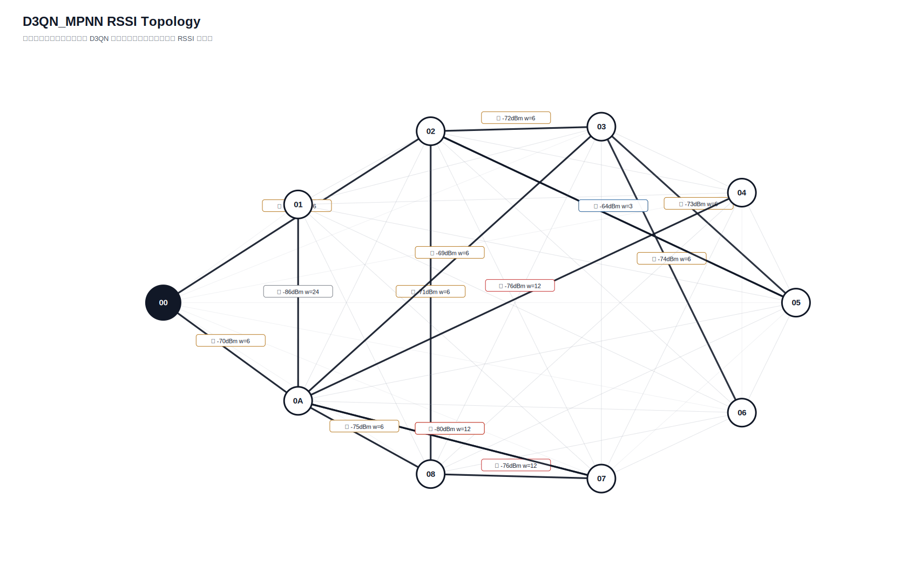

# D3QN_MPNN 真实硬件测试汇总报告

- 日志目录：`/home/sueiny/rk3506_linux6.1_v1.2.0/app/广播组网上位机/app/logs/d3qn_hw/第11次测试`
- 算法：`D3QN_MPNN`
- 推理策略：`纯D3QN，无Dijkstra fallback，无规则兜底`
- 目标：有效 SEND 平均点到点延时 `<220ms`，实际 ACK 丢包率 `<10%`；路由失败单独统计。
- Checkpoint：`/home/sueiny/rk3506_linux6.1_v1.2.0/app/广播组网上位机/app/checkpoints/d3qn_mpnn/latest.pt`
- 节点：`01, 02, 03, 04, 05, 06, 07, 08, 0A`
- 地址说明：CLI 按十六进制地址解析，因此目标 `10` 表示地址 `0x10`。
- 计划轮次：`144`，实际SEND：`144`，成功：`119`，ACK timeout：`25`，D3QN路由失败：`0`，实际丢包率：`17.36%`
- 端到端平均延时：`231.7ms`，P95：`1103.8ms`，最小/最大：`0.0ms` / `1705.9ms`
- 时延抖动均值：`311.1ms`，时延标准差：`361.3ms`
- D3QN 路由失败次数：`0`

## 拓扑图

## 测试结果

| 出发点 | 目标点 | 路径 | D3QN动作 | 成功/实际SEND | ACK timeout | 路由失败 | 丢包率 | 点到点平均 | P95 | 推理平均 | D3QN总耗时 | 重采 | 切换 | 最弱 RSSI |
|---|---|---|---:|---:|---:|---:|---:|---:|---:|---:|---:|---:|---:|---:|
| `01` | `02` | `00 -> 01 -> 06 -> 02` | `3` | `2/2` | `0` | `0` | `0.00%` | `0.0ms` | `0.0ms` | `67.7ms` | `67.7ms` | `0` | `0` | `-92` |
| `01` | `03` | `00 -> 01 -> 03` | `0` | `1/2` | `1` | `0` | `50.00%` | `200.5ms` | `200.5ms` | `37.8ms` | `237.3ms` | `0` | `0` | `-92` |
| `01` | `04` | `00 -> 01 -> 04` | `1` | `2/2` | `0` | `0` | `0.00%` | `0.0ms` | `0.0ms` | `40.2ms` | `40.2ms` | `0` | `0` | `-92` |
| `01` | `05` | `00 -> 01 -> 05` | `0` | `2/2` | `0` | `0` | `0.00%` | `0.0ms` | `0.0ms` | `37.7ms` | `37.7ms` | `0` | `0` | `-92` |
| `01` | `06` | `00 -> 01 -> 06` | `0` | `2/2` | `0` | `0` | `0.00%` | `250.5ms` | `501.0ms` | `34.3ms` | `284.8ms` | `0` | `0` | `-92` |
| `01` | `07` | `00 -> 01 -> 07` | `0` | `2/2` | `0` | `0` | `0.00%` | `150.3ms` | `300.6ms` | `36.1ms` | `186.4ms` | `0` | `0` | `-92` |
| `01` | `08` | `00 -> 01 -> 06 -> 08` | `1` | `2/2` | `0` | `0` | `0.00%` | `100.0ms` | `200.1ms` | `32.3ms` | `132.4ms` | `0` | `0` | `-92` |
| `01` | `0A` | `00 -> 01 -> 0A` | `1` | `2/2` | `0` | `0` | `0.00%` | `100.0ms` | `199.9ms` | `36.5ms` | `136.5ms` | `0` | `0` | `-92` |
| `02` | `01` | `00 -> 02 -> 01` | `0` | `2/2` | `0` | `0` | `0.00%` | `100.1ms` | `200.2ms` | `36.8ms` | `136.9ms` | `0` | `0` | `-87` |
| `02` | `03` | `00 -> 02 -> 03` | `0` | `2/2` | `0` | `0` | `0.00%` | `50.4ms` | `100.8ms` | `35.0ms` | `85.4ms` | `0` | `0` | `-76` |
| `02` | `04` | `00 -> 02 -> 04` | `2` | `2/2` | `0` | `0` | `0.00%` | `0.0ms` | `0.0ms` | `33.9ms` | `33.9ms` | `0` | `2` | `-96` |
| `02` | `05` | `00 -> 02 -> 05` | `0` | `1/2` | `1` | `0` | `50.00%` | `0.0ms` | `0.0ms` | `36.3ms` | `35.0ms` | `0` | `0` | `-75` |
| `02` | `06` | `00 -> 02 -> 06` | `0` | `2/2` | `0` | `0` | `0.00%` | `0.1ms` | `0.2ms` | `35.9ms` | `36.0ms` | `0` | `0` | `-75` |
| `02` | `07` | `00 -> 02 -> 08 -> 07` | `2` | `2/2` | `0` | `0` | `0.00%` | `45.6ms` | `91.2ms` | `39.7ms` | `85.2ms` | `0` | `0` | `-76` |
| `02` | `08` | `00 -> 02 -> 05 -> 08` | `2` | `0/2` | `2` | `0` | `100.00%` | `n/a` | `n/a` | `36.4ms` | `n/a` | `0` | `0` | `-76` |
| `02` | `0A` | `00 -> 02 -> 0A` | `0` | `2/2` | `0` | `0` | `0.00%` | `0.0ms` | `0.0ms` | `34.2ms` | `34.2ms` | `0` | `0` | `-84` |
| `03` | `01` | `00 -> 03 -> 01` | `0` | `0/2` | `2` | `0` | `100.00%` | `n/a` | `n/a` | `35.1ms` | `n/a` | `0` | `0` | `-93` |
| `03` | `02` | `00 -> 03 -> 06 -> 02` | `2` | `2/2` | `0` | `0` | `0.00%` | `201.7ms` | `403.4ms` | `37.0ms` | `238.7ms` | `0` | `2` | `-74` |
| `03` | `04` | `00 -> 03 -> 0A -> 04` | `2` | `2/2` | `0` | `0` | `0.00%` | `251.4ms` | `502.8ms` | `32.8ms` | `284.1ms` | `0` | `2` | `-82` |
| `03` | `05` | `00 -> 03 -> 05` | `0` | `2/2` | `0` | `0` | `0.00%` | `551.9ms` | `1103.8ms` | `35.3ms` | `587.2ms` | `0` | `0` | `-73` |
| `03` | `06` | `00 -> 03 -> 06` | `0` | `2/2` | `0` | `0` | `0.00%` | `351.7ms` | `703.1ms` | `35.4ms` | `387.0ms` | `0` | `0` | `-74` |
| `03` | `07` | `00 -> 03 -> 07` | `1` | `2/2` | `0` | `0` | `0.00%` | `400.9ms` | `401.0ms` | `36.5ms` | `437.4ms` | `0` | `0` | `-80` |
| `03` | `08` | `00 -> 03 -> 06 -> 08` | `1` | `2/2` | `0` | `0` | `0.00%` | `456.1ms` | `510.7ms` | `37.6ms` | `493.7ms` | `0` | `0` | `-74` |
| `03` | `0A` | `00 -> 03 -> 05 -> 0A` | `3` | `2/2` | `0` | `0` | `0.00%` | `0.0ms` | `0.0ms` | `34.9ms` | `34.9ms` | `0` | `0` | `-84` |
| `04` | `01` | `00 -> 04 -> 01` | `0` | `0/2` | `2` | `0` | `100.00%` | `n/a` | `n/a` | `33.3ms` | `n/a` | `0` | `0` | `-87` |
| `04` | `02` | `00 -> 04 -> 03 -> 05 -> 02` | `2` | `2/2` | `0` | `0` | `0.00%` | `250.5ms` | `501.1ms` | `34.4ms` | `285.0ms` | `0` | `0` | `-73` |
| `04` | `03` | `00 -> 04 -> 03` | `0` | `1/2` | `1` | `0` | `50.00%` | `300.5ms` | `300.5ms` | `39.2ms` | `339.0ms` | `0` | `2` | `-66` |
| `04` | `05` | `00 -> 04 -> 03 -> 05` | `0` | `0/2` | `2` | `0` | `100.00%` | `n/a` | `n/a` | `35.6ms` | `n/a` | `0` | `0` | `-73` |
| `04` | `06` | `00 -> 04 -> 03 -> 06` | `0` | `2/2` | `0` | `0` | `0.00%` | `100.4ms` | `200.8ms` | `35.3ms` | `135.7ms` | `0` | `0` | `-74` |
| `04` | `07` | `00 -> 04 -> 0A -> 07` | `1` | `0/2` | `2` | `0` | `100.00%` | `n/a` | `n/a` | `35.3ms` | `n/a` | `0` | `0` | `-80` |
| `04` | `08` | `00 -> 04 -> 08` | `0` | `2/2` | `0` | `0` | `0.00%` | `702.3ms` | `1103.7ms` | `31.4ms` | `733.7ms` | `0` | `0` | `-70` |
| `04` | `0A` | `00 -> 04 -> 0A` | `0` | `1/2` | `1` | `0` | `50.00%` | `0.0ms` | `0.0ms` | `34.5ms` | `35.3ms` | `0` | `0` | `-66` |
| `05` | `01` | `00 -> 02 -> 05 -> 01` | `0` | `2/2` | `0` | `0` | `0.00%` | `146.1ms` | `191.7ms` | `32.6ms` | `178.7ms` | `0` | `2` | `-88` |
| `05` | `02` | `00 -> 02 -> 05 -> 02` | `0` | `2/2` | `0` | `0` | `0.00%` | `50.0ms` | `100.1ms` | `33.1ms` | `83.2ms` | `0` | `0` | `-75` |
| `05` | `03` | `00 -> 02 -> 05 -> 0A -> 03` | `2` | `2/2` | `0` | `0` | `0.00%` | `100.2ms` | `200.4ms` | `40.3ms` | `140.5ms` | `0` | `2` | `-84` |
| `05` | `04` | `00 -> 02 -> 05 -> 04` | `2` | `2/2` | `0` | `0` | `0.00%` | `199.8ms` | `300.2ms` | `34.1ms` | `233.9ms` | `0` | `2` | `-93` |
| `05` | `06` | `00 -> 02 -> 05 -> 03 -> 06` | `2` | `2/2` | `0` | `0` | `0.00%` | `300.7ms` | `501.4ms` | `33.7ms` | `334.4ms` | `0` | `2` | `-83` |
| `05` | `07` | `00 -> 02 -> 05 -> 06 -> 07` | `2` | `1/2` | `1` | `0` | `50.00%` | `902.6ms` | `902.6ms` | `37.1ms` | `939.8ms` | `0` | `2` | `-76` |
| `05` | `08` | `00 -> 02 -> 05 -> 08` | `1` | `2/2` | `0` | `0` | `0.00%` | `551.8ms` | `1003.8ms` | `34.8ms` | `586.5ms` | `0` | `2` | `-76` |
| `05` | `0A` | `00 -> 02 -> 05 -> 0A` | `0` | `2/2` | `0` | `0` | `0.00%` | `250.9ms` | `501.7ms` | `32.4ms` | `283.2ms` | `0` | `2` | `-84` |
| `06` | `01` | `00 -> 06 -> 01` | `0` | `1/2` | `1` | `0` | `50.00%` | `400.5ms` | `400.5ms` | `31.9ms` | `433.4ms` | `0` | `0` | `-86` |
| `06` | `02` | `00 -> 06 -> 02` | `0` | `2/2` | `0` | `0` | `0.00%` | `350.7ms` | `501.4ms` | `35.5ms` | `386.2ms` | `0` | `0` | `-73` |
| `06` | `03` | `00 -> 06 -> 07 -> 0A -> 03` | `3` | `1/2` | `1` | `0` | `50.00%` | `1505.7ms` | `1505.7ms` | `36.9ms` | `1539.6ms` | `0` | `0` | `-74` |
| `06` | `04` | `00 -> 06 -> 07 -> 0A -> 04` | `3` | `2/2` | `0` | `0` | `0.00%` | `49.9ms` | `99.9ms` | `33.8ms` | `83.7ms` | `0` | `2` | `-76` |
| `06` | `05` | `00 -> 06 -> 02 -> 05` | `0` | `1/2` | `1` | `0` | `50.00%` | `0.0ms` | `0.0ms` | `36.5ms` | `33.0ms` | `0` | `0` | `-73` |
| `06` | `07` | `00 -> 06 -> 08 -> 07` | `2` | `2/2` | `0` | `0` | `0.00%` | `150.3ms` | `300.6ms` | `38.0ms` | `188.2ms` | `0` | `0` | `-76` |
| `06` | `08` | `00 -> 06 -> 07 -> 0A -> 08` | `3` | `2/2` | `0` | `0` | `0.00%` | `0.0ms` | `0.0ms` | `35.7ms` | `35.7ms` | `0` | `0` | `-75` |
| `06` | `0A` | `00 -> 06 -> 07 -> 0A` | `0` | `2/2` | `0` | `0` | `0.00%` | `0.0ms` | `0.0ms` | `37.2ms` | `37.2ms` | `0` | `0` | `-74` |
| `07` | `01` | `00 -> 06 -> 07 -> 03 -> 01` | `2` | `2/2` | `0` | `0` | `0.00%` | `49.9ms` | `99.9ms` | `35.7ms` | `85.6ms` | `0` | `2` | `-93` |
| `07` | `02` | `00 -> 06 -> 07 -> 0A -> 03 -> 02` | `3` | `2/2` | `0` | `0` | `0.00%` | `0.0ms` | `0.0ms` | `33.0ms` | `33.0ms` | `0` | `2` | `-74` |
| `07` | `03` | `00 -> 06 -> 07 -> 0A -> 03` | `1` | `1/2` | `1` | `0` | `50.00%` | `501.3ms` | `501.3ms` | `34.5ms` | `533.8ms` | `0` | `2` | `-74` |
| `07` | `04` | `00 -> 06 -> 07 -> 04` | `2` | `1/2` | `1` | `0` | `50.00%` | `0.0ms` | `0.0ms` | `31.9ms` | `31.0ms` | `0` | `0` | `-93` |
| `07` | `05` | `00 -> 06 -> 07 -> 0A -> 03 -> 05` | `1` | `2/2` | `0` | `0` | `0.00%` | `150.2ms` | `300.3ms` | `35.4ms` | `185.6ms` | `0` | `0` | `-74` |
| `07` | `06` | `00 -> 06 -> 07 -> 0A -> 03 -> 06` | `2` | `1/2` | `1` | `0` | `50.00%` | `100.5ms` | `100.5ms` | `32.5ms` | `134.2ms` | `0` | `0` | `-74` |
| `07` | `08` | `00 -> 06 -> 07 -> 0A -> 08` | `1` | `2/2` | `0` | `0` | `0.00%` | `0.0ms` | `0.0ms` | `35.2ms` | `35.2ms` | `0` | `2` | `-75` |
| `07` | `0A` | `00 -> 06 -> 07 -> 0A` | `0` | `2/2` | `0` | `0` | `0.00%` | `0.0ms` | `0.0ms` | `35.1ms` | `35.1ms` | `0` | `2` | `-74` |
| `08` | `01` | `00 -> 02 -> 08 -> 01` | `0` | `2/2` | `0` | `0` | `0.00%` | `802.9ms` | `1605.8ms` | `38.2ms` | `841.1ms` | `0` | `2` | `-90` |
| `08` | `02` | `00 -> 02 -> 08 -> 05 -> 02` | `1` | `1/2` | `1` | `0` | `50.00%` | `1405.4ms` | `1405.4ms` | `34.0ms` | `1436.9ms` | `0` | `0` | `-85` |
| `08` | `03` | `00 -> 02 -> 08 -> 0A -> 03` | `1` | `2/2` | `0` | `0` | `0.00%` | `0.0ms` | `0.0ms` | `35.7ms` | `35.8ms` | `0` | `2` | `-76` |
| `08` | `04` | `00 -> 02 -> 08 -> 04` | `1` | `2/2` | `0` | `0` | `0.00%` | `200.6ms` | `401.2ms` | `34.2ms` | `234.8ms` | `0` | `2` | `-92` |
| `08` | `05` | `00 -> 02 -> 08 -> 05` | `0` | `1/2` | `1` | `0` | `50.00%` | `501.7ms` | `501.7ms` | `36.0ms` | `535.0ms` | `0` | `2` | `-85` |
| `08` | `06` | `00 -> 02 -> 08 -> 06` | `0` | `1/2` | `1` | `0` | `50.00%` | `1705.9ms` | `1705.9ms` | `30.7ms` | `1737.3ms` | `0` | `2` | `-83` |
| `08` | `07` | `00 -> 02 -> 08 -> 07` | `0` | `2/2` | `0` | `0` | `0.00%` | `651.9ms` | `1303.6ms` | `36.6ms` | `688.5ms` | `0` | `2` | `-76` |
| `08` | `0A` | `00 -> 02 -> 08 -> 07 -> 0A` | `1` | `2/2` | `0` | `0` | `0.00%` | `351.1ms` | `401.5ms` | `35.5ms` | `386.7ms` | `0` | `2` | `-76` |
| `0A` | `01` | `00 -> 0A -> 01` | `0` | `2/2` | `0` | `0` | `0.00%` | `50.3ms` | `100.6ms` | `40.0ms` | `90.3ms` | `0` | `0` | `-86` |
| `0A` | `02` | `00 -> 0A -> 03 -> 05 -> 02` | `2` | `2/2` | `0` | `0` | `0.00%` | `451.1ms` | `501.6ms` | `37.2ms` | `488.3ms` | `0` | `0` | `-73` |
| `0A` | `03` | `00 -> 0A -> 03` | `0` | `2/2` | `0` | `0` | `0.00%` | `401.1ms` | `401.1ms` | `37.8ms` | `438.9ms` | `0` | `2` | `-70` |
| `0A` | `04` | `00 -> 0A -> 04` | `0` | `2/2` | `0` | `0` | `0.00%` | `250.8ms` | `501.2ms` | `32.8ms` | `283.7ms` | `0` | `2` | `-76` |
| `0A` | `05` | `00 -> 0A -> 03 -> 02 -> 05` | `3` | `2/2` | `0` | `0` | `0.00%` | `0.0ms` | `0.0ms` | `32.1ms` | `32.1ms` | `0` | `0` | `-72` |
| `0A` | `06` | `00 -> 0A -> 03 -> 06` | `0` | `2/2` | `0` | `0` | `0.00%` | `350.7ms` | `401.2ms` | `33.3ms` | `384.0ms` | `0` | `0` | `-74` |
| `0A` | `07` | `00 -> 0A -> 07` | `0` | `1/2` | `1` | `0` | `50.00%` | `0.2ms` | `0.2ms` | `33.6ms` | `30.8ms` | `0` | `0` | `-80` |
| `0A` | `08` | `00 -> 0A -> 08` | `0` | `2/2` | `0` | `0` | `0.00%` | `100.4ms` | `200.7ms` | `34.9ms` | `135.3ms` | `0` | `0` | `-75` |

## 指标总结对比

| 指标 | 当前值 | 单位 | 说明 |
|---|---:|---|---|
| 算法计算延时 | `35.7ms` | ms | 上位机用 D3QN 算出路径的平均耗时 |
| 指令下发延时 | `231.7ms` | ms | 当前硬件无中间节点时间戳，用 SEND 到 ACK 总时延近似 |
| 端到端实际传输平均延时 | `231.7ms` | ms | 现有统计总 ACK 时延 |
| 全局平均丢包率 | `17.36%` | ratio | 总 timeout / 总发送 |
| D3QN 路由失败次数 | `0` | count | 无候选路径、checkpoint 缺失或模型输入不匹配 |
| 单路径平均跳数 | `2.9167` | hops | 各目标最终路径跳数平均值 |
| 平均单跳传输耗时 | `91.2ms` | ms/hop | 端到端平均延时 / 跳数折算 |
| RSSI 实时波动范围 | `35` | dB | 当前拓扑边 RSSI 最大值减最小值 |
| RSSI 标准差 | `7.9025` | dB | 当前拓扑边 RSSI 标准差 |
| 时延抖动均值 | `311.1ms` | ms | 相邻成功 ACK 延时差值均值 |
| 时延标准差 | `361.3ms` | ms | 成功 ACK 延时标准差 |

## 文件

- [`测试指标汇总.xlsx`](测试指标汇总.xlsx)
- [`拓扑图.txt`](拓扑图.txt)
- [`原始串口日志.log`](原始串口日志.log)
- `原始JSON数据/model_decisions.jsonl`
- `原始JSON数据/d3qn_state.json`

## 来源说明

| 来源 | 含义 |
|---|---|
| `real_rssi` | 由 RSSI_REQ 和 RSSI_REPORT 得到 |
| `real_ack` | 由真实 ACK 成功/timeout 统计得到 |
| `default` | 当前硬件不可直接测量，使用默认值占位 |
| `derived` | 由真实测试记录派生计算得到 |
| `derived_from_rssi` | 训练环境中容量、延时、丢包等不可测字段由真实 RSSI 分段派生 |
