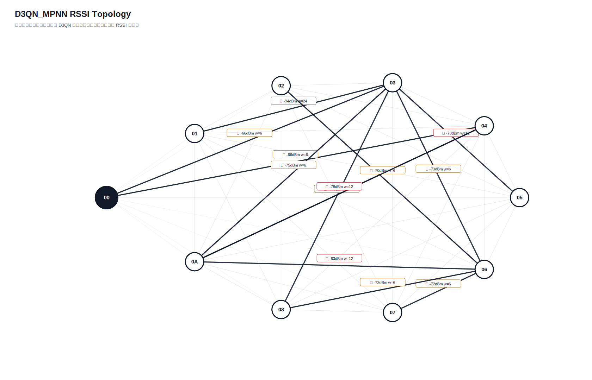

# D3QN_MPNN 真实硬件测试汇总报告

- 日志目录：`/home/sueiny/rk3506_linux6.1_v1.2.0/app/广播组网上位机/app/logs/d3qn_hw/第12次测试`
- 算法：`D3QN_MPNN`
- 推理策略：`纯D3QN，无Dijkstra fallback，无规则兜底`
- 目标：有效 SEND 平均点到点延时 `<220ms`，实际 ACK 丢包率 `<10%`；路由失败单独统计。
- Checkpoint：`/home/sueiny/rk3506_linux6.1_v1.2.0/app/广播组网上位机/app/checkpoints/d3qn_mpnn/latest.pt`
- 节点：`01, 02, 03, 04, 05, 06, 07, 08, 0A`
- 地址说明：CLI 按十六进制地址解析，因此目标 `10` 表示地址 `0x10`。
- 计划轮次：`144`，实际SEND：`144`，成功：`90`，ACK timeout：`54`，D3QN路由失败：`0`，实际丢包率：`37.50%`
- 端到端平均延时：`196.2ms`，P95：`1103.8ms`，最小/最大：`0.0ms` / `1705.8ms`
- 时延抖动均值：`326.7ms`，时延标准差：`352.0ms`
- D3QN 路由失败次数：`0`

## 拓扑图

## 测试结果

| 出发点 | 目标点 | 路径 | D3QN动作 | 成功/实际SEND | ACK timeout | 路由失败 | 丢包率 | 点到点平均 | P95 | 推理平均 | D3QN总耗时 | 重采 | 切换 | 最弱 RSSI |
|---|---|---|---:|---:|---:|---:|---:|---:|---:|---:|---:|---:|---:|---:|
| `01` | `02` | `00 -> 01 -> 03 -> 06 -> 02` | `3` | `2/2` | `0` | `0` | `0.00%` | `0.0ms` | `0.0ms` | `37.0ms` | `37.0ms` | `0` | `0` | `-88` |
| `01` | `03` | `00 -> 01 -> 02 -> 03` | `1` | `2/2` | `0` | `0` | `0.00%` | `555.7ms` | `902.2ms` | `32.1ms` | `587.8ms` | `0` | `0` | `-88` |
| `01` | `04` | `00 -> 01 -> 04` | `1` | `2/2` | `0` | `0` | `0.00%` | `0.0ms` | `0.0ms` | `34.9ms` | `34.9ms` | `0` | `2` | `-91` |
| `01` | `05` | `00 -> 01 -> 03 -> 05` | `2` | `2/2` | `0` | `0` | `0.00%` | `50.4ms` | `100.9ms` | `34.7ms` | `85.2ms` | `0` | `0` | `-88` |
| `01` | `06` | `00 -> 01 -> 03 -> 06` | `1` | `2/2` | `0` | `0` | `0.00%` | `200.6ms` | `401.1ms` | `34.8ms` | `235.4ms` | `0` | `0` | `-88` |
| `01` | `07` | `00 -> 01 -> 03 -> 06 -> 07` | `3` | `2/2` | `0` | `0` | `0.00%` | `0.0ms` | `0.0ms` | `43.6ms` | `43.6ms` | `0` | `0` | `-88` |
| `01` | `08` | `00 -> 01 -> 02 -> 03 -> 08` | `2` | `1/2` | `1` | `0` | `50.00%` | `301.1ms` | `301.1ms` | `34.9ms` | `335.9ms` | `0` | `0` | `-88` |
| `01` | `0A` | `00 -> 01 -> 02 -> 0A` | `3` | `2/2` | `0` | `0` | `0.00%` | `0.0ms` | `0.0ms` | `35.6ms` | `35.6ms` | `0` | `0` | `-88` |
| `02` | `01` | `00 -> 02 -> 03 -> 01` | `1` | `0/2` | `2` | `0` | `100.00%` | `n/a` | `n/a` | `41.0ms` | `n/a` | `0` | `0` | `-94` |
| `02` | `03` | `00 -> 02 -> 03` | `0` | `1/2` | `1` | `0` | `50.00%` | `201.6ms` | `201.6ms` | `41.2ms` | `239.9ms` | `0` | `0` | `-76` |
| `02` | `04` | `00 -> 02 -> 04` | `0` | `2/2` | `0` | `0` | `0.00%` | `100.4ms` | `101.0ms` | `34.0ms` | `134.4ms` | `0` | `2` | `-96` |
| `02` | `05` | `00 -> 02 -> 03 -> 06 -> 05` | `3` | `2/2` | `0` | `0` | `0.00%` | `0.0ms` | `0.0ms` | `35.6ms` | `35.6ms` | `0` | `0` | `-78` |
| `02` | `06` | `00 -> 02 -> 03 -> 06` | `1` | `0/2` | `2` | `0` | `100.00%` | `n/a` | `n/a` | `32.5ms` | `n/a` | `0` | `0` | `-76` |
| `02` | `07` | `00 -> 02 -> 03 -> 06 -> 07` | `1` | `2/2` | `0` | `0` | `0.00%` | `150.5ms` | `300.9ms` | `36.5ms` | `187.0ms` | `0` | `0` | `-76` |
| `02` | `08` | `00 -> 02 -> 03 -> 08` | `0` | `2/2` | `0` | `0` | `0.00%` | `0.0ms` | `0.0ms` | `33.3ms` | `33.3ms` | `0` | `0` | `-76` |
| `02` | `0A` | `00 -> 02 -> 03 -> 08 -> 0A` | `2` | `1/2` | `1` | `0` | `50.00%` | `100.5ms` | `100.5ms` | `35.5ms` | `135.9ms` | `0` | `0` | `-76` |
| `03` | `01` | `00 -> 03 -> 06 -> 01` | `1` | `0/2` | `2` | `0` | `100.00%` | `n/a` | `n/a` | `35.4ms` | `n/a` | `0` | `0` | `-94` |
| `03` | `02` | `00 -> 03 -> 06 -> 02` | `1` | `1/2` | `1` | `0` | `50.00%` | `301.3ms` | `301.3ms` | `35.5ms` | `338.2ms` | `0` | `0` | `-73` |
| `03` | `04` | `00 -> 03 -> 04` | `1` | `2/2` | `0` | `0` | `0.00%` | `200.8ms` | `401.6ms` | `35.9ms` | `236.6ms` | `0` | `2` | `-86` |
| `03` | `05` | `00 -> 03 -> 06 -> 05` | `3` | `1/2` | `1` | `0` | `50.00%` | `0.0ms` | `0.0ms` | `33.5ms` | `32.1ms` | `0` | `0` | `-78` |
| `03` | `06` | `00 -> 03 -> 06` | `0` | `2/2` | `0` | `0` | `0.00%` | `802.6ms` | `1605.1ms` | `35.4ms` | `838.0ms` | `0` | `0` | `-73` |
| `03` | `07` | `00 -> 03 -> 06 -> 07` | `0` | `1/2` | `1` | `0` | `50.00%` | `0.0ms` | `0.0ms` | `34.4ms` | `35.2ms` | `0` | `0` | `-73` |
| `03` | `08` | `00 -> 03 -> 08` | `0` | `2/2` | `0` | `0` | `0.00%` | `150.4ms` | `300.9ms` | `31.4ms` | `181.9ms` | `0` | `0` | `-74` |
| `03` | `0A` | `00 -> 03 -> 06 -> 0A` | `2` | `2/2` | `0` | `0` | `0.00%` | `0.0ms` | `0.0ms` | `35.3ms` | `35.3ms` | `0` | `2` | `-83` |
| `04` | `01` | `00 -> 04 -> 01` | `0` | `0/2` | `2` | `0` | `100.00%` | `n/a` | `n/a` | `39.1ms` | `n/a` | `0` | `0` | `-89` |
| `04` | `02` | `00 -> 04 -> 03 -> 06 -> 02` | `3` | `0/2` | `2` | `0` | `100.00%` | `n/a` | `n/a` | `34.4ms` | `n/a` | `0` | `0` | `-73` |
| `04` | `03` | `00 -> 04 -> 02 -> 03` | `2` | `1/2` | `1` | `0` | `50.00%` | `1103.8ms` | `1103.8ms` | `33.6ms` | `1139.6ms` | `0` | `0` | `-75` |
| `04` | `05` | `00 -> 04 -> 05` | `1` | `1/2` | `1` | `0` | `50.00%` | `0.0ms` | `0.0ms` | `37.0ms` | `33.7ms` | `0` | `0` | `-81` |
| `04` | `06` | `00 -> 04 -> 03 -> 06` | `1` | `0/2` | `2` | `0` | `100.00%` | `n/a` | `n/a` | `32.5ms` | `n/a` | `0` | `0` | `-73` |
| `04` | `07` | `00 -> 04 -> 03 -> 06 -> 07` | `3` | `2/2` | `0` | `0` | `0.00%` | `49.9ms` | `99.8ms` | `36.1ms` | `86.0ms` | `0` | `0` | `-73` |
| `04` | `08` | `00 -> 04 -> 03 -> 08` | `0` | `1/2` | `1` | `0` | `50.00%` | `0.0ms` | `0.0ms` | `37.1ms` | `40.3ms` | `0` | `0` | `-74` |
| `04` | `0A` | `00 -> 04 -> 03 -> 08 -> 0A` | `3` | `2/2` | `0` | `0` | `0.00%` | `251.2ms` | `502.4ms` | `35.2ms` | `286.4ms` | `0` | `0` | `-75` |
| `05` | `01` | `00 -> 05 -> 01` | `0` | `2/2` | `0` | `0` | `0.00%` | `0.0ms` | `0.0ms` | `35.2ms` | `35.2ms` | `0` | `0` | `-92` |
| `05` | `02` | `00 -> 05 -> 03 -> 02` | `3` | `1/2` | `1` | `0` | `50.00%` | `0.0ms` | `0.0ms` | `36.2ms` | `37.1ms` | `0` | `0` | `-82` |
| `05` | `03` | `00 -> 05 -> 02 -> 03` | `0` | `2/2` | `0` | `0` | `0.00%` | `150.5ms` | `300.9ms` | `33.6ms` | `184.1ms` | `0` | `0` | `-82` |
| `05` | `04` | `00 -> 05 -> 04` | `1` | `0/2` | `2` | `0` | `100.00%` | `n/a` | `n/a` | `39.8ms` | `n/a` | `0` | `2` | `-96` |
| `05` | `06` | `00 -> 05 -> 03 -> 06` | `3` | `1/2` | `1` | `0` | `50.00%` | `0.0ms` | `0.0ms` | `35.4ms` | `36.1ms` | `0` | `0` | `-82` |
| `05` | `07` | `00 -> 05 -> 02 -> 03 -> 06 -> 07` | `3` | `2/2` | `0` | `0` | `0.00%` | `597.3ms` | `1194.6ms` | `39.0ms` | `636.3ms` | `0` | `0` | `-82` |
| `05` | `08` | `00 -> 05 -> 03 -> 08` | `3` | `1/2` | `1` | `0` | `50.00%` | `0.0ms` | `0.0ms` | `34.6ms` | `33.1ms` | `0` | `0` | `-82` |
| `05` | `0A` | `00 -> 05 -> 06 -> 0A` | `2` | `1/2` | `1` | `0` | `50.00%` | `0.0ms` | `0.0ms` | `36.4ms` | `36.1ms` | `0` | `0` | `-83` |
| `06` | `01` | `00 -> 06 -> 03 -> 01` | `2` | `0/2` | `2` | `0` | `100.00%` | `n/a` | `n/a` | `33.6ms` | `n/a` | `0` | `0` | `-94` |
| `06` | `02` | `00 -> 06 -> 03 -> 02` | `1` | `1/2` | `1` | `0` | `50.00%` | `0.0ms` | `0.0ms` | `34.9ms` | `34.9ms` | `0` | `0` | `-80` |
| `06` | `03` | `00 -> 06 -> 02 -> 03` | `2` | `1/2` | `1` | `0` | `50.00%` | `99.7ms` | `99.7ms` | `31.9ms` | `130.3ms` | `0` | `0` | `-73` |
| `06` | `04` | `00 -> 06 -> 04` | `1` | `1/2` | `1` | `0` | `50.00%` | `0.0ms` | `0.0ms` | `35.8ms` | `32.2ms` | `0` | `2` | `-98` |
| `06` | `05` | `00 -> 06 -> 07 -> 03 -> 05` | `3` | `2/2` | `0` | `0` | `0.00%` | `50.1ms` | `100.3ms` | `33.9ms` | `84.0ms` | `0` | `0` | `-78` |
| `06` | `07` | `00 -> 06 -> 02 -> 03 -> 07` | `3` | `2/2` | `0` | `0` | `0.00%` | `150.5ms` | `300.9ms` | `35.3ms` | `185.7ms` | `0` | `0` | `-81` |
| `06` | `08` | `00 -> 06 -> 03 -> 08` | `0` | `1/2` | `1` | `0` | `50.00%` | `0.0ms` | `0.0ms` | `37.7ms` | `39.9ms` | `0` | `0` | `-74` |
| `06` | `0A` | `00 -> 06 -> 03 -> 08 -> 0A` | `3` | `2/2` | `0` | `0` | `0.00%` | `50.1ms` | `100.1ms` | `34.9ms` | `84.9ms` | `0` | `0` | `-75` |
| `07` | `01` | `00 -> 06 -> 07 -> 03 -> 08 -> 01` | `3` | `2/2` | `0` | `0` | `0.00%` | `451.6ms` | `501.6ms` | `35.7ms` | `487.3ms` | `0` | `2` | `-90` |
| `07` | `02` | `00 -> 06 -> 07 -> 03 -> 02` | `1` | `2/2` | `0` | `0` | `0.00%` | `100.2ms` | `200.5ms` | `38.6ms` | `138.9ms` | `0` | `2` | `-80` |
| `07` | `03` | `00 -> 06 -> 07 -> 03` | `0` | `1/2` | `1` | `0` | `50.00%` | `1404.5ms` | `1404.5ms` | `34.0ms` | `1440.7ms` | `0` | `2` | `-73` |
| `07` | `04` | `00 -> 06 -> 07 -> 04` | `1` | `0/2` | `2` | `0` | `100.00%` | `n/a` | `n/a` | `38.9ms` | `n/a` | `0` | `2` | `-88` |
| `07` | `05` | `00 -> 06 -> 07 -> 03 -> 05` | `0` | `0/2` | `2` | `0` | `100.00%` | `n/a` | `n/a` | `33.6ms` | `n/a` | `0` | `2` | `-78` |
| `07` | `06` | `00 -> 06 -> 07 -> 03 -> 06` | `0` | `1/2` | `1` | `0` | `50.00%` | `0.0ms` | `0.0ms` | `38.8ms` | `36.9ms` | `0` | `0` | `-73` |
| `07` | `08` | `00 -> 06 -> 07 -> 03 -> 08` | `0` | `1/2` | `1` | `0` | `50.00%` | `0.0ms` | `0.0ms` | `33.7ms` | `32.4ms` | `0` | `2` | `-74` |
| `07` | `0A` | `00 -> 06 -> 07 -> 03 -> 08 -> 0A` | `1` | `2/2` | `0` | `0` | `0.00%` | `50.1ms` | `100.3ms` | `38.6ms` | `88.8ms` | `0` | `0` | `-75` |
| `08` | `01` | `00 -> 03 -> 08 -> 01` | `0` | `2/2` | `0` | `0` | `0.00%` | `50.1ms` | `100.1ms` | `33.6ms` | `83.7ms` | `0` | `0` | `-90` |
| `08` | `02` | `00 -> 03 -> 08 -> 06 -> 02` | `1` | `2/2` | `0` | `0` | `0.00%` | `501.9ms` | `803.1ms` | `37.7ms` | `539.6ms` | `0` | `0` | `-74` |
| `08` | `03` | `00 -> 03 -> 08 -> 07 -> 03` | `3` | `1/2` | `1` | `0` | `50.00%` | `0.0ms` | `0.0ms` | `36.2ms` | `36.8ms` | `0` | `0` | `-76` |
| `08` | `04` | `00 -> 03 -> 08 -> 04` | `1` | `2/2` | `0` | `0` | `0.00%` | `200.9ms` | `401.7ms` | `39.1ms` | `240.0ms` | `0` | `2` | `-90` |
| `08` | `05` | `00 -> 03 -> 08 -> 06 -> 02 -> 05` | `2` | `2/2` | `0` | `0` | `0.00%` | `250.9ms` | `501.8ms` | `35.0ms` | `285.9ms` | `0` | `0` | `-74` |
| `08` | `06` | `00 -> 03 -> 08 -> 02 -> 06` | `1` | `2/2` | `0` | `0` | `0.00%` | `852.9ms` | `1705.8ms` | `36.4ms` | `889.3ms` | `0` | `2` | `-76` |
| `08` | `07` | `00 -> 03 -> 08 -> 02 -> 06 -> 07` | `3` | `2/2` | `0` | `0` | `0.00%` | `350.9ms` | `401.1ms` | `39.3ms` | `390.2ms` | `0` | `0` | `-76` |
| `08` | `0A` | `00 -> 03 -> 08 -> 06 -> 0A` | `2` | `2/2` | `0` | `0` | `0.00%` | `301.3ms` | `301.3ms` | `40.2ms` | `341.5ms` | `0` | `0` | `-83` |
| `0A` | `01` | `00 -> 04 -> 0A -> 03 -> 01` | `1` | `2/2` | `0` | `0` | `0.00%` | `250.6ms` | `501.2ms` | `33.3ms` | `283.9ms` | `0` | `0` | `-94` |
| `0A` | `02` | `00 -> 04 -> 0A -> 03 -> 06 -> 02` | `2` | `0/2` | `2` | `0` | `100.00%` | `n/a` | `n/a` | `36.4ms` | `n/a` | `0` | `2` | `-75` |
| `0A` | `03` | `00 -> 04 -> 0A -> 03` | `0` | `0/2` | `2` | `0` | `100.00%` | `n/a` | `n/a` | `34.6ms` | `n/a` | `0` | `2` | `-75` |
| `0A` | `04` | `00 -> 04 -> 0A -> 04` | `0` | `1/2` | `1` | `0` | `50.00%` | `401.3ms` | `401.3ms` | `33.6ms` | `434.0ms` | `0` | `2` | `-78` |
| `0A` | `05` | `00 -> 04 -> 0A -> 03 -> 05` | `2` | `0/2` | `2` | `0` | `100.00%` | `n/a` | `n/a` | `34.9ms` | `n/a` | `0` | `0` | `-78` |
| `0A` | `06` | `00 -> 04 -> 0A -> 03 -> 06` | `0` | `0/2` | `2` | `0` | `100.00%` | `n/a` | `n/a` | `35.8ms` | `n/a` | `0` | `0` | `-75` |
| `0A` | `07` | `00 -> 04 -> 0A -> 03 -> 06 -> 07` | `1` | `0/2` | `2` | `0` | `100.00%` | `n/a` | `n/a` | `34.7ms` | `n/a` | `0` | `0` | `-75` |
| `0A` | `08` | `00 -> 04 -> 0A -> 03 -> 08` | `0` | `0/2` | `2` | `0` | `100.00%` | `n/a` | `n/a` | `39.3ms` | `n/a` | `0` | `0` | `-75` |

## 指标总结对比

| 指标 | 当前值 | 单位 | 说明 |
|---|---:|---|---|
| 算法计算延时 | `35.8ms` | ms | 上位机用 D3QN 算出路径的平均耗时 |
| 指令下发延时 | `196.2ms` | ms | 当前硬件无中间节点时间戳，用 SEND 到 ACK 总时延近似 |
| 端到端实际传输平均延时 | `196.2ms` | ms | 现有统计总 ACK 时延 |
| 全局平均丢包率 | `37.50%` | ratio | 总 timeout / 总发送 |
| D3QN 路由失败次数 | `0` | count | 无候选路径、checkpoint 缺失或模型输入不匹配 |
| 单路径平均跳数 | `3.375` | hops | 各目标最终路径跳数平均值 |
| 平均单跳传输耗时 | `59.9ms` | ms/hop | 端到端平均延时 / 跳数折算 |
| RSSI 实时波动范围 | `39` | dB | 当前拓扑边 RSSI 最大值减最小值 |
| RSSI 标准差 | `8.9528` | dB | 当前拓扑边 RSSI 标准差 |
| 时延抖动均值 | `326.7ms` | ms | 相邻成功 ACK 延时差值均值 |
| 时延标准差 | `352.0ms` | ms | 成功 ACK 延时标准差 |

## 文件

- [`测试指标汇总.xlsx`](测试指标汇总.xlsx)
- [`拓扑图.txt`](拓扑图.txt)
- [`原始串口日志.log`](原始串口日志.log)
- `原始JSON数据/model_decisions.jsonl`
- `原始JSON数据/d3qn_state.json`

## 来源说明

| 来源 | 含义 |
|---|---|
| `real_rssi` | 由 RSSI_REQ 和 RSSI_REPORT 得到 |
| `real_ack` | 由真实 ACK 成功/timeout 统计得到 |
| `default` | 当前硬件不可直接测量，使用默认值占位 |
| `derived` | 由真实测试记录派生计算得到 |
| `derived_from_rssi` | 训练环境中容量、延时、丢包等不可测字段由真实 RSSI 分段派生 |
