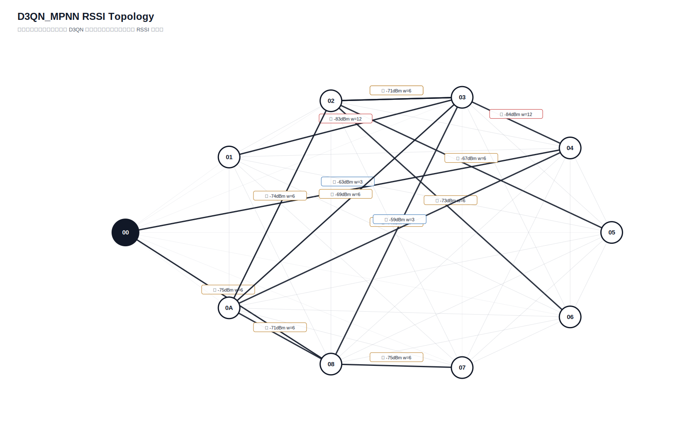

# D3QN_MPNN 真实硬件测试汇总报告

- 日志目录：`/home/sueiny/rk3506_linux6.1_v1.2.0/app/广播组网上位机/app/logs/d3qn_hw/第13次测试`
- 算法：`D3QN_MPNN`
- 推理策略：`纯D3QN，无Dijkstra fallback，无规则兜底`
- 目标：有效 SEND 平均点到点延时 `<220ms`，实际 ACK 丢包率 `<10%`；路由失败单独统计。
- Checkpoint：`/home/sueiny/rk3506_linux6.1_v1.2.0/app/广播组网上位机/app/checkpoints/d3qn_mpnn/latest.pt`
- 节点：`01, 02, 03, 04, 05, 06, 07, 08, 0A`
- 地址说明：CLI 按十六进制地址解析，因此目标 `10` 表示地址 `0x10`。
- 计划轮次：`144`，实际SEND：`144`，成功：`89`，ACK timeout：`55`，D3QN路由失败：`0`，实际丢包率：`38.19%`
- 端到端平均延时：`220.9ms`，P95：`1503.8ms`，最小/最大：`0.0ms` / `1906.4ms`
- 时延抖动均值：`363.7ms`，时延标准差：`422.1ms`
- D3QN 路由失败次数：`0`

## 拓扑图

## 测试结果

| 出发点 | 目标点 | 路径 | D3QN动作 | 成功/实际SEND | ACK timeout | 路由失败 | 丢包率 | 点到点平均 | P95 | 推理平均 | D3QN总耗时 | 重采 | 切换 | 最弱 RSSI |
|---|---|---|---:|---:|---:|---:|---:|---:|---:|---:|---:|---:|---:|---:|
| `01` | `02` | `00 -> 04 -> 01 -> 03 -> 02` | `1` | `2/2` | `0` | `0` | `0.00%` | `300.2ms` | `399.6ms` | `45.7ms` | `345.9ms` | `0` | `0` | `-83` |
| `01` | `03` | `00 -> 04 -> 01 -> 02 -> 03` | `1` | `2/2` | `0` | `0` | `0.00%` | `200.0ms` | `200.0ms` | `33.4ms` | `233.3ms` | `0` | `0` | `-83` |
| `01` | `04` | `00 -> 04 -> 01 -> 03 -> 04` | `0` | `1/2` | `1` | `0` | `50.00%` | `99.7ms` | `99.7ms` | `33.0ms` | `134.8ms` | `0` | `2` | `-84` |
| `01` | `05` | `00 -> 04 -> 01 -> 02 -> 05` | `1` | `2/2` | `0` | `0` | `0.00%` | `0.0ms` | `0.0ms` | `30.9ms` | `30.9ms` | `0` | `0` | `-83` |
| `01` | `06` | `00 -> 04 -> 01 -> 02 -> 05 -> 06` | `3` | `2/2` | `0` | `0` | `0.00%` | `200.9ms` | `401.8ms` | `31.1ms` | `232.0ms` | `0` | `0` | `-83` |
| `01` | `07` | `00 -> 04 -> 01 -> 08 -> 07` | `2` | `1/2` | `1` | `0` | `50.00%` | `300.8ms` | `300.8ms` | `29.0ms` | `328.5ms` | `0` | `0` | `-83` |
| `01` | `08` | `00 -> 04 -> 01 -> 03 -> 08` | `1` | `2/2` | `0` | `0` | `0.00%` | `151.1ms` | `302.2ms` | `32.9ms` | `184.0ms` | `0` | `0` | `-83` |
| `01` | `0A` | `00 -> 04 -> 01 -> 02 -> 05 -> 0A` | `3` | `2/2` | `0` | `0` | `0.00%` | `200.2ms` | `400.5ms` | `33.5ms` | `233.7ms` | `0` | `0` | `-83` |
| `02` | `01` | `00 -> 04 -> 02 -> 03 -> 01` | `1` | `0/2` | `2` | `0` | `100.00%` | `n/a` | `n/a` | `35.8ms` | `n/a` | `0` | `2` | `-83` |
| `02` | `03` | `00 -> 04 -> 02 -> 03` | `0` | `2/2` | `0` | `0` | `0.00%` | `651.7ms` | `1203.7ms` | `33.5ms` | `685.2ms` | `0` | `0` | `-71` |
| `02` | `04` | `00 -> 04 -> 02 -> 03 -> 04` | `0` | `0/2` | `2` | `0` | `100.00%` | `n/a` | `n/a` | `29.4ms` | `n/a` | `0` | `2` | `-84` |
| `02` | `05` | `00 -> 04 -> 02 -> 05` | `0` | `0/2` | `2` | `0` | `100.00%` | `n/a` | `n/a` | `31.4ms` | `n/a` | `0` | `0` | `-70` |
| `02` | `06` | `00 -> 04 -> 02 -> 06` | `0` | `0/2` | `2` | `0` | `100.00%` | `n/a` | `n/a` | `29.0ms` | `n/a` | `0` | `0` | `-73` |
| `02` | `07` | `00 -> 04 -> 02 -> 03 -> 08 -> 07` | `2` | `2/2` | `0` | `0` | `0.00%` | `301.0ms` | `401.2ms` | `29.3ms` | `330.3ms` | `0` | `0` | `-75` |
| `02` | `08` | `00 -> 04 -> 02 -> 03 -> 08` | `0` | `2/2` | `0` | `0` | `0.00%` | `0.0ms` | `0.0ms` | `31.4ms` | `31.4ms` | `0` | `0` | `-74` |
| `02` | `0A` | `00 -> 04 -> 02 -> 03 -> 08 -> 0A` | `2` | `2/2` | `0` | `0` | `0.00%` | `0.0ms` | `0.0ms` | `32.6ms` | `32.6ms` | `0` | `0` | `-74` |
| `03` | `01` | `00 -> 03 -> 02 -> 01` | `1` | `2/2` | `0` | `0` | `0.00%` | `0.0ms` | `0.0ms` | `30.1ms` | `30.1ms` | `0` | `2` | `-85` |
| `03` | `02` | `00 -> 03 -> 02` | `0` | `2/2` | `0` | `0` | `0.00%` | `50.3ms` | `100.6ms` | `29.5ms` | `79.8ms` | `0` | `0` | `-75` |
| `03` | `04` | `00 -> 03 -> 08 -> 0A -> 04` | `3` | `1/2` | `1` | `0` | `50.00%` | `0.0ms` | `0.0ms` | `31.9ms` | `35.2ms` | `0` | `2` | `-76` |
| `03` | `05` | `00 -> 03 -> 02 -> 05` | `0` | `1/2` | `1` | `0` | `50.00%` | `0.0ms` | `0.0ms` | `33.0ms` | `27.4ms` | `0` | `0` | `-75` |
| `03` | `06` | `00 -> 03 -> 02 -> 06` | `0` | `0/2` | `2` | `0` | `100.00%` | `n/a` | `n/a` | `31.0ms` | `n/a` | `0` | `0` | `-75` |
| `03` | `07` | `00 -> 03 -> 08 -> 07` | `0` | `2/2` | `0` | `0` | `0.00%` | `201.1ms` | `402.2ms` | `31.6ms` | `232.7ms` | `0` | `0` | `-75` |
| `03` | `08` | `00 -> 03 -> 08` | `0` | `0/2` | `2` | `0` | `100.00%` | `n/a` | `n/a` | `31.1ms` | `n/a` | `0` | `0` | `-75` |
| `03` | `0A` | `00 -> 03 -> 04 -> 0A` | `2` | `1/2` | `1` | `0` | `50.00%` | `0.0ms` | `0.0ms` | `30.2ms` | `32.8ms` | `0` | `0` | `-84` |
| `04` | `01` | `00 -> 04 -> 03 -> 01` | `1` | `1/2` | `1` | `0` | `50.00%` | `401.1ms` | `401.1ms` | `32.2ms` | `429.3ms` | `0` | `0` | `-83` |
| `04` | `02` | `00 -> 04 -> 03 -> 02` | `1` | `0/2` | `2` | `0` | `100.00%` | `n/a` | `n/a` | `32.2ms` | `n/a` | `0` | `0` | `-71` |
| `04` | `03` | `00 -> 04 -> 03` | `0` | `1/2` | `1` | `0` | `50.00%` | `1705.6ms` | `1705.6ms` | `34.5ms` | `1738.2ms` | `0` | `0` | `-63` |
| `04` | `05` | `00 -> 04 -> 03 -> 02 -> 05` | `2` | `2/2` | `0` | `0` | `0.00%` | `45.9ms` | `91.8ms` | `30.4ms` | `76.3ms` | `0` | `0` | `-71` |
| `04` | `06` | `00 -> 04 -> 03 -> 02 -> 06` | `2` | `2/2` | `0` | `0` | `0.00%` | `802.1ms` | `1604.2ms` | `31.8ms` | `833.9ms` | `0` | `0` | `-73` |
| `04` | `07` | `00 -> 04 -> 0A -> 07` | `1` | `1/2` | `1` | `0` | `50.00%` | `0.0ms` | `0.0ms` | `33.0ms` | `33.0ms` | `0` | `0` | `-70` |
| `04` | `08` | `00 -> 04 -> 03 -> 08` | `1` | `2/2` | `0` | `0` | `0.00%` | `0.0ms` | `0.0ms` | `34.7ms` | `34.7ms` | `0` | `0` | `-74` |
| `04` | `0A` | `00 -> 04 -> 0A` | `0` | `2/2` | `0` | `0` | `0.00%` | `200.8ms` | `401.5ms` | `36.4ms` | `237.1ms` | `0` | `0` | `-63` |
| `05` | `01` | `00 -> 05 -> 02 -> 03 -> 01` | `2` | `1/2` | `1` | `0` | `50.00%` | `401.6ms` | `401.6ms` | `34.7ms` | `438.6ms` | `0` | `0` | `-83` |
| `05` | `02` | `00 -> 05 -> 02` | `0` | `1/2` | `1` | `0` | `50.00%` | `100.2ms` | `100.2ms` | `31.2ms` | `127.1ms` | `0` | `0` | `-78` |
| `05` | `03` | `00 -> 05 -> 02 -> 03` | `0` | `1/2` | `1` | `0` | `50.00%` | `1203.2ms` | `1203.2ms` | `29.2ms` | `1230.0ms` | `0` | `0` | `-78` |
| `05` | `04` | `00 -> 05 -> 02 -> 03 -> 04` | `3` | `2/2` | `0` | `0` | `0.00%` | `0.0ms` | `0.0ms` | `30.6ms` | `30.6ms` | `0` | `2` | `-84` |
| `05` | `06` | `00 -> 05 -> 02 -> 06` | `1` | `2/2` | `0` | `0` | `0.00%` | `0.0ms` | `0.0ms` | `30.4ms` | `30.4ms` | `0` | `0` | `-78` |
| `05` | `07` | `00 -> 05 -> 02 -> 06 -> 07` | `3` | `2/2` | `0` | `0` | `0.00%` | `0.1ms` | `0.2ms` | `28.6ms` | `28.7ms` | `0` | `0` | `-78` |
| `05` | `08` | `00 -> 05 -> 02 -> 03 -> 08` | `2` | `1/2` | `1` | `0` | `50.00%` | `0.0ms` | `0.0ms` | `28.0ms` | `25.2ms` | `0` | `0` | `-78` |
| `05` | `0A` | `00 -> 05 -> 0A` | `0` | `2/2` | `0` | `0` | `0.00%` | `150.2ms` | `300.3ms` | `29.6ms` | `179.7ms` | `0` | `0` | `-78` |
| `06` | `01` | `00 -> 06 -> 02 -> 03 -> 01` | `2` | `2/2` | `0` | `0` | `0.00%` | `953.2ms` | `1906.4ms` | `30.4ms` | `983.6ms` | `0` | `0` | `-83` |
| `06` | `02` | `00 -> 06 -> 07 -> 02` | `2` | `2/2` | `0` | `0` | `0.00%` | `301.4ms` | `602.7ms` | `27.9ms` | `329.3ms` | `0` | `0` | `-81` |
| `06` | `03` | `00 -> 06 -> 02 -> 03` | `0` | `2/2` | `0` | `0` | `0.00%` | `49.8ms` | `99.7ms` | `31.2ms` | `81.0ms` | `0` | `0` | `-81` |
| `06` | `04` | `00 -> 06 -> 02 -> 03 -> 04` | `2` | `1/2` | `1` | `0` | `50.00%` | `200.6ms` | `200.6ms` | `32.0ms` | `231.7ms` | `0` | `2` | `-84` |
| `06` | `05` | `00 -> 06 -> 07 -> 02 -> 05` | `2` | `2/2` | `0` | `0` | `0.00%` | `50.1ms` | `100.3ms` | `32.1ms` | `82.3ms` | `0` | `0` | `-81` |
| `06` | `07` | `00 -> 06 -> 07` | `0` | `2/2` | `0` | `0` | `0.00%` | `300.9ms` | `301.2ms` | `30.1ms` | `331.0ms` | `0` | `0` | `-81` |
| `06` | `08` | `00 -> 06 -> 02 -> 03 -> 08` | `2` | `1/2` | `1` | `0` | `50.00%` | `0.0ms` | `0.0ms` | `29.2ms` | `29.1ms` | `0` | `0` | `-81` |
| `06` | `0A` | `00 -> 06 -> 02 -> 05 -> 0A` | `2` | `2/2` | `0` | `0` | `0.00%` | `0.0ms` | `0.0ms` | `33.0ms` | `33.0ms` | `0` | `0` | `-81` |
| `07` | `01` | `00 -> 07 -> 02 -> 03 -> 01` | `2` | `0/2` | `2` | `0` | `100.00%` | `n/a` | `n/a` | `30.9ms` | `n/a` | `0` | `0` | `-83` |
| `07` | `02` | `00 -> 07 -> 02` | `0` | `0/2` | `2` | `0` | `100.00%` | `n/a` | `n/a` | `32.8ms` | `n/a` | `0` | `0` | `-75` |
| `07` | `03` | `00 -> 07 -> 02 -> 03` | `0` | `1/2` | `1` | `0` | `50.00%` | `401.1ms` | `401.1ms` | `36.3ms` | `432.5ms` | `0` | `0` | `-75` |
| `07` | `04` | `00 -> 07 -> 02 -> 03 -> 04` | `2` | `1/2` | `1` | `0` | `50.00%` | `0.0ms` | `0.0ms` | `29.3ms` | `29.2ms` | `0` | `2` | `-84` |
| `07` | `05` | `00 -> 07 -> 02 -> 05` | `0` | `0/2` | `2` | `0` | `100.00%` | `n/a` | `n/a` | `26.3ms` | `n/a` | `0` | `0` | `-75` |
| `07` | `06` | `00 -> 07 -> 02 -> 06` | `0` | `2/2` | `0` | `0` | `0.00%` | `49.8ms` | `99.7ms` | `33.1ms` | `82.9ms` | `0` | `0` | `-75` |
| `07` | `08` | `00 -> 07 -> 02 -> 03 -> 08` | `1` | `1/2` | `1` | `0` | `50.00%` | `200.1ms` | `200.1ms` | `30.7ms` | `227.6ms` | `0` | `0` | `-75` |
| `07` | `0A` | `00 -> 07 -> 02 -> 05 -> 0A` | `2` | `2/2` | `0` | `0` | `0.00%` | `0.1ms` | `0.1ms` | `29.4ms` | `29.4ms` | `0` | `2` | `-75` |
| `08` | `01` | `00 -> 08 -> 07 -> 02 -> 01` | `3` | `0/2` | `2` | `0` | `100.00%` | `n/a` | `n/a` | `32.1ms` | `n/a` | `0` | `0` | `-85` |
| `08` | `02` | `00 -> 08 -> 07 -> 02` | `1` | `1/2` | `1` | `0` | `50.00%` | `0.0ms` | `0.0ms` | `32.7ms` | `31.1ms` | `0` | `0` | `-75` |
| `08` | `03` | `00 -> 08 -> 07 -> 02 -> 03` | `3` | `2/2` | `0` | `0` | `0.00%` | `3.9ms` | `7.9ms` | `32.2ms` | `36.2ms` | `0` | `0` | `-75` |
| `08` | `04` | `00 -> 08 -> 0A -> 04` | `1` | `2/2` | `0` | `0` | `0.00%` | `49.9ms` | `99.8ms` | `35.0ms` | `84.9ms` | `0` | `2` | `-76` |
| `08` | `05` | `00 -> 08 -> 07 -> 02 -> 05` | `3` | `1/2` | `1` | `0` | `50.00%` | `0.0ms` | `0.0ms` | `34.9ms` | `37.2ms` | `0` | `0` | `-75` |
| `08` | `06` | `00 -> 08 -> 07 -> 02 -> 06` | `3` | `2/2` | `0` | `0` | `0.00%` | `200.2ms` | `400.5ms` | `33.3ms` | `233.6ms` | `0` | `0` | `-75` |
| `08` | `07` | `00 -> 08 -> 07` | `0` | `2/2` | `0` | `0` | `0.00%` | `852.6ms` | `1705.3ms` | `33.5ms` | `886.2ms` | `0` | `2` | `-75` |
| `08` | `0A` | `00 -> 08 -> 0A` | `0` | `2/2` | `0` | `0` | `0.00%` | `50.1ms` | `100.2ms` | `31.2ms` | `81.3ms` | `0` | `2` | `-75` |
| `0A` | `01` | `00 -> 04 -> 0A -> 02 -> 03 -> 01` | `3` | `1/2` | `1` | `0` | `50.00%` | `1503.8ms` | `1503.8ms` | `32.9ms` | `1541.5ms` | `0` | `0` | `-83` |
| `0A` | `02` | `00 -> 04 -> 0A -> 03 -> 02` | `1` | `0/2` | `2` | `0` | `100.00%` | `n/a` | `n/a` | `30.9ms` | `n/a` | `0` | `2` | `-71` |
| `0A` | `03` | `00 -> 04 -> 0A -> 02 -> 03` | `1` | `0/2` | `2` | `0` | `100.00%` | `n/a` | `n/a` | `33.0ms` | `n/a` | `0` | `2` | `-74` |
| `0A` | `04` | `00 -> 04 -> 0A -> 03 -> 04` | `2` | `0/2` | `2` | `0` | `100.00%` | `n/a` | `n/a` | `33.8ms` | `n/a` | `0` | `2` | `-84` |
| `0A` | `05` | `00 -> 04 -> 0A -> 03 -> 02 -> 05` | `3` | `0/2` | `2` | `0` | `100.00%` | `n/a` | `n/a` | `30.3ms` | `n/a` | `0` | `0` | `-71` |
| `0A` | `06` | `00 -> 04 -> 0A -> 03 -> 02 -> 06` | `2` | `1/2` | `1` | `0` | `50.00%` | `502.6ms` | `502.6ms` | `29.8ms` | `534.0ms` | `0` | `0` | `-73` |
| `0A` | `07` | `00 -> 04 -> 0A -> 03 -> 08 -> 07` | `3` | `0/2` | `2` | `0` | `100.00%` | `n/a` | `n/a` | `33.1ms` | `n/a` | `0` | `0` | `-75` |
| `0A` | `08` | `00 -> 04 -> 0A -> 02 -> 03 -> 08` | `3` | `0/2` | `2` | `0` | `100.00%` | `n/a` | `n/a` | `34.1ms` | `n/a` | `0` | `0` | `-74` |

## 指标总结对比

| 指标 | 当前值 | 单位 | 说明 |
|---|---:|---|---|
| 算法计算延时 | `31.9ms` | ms | 上位机用 D3QN 算出路径的平均耗时 |
| 指令下发延时 | `220.9ms` | ms | 当前硬件无中间节点时间戳，用 SEND 到 ACK 总时延近似 |
| 端到端实际传输平均延时 | `220.9ms` | ms | 现有统计总 ACK 时延 |
| 全局平均丢包率 | `38.19%` | ratio | 总 timeout / 总发送 |
| D3QN 路由失败次数 | `0` | count | 无候选路径、checkpoint 缺失或模型输入不匹配 |
| 单路径平均跳数 | `3.5556` | hops | 各目标最终路径跳数平均值 |
| 平均单跳传输耗时 | `78.7ms` | ms/hop | 端到端平均延时 / 跳数折算 |
| RSSI 实时波动范围 | `41` | dB | 当前拓扑边 RSSI 最大值减最小值 |
| RSSI 标准差 | `8.6847` | dB | 当前拓扑边 RSSI 标准差 |
| 时延抖动均值 | `363.7ms` | ms | 相邻成功 ACK 延时差值均值 |
| 时延标准差 | `422.1ms` | ms | 成功 ACK 延时标准差 |

## 文件

- [`测试指标汇总.xlsx`](测试指标汇总.xlsx)
- [`拓扑图.txt`](拓扑图.txt)
- [`原始串口日志.log`](原始串口日志.log)
- `原始JSON数据/model_decisions.jsonl`
- `原始JSON数据/d3qn_state.json`

## 来源说明

| 来源 | 含义 |
|---|---|
| `real_rssi` | 由 RSSI_REQ 和 RSSI_REPORT 得到 |
| `real_ack` | 由真实 ACK 成功/timeout 统计得到 |
| `default` | 当前硬件不可直接测量，使用默认值占位 |
| `derived` | 由真实测试记录派生计算得到 |
| `derived_from_rssi` | 训练环境中容量、延时、丢包等不可测字段由真实 RSSI 分段派生 |
