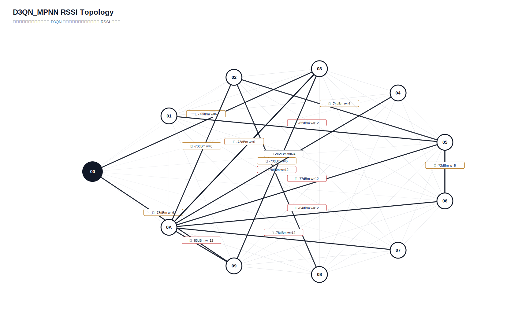

# D3QN_MPNN 真实硬件测试汇总报告

- 日志目录：`/home/sueiny/rk3506_linux6.1_v1.2.0/app/广播组网上位机/app/logs/d3qn_hw/第19次测试`
- 算法：`D3QN_MPNN`
- 推理策略：`纯D3QN，无Dijkstra fallback，无规则兜底`
- 目标：有效 SEND 平均点到点延时 `<220ms`，实际 ACK 丢包率 `<10%`；路由失败单独统计。
- Checkpoint：`checkpoints/d3qn_mpnn/latest.pt`
- 节点：`01, 02, 03, 04, 05, 06, 07, 08, 09, 0A`
- 地址说明：CLI 按十六进制地址解析，因此目标 `10` 表示地址 `0x10`。
- 计划轮次：`180`，实际SEND：`180`，成功：`128`，ACK timeout：`52`，D3QN路由失败：`0`，实际丢包率：`28.89%`
- 端到端平均延时：`212.9ms`，P95：`903.5ms`，最小/最大：`0.0ms` / `1805.4ms`
- 时延抖动均值：`269.1ms`，时延标准差：`360.1ms`
- D3QN 路由失败次数：`0`

## 拓扑图

## 测试结果

| 出发点 | 目标点 | 路径 | D3QN动作 | 成功/实际SEND | ACK timeout | 路由失败 | 丢包率 | 点到点平均 | P95 | 推理平均 | D3QN总耗时 | 重采 | 切换 | 最弱 RSSI |
|---|---|---|---:|---:|---:|---:|---:|---:|---:|---:|---:|---:|---:|---:|
| `01` | `02` | `00 -> 01 -> 05 -> 02` | `0` | `2/2` | `0` | `0` | `0.00%` | `0.0ms` | `0.0ms` | `48.7ms` | `48.7ms` | `0` | `0` | `-88` |
| `01` | `03` | `00 -> 01 -> 03` | `0` | `2/2` | `0` | `0` | `0.00%` | `0.0ms` | `0.0ms` | `38.2ms` | `38.2ms` | `0` | `0` | `-88` |
| `01` | `04` | `00 -> 01 -> 03 -> 04` | `1` | `2/2` | `0` | `0` | `0.00%` | `0.0ms` | `0.0ms` | `42.6ms` | `42.6ms` | `0` | `2` | `-88` |
| `01` | `05` | `00 -> 01 -> 05` | `0` | `2/2` | `0` | `0` | `0.00%` | `0.0ms` | `0.0ms` | `41.9ms` | `41.9ms` | `0` | `0` | `-88` |
| `01` | `06` | `00 -> 01 -> 03 -> 05 -> 06` | `2` | `2/2` | `0` | `0` | `0.00%` | `0.0ms` | `0.0ms` | `37.5ms` | `37.5ms` | `0` | `0` | `-88` |
| `01` | `07` | `00 -> 01 -> 03 -> 07` | `1` | `1/2` | `1` | `0` | `50.00%` | `0.0ms` | `0.0ms` | `41.5ms` | `46.6ms` | `0` | `0` | `-88` |
| `01` | `08` | `00 -> 01 -> 08` | `0` | `1/2` | `1` | `0` | `50.00%` | `0.0ms` | `0.0ms` | `36.6ms` | `39.7ms` | `0` | `0` | `-88` |
| `01` | `09` | `00 -> 01 -> 09` | `0` | `2/2` | `0` | `0` | `0.00%` | `49.7ms` | `99.4ms` | `47.1ms` | `96.8ms` | `0` | `0` | `-88` |
| `01` | `0A` | `00 -> 01 -> 03 -> 0A` | `2` | `1/2` | `1` | `0` | `50.00%` | `0.0ms` | `0.0ms` | `38.7ms` | `40.5ms` | `0` | `0` | `-88` |
| `02` | `01` | `00 -> 03 -> 02 -> 05 -> 01` | `0` | `0/2` | `2` | `0` | `100.00%` | `n/a` | `n/a` | `46.1ms` | `n/a` | `0` | `2` | `-82` |
| `02` | `03` | `00 -> 03 -> 02 -> 05 -> 03` | `1` | `1/2` | `1` | `0` | `50.00%` | `0.0ms` | `0.0ms` | `41.1ms` | `41.7ms` | `0` | `0` | `-80` |
| `02` | `04` | `00 -> 03 -> 02 -> 05 -> 03 -> 04` | `1` | `2/2` | `0` | `0` | `0.00%` | `100.2ms` | `200.3ms` | `39.7ms` | `139.9ms` | `0` | `0` | `-84` |
| `02` | `05` | `00 -> 03 -> 02 -> 05` | `0` | `0/2` | `2` | `0` | `100.00%` | `n/a` | `n/a` | `39.2ms` | `n/a` | `0` | `2` | `-80` |
| `02` | `06` | `00 -> 03 -> 02 -> 05 -> 06` | `0` | `2/2` | `0` | `0` | `0.00%` | `200.5ms` | `400.9ms` | `40.7ms` | `241.2ms` | `0` | `2` | `-80` |
| `02` | `07` | `00 -> 03 -> 02 -> 05 -> 09 -> 07` | `3` | `2/2` | `0` | `0` | `0.00%` | `100.1ms` | `199.9ms` | `41.3ms` | `141.4ms` | `0` | `2` | `-80` |
| `02` | `08` | `00 -> 03 -> 02 -> 05 -> 08` | `3` | `2/2` | `0` | `0` | `0.00%` | `0.0ms` | `0.0ms` | `39.3ms` | `39.3ms` | `0` | `2` | `-81` |
| `02` | `09` | `00 -> 03 -> 02 -> 05 -> 09` | `0` | `2/2` | `0` | `0` | `0.00%` | `150.1ms` | `300.2ms` | `39.9ms` | `190.0ms` | `0` | `2` | `-80` |
| `02` | `0A` | `00 -> 03 -> 02 -> 05 -> 0A` | `2` | `1/2` | `1` | `0` | `50.00%` | `0.0ms` | `0.0ms` | `41.4ms` | `37.5ms` | `0` | `0` | `-80` |
| `03` | `01` | `00 -> 03 -> 05 -> 01` | `0` | `1/2` | `1` | `0` | `50.00%` | `0.0ms` | `0.0ms` | `41.9ms` | `42.9ms` | `0` | `0` | `-82` |
| `03` | `02` | `00 -> 03 -> 02` | `0` | `2/2` | `0` | `0` | `0.00%` | `0.0ms` | `0.0ms` | `41.6ms` | `41.6ms` | `0` | `0` | `-80` |
| `03` | `04` | `00 -> 03 -> 04` | `0` | `2/2` | `0` | `0` | `0.00%` | `0.0ms` | `0.0ms` | `46.7ms` | `46.7ms` | `0` | `2` | `-84` |
| `03` | `05` | `00 -> 03 -> 05` | `0` | `0/2` | `2` | `0` | `100.00%` | `n/a` | `n/a` | `44.0ms` | `n/a` | `0` | `0` | `-75` |
| `03` | `06` | `00 -> 03 -> 05 -> 06` | `0` | `0/2` | `2` | `0` | `100.00%` | `n/a` | `n/a` | `41.6ms` | `n/a` | `0` | `0` | `-75` |
| `03` | `07` | `00 -> 03 -> 07` | `0` | `1/2` | `1` | `0` | `50.00%` | `401.0ms` | `401.0ms` | `46.4ms` | `449.8ms` | `0` | `0` | `-73` |
| `03` | `08` | `00 -> 03 -> 08` | `0` | `2/2` | `0` | `0` | `0.00%` | `250.3ms` | `300.7ms` | `41.2ms` | `291.5ms` | `0` | `0` | `-75` |
| `03` | `09` | `00 -> 03 -> 09` | `0` | `2/2` | `0` | `0` | `0.00%` | `196.0ms` | `391.9ms` | `38.1ms` | `234.0ms` | `0` | `0` | `-74` |
| `03` | `0A` | `00 -> 03 -> 06 -> 0A` | `3` | `2/2` | `0` | `0` | `0.00%` | `200.6ms` | `401.2ms` | `47.6ms` | `248.1ms` | `0` | `0` | `-83` |
| `04` | `01` | `00 -> 04 -> 03 -> 01` | `2` | `2/2` | `0` | `0` | `0.00%` | `49.9ms` | `99.7ms` | `46.1ms` | `96.0ms` | `0` | `0` | `-88` |
| `04` | `02` | `00 -> 04 -> 03 -> 02` | `0` | `2/2` | `0` | `0` | `0.00%` | `501.6ms` | `902.4ms` | `38.7ms` | `540.2ms` | `0` | `0` | `-80` |
| `04` | `03` | `00 -> 04 -> 03` | `0` | `0/2` | `2` | `0` | `100.00%` | `n/a` | `n/a` | `41.3ms` | `n/a` | `0` | `2` | `-63` |
| `04` | `05` | `00 -> 04 -> 03 -> 06 -> 05` | `3` | `1/2` | `1` | `0` | `50.00%` | `503.4ms` | `503.4ms` | `39.7ms` | `543.7ms` | `0` | `0` | `-83` |
| `04` | `06` | `00 -> 04 -> 03 -> 07 -> 06` | `3` | `2/2` | `0` | `0` | `0.00%` | `350.4ms` | `500.7ms` | `39.2ms` | `389.6ms` | `0` | `0` | `-77` |
| `04` | `07` | `00 -> 04 -> 03 -> 07` | `0` | `1/2` | `1` | `0` | `50.00%` | `702.6ms` | `702.6ms` | `46.0ms` | `753.4ms` | `0` | `0` | `-66` |
| `04` | `08` | `00 -> 04 -> 03 -> 08` | `0` | `2/2` | `0` | `0` | `0.00%` | `301.2ms` | `301.6ms` | `42.0ms` | `343.2ms` | `0` | `2` | `-75` |
| `04` | `09` | `00 -> 04 -> 03 -> 09` | `0` | `2/2` | `0` | `0` | `0.00%` | `100.4ms` | `200.9ms` | `40.6ms` | `141.0ms` | `0` | `2` | `-74` |
| `04` | `0A` | `00 -> 04 -> 03 -> 0A` | `0` | `2/2` | `0` | `0` | `0.00%` | `652.1ms` | `903.5ms` | `43.4ms` | `695.5ms` | `0` | `0` | `-78` |
| `05` | `01` | `00 -> 03 -> 05 -> 01` | `0` | `2/2` | `0` | `0` | `0.00%` | `49.3ms` | `98.7ms` | `40.1ms` | `89.4ms` | `0` | `2` | `-82` |
| `05` | `02` | `00 -> 03 -> 05 -> 02` | `0` | `2/2` | `0` | `0` | `0.00%` | `200.2ms` | `300.4ms` | `45.9ms` | `246.1ms` | `0` | `2` | `-75` |
| `05` | `03` | `00 -> 03 -> 05 -> 03` | `0` | `0/2` | `2` | `0` | `100.00%` | `n/a` | `n/a` | `39.4ms` | `n/a` | `0` | `0` | `-75` |
| `05` | `04` | `00 -> 03 -> 05 -> 03 -> 04` | `0` | `1/2` | `1` | `0` | `50.00%` | `1714.6ms` | `1714.6ms` | `42.3ms` | `1757.8ms` | `0` | `0` | `-84` |
| `05` | `06` | `00 -> 03 -> 05 -> 01 -> 06` | `3` | `1/2` | `1` | `0` | `50.00%` | `200.4ms` | `200.4ms` | `39.9ms` | `241.0ms` | `0` | `2` | `-82` |
| `05` | `07` | `00 -> 03 -> 05 -> 09 -> 07` | `1` | `1/2` | `1` | `0` | `50.00%` | `400.0ms` | `400.0ms` | `36.0ms` | `438.2ms` | `0` | `2` | `-75` |
| `05` | `08` | `00 -> 03 -> 05 -> 08` | `1` | `2/2` | `0` | `0` | `0.00%` | `50.1ms` | `100.1ms` | `44.1ms` | `94.2ms` | `0` | `2` | `-81` |
| `05` | `09` | `00 -> 03 -> 05 -> 09` | `0` | `1/2` | `1` | `0` | `50.00%` | `300.6ms` | `300.6ms` | `37.0ms` | `340.7ms` | `0` | `2` | `-75` |
| `05` | `0A` | `00 -> 03 -> 05 -> 0A` | `1` | `2/2` | `0` | `0` | `0.00%` | `300.4ms` | `400.8ms` | `48.4ms` | `348.8ms` | `0` | `2` | `-79` |
| `06` | `01` | `00 -> 06 -> 03 -> 05 -> 01` | `2` | `2/2` | `0` | `0` | `0.00%` | `150.2ms` | `300.4ms` | `42.0ms` | `192.2ms` | `0` | `0` | `-83` |
| `06` | `02` | `00 -> 06 -> 0A -> 02` | `2` | `1/2` | `1` | `0` | `50.00%` | `0.0ms` | `0.0ms` | `40.0ms` | `41.9ms` | `0` | `0` | `-83` |
| `06` | `03` | `00 -> 06 -> 0A -> 03` | `2` | `0/2` | `2` | `0` | `100.00%` | `n/a` | `n/a` | `47.4ms` | `n/a` | `0` | `0` | `-83` |
| `06` | `04` | `00 -> 06 -> 03 -> 04` | `0` | `2/2` | `0` | `0` | `0.00%` | `0.0ms` | `0.0ms` | `38.2ms` | `38.2ms` | `0` | `2` | `-84` |
| `06` | `05` | `00 -> 06 -> 03 -> 05` | `1` | `2/2` | `0` | `0` | `0.00%` | `49.8ms` | `99.6ms` | `37.3ms` | `87.1ms` | `0` | `0` | `-83` |
| `06` | `07` | `00 -> 06 -> 07` | `1` | `2/2` | `0` | `0` | `0.00%` | `451.4ms` | `902.8ms` | `43.4ms` | `494.9ms` | `0` | `0` | `-83` |
| `06` | `08` | `00 -> 06 -> 03 -> 08` | `0` | `2/2` | `0` | `0` | `0.00%` | `0.0ms` | `0.0ms` | `46.3ms` | `46.3ms` | `0` | `0` | `-83` |
| `06` | `09` | `00 -> 06 -> 09` | `2` | `2/2` | `0` | `0` | `0.00%` | `0.0ms` | `0.0ms` | `48.4ms` | `48.4ms` | `0` | `0` | `-85` |
| `06` | `0A` | `00 -> 06 -> 0A` | `0` | `2/2` | `0` | `0` | `0.00%` | `0.0ms` | `0.0ms` | `40.5ms` | `40.5ms` | `0` | `0` | `-83` |
| `07` | `01` | `00 -> 03 -> 07 -> 05 -> 01` | `2` | `1/2` | `1` | `0` | `50.00%` | `200.0ms` | `200.0ms` | `40.6ms` | `240.2ms` | `0` | `2` | `-84` |
| `07` | `02` | `00 -> 03 -> 07 -> 0A -> 02` | `3` | `2/2` | `0` | `0` | `0.00%` | `150.4ms` | `200.6ms` | `39.9ms` | `190.3ms` | `0` | `2` | `-82` |
| `07` | `03` | `00 -> 03 -> 07 -> 03` | `0` | `1/2` | `1` | `0` | `50.00%` | `902.9ms` | `902.9ms` | `45.0ms` | `943.4ms` | `0` | `0` | `-73` |
| `07` | `04` | `00 -> 03 -> 07 -> 04` | `2` | `2/2` | `0` | `0` | `0.00%` | `49.9ms` | `99.9ms` | `32.0ms` | `81.9ms` | `0` | `2` | `-100` |
| `07` | `05` | `00 -> 03 -> 07 -> 05` | `1` | `1/2` | `1` | `0` | `50.00%` | `0.0ms` | `0.0ms` | `41.3ms` | `45.0ms` | `0` | `2` | `-84` |
| `07` | `06` | `00 -> 03 -> 07 -> 05 -> 06` | `3` | `2/2` | `0` | `0` | `0.00%` | `50.1ms` | `100.1ms` | `42.2ms` | `92.3ms` | `0` | `2` | `-84` |
| `07` | `08` | `00 -> 03 -> 07 -> 09 -> 08` | `3` | `2/2` | `0` | `0` | `0.00%` | `250.6ms` | `501.2ms` | `40.6ms` | `291.2ms` | `0` | `2` | `-76` |
| `07` | `09` | `00 -> 03 -> 07 -> 05 -> 09` | `3` | `1/2` | `1` | `0` | `50.00%` | `0.0ms` | `0.0ms` | `39.1ms` | `42.1ms` | `0` | `2` | `-84` |
| `07` | `0A` | `00 -> 03 -> 07 -> 0A` | `0` | `2/2` | `0` | `0` | `0.00%` | `50.4ms` | `100.8ms` | `42.4ms` | `92.8ms` | `0` | `2` | `-82` |
| `08` | `01` | `00 -> 08 -> 03 -> 05 -> 01` | `3` | `1/2` | `1` | `0` | `50.00%` | `300.5ms` | `300.5ms` | `42.7ms` | `338.4ms` | `0` | `0` | `-82` |
| `08` | `02` | `00 -> 08 -> 03 -> 02` | `2` | `2/2` | `0` | `0` | `0.00%` | `447.0ms` | `492.9ms` | `43.0ms` | `490.0ms` | `0` | `0` | `-80` |
| `08` | `03` | `00 -> 08 -> 03` | `0` | `1/2` | `1` | `0` | `50.00%` | `199.3ms` | `199.3ms` | `42.2ms` | `241.6ms` | `0` | `0` | `-76` |
| `08` | `04` | `00 -> 08 -> 03 -> 04` | `1` | `2/2` | `0` | `0` | `0.00%` | `0.1ms` | `0.1ms` | `39.2ms` | `39.3ms` | `0` | `2` | `-84` |
| `08` | `05` | `00 -> 08 -> 03 -> 05` | `2` | `2/2` | `0` | `0` | `0.00%` | `802.5ms` | `1605.0ms` | `39.6ms` | `842.2ms` | `0` | `0` | `-76` |
| `08` | `06` | `00 -> 08 -> 02 -> 05 -> 06` | `2` | `2/2` | `0` | `0` | `0.00%` | `300.7ms` | `401.2ms` | `45.2ms` | `345.8ms` | `0` | `0` | `-82` |
| `08` | `07` | `00 -> 08 -> 03 -> 07` | `1` | `1/2` | `1` | `0` | `50.00%` | `199.8ms` | `199.8ms` | `45.5ms` | `250.0ms` | `0` | `0` | `-76` |
| `08` | `09` | `00 -> 08 -> 03 -> 09` | `1` | `2/2` | `0` | `0` | `0.00%` | `0.0ms` | `0.0ms` | `50.7ms` | `50.7ms` | `0` | `2` | `-76` |
| `08` | `0A` | `00 -> 08 -> 03 -> 0A` | `2` | `2/2` | `0` | `0` | `0.00%` | `100.2ms` | `200.3ms` | `38.0ms` | `138.2ms` | `0` | `0` | `-78` |
| `09` | `01` | `00 -> 09 -> 03 -> 05 -> 01` | `1` | `2/2` | `0` | `0` | `0.00%` | `300.5ms` | `501.3ms` | `39.0ms` | `339.5ms` | `0` | `0` | `-82` |
| `09` | `02` | `00 -> 09 -> 03 -> 02` | `1` | `2/2` | `0` | `0` | `0.00%` | `200.3ms` | `400.7ms` | `37.0ms` | `237.4ms` | `0` | `0` | `-80` |
| `09` | `03` | `00 -> 09 -> 0A -> 03` | `3` | `1/2` | `1` | `0` | `50.00%` | `300.7ms` | `300.7ms` | `38.6ms` | `337.8ms` | `0` | `0` | `-81` |
| `09` | `04` | `00 -> 09 -> 03 -> 04` | `1` | `1/2` | `1` | `0` | `50.00%` | `1203.8ms` | `1203.8ms` | `38.0ms` | `1237.1ms` | `0` | `2` | `-84` |
| `09` | `05` | `00 -> 09 -> 03 -> 05` | `0` | `1/2` | `1` | `0` | `50.00%` | `200.3ms` | `200.3ms` | `40.0ms` | `241.7ms` | `0` | `0` | `-75` |
| `09` | `06` | `00 -> 09 -> 03 -> 05 -> 06` | `0` | `2/2` | `0` | `0` | `0.00%` | `0.0ms` | `0.0ms` | `38.2ms` | `38.2ms` | `0` | `0` | `-75` |
| `09` | `07` | `00 -> 09 -> 03 -> 07` | `1` | `1/2` | `1` | `0` | `50.00%` | `0.0ms` | `0.0ms` | `37.8ms` | `39.3ms` | `0` | `0` | `-73` |
| `09` | `08` | `00 -> 09 -> 03 -> 08` | `1` | `2/2` | `0` | `0` | `0.00%` | `99.7ms` | `199.4ms` | `37.2ms` | `136.9ms` | `0` | `0` | `-75` |
| `09` | `0A` | `00 -> 09 -> 03 -> 0A` | `1` | `2/2` | `0` | `0` | `0.00%` | `99.6ms` | `199.2ms` | `40.2ms` | `139.8ms` | `0` | `0` | `-78` |
| `0A` | `01` | `00 -> 03 -> 0A -> 05 -> 01` | `3` | `2/2` | `0` | `0` | `0.00%` | `652.0ms` | `1002.6ms` | `33.6ms` | `685.6ms` | `0` | `2` | `-82` |
| `0A` | `02` | `00 -> 03 -> 0A -> 02` | `0` | `0/2` | `2` | `0` | `100.00%` | `n/a` | `n/a` | `38.0ms` | `n/a` | `0` | `2` | `-78` |
| `0A` | `03` | `00 -> 03 -> 0A -> 03` | `0` | `0/2` | `2` | `0` | `100.00%` | `n/a` | `n/a` | `40.7ms` | `n/a` | `0` | `0` | `-78` |
| `0A` | `04` | `00 -> 03 -> 0A -> 04` | `2` | `1/2` | `1` | `0` | `50.00%` | `0.0ms` | `0.0ms` | `39.7ms` | `35.6ms` | `0` | `2` | `-96` |
| `0A` | `05` | `00 -> 03 -> 0A -> 06 -> 05` | `3` | `1/2` | `1` | `0` | `50.00%` | `1805.4ms` | `1805.4ms` | `46.5ms` | `1852.0ms` | `0` | `2` | `-84` |
| `0A` | `06` | `00 -> 03 -> 0A -> 02 -> 05 -> 06` | `1` | `0/2` | `2` | `0` | `100.00%` | `n/a` | `n/a` | `42.9ms` | `n/a` | `0` | `2` | `-78` |
| `0A` | `07` | `00 -> 03 -> 0A -> 07` | `1` | `0/2` | `2` | `0` | `100.00%` | `n/a` | `n/a` | `38.2ms` | `n/a` | `0` | `2` | `-78` |
| `0A` | `08` | `00 -> 03 -> 0A -> 02 -> 08` | `2` | `0/2` | `2` | `0` | `100.00%` | `n/a` | `n/a` | `42.1ms` | `n/a` | `0` | `2` | `-78` |
| `0A` | `09` | `00 -> 03 -> 0A -> 09` | `1` | `1/2` | `1` | `0` | `50.00%` | `1704.7ms` | `1704.7ms` | `37.9ms` | `1745.9ms` | `0` | `2` | `-83` |

## 指标总结对比

| 指标 | 当前值 | 单位 | 说明 |
|---|---:|---|---|
| 算法计算延时 | `41.3ms` | ms | 上位机用 D3QN 算出路径的平均耗时 |
| 指令下发延时 | `212.9ms` | ms | 当前硬件无中间节点时间戳，用 SEND 到 ACK 总时延近似 |
| 端到端实际传输平均延时 | `212.9ms` | ms | 现有统计总 ACK 时延 |
| 全局平均丢包率 | `28.89%` | ratio | 总 timeout / 总发送 |
| D3QN 路由失败次数 | `0` | count | 无候选路径、checkpoint 缺失或模型输入不匹配 |
| 单路径平均跳数 | `3.1778` | hops | 各目标最终路径跳数平均值 |
| 平均单跳传输耗时 | `77.0ms` | ms/hop | 端到端平均延时 / 跳数折算 |
| RSSI 实时波动范围 | `38` | dB | 当前拓扑边 RSSI 最大值减最小值 |
| RSSI 标准差 | `7.7626` | dB | 当前拓扑边 RSSI 标准差 |
| 时延抖动均值 | `269.1ms` | ms | 相邻成功 ACK 延时差值均值 |
| 时延标准差 | `360.1ms` | ms | 成功 ACK 延时标准差 |

## 文件

- [`测试指标汇总.xlsx`](测试指标汇总.xlsx)
- [`拓扑图.txt`](拓扑图.txt)
- [`原始串口日志.log`](原始串口日志.log)
- `原始JSON数据/model_decisions.jsonl`
- `原始JSON数据/d3qn_state.json`

## 来源说明

| 来源 | 含义 |
|---|---|
| `real_rssi` | 由 RSSI_REQ 和 RSSI_REPORT 得到 |
| `real_ack` | 由真实 ACK 成功/timeout 统计得到 |
| `default` | 当前硬件不可直接测量，使用默认值占位 |
| `derived` | 由真实测试记录派生计算得到 |
| `derived_from_rssi` | 训练环境中容量、延时、丢包等不可测字段由真实 RSSI 分段派生 |
