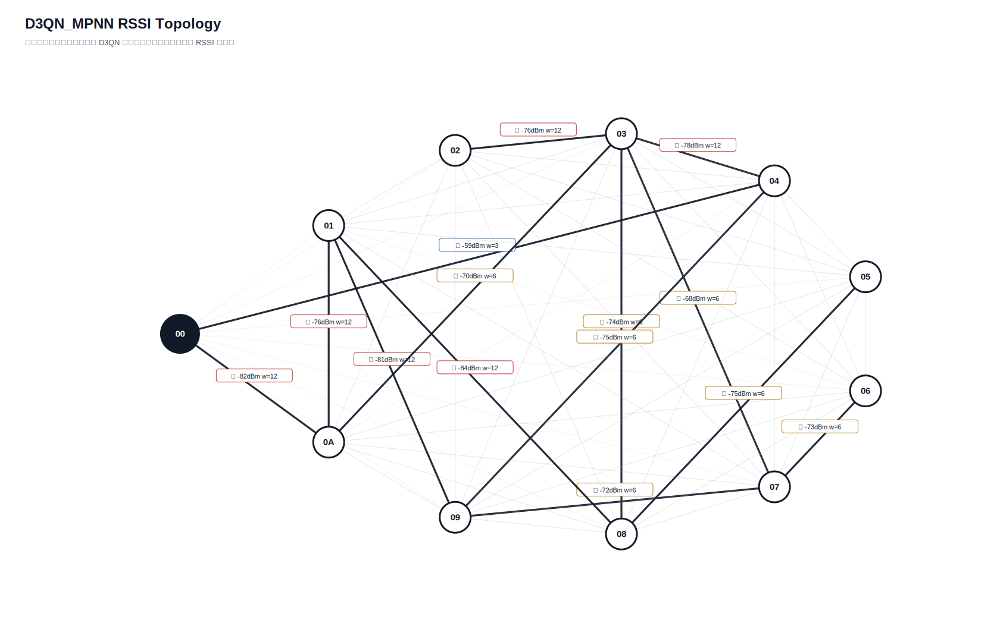

# D3QN_MPNN 真实硬件测试汇总报告

- 日志目录：`/home/sueiny/rk3506_linux6.1_v1.2.0/app/广播组网上位机/app/logs/d3qn_hw/第21次测试`
- 算法：`D3QN_MPNN`
- 推理策略：`纯D3QN，无Dijkstra fallback，无规则兜底`
- 目标：有效 SEND 平均点到点延时 `<220ms`，实际 ACK 丢包率 `<10%`；路由失败单独统计。
- Checkpoint：`checkpoints/d3qn_mpnn/latest.pt`
- 节点：`01, 02, 03, 04, 05, 06, 07, 08, 09, 0A`
- 地址说明：CLI 按十六进制地址解析，因此目标 `10` 表示地址 `0x10`。
- 计划轮次：`180`，实际SEND：`180`，成功：`131`，ACK timeout：`49`，D3QN路由失败：`0`，实际丢包率：`27.22%`
- 端到端平均延时：`223.2ms`，P95：`1010.1ms`，最小/最大：`0.0ms` / `1916.7ms`
- 时延抖动均值：`292.3ms`，时延标准差：`365.3ms`
- D3QN 路由失败次数：`0`

## 拓扑图

## 测试结果

| 出发点 | 目标点 | 路径 | D3QN动作 | 成功/实际SEND | ACK timeout | 路由失败 | 丢包率 | 点到点平均 | P95 | 推理平均 | D3QN总耗时 | 重采 | 切换 | 最弱 RSSI |
|---|---|---|---:|---:|---:|---:|---:|---:|---:|---:|---:|---:|---:|---:|
| `01` | `02` | `00 -> 08 -> 01 -> 03 -> 02` | `2` | `2/2` | `0` | `0` | `0.00%` | `0.0ms` | `0.0ms` | `47.6ms` | `47.6ms` | `0` | `0` | `-84` |
| `01` | `03` | `00 -> 08 -> 01 -> 05 -> 03` | `1` | `1/2` | `1` | `0` | `50.00%` | `1004.8ms` | `1004.8ms` | `43.3ms` | `1047.4ms` | `0` | `0` | `-84` |
| `01` | `04` | `00 -> 08 -> 01 -> 03 -> 04` | `0` | `2/2` | `0` | `0` | `0.00%` | `49.9ms` | `99.8ms` | `43.6ms` | `93.5ms` | `0` | `2` | `-84` |
| `01` | `05` | `00 -> 08 -> 01 -> 03 -> 05` | `3` | `2/2` | `0` | `0` | `0.00%` | `551.2ms` | `610.4ms` | `44.1ms` | `595.3ms` | `0` | `2` | `-84` |
| `01` | `06` | `00 -> 08 -> 01 -> 03 -> 07 -> 06` | `3` | `2/2` | `0` | `0` | `0.00%` | `101.2ms` | `202.3ms` | `42.4ms` | `143.7ms` | `0` | `0` | `-84` |
| `01` | `07` | `00 -> 08 -> 01 -> 05 -> 03 -> 07` | `2` | `2/2` | `0` | `0` | `0.00%` | `150.4ms` | `300.8ms` | `41.8ms` | `192.2ms` | `0` | `2` | `-84` |
| `01` | `08` | `00 -> 08 -> 01 -> 03 -> 08` | `1` | `1/2` | `1` | `0` | `50.00%` | `401.3ms` | `401.3ms` | `40.7ms` | `442.1ms` | `0` | `0` | `-84` |
| `01` | `09` | `00 -> 08 -> 01 -> 03 -> 07 -> 09` | `3` | `2/2` | `0` | `0` | `0.00%` | `0.0ms` | `0.0ms` | `44.1ms` | `44.1ms` | `0` | `0` | `-84` |
| `01` | `0A` | `00 -> 08 -> 01 -> 03 -> 09 -> 0A` | `3` | `2/2` | `0` | `0` | `0.00%` | `250.7ms` | `501.5ms` | `41.3ms` | `292.0ms` | `0` | `0` | `-84` |
| `02` | `01` | `00 -> 02 -> 08 -> 01` | `3` | `1/2` | `1` | `0` | `50.00%` | `1505.9ms` | `1505.9ms` | `42.9ms` | `1546.0ms` | `0` | `0` | `-84` |
| `02` | `03` | `00 -> 02 -> 05 -> 03` | `1` | `0/2` | `2` | `0` | `100.00%` | `n/a` | `n/a` | `42.8ms` | `n/a` | `0` | `0` | `-83` |
| `02` | `04` | `00 -> 02 -> 05 -> 03 -> 04` | `3` | `2/2` | `0` | `0` | `0.00%` | `0.0ms` | `0.0ms` | `37.7ms` | `37.7ms` | `0` | `2` | `-83` |
| `02` | `05` | `00 -> 02 -> 08 -> 05` | `2` | `0/2` | `2` | `0` | `100.00%` | `n/a` | `n/a` | `44.1ms` | `n/a` | `0` | `0` | `-83` |
| `02` | `06` | `00 -> 02 -> 03 -> 07 -> 06` | `3` | `0/2` | `2` | `0` | `100.00%` | `n/a` | `n/a` | `35.5ms` | `n/a` | `0` | `0` | `-83` |
| `02` | `07` | `00 -> 02 -> 05 -> 03 -> 07` | `1` | `1/2` | `1` | `0` | `50.00%` | `0.0ms` | `0.0ms` | `42.4ms` | `41.8ms` | `0` | `0` | `-83` |
| `02` | `08` | `00 -> 02 -> 05 -> 03 -> 08` | `3` | `1/2` | `1` | `0` | `50.00%` | `0.0ms` | `0.0ms` | `38.3ms` | `37.9ms` | `0` | `0` | `-83` |
| `02` | `09` | `00 -> 02 -> 05 -> 03 -> 09` | `2` | `2/2` | `0` | `0` | `0.00%` | `0.0ms` | `0.0ms` | `39.3ms` | `39.3ms` | `0` | `0` | `-83` |
| `02` | `0A` | `00 -> 02 -> 03 -> 09 -> 0A` | `3` | `2/2` | `0` | `0` | `0.00%` | `150.6ms` | `301.3ms` | `38.0ms` | `188.6ms` | `0` | `0` | `-83` |
| `03` | `01` | `00 -> 03 -> 08 -> 01` | `0` | `0/2` | `2` | `0` | `100.00%` | `n/a` | `n/a` | `43.6ms` | `n/a` | `0` | `0` | `-84` |
| `03` | `02` | `00 -> 03 -> 07 -> 02` | `2` | `2/2` | `0` | `0` | `0.00%` | `0.0ms` | `0.0ms` | `36.6ms` | `36.6ms` | `0` | `0` | `-84` |
| `03` | `04` | `00 -> 03 -> 04` | `0` | `1/2` | `1` | `0` | `50.00%` | `100.1ms` | `100.1ms` | `33.0ms` | `134.6ms` | `0` | `2` | `-78` |
| `03` | `05` | `00 -> 03 -> 08 -> 05` | `1` | `2/2` | `0` | `0` | `0.00%` | `0.0ms` | `0.0ms` | `39.9ms` | `39.9ms` | `0` | `0` | `-75` |
| `03` | `06` | `00 -> 03 -> 07 -> 06` | `0` | `2/2` | `0` | `0` | `0.00%` | `150.3ms` | `300.6ms` | `35.5ms` | `185.8ms` | `0` | `0` | `-73` |
| `03` | `07` | `00 -> 03 -> 07` | `0` | `2/2` | `0` | `0` | `0.00%` | `0.1ms` | `0.2ms` | `39.1ms` | `39.2ms` | `0` | `0` | `-69` |
| `03` | `08` | `00 -> 03 -> 08` | `0` | `1/2` | `1` | `0` | `50.00%` | `0.0ms` | `0.0ms` | `48.9ms` | `60.7ms` | `0` | `0` | `-74` |
| `03` | `09` | `00 -> 03 -> 08 -> 09` | `3` | `2/2` | `0` | `0` | `0.00%` | `0.0ms` | `0.0ms` | `44.5ms` | `44.5ms` | `0` | `0` | `-82` |
| `03` | `0A` | `00 -> 03 -> 07 -> 09 -> 0A` | `3` | `2/2` | `0` | `0` | `0.00%` | `852.7ms` | `1504.4ms` | `41.2ms` | `893.9ms` | `0` | `0` | `-73` |
| `04` | `01` | `00 -> 04 -> 03 -> 08 -> 01` | `1` | `2/2` | `0` | `0` | `0.00%` | `0.0ms` | `0.0ms` | `39.8ms` | `39.8ms` | `0` | `0` | `-84` |
| `04` | `02` | `00 -> 04 -> 03 -> 07 -> 02` | `3` | `2/2` | `0` | `0` | `0.00%` | `50.0ms` | `100.0ms` | `37.2ms` | `87.2ms` | `0` | `0` | `-84` |
| `04` | `03` | `00 -> 04 -> 05 -> 03` | `3` | `1/2` | `1` | `0` | `50.00%` | `0.0ms` | `0.0ms` | `41.3ms` | `37.7ms` | `0` | `2` | `-84` |
| `04` | `05` | `00 -> 04 -> 03 -> 08 -> 05` | `2` | `1/2` | `1` | `0` | `50.00%` | `0.0ms` | `0.0ms` | `40.6ms` | `41.6ms` | `0` | `0` | `-75` |
| `04` | `06` | `00 -> 04 -> 03 -> 07 -> 06` | `1` | `2/2` | `0` | `0` | `0.00%` | `50.0ms` | `100.0ms` | `39.0ms` | `89.0ms` | `0` | `0` | `-73` |
| `04` | `07` | `00 -> 04 -> 03 -> 07` | `0` | `1/2` | `1` | `0` | `50.00%` | `0.0ms` | `0.0ms` | `40.7ms` | `39.9ms` | `0` | `0` | `-68` |
| `04` | `08` | `00 -> 04 -> 03 -> 08` | `0` | `2/2` | `0` | `0` | `0.00%` | `0.0ms` | `0.0ms` | `41.9ms` | `41.9ms` | `0` | `2` | `-74` |
| `04` | `09` | `00 -> 04 -> 03 -> 07 -> 09` | `2` | `2/2` | `0` | `0` | `0.00%` | `250.7ms` | `501.4ms` | `44.2ms` | `294.9ms` | `0` | `0` | `-72` |
| `04` | `0A` | `00 -> 04 -> 03 -> 09 -> 0A` | `1` | `2/2` | `0` | `0` | `0.00%` | `150.3ms` | `300.5ms` | `42.1ms` | `192.3ms` | `0` | `0` | `-73` |
| `05` | `01` | `00 -> 08 -> 05 -> 03 -> 09 -> 01` | `3` | `1/2` | `1` | `0` | `50.00%` | `0.0ms` | `0.0ms` | `43.3ms` | `46.8ms` | `0` | `2` | `-81` |
| `05` | `02` | `00 -> 08 -> 05 -> 03 -> 02` | `1` | `2/2` | `0` | `0` | `0.00%` | `150.4ms` | `300.7ms` | `41.0ms` | `191.4ms` | `0` | `2` | `-76` |
| `05` | `03` | `00 -> 08 -> 05 -> 03` | `0` | `0/2` | `2` | `0` | `100.00%` | `n/a` | `n/a` | `38.6ms` | `n/a` | `0` | `0` | `-75` |
| `05` | `04` | `00 -> 08 -> 05 -> 03 -> 04` | `0` | `2/2` | `0` | `0` | `0.00%` | `0.0ms` | `0.0ms` | `42.1ms` | `42.1ms` | `0` | `2` | `-78` |
| `05` | `06` | `00 -> 08 -> 05 -> 03 -> 07 -> 06` | `2` | `1/2` | `1` | `0` | `50.00%` | `200.5ms` | `200.5ms` | `42.2ms` | `241.6ms` | `0` | `2` | `-75` |
| `05` | `07` | `00 -> 08 -> 05 -> 03 -> 07` | `0` | `1/2` | `1` | `0` | `50.00%` | `300.5ms` | `300.5ms` | `41.6ms` | `341.4ms` | `0` | `2` | `-75` |
| `05` | `08` | `00 -> 08 -> 05 -> 03 -> 08` | `1` | `2/2` | `0` | `0` | `0.00%` | `404.3ms` | `808.7ms` | `42.5ms` | `446.8ms` | `0` | `0` | `-75` |
| `05` | `09` | `00 -> 08 -> 05 -> 03 -> 07 -> 09` | `3` | `2/2` | `0` | `0` | `0.00%` | `252.8ms` | `505.6ms` | `44.1ms` | `296.9ms` | `0` | `0` | `-75` |
| `05` | `0A` | `00 -> 08 -> 05 -> 03 -> 09 -> 0A` | `2` | `2/2` | `0` | `0` | `0.00%` | `300.7ms` | `401.1ms` | `42.1ms` | `342.8ms` | `0` | `0` | `-75` |
| `06` | `01` | `00 -> 06 -> 08 -> 01` | `1` | `2/2` | `0` | `0` | `0.00%` | `250.6ms` | `300.7ms` | `47.9ms` | `298.5ms` | `0` | `0` | `-84` |
| `06` | `02` | `00 -> 06 -> 02` | `0` | `2/2` | `0` | `0` | `0.00%` | `351.3ms` | `401.1ms` | `54.1ms` | `405.5ms` | `0` | `0` | `-78` |
| `06` | `03` | `00 -> 06 -> 05 -> 03` | `1` | `1/2` | `1` | `0` | `50.00%` | `802.0ms` | `802.0ms` | `42.1ms` | `840.3ms` | `0` | `0` | `-78` |
| `06` | `04` | `00 -> 06 -> 03 -> 04` | `2` | `1/2` | `1` | `0` | `50.00%` | `0.0ms` | `0.0ms` | `42.3ms` | `42.6ms` | `0` | `2` | `-82` |
| `06` | `05` | `00 -> 06 -> 03 -> 05` | `3` | `0/2` | `2` | `0` | `100.00%` | `n/a` | `n/a` | `41.0ms` | `n/a` | `0` | `0` | `-82` |
| `06` | `07` | `00 -> 06 -> 05 -> 03 -> 07` | `2` | `1/2` | `1` | `0` | `50.00%` | `0.0ms` | `0.0ms` | `42.7ms` | `39.8ms` | `0` | `0` | `-78` |
| `06` | `08` | `00 -> 06 -> 05 -> 03 -> 08` | `3` | `2/2` | `0` | `0` | `0.00%` | `0.0ms` | `0.0ms` | `40.2ms` | `40.2ms` | `0` | `0` | `-78` |
| `06` | `09` | `00 -> 06 -> 05 -> 03 -> 09` | `2` | `2/2` | `0` | `0` | `0.00%` | `49.8ms` | `99.6ms` | `42.3ms` | `92.1ms` | `0` | `0` | `-78` |
| `06` | `0A` | `00 -> 06 -> 0A` | `1` | `2/2` | `0` | `0` | `0.00%` | `0.0ms` | `0.0ms` | `44.2ms` | `44.2ms` | `0` | `0` | `-81` |
| `07` | `01` | `00 -> 03 -> 07 -> 08 -> 01` | `0` | `2/2` | `0` | `0` | `0.00%` | `100.6ms` | `201.1ms` | `37.2ms` | `137.7ms` | `0` | `2` | `-84` |
| `07` | `02` | `00 -> 03 -> 07 -> 06 -> 02` | `3` | `2/2` | `0` | `0` | `0.00%` | `100.2ms` | `200.3ms` | `42.0ms` | `142.2ms` | `0` | `2` | `-78` |
| `07` | `03` | `00 -> 03 -> 07 -> 05 -> 03` | `2` | `1/2` | `1` | `0` | `50.00%` | `0.0ms` | `0.0ms` | `42.7ms` | `42.9ms` | `0` | `0` | `-80` |
| `07` | `04` | `00 -> 03 -> 07 -> 03 -> 04` | `0` | `2/2` | `0` | `0` | `0.00%` | `100.4ms` | `200.9ms` | `45.3ms` | `145.8ms` | `0` | `0` | `-78` |
| `07` | `05` | `00 -> 03 -> 07 -> 06 -> 05` | `1` | `2/2` | `0` | `0` | `0.00%` | `651.4ms` | `1102.9ms` | `42.4ms` | `693.8ms` | `0` | `0` | `-73` |
| `07` | `06` | `00 -> 03 -> 07 -> 06` | `0` | `1/2` | `1` | `0` | `50.00%` | `0.0ms` | `0.0ms` | `43.4ms` | `44.8ms` | `0` | `0` | `-73` |
| `07` | `08` | `00 -> 03 -> 07 -> 06 -> 08` | `2` | `2/2` | `0` | `0` | `0.00%` | `304.4ms` | `403.6ms` | `49.2ms` | `353.6ms` | `0` | `2` | `-74` |
| `07` | `09` | `00 -> 03 -> 07 -> 06 -> 09` | `2` | `2/2` | `0` | `0` | `0.00%` | `253.2ms` | `506.4ms` | `42.9ms` | `296.1ms` | `0` | `2` | `-85` |
| `07` | `0A` | `00 -> 03 -> 07 -> 09 -> 0A` | `0` | `2/2` | `0` | `0` | `0.00%` | `99.6ms` | `199.3ms` | `45.3ms` | `144.9ms` | `0` | `2` | `-73` |
| `08` | `01` | `00 -> 08 -> 01` | `0` | `2/2` | `0` | `0` | `0.00%` | `350.7ms` | `401.0ms` | `41.5ms` | `392.2ms` | `0` | `0` | `-84` |
| `08` | `02` | `00 -> 08 -> 01 -> 02` | `2` | `1/2` | `1` | `0` | `50.00%` | `401.6ms` | `401.6ms` | `44.0ms` | `443.5ms` | `0` | `0` | `-84` |
| `08` | `03` | `00 -> 08 -> 05 -> 03` | `1` | `0/2` | `2` | `0` | `100.00%` | `n/a` | `n/a` | `39.2ms` | `n/a` | `0` | `0` | `-75` |
| `08` | `04` | `00 -> 08 -> 05 -> 03 -> 04` | `3` | `2/2` | `0` | `0` | `0.00%` | `1108.7ms` | `1916.7ms` | `43.9ms` | `1152.5ms` | `0` | `2` | `-78` |
| `08` | `05` | `00 -> 08 -> 01 -> 05` | `1` | `1/2` | `1` | `0` | `50.00%` | `300.3ms` | `300.3ms` | `43.9ms` | `342.7ms` | `0` | `0` | `-84` |
| `08` | `06` | `00 -> 08 -> 01 -> 05 -> 06` | `3` | `2/2` | `0` | `0` | `0.00%` | `50.1ms` | `99.6ms` | `39.1ms` | `89.2ms` | `0` | `0` | `-84` |
| `08` | `07` | `00 -> 08 -> 05 -> 03 -> 07` | `3` | `1/2` | `1` | `0` | `50.00%` | `99.8ms` | `99.8ms` | `42.1ms` | `144.1ms` | `0` | `0` | `-75` |
| `08` | `09` | `00 -> 08 -> 05 -> 03 -> 09` | `2` | `2/2` | `0` | `0` | `0.00%` | `0.0ms` | `0.0ms` | `42.3ms` | `42.3ms` | `0` | `0` | `-75` |
| `08` | `0A` | `00 -> 08 -> 09 -> 0A` | `3` | `2/2` | `0` | `0` | `0.00%` | `0.0ms` | `0.0ms` | `47.9ms` | `47.9ms` | `0` | `0` | `-82` |
| `09` | `01` | `00 -> 04 -> 09 -> 03 -> 08 -> 01` | `1` | `2/2` | `0` | `0` | `0.00%` | `301.6ms` | `402.4ms` | `39.0ms` | `340.6ms` | `0` | `0` | `-84` |
| `09` | `02` | `00 -> 04 -> 09 -> 01 -> 02` | `3` | `0/2` | `2` | `0` | `100.00%` | `n/a` | `n/a` | `43.3ms` | `n/a` | `0` | `0` | `-81` |
| `09` | `03` | `00 -> 04 -> 09 -> 05 -> 03` | `3` | `1/2` | `1` | `0` | `50.00%` | `1001.5ms` | `1001.5ms` | `41.4ms` | `1041.7ms` | `0` | `0` | `-83` |
| `09` | `04` | `00 -> 04 -> 09 -> 0A -> 03 -> 04` | `3` | `1/2` | `1` | `0` | `50.00%` | `701.6ms` | `701.6ms` | `42.7ms` | `745.3ms` | `0` | `2` | `-78` |
| `09` | `05` | `00 -> 04 -> 09 -> 03 -> 08 -> 05` | `3` | `2/2` | `0` | `0` | `0.00%` | `605.1ms` | `1010.1ms` | `38.0ms` | `643.1ms` | `0` | `0` | `-75` |
| `09` | `06` | `00 -> 04 -> 09 -> 03 -> 07 -> 06` | `1` | `1/2` | `1` | `0` | `50.00%` | `0.0ms` | `0.0ms` | `39.9ms` | `37.0ms` | `0` | `0` | `-75` |
| `09` | `07` | `00 -> 04 -> 09 -> 0A -> 03 -> 07` | `3` | `2/2` | `0` | `0` | `0.00%` | `200.3ms` | `400.7ms` | `43.4ms` | `243.7ms` | `0` | `0` | `-75` |
| `09` | `08` | `00 -> 04 -> 09 -> 03 -> 08` | `0` | `0/2` | `2` | `0` | `100.00%` | `n/a` | `n/a` | `44.0ms` | `n/a` | `0` | `0` | `-75` |
| `09` | `0A` | `00 -> 04 -> 09 -> 01 -> 0A` | `3` | `0/2` | `2` | `0` | `100.00%` | `n/a` | `n/a` | `39.5ms` | `n/a` | `0` | `0` | `-81` |
| `0A` | `01` | `00 -> 0A -> 03 -> 08 -> 01` | `1` | `2/2` | `0` | `0` | `0.00%` | `250.5ms` | `401.5ms` | `39.8ms` | `290.3ms` | `0` | `0` | `-84` |
| `0A` | `02` | `00 -> 0A -> 03 -> 02` | `1` | `1/2` | `1` | `0` | `50.00%` | `1605.6ms` | `1605.6ms` | `41.6ms` | `1649.8ms` | `0` | `0` | `-82` |
| `0A` | `03` | `00 -> 0A -> 03` | `0` | `0/2` | `2` | `0` | `100.00%` | `n/a` | `n/a` | `44.9ms` | `n/a` | `0` | `0` | `-82` |
| `0A` | `04` | `00 -> 0A -> 03 -> 04` | `0` | `1/2` | `1` | `0` | `50.00%` | `1412.8ms` | `1412.8ms` | `46.5ms` | `1458.1ms` | `0` | `2` | `-82` |
| `0A` | `05` | `00 -> 0A -> 03 -> 08 -> 05` | `3` | `1/2` | `1` | `0` | `50.00%` | `400.6ms` | `400.6ms` | `41.7ms` | `444.3ms` | `0` | `0` | `-82` |
| `0A` | `06` | `00 -> 0A -> 03 -> 07 -> 06` | `1` | `2/2` | `0` | `0` | `0.00%` | `352.0ms` | `400.2ms` | `43.4ms` | `395.4ms` | `0` | `0` | `-82` |
| `0A` | `07` | `00 -> 0A -> 03 -> 07` | `0` | `2/2` | `0` | `0` | `0.00%` | `150.2ms` | `300.3ms` | `44.8ms` | `195.0ms` | `0` | `0` | `-82` |
| `0A` | `08` | `00 -> 0A -> 03 -> 08` | `0` | `2/2` | `0` | `0` | `0.00%` | `0.0ms` | `0.0ms` | `47.7ms` | `47.7ms` | `0` | `0` | `-82` |
| `0A` | `09` | `00 -> 0A -> 03 -> 07 -> 09` | `2` | `2/2` | `0` | `0` | `0.00%` | `0.0ms` | `0.0ms` | `42.2ms` | `42.2ms` | `0` | `0` | `-82` |

## 指标总结对比

| 指标 | 当前值 | 单位 | 说明 |
|---|---:|---|---|
| 算法计算延时 | `42.1ms` | ms | 上位机用 D3QN 算出路径的平均耗时 |
| 指令下发延时 | `223.2ms` | ms | 当前硬件无中间节点时间戳，用 SEND 到 ACK 总时延近似 |
| 端到端实际传输平均延时 | `223.2ms` | ms | 现有统计总 ACK 时延 |
| 全局平均丢包率 | `27.22%` | ratio | 总 timeout / 总发送 |
| D3QN 路由失败次数 | `0` | count | 无候选路径、checkpoint 缺失或模型输入不匹配 |
| 单路径平均跳数 | `3.7111` | hops | 各目标最终路径跳数平均值 |
| 平均单跳传输耗时 | `70.0ms` | ms/hop | 端到端平均延时 / 跳数折算 |
| RSSI 实时波动范围 | `40` | dB | 当前拓扑边 RSSI 最大值减最小值 |
| RSSI 标准差 | `7.5739` | dB | 当前拓扑边 RSSI 标准差 |
| 时延抖动均值 | `292.3ms` | ms | 相邻成功 ACK 延时差值均值 |
| 时延标准差 | `365.3ms` | ms | 成功 ACK 延时标准差 |

## 文件

- [`测试指标汇总.xlsx`](测试指标汇总.xlsx)
- [`拓扑图.txt`](拓扑图.txt)
- [`原始串口日志.log`](原始串口日志.log)
- `原始JSON数据/model_decisions.jsonl`
- `原始JSON数据/d3qn_state.json`

## 来源说明

| 来源 | 含义 |
|---|---|
| `real_rssi` | 由 RSSI_REQ 和 RSSI_REPORT 得到 |
| `real_ack` | 由真实 ACK 成功/timeout 统计得到 |
| `default` | 当前硬件不可直接测量，使用默认值占位 |
| `derived` | 由真实测试记录派生计算得到 |
| `derived_from_rssi` | 训练环境中容量、延时、丢包等不可测字段由真实 RSSI 分段派生 |
