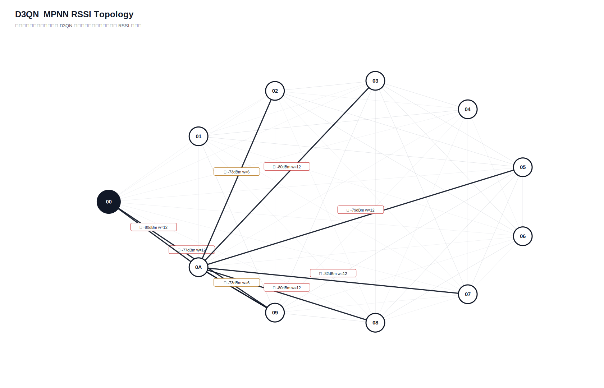

# D3QN_MPNN 真实硬件测试汇总报告

- 日志目录：`/home/sueiny/rk3506_linux6.1_v1.2.0/app/广播组网上位机/app/logs/d3qn_hw/第26次测试`
- 算法：`D3QN_MPNN`
- 推理策略：`纯D3QN，无Dijkstra fallback，无规则兜底`
- 目标：有效 SEND 平均点到点延时 `<220ms`，实际 ACK 丢包率 `<10%`；路由失败单独统计。
- Checkpoint：`checkpoints/d3qn_mpnn/latest.pt`
- 节点：`01, 02, 03, 04, 05, 06, 07, 08, 09, 0A`
- 地址说明：CLI 按十六进制地址解析，因此目标 `10` 表示地址 `0x10`。
- 计划轮次：`180`，实际SEND：`180`，成功：`158`，ACK timeout：`22`，D3QN路由失败：`0`，实际丢包率：`12.22%`
- 端到端平均延时：`101.5ms`，P95：`401.2ms`，最小/最大：`0.0ms` / `1203.3ms`
- 时延抖动均值：`143.2ms`，时延标准差：`179.0ms`
- D3QN 路由失败次数：`0`

## 拓扑图

## 测试结果

| 出发点 | 目标点 | 路径 | D3QN动作 | 成功/实际SEND | ACK timeout | 路由失败 | 丢包率 | 点到点平均 | P95 | 推理平均 | D3QN总耗时 | 重采 | 切换 | 最弱 RSSI |
|---|---|---|---:|---:|---:|---:|---:|---:|---:|---:|---:|---:|---:|---:|
| `01` | `02` | `00 -> 01 -> 02` | `0` | `2/2` | `0` | `0` | `0.00%` | `152.8ms` | `305.6ms` | `27.8ms` | `180.6ms` | `0` | `0` | `-82` |
| `01` | `03` | `00 -> 01 -> 03` | `0` | `1/2` | `1` | `0` | `50.00%` | `200.6ms` | `200.6ms` | `20.8ms` | `221.1ms` | `0` | `0` | `-82` |
| `01` | `04` | `00 -> 01 -> 04` | `0` | `2/2` | `0` | `0` | `0.00%` | `50.1ms` | `100.3ms` | `20.7ms` | `70.9ms` | `0` | `0` | `-84` |
| `01` | `05` | `00 -> 01 -> 05` | `0` | `2/2` | `0` | `0` | `0.00%` | `50.0ms` | `100.1ms` | `20.2ms` | `70.2ms` | `0` | `0` | `-82` |
| `01` | `06` | `00 -> 01 -> 06` | `0` | `2/2` | `0` | `0` | `0.00%` | `100.0ms` | `200.0ms` | `18.5ms` | `118.5ms` | `0` | `0` | `-82` |
| `01` | `07` | `00 -> 01 -> 07` | `0` | `2/2` | `0` | `0` | `0.00%` | `0.0ms` | `0.0ms` | `19.5ms` | `19.5ms` | `0` | `0` | `-82` |
| `01` | `08` | `00 -> 01 -> 08` | `0` | `2/2` | `0` | `0` | `0.00%` | `50.0ms` | `100.0ms` | `17.0ms` | `67.1ms` | `0` | `0` | `-82` |
| `01` | `09` | `00 -> 01 -> 09` | `0` | `1/2` | `1` | `0` | `50.00%` | `100.4ms` | `100.4ms` | `17.9ms` | `118.7ms` | `0` | `0` | `-82` |
| `01` | `0A` | `00 -> 01 -> 0A` | `0` | `2/2` | `0` | `0` | `0.00%` | `0.3ms` | `0.6ms` | `20.2ms` | `20.5ms` | `0` | `0` | `-82` |
| `02` | `01` | `00 -> 02 -> 01` | `0` | `1/2` | `1` | `0` | `50.00%` | `200.4ms` | `200.4ms` | `19.9ms` | `217.2ms` | `0` | `0` | `-84` |
| `02` | `03` | `00 -> 02 -> 03` | `0` | `2/2` | `0` | `0` | `0.00%` | `0.0ms` | `0.0ms` | `19.4ms` | `19.4ms` | `0` | `0` | `-81` |
| `02` | `04` | `00 -> 02 -> 04` | `0` | `1/2` | `1` | `0` | `50.00%` | `200.1ms` | `200.1ms` | `22.7ms` | `221.2ms` | `0` | `0` | `-81` |
| `02` | `05` | `00 -> 02 -> 05` | `0` | `2/2` | `0` | `0` | `0.00%` | `50.0ms` | `100.1ms` | `22.5ms` | `72.6ms` | `0` | `0` | `-81` |
| `02` | `06` | `00 -> 02 -> 06` | `0` | `2/2` | `0` | `0` | `0.00%` | `0.0ms` | `0.1ms` | `19.9ms` | `19.9ms` | `0` | `0` | `-81` |
| `02` | `07` | `00 -> 02 -> 07` | `0` | `1/2` | `1` | `0` | `50.00%` | `0.0ms` | `0.0ms` | `19.3ms` | `17.1ms` | `0` | `0` | `-81` |
| `02` | `08` | `00 -> 02 -> 08` | `0` | `2/2` | `0` | `0` | `0.00%` | `100.3ms` | `200.6ms` | `22.8ms` | `123.1ms` | `0` | `0` | `-81` |
| `02` | `09` | `00 -> 02 -> 09` | `0` | `2/2` | `0` | `0` | `0.00%` | `100.1ms` | `200.1ms` | `18.6ms` | `118.7ms` | `0` | `0` | `-81` |
| `02` | `0A` | `00 -> 02 -> 0A` | `0` | `1/2` | `1` | `0` | `50.00%` | `100.2ms` | `100.2ms` | `18.7ms` | `117.3ms` | `0` | `0` | `-81` |
| `03` | `01` | `00 -> 03 -> 01` | `0` | `2/2` | `0` | `0` | `0.00%` | `0.0ms` | `0.0ms` | `21.1ms` | `21.1ms` | `0` | `0` | `-66` |
| `03` | `02` | `00 -> 03 -> 02` | `0` | `2/2` | `0` | `0` | `0.00%` | `0.0ms` | `0.0ms` | `19.1ms` | `19.1ms` | `0` | `0` | `-77` |
| `03` | `04` | `00 -> 03 -> 04` | `0` | `2/2` | `0` | `0` | `0.00%` | `50.0ms` | `100.1ms` | `20.2ms` | `70.2ms` | `0` | `0` | `-81` |
| `03` | `05` | `00 -> 03 -> 05` | `0` | `2/2` | `0` | `0` | `0.00%` | `100.5ms` | `201.0ms` | `19.8ms` | `120.3ms` | `0` | `0` | `-74` |
| `03` | `06` | `00 -> 03 -> 06` | `0` | `1/2` | `1` | `0` | `50.00%` | `100.4ms` | `100.4ms` | `16.3ms` | `117.3ms` | `0` | `0` | `-85` |
| `03` | `07` | `00 -> 03 -> 07` | `0` | `2/2` | `0` | `0` | `0.00%` | `0.0ms` | `0.0ms` | `20.8ms` | `20.8ms` | `0` | `0` | `-70` |
| `03` | `08` | `00 -> 03 -> 08` | `0` | `2/2` | `0` | `0` | `0.00%` | `100.1ms` | `200.2ms` | `20.3ms` | `120.4ms` | `0` | `0` | `-82` |
| `03` | `09` | `00 -> 03 -> 09` | `0` | `1/2` | `1` | `0` | `50.00%` | `99.9ms` | `99.9ms` | `21.1ms` | `122.8ms` | `0` | `0` | `-76` |
| `03` | `0A` | `00 -> 03 -> 0A` | `0` | `1/2` | `1` | `0` | `50.00%` | `100.0ms` | `100.0ms` | `19.1ms` | `120.1ms` | `0` | `0` | `-81` |
| `04` | `01` | `00 -> 04 -> 01` | `0` | `2/2` | `0` | `0` | `0.00%` | `150.1ms` | `300.1ms` | `21.4ms` | `171.4ms` | `0` | `0` | `-80` |
| `04` | `02` | `00 -> 04 -> 02` | `0` | `2/2` | `0` | `0` | `0.00%` | `200.2ms` | `400.3ms` | `22.0ms` | `222.1ms` | `0` | `0` | `-81` |
| `04` | `03` | `00 -> 04 -> 03` | `0` | `2/2` | `0` | `0` | `0.00%` | `0.0ms` | `0.0ms` | `21.3ms` | `21.3ms` | `0` | `0` | `-66` |
| `04` | `05` | `00 -> 04 -> 00 -> 05` | `0` | `2/2` | `0` | `0` | `0.00%` | `0.0ms` | `0.0ms` | `19.7ms` | `19.7ms` | `0` | `0` | `-78` |
| `04` | `06` | `00 -> 04 -> 06` | `0` | `1/2` | `1` | `0` | `50.00%` | `701.9ms` | `701.9ms` | `21.0ms` | `724.5ms` | `0` | `0` | `-84` |
| `04` | `07` | `00 -> 04 -> 07` | `0` | `2/2` | `0` | `0` | `0.00%` | `0.0ms` | `0.0ms` | `22.0ms` | `22.0ms` | `0` | `0` | `-77` |
| `04` | `08` | `00 -> 04 -> 08` | `0` | `2/2` | `0` | `0` | `0.00%` | `250.4ms` | `500.8ms` | `21.2ms` | `271.6ms` | `0` | `0` | `-72` |
| `04` | `09` | `00 -> 04 -> 09` | `0` | `2/2` | `0` | `0` | `0.00%` | `250.4ms` | `300.5ms` | `21.9ms` | `272.3ms` | `0` | `0` | `-80` |
| `04` | `0A` | `00 -> 04 -> 0A` | `0` | `2/2` | `0` | `0` | `0.00%` | `49.9ms` | `99.8ms` | `20.8ms` | `70.7ms` | `0` | `0` | `-78` |
| `05` | `01` | `00 -> 05 -> 01` | `0` | `2/2` | `0` | `0` | `0.00%` | `49.9ms` | `99.8ms` | `20.4ms` | `70.3ms` | `0` | `0` | `-79` |
| `05` | `02` | `00 -> 05 -> 02` | `0` | `2/2` | `0` | `0` | `0.00%` | `0.0ms` | `0.0ms` | `20.8ms` | `20.8ms` | `0` | `0` | `-78` |
| `05` | `03` | `00 -> 05 -> 03` | `0` | `2/2` | `0` | `0` | `0.00%` | `551.0ms` | `1102.1ms` | `21.5ms` | `572.5ms` | `0` | `0` | `-78` |
| `05` | `04` | `00 -> 05 -> 00 -> 04` | `0` | `2/2` | `0` | `0` | `0.00%` | `0.0ms` | `0.0ms` | `21.2ms` | `21.2ms` | `0` | `0` | `-78` |
| `05` | `06` | `00 -> 05 -> 06` | `0` | `1/2` | `1` | `0` | `50.00%` | `0.0ms` | `0.0ms` | `23.3ms` | `24.7ms` | `0` | `0` | `-78` |
| `05` | `07` | `00 -> 05 -> 07` | `0` | `2/2` | `0` | `0` | `0.00%` | `150.5ms` | `201.1ms` | `20.3ms` | `170.8ms` | `0` | `0` | `-83` |
| `05` | `08` | `00 -> 05 -> 08` | `0` | `2/2` | `0` | `0` | `0.00%` | `0.0ms` | `0.0ms` | `18.1ms` | `18.1ms` | `0` | `0` | `-78` |
| `05` | `09` | `00 -> 05 -> 09` | `0` | `2/2` | `0` | `0` | `0.00%` | `0.0ms` | `0.0ms` | `18.6ms` | `18.6ms` | `0` | `0` | `-85` |
| `05` | `0A` | `00 -> 05 -> 0A` | `0` | `2/2` | `0` | `0` | `0.00%` | `351.0ms` | `702.1ms` | `19.8ms` | `370.8ms` | `0` | `0` | `-78` |
| `06` | `01` | `00 -> 06 -> 01` | `0` | `2/2` | `0` | `0` | `0.00%` | `0.0ms` | `0.0ms` | `16.6ms` | `16.6ms` | `0` | `0` | `-84` |
| `06` | `02` | `00 -> 06 -> 02` | `0` | `2/2` | `0` | `0` | `0.00%` | `51.0ms` | `102.0ms` | `19.3ms` | `70.3ms` | `0` | `0` | `-84` |
| `06` | `03` | `00 -> 06 -> 03` | `0` | `0/2` | `2` | `0` | `100.00%` | `n/a` | `n/a` | `24.4ms` | `n/a` | `0` | `0` | `-84` |
| `06` | `04` | `00 -> 06 -> 04` | `0` | `1/2` | `1` | `0` | `50.00%` | `200.2ms` | `200.2ms` | `16.9ms` | `218.2ms` | `0` | `0` | `-84` |
| `06` | `05` | `00 -> 06 -> 05` | `0` | `2/2` | `0` | `0` | `0.00%` | `0.0ms` | `0.0ms` | `21.0ms` | `21.0ms` | `0` | `0` | `-84` |
| `06` | `07` | `00 -> 06 -> 07` | `0` | `0/2` | `2` | `0` | `100.00%` | `n/a` | `n/a` | `23.6ms` | `n/a` | `0` | `0` | `-84` |
| `06` | `08` | `00 -> 06 -> 08` | `0` | `2/2` | `0` | `0` | `0.00%` | `199.9ms` | `300.4ms` | `20.8ms` | `220.7ms` | `0` | `0` | `-84` |
| `06` | `09` | `00 -> 06 -> 09` | `0` | `2/2` | `0` | `0` | `0.00%` | `50.0ms` | `100.0ms` | `24.5ms` | `74.5ms` | `0` | `0` | `-84` |
| `06` | `0A` | `00 -> 06 -> 0A` | `0` | `2/2` | `0` | `0` | `0.00%` | `50.1ms` | `100.2ms` | `23.6ms` | `73.7ms` | `0` | `0` | `-84` |
| `07` | `01` | `00 -> 07 -> 01` | `0` | `1/2` | `1` | `0` | `50.00%` | `0.0ms` | `0.0ms` | `17.3ms` | `17.8ms` | `0` | `0` | `-78` |
| `07` | `02` | `00 -> 07 -> 02` | `0` | `1/2` | `1` | `0` | `50.00%` | `100.3ms` | `100.3ms` | `23.4ms` | `132.8ms` | `0` | `0` | `-84` |
| `07` | `03` | `00 -> 07 -> 03` | `0` | `2/2` | `0` | `0` | `0.00%` | `50.2ms` | `100.4ms` | `23.4ms` | `73.6ms` | `0` | `0` | `-78` |
| `07` | `04` | `00 -> 07 -> 04` | `0` | `2/2` | `0` | `0` | `0.00%` | `102.9ms` | `105.1ms` | `20.9ms` | `123.8ms` | `0` | `0` | `-78` |
| `07` | `05` | `00 -> 07 -> 05` | `0` | `2/2` | `0` | `0` | `0.00%` | `51.5ms` | `103.0ms` | `23.8ms` | `75.3ms` | `0` | `0` | `-78` |
| `07` | `06` | `00 -> 07 -> 06` | `0` | `2/2` | `0` | `0` | `0.00%` | `0.0ms` | `0.0ms` | `22.6ms` | `22.6ms` | `0` | `0` | `-85` |
| `07` | `08` | `00 -> 07 -> 08` | `0` | `2/2` | `0` | `0` | `0.00%` | `50.5ms` | `101.0ms` | `19.1ms` | `69.7ms` | `0` | `0` | `-84` |
| `07` | `09` | `00 -> 07 -> 09` | `0` | `2/2` | `0` | `0` | `0.00%` | `100.4ms` | `200.8ms` | `21.0ms` | `121.4ms` | `0` | `0` | `-81` |
| `07` | `0A` | `00 -> 07 -> 0A` | `0` | `2/2` | `0` | `0` | `0.00%` | `0.0ms` | `0.0ms` | `22.0ms` | `22.0ms` | `0` | `0` | `-80` |
| `08` | `01` | `00 -> 08 -> 01` | `0` | `2/2` | `0` | `0` | `0.00%` | `100.2ms` | `200.4ms` | `20.6ms` | `120.9ms` | `0` | `0` | `-72` |
| `08` | `02` | `00 -> 08 -> 02` | `0` | `2/2` | `0` | `0` | `0.00%` | `100.2ms` | `200.3ms` | `19.7ms` | `119.8ms` | `0` | `0` | `-81` |
| `08` | `03` | `00 -> 08 -> 03` | `0` | `2/2` | `0` | `0` | `0.00%` | `0.0ms` | `0.0ms` | `16.2ms` | `16.2ms` | `0` | `0` | `-72` |
| `08` | `04` | `00 -> 08 -> 04` | `0` | `1/2` | `1` | `0` | `50.00%` | `0.0ms` | `0.0ms` | `18.5ms` | `18.8ms` | `0` | `0` | `-72` |
| `08` | `05` | `00 -> 08 -> 05` | `0` | `2/2` | `0` | `0` | `0.00%` | `0.0ms` | `0.0ms` | `18.7ms` | `18.7ms` | `0` | `0` | `-72` |
| `08` | `06` | `00 -> 08 -> 06` | `0` | `2/2` | `0` | `0` | `0.00%` | `0.0ms` | `0.0ms` | `18.8ms` | `18.8ms` | `0` | `0` | `-75` |
| `08` | `07` | `00 -> 08 -> 07` | `0` | `2/2` | `0` | `0` | `0.00%` | `301.0ms` | `401.4ms` | `20.9ms` | `322.0ms` | `0` | `0` | `-72` |
| `08` | `09` | `00 -> 08 -> 09` | `0` | `2/2` | `0` | `0` | `0.00%` | `0.0ms` | `0.0ms` | `27.8ms` | `27.8ms` | `0` | `0` | `-81` |
| `08` | `0A` | `00 -> 08 -> 0A` | `0` | `2/2` | `0` | `0` | `0.00%` | `0.0ms` | `0.0ms` | `24.3ms` | `24.3ms` | `0` | `0` | `-72` |
| `09` | `01` | `00 -> 09 -> 01` | `0` | `1/2` | `1` | `0` | `50.00%` | `400.8ms` | `400.8ms` | `21.3ms` | `421.9ms` | `0` | `0` | `-77` |
| `09` | `02` | `00 -> 09 -> 02` | `0` | `2/2` | `0` | `0` | `0.00%` | `301.0ms` | `401.2ms` | `18.9ms` | `319.8ms` | `0` | `0` | `-81` |
| `09` | `03` | `00 -> 09 -> 03` | `0` | `2/2` | `0` | `0` | `0.00%` | `200.4ms` | `400.9ms` | `20.5ms` | `220.9ms` | `0` | `0` | `-77` |
| `09` | `04` | `00 -> 09 -> 04` | `0` | `2/2` | `0` | `0` | `0.00%` | `0.0ms` | `0.0ms` | `20.5ms` | `20.5ms` | `0` | `0` | `-77` |
| `09` | `05` | `00 -> 09 -> 05` | `0` | `2/2` | `0` | `0` | `0.00%` | `100.3ms` | `200.4ms` | `20.3ms` | `120.6ms` | `0` | `0` | `-82` |
| `09` | `06` | `00 -> 09 -> 06` | `0` | `2/2` | `0` | `0` | `0.00%` | `0.0ms` | `0.1ms` | `19.6ms` | `19.7ms` | `0` | `0` | `-77` |
| `09` | `07` | `00 -> 09 -> 07` | `0` | `1/2` | `1` | `0` | `50.00%` | `0.0ms` | `0.0ms` | `19.6ms` | `18.5ms` | `0` | `0` | `-77` |
| `09` | `08` | `00 -> 09 -> 08` | `0` | `2/2` | `0` | `0` | `0.00%` | `150.1ms` | `200.4ms` | `20.2ms` | `170.4ms` | `0` | `0` | `-77` |
| `09` | `0A` | `00 -> 09 -> 0A` | `0` | `2/2` | `0` | `0` | `0.00%` | `50.0ms` | `100.0ms` | `23.3ms` | `73.4ms` | `0` | `0` | `-77` |
| `0A` | `01` | `00 -> 0A -> 01` | `0` | `2/2` | `0` | `0` | `0.00%` | `752.0ms` | `1203.3ms` | `19.3ms` | `771.3ms` | `0` | `0` | `-80` |
| `0A` | `02` | `00 -> 0A -> 02` | `0` | `2/2` | `0` | `0` | `0.00%` | `350.5ms` | `501.1ms` | `21.6ms` | `372.1ms` | `0` | `0` | `-80` |
| `0A` | `03` | `00 -> 0A -> 03` | `0` | `2/2` | `0` | `0` | `0.00%` | `100.3ms` | `200.6ms` | `18.4ms` | `118.7ms` | `0` | `0` | `-80` |
| `0A` | `04` | `00 -> 0A -> 04` | `0` | `2/2` | `0` | `0` | `0.00%` | `150.1ms` | `200.1ms` | `23.7ms` | `173.8ms` | `0` | `0` | `-80` |
| `0A` | `05` | `00 -> 0A -> 05` | `0` | `1/2` | `1` | `0` | `50.00%` | `0.0ms` | `0.0ms` | `20.6ms` | `22.0ms` | `0` | `0` | `-80` |
| `0A` | `06` | `00 -> 0A -> 06` | `0` | `2/2` | `0` | `0` | `0.00%` | `200.5ms` | `200.6ms` | `20.5ms` | `221.0ms` | `0` | `0` | `-80` |
| `0A` | `07` | `00 -> 0A -> 07` | `0` | `2/2` | `0` | `0` | `0.00%` | `96.1ms` | `191.8ms` | `22.1ms` | `118.2ms` | `0` | `0` | `-82` |
| `0A` | `08` | `00 -> 0A -> 08` | `0` | `2/2` | `0` | `0` | `0.00%` | `50.0ms` | `99.9ms` | `19.5ms` | `69.5ms` | `0` | `0` | `-80` |
| `0A` | `09` | `00 -> 0A -> 09` | `0` | `2/2` | `0` | `0` | `0.00%` | `150.2ms` | `200.2ms` | `18.3ms` | `168.5ms` | `0` | `0` | `-80` |

## 指标总结对比

| 指标 | 当前值 | 单位 | 说明 |
|---|---:|---|---|
| 算法计算延时 | `20.6ms` | ms | 上位机用 D3QN 算出路径的平均耗时 |
| 指令下发延时 | `101.5ms` | ms | 当前硬件无中间节点时间戳，用 SEND 到 ACK 总时延近似 |
| 端到端实际传输平均延时 | `101.5ms` | ms | 现有统计总 ACK 时延 |
| 全局平均丢包率 | `12.22%` | ratio | 总 timeout / 总发送 |
| D3QN 路由失败次数 | `0` | count | 无候选路径、checkpoint 缺失或模型输入不匹配 |
| 单路径平均跳数 | `2.0222` | hops | 各目标最终路径跳数平均值 |
| 平均单跳传输耗时 | `52.7ms` | ms/hop | 端到端平均延时 / 跳数折算 |
| RSSI 实时波动范围 | `26` | dB | 当前拓扑边 RSSI 最大值减最小值 |
| RSSI 标准差 | `5.3485` | dB | 当前拓扑边 RSSI 标准差 |
| 时延抖动均值 | `143.2ms` | ms | 相邻成功 ACK 延时差值均值 |
| 时延标准差 | `179.0ms` | ms | 成功 ACK 延时标准差 |

## 文件

- [`测试指标汇总.xlsx`](测试指标汇总.xlsx)
- [`拓扑图.txt`](拓扑图.txt)
- [`原始串口日志.log`](原始串口日志.log)
- `原始JSON数据/model_decisions.jsonl`
- `原始JSON数据/d3qn_state.json`

## 来源说明

| 来源 | 含义 |
|---|---|
| `real_rssi` | 由 RSSI_REQ 和 RSSI_REPORT 得到 |
| `real_ack` | 由真实 ACK 成功/timeout 统计得到 |
| `default` | 当前硬件不可直接测量，使用默认值占位 |
| `derived` | 由真实测试记录派生计算得到 |
| `derived_from_rssi` | 训练环境中容量、延时、丢包等不可测字段由真实 RSSI 分段派生 |
