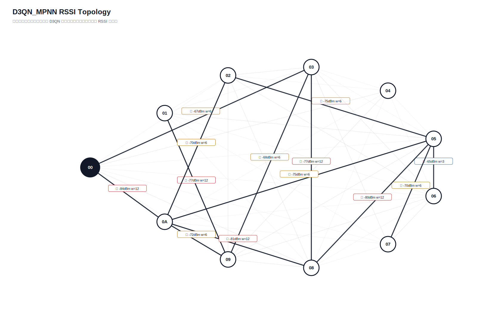

# D3QN_MPNN 真实硬件测试汇总报告

- 日志目录：`/home/sueiny/rk3506_linux6.1_v1.2.0/app/广播组网上位机/app/logs/d3qn_hw/第33次测试`
- 算法：`D3QN_MPNN`
- 推理策略：`纯D3QN，无Dijkstra fallback，无规则兜底`
- 目标：有效 SEND 平均点到点延时 `<220ms`，实际 ACK 丢包率 `<10%`；路由失败单独统计。
- Checkpoint：`/home/sueiny/rk3506_linux6.1_v1.2.0/app/广播组网上位机/app/checkpoints/d3qn_mpnn/latest.pt`
- 节点：`01, 02, 03, 04, 05, 06, 07, 08, 09, 0A`
- 地址说明：CLI 按十六进制地址解析，因此目标 `10` 表示地址 `0x10`。
- 计划轮次：`1800`，实际SEND：`1620`，成功：`1415`，ACK timeout：`205`，D3QN路由失败：`180`，实际丢包率：`12.65%`
- 端到端平均延时：`98.8ms`，P95：`501.4ms`，最小/最大：`0.0ms` / `1805.7ms`
- 推理时间平均：`128.5ms`，源到目标平均：`247.8ms`
- 时延抖动均值：`139.3ms`，时延标准差：`223.8ms`
- D3QN 路由失败次数：`180`

## 拓扑图

## 测试结果

| 出发点 | 目标点 | 路径 | D3QN动作 | 成功/实际SEND | ACK timeout | 路由失败 | 丢包率 | 点到点平均 | P95 | 推理平均 | 源到目标平均 | 总延时 | 重采 | 切换 | 最弱 RSSI |
|---|---|---|---:|---:|---:|---:|---:|---:|---:|---:|---:|---:|---:|---:|---:|
| `01` | `02` | `01 -> 09 -> 08 -> 03 -> 02` | `3` | `0/0` | `0` | `20` | `n/a` | `n/a` | `n/a` | `1057.3ms` | `n/a` | `n/a` | `0` | `20` | `-80` |
| `01` | `03` | `01 -> 09 -> 08 -> 07 -> 03` | `2` | `0/0` | `0` | `20` | `n/a` | `n/a` | `n/a` | `995.6ms` | `n/a` | `n/a` | `0` | `20` | `-80` |
| `01` | `04` | `01 -> 09 -> 08 -> 00 -> 04` | `2` | `0/0` | `0` | `20` | `n/a` | `n/a` | `n/a` | `1006.4ms` | `n/a` | `n/a` | `0` | `20` | `-80` |
| `01` | `05` | `01 -> 09 -> 03 -> 05` | `2` | `0/0` | `0` | `20` | `n/a` | `n/a` | `n/a` | `1011.0ms` | `n/a` | `n/a` | `0` | `20` | `-80` |
| `01` | `06` | `01 -> 09 -> 03 -> 06` | `3` | `0/0` | `0` | `20` | `n/a` | `n/a` | `n/a` | `1016.2ms` | `n/a` | `n/a` | `0` | `20` | `-75` |
| `01` | `07` | `01 -> 09 -> 08 -> 07` | `0` | `0/0` | `0` | `20` | `n/a` | `n/a` | `n/a` | `1049.7ms` | `n/a` | `n/a` | `0` | `20` | `-80` |
| `01` | `08` | `01 -> 09 -> 08` | `0` | `0/0` | `0` | `20` | `n/a` | `n/a` | `n/a` | `1071.0ms` | `n/a` | `n/a` | `0` | `20` | `-80` |
| `01` | `09` | `01 -> 09` | `0` | `0/0` | `0` | `20` | `n/a` | `n/a` | `n/a` | `986.5ms` | `n/a` | `n/a` | `0` | `20` | `-64` |
| `01` | `0A` | `01 -> 09 -> 03 -> 0A` | `1` | `0/0` | `0` | `20` | `n/a` | `n/a` | `n/a` | `1027.6ms` | `n/a` | `n/a` | `0` | `20` | `-69` |
| `02` | `01` | `00 -> 02 -> 09 -> 01` | `1` | `12/20` | `8` | `0` | `40.00%` | `91.7ms` | `401.0ms` | `425.9ms` | `234.5ms` | `n/a` | `0` | `15` | `-84` |
| `02` | `03` | `00 -> 02 -> 06 -> 03` | `3` | `17/20` | `3` | `0` | `15.00%` | `11.7ms` | `100.2ms` | `166.2ms` | `148.0ms` | `201.3ms` | `0` | `7` | `-84` |
| `02` | `04` | `00 -> 02 -> 04` | `0` | `18/20` | `2` | `0` | `10.00%` | `5.7ms` | `100.3ms` | `97.9ms` | `134.5ms` | `101.3ms` | `0` | `20` | `-84` |
| `02` | `05` | `00 -> 02 -> 05` | `0` | `17/20` | `3` | `0` | `15.00%` | `0.0ms` | `0.2ms` | `150.7ms` | `136.2ms` | `200.9ms` | `0` | `15` | `-84` |
| `02` | `06` | `00 -> 02 -> 08 -> 06` | `3` | `16/20` | `4` | `0` | `20.00%` | `81.3ms` | `801.0ms` | `219.3ms` | `232.3ms` | `100.8ms` | `0` | `15` | `-84` |
| `02` | `07` | `00 -> 02 -> 07` | `0` | `15/20` | `5` | `0` | `25.00%` | `53.6ms` | `501.4ms` | `165.7ms` | `261.5ms` | `201.2ms` | `0` | `15` | `-84` |
| `02` | `08` | `00 -> 02 -> 06 -> 08` | `1` | `18/20` | `2` | `0` | `10.00%` | `50.0ms` | `400.8ms` | `102.6ms` | `173.2ms` | `100.9ms` | `0` | `2` | `-84` |
| `02` | `09` | `00 -> 02 -> 09` | `1` | `17/20` | `3` | `0` | `15.00%` | `65.2ms` | `501.0ms` | `173.9ms` | `208.3ms` | `301.2ms` | `0` | `12` | `-84` |
| `02` | `0A` | `00 -> 02 -> 06 -> 05 -> 0A` | `2` | `12/20` | `8` | `0` | `40.00%` | `16.6ms` | `100.0ms` | `165.9ms` | `151.0ms` | `101.0ms` | `1` | `10` | `-84` |
| `03` | `01` | `00 -> 03 -> 05 -> 01` | `0` | `17/20` | `3` | `0` | `15.00%` | `59.3ms` | `203.5ms` | `3.3ms` | `166.2ms` | `100.9ms` | `1` | `20` | `-81` |
| `03` | `02` | `00 -> 03 -> 05 -> 02` | `1` | `20/20` | `0` | `0` | `0.00%` | `95.2ms` | `401.0ms` | `0.1ms` | `281.5ms` | `401.9ms` | `0` | `0` | `-80` |
| `03` | `04` | `00 -> 03 -> 09 -> 04` | `3` | `20/20` | `0` | `0` | `0.00%` | `50.2ms` | `400.2ms` | `0.1ms` | `161.2ms` | `101.6ms` | `0` | `20` | `-85` |
| `03` | `05` | `00 -> 03 -> 02 -> 05` | `1` | `20/20` | `0` | `0` | `0.00%` | `80.0ms` | `400.7ms` | `0.1ms` | `231.3ms` | `100.9ms` | `0` | `14` | `-76` |
| `03` | `06` | `00 -> 03 -> 05 -> 02 -> 06` | `2` | `20/20` | `0` | `0` | `0.00%` | `85.2ms` | `300.7ms` | `0.1ms` | `211.2ms` | `100.7ms` | `0` | `0` | `-80` |
| `03` | `07` | `00 -> 03 -> 05 -> 07` | `1` | `19/20` | `1` | `0` | `5.00%` | `31.7ms` | `300.1ms` | `0.1ms` | `223.2ms` | `303.2ms` | `0` | `13` | `-80` |
| `03` | `08` | `00 -> 03 -> 05 -> 08` | `1` | `20/20` | `0` | `0` | `0.00%` | `70.3ms` | `201.1ms` | `0.1ms` | `196.3ms` | `100.9ms` | `0` | `0` | `-80` |
| `03` | `09` | `00 -> 03 -> 09` | `0` | `19/20` | `1` | `0` | `5.00%` | `142.4ms` | `1504.2ms` | `1.6ms` | `264.7ms` | `202.0ms` | `0` | `20` | `-68` |
| `03` | `0A` | `00 -> 03 -> 09 -> 0A` | `0` | `14/20` | `6` | `0` | `30.00%` | `86.1ms` | `400.8ms` | `8.0ms` | `201.4ms` | `n/a` | `1` | `14` | `-78` |
| `04` | `01` | `00 -> 04 -> 01` | `0` | `16/20` | `4` | `0` | `20.00%` | `50.6ms` | `407.9ms` | `7.2ms` | `214.5ms` | `101.1ms` | `0` | `15` | `-63` |
| `04` | `02` | `00 -> 04 -> 02` | `0` | `13/20` | `7` | `0` | `35.00%` | `15.4ms` | `100.4ms` | `7.2ms` | `147.3ms` | `100.8ms` | `2` | `17` | `-80` |
| `04` | `03` | `00 -> 04 -> 09 -> 03` | `2` | `19/20` | `1` | `0` | `5.00%` | `36.9ms` | `400.6ms` | `1.7ms` | `164.3ms` | `100.8ms` | `0` | `20` | `-70` |
| `04` | `05` | `00 -> 04 -> 02 -> 05` | `0` | `20/20` | `0` | `0` | `0.00%` | `50.3ms` | `300.9ms` | `0.1ms` | `196.4ms` | `101.0ms` | `0` | `20` | `-80` |
| `04` | `06` | `00 -> 04 -> 06` | `0` | `20/20` | `0` | `0` | `0.00%` | `110.3ms` | `500.9ms` | `0.1ms` | `271.3ms` | `201.1ms` | `0` | `20` | `-78` |
| `04` | `07` | `00 -> 04 -> 07` | `0` | `18/20` | `2` | `0` | `10.00%` | `66.9ms` | `402.5ms` | `1.8ms` | `190.2ms` | `101.1ms` | `0` | `20` | `-63` |
| `04` | `08` | `00 -> 04 -> 08` | `1` | `19/20` | `1` | `0` | `5.00%` | `95.0ms` | `501.6ms` | `0.1ms` | `217.1ms` | `101.3ms` | `0` | `20` | `-73` |
| `04` | `09` | `00 -> 04 -> 09` | `0` | `19/20` | `1` | `0` | `5.00%` | `53.7ms` | `506.7ms` | `1.8ms` | `219.3ms` | `101.2ms` | `0` | `20` | `-70` |
| `04` | `0A` | `00 -> 04 -> 02 -> 0A` | `0` | `19/20` | `1` | `0` | `5.00%` | `15.8ms` | `200.6ms` | `0.1ms` | `137.8ms` | `201.2ms` | `0` | `20` | `-80` |
| `05` | `01` | `00 -> 03 -> 05 -> 01` | `0` | `16/20` | `4` | `0` | `20.00%` | `81.6ms` | `501.9ms` | `5.9ms` | `213.9ms` | `100.8ms` | `1` | `17` | `-81` |
| `05` | `02` | `00 -> 03 -> 05 -> 02` | `0` | `20/20` | `0` | `0` | `0.00%` | `30.1ms` | `100.3ms` | `0.1ms` | `156.1ms` | `100.9ms` | `0` | `20` | `-80` |
| `05` | `03` | `00 -> 05 -> 02 -> 03` | `2` | `14/20` | `6` | `0` | `30.00%` | `93.0ms` | `901.9ms` | `5.6ms` | `222.7ms` | `201.0ms` | `1` | `15` | `-82` |
| `05` | `04` | `00 -> 05 -> 03 -> 00 -> 04` | `2` | `13/20` | `7` | `0` | `35.00%` | `15.5ms` | `101.0ms` | `10.9ms` | `170.5ms` | `100.8ms` | `0` | `13` | `-84` |
| `05` | `06` | `00 -> 04 -> 05 -> 02 -> 0A -> 06` | `2` | `16/20` | `4` | `0` | `20.00%` | `119.1ms` | `400.2ms` | `1.9ms` | `257.9ms` | `100.9ms` | `1` | `12` | `-85` |
| `05` | `07` | `00 -> 04 -> 05 -> 08 -> 07` | `3` | `16/20` | `4` | `0` | `20.00%` | `213.0ms` | `1202.7ms` | `3.9ms` | `458.2ms` | `100.8ms` | `0` | `15` | `-85` |
| `05` | `08` | `00 -> 04 -> 05 -> 08` | `0` | `18/20` | `2` | `0` | `10.00%` | `117.6ms` | `601.3ms` | `0.1ms` | `296.5ms` | `100.7ms` | `0` | `20` | `-85` |
| `05` | `09` | `00 -> 05 -> 02 -> 03 -> 09` | `1` | `17/20` | `3` | `0` | `15.00%` | `17.7ms` | `100.5ms` | `0.1ms` | `165.8ms` | `200.9ms` | `1` | `15` | `-82` |
| `05` | `0A` | `00 -> 05 -> 0A` | `0` | `14/20` | `6` | `0` | `30.00%` | `78.8ms` | `602.0ms` | `8.9ms` | `222.8ms` | `n/a` | `1` | `15` | `-82` |
| `06` | `01` | `00 -> 04 -> 06 -> 0A -> 09 -> 01` | `2` | `20/20` | `0` | `0` | `0.00%` | `70.5ms` | `403.6ms` | `0.1ms` | `241.8ms` | `100.8ms` | `0` | `0` | `-78` |
| `06` | `02` | `00 -> 04 -> 06 -> 02` | `1` | `17/20` | `3` | `0` | `15.00%` | `165.1ms` | `1003.0ms` | `0.1ms` | `378.1ms` | `200.8ms` | `0` | `15` | `-78` |
| `06` | `03` | `00 -> 04 -> 06 -> 09 -> 03` | `0` | `18/20` | `2` | `0` | `10.00%` | `61.6ms` | `300.3ms` | `1.7ms` | `291.1ms` | `303.2ms` | `0` | `15` | `-83` |
| `06` | `04` | `00 -> 04 -> 06 -> 04` | `0` | `17/20` | `3` | `0` | `15.00%` | `490.0ms` | `1513.0ms` | `0.1ms` | `602.9ms` | `702.8ms` | `1` | `20` | `-78` |
| `06` | `05` | `00 -> 04 -> 06 -> 08 -> 05` | `3` | `19/20` | `1` | `0` | `5.00%` | `120.8ms` | `501.1ms` | `0.1ms` | `232.9ms` | `100.7ms` | `0` | `15` | `-78` |
| `06` | `07` | `00 -> 04 -> 06 -> 05 -> 07` | `2` | `16/20` | `4` | `0` | `20.00%` | `106.9ms` | `709.4ms` | `1.9ms` | `214.1ms` | `101.1ms` | `1` | `15` | `-78` |
| `06` | `08` | `00 -> 04 -> 06 -> 0A -> 08` | `2` | `19/20` | `1` | `0` | `5.00%` | `42.8ms` | `300.6ms` | `0.1ms` | `198.4ms` | `212.4ms` | `0` | `20` | `-81` |
| `06` | `09` | `00 -> 04 -> 06 -> 01 -> 09` | `2` | `18/20` | `2` | `0` | `10.00%` | `217.8ms` | `1805.7ms` | `0.1ms` | `335.4ms` | `100.9ms` | `0` | `15` | `-78` |
| `06` | `0A` | `00 -> 04 -> 06 -> 02 -> 0A` | `3` | `15/20` | `5` | `0` | `25.00%` | `74.2ms` | `409.8ms` | `5.8ms` | `222.1ms` | `101.1ms` | `1` | `15` | `-78` |
| `07` | `01` | `00 -> 03 -> 07 -> 02 -> 01` | `2` | `14/20` | `6` | `0` | `30.00%` | `43.0ms` | `401.7ms` | `9.9ms` | `172.6ms` | `100.8ms` | `2` | `17` | `-72` |
| `07` | `02` | `00 -> 03 -> 07 -> 02` | `0` | `18/20` | `2` | `0` | `10.00%` | `106.1ms` | `1104.7ms` | `0.1ms` | `279.6ms` | `104.8ms` | `0` | `20` | `-72` |
| `07` | `03` | `00 -> 03 -> 07 -> 08 -> 03` | `3` | `17/20` | `3` | `0` | `15.00%` | `330.1ms` | `1302.2ms` | `0.1ms` | `543.3ms` | `1604.5ms` | `0` | `15` | `-77` |
| `07` | `04` | `00 -> 03 -> 07 -> 04` | `1` | `20/20` | `0` | `0` | `0.00%` | `80.3ms` | `399.9ms` | `0.1ms` | `201.4ms` | `101.8ms` | `0` | `20` | `-72` |
| `07` | `05` | `00 -> 03 -> 07 -> 05` | `0` | `20/20` | `0` | `0` | `0.00%` | `85.7ms` | `501.8ms` | `0.1ms` | `242.2ms` | `101.0ms` | `0` | `20` | `-78` |
| `07` | `06` | `00 -> 03 -> 07 -> 08 -> 06` | `1` | `19/20` | `1` | `0` | `5.00%` | `42.2ms` | `501.4ms` | `1.8ms` | `185.5ms` | `101.1ms` | `0` | `20` | `-74` |
| `07` | `08` | `00 -> 03 -> 07 -> 01 -> 08` | `2` | `20/20` | `0` | `0` | `0.00%` | `210.5ms` | `1002.1ms` | `0.1ms` | `336.6ms` | `100.9ms` | `0` | `20` | `-72` |
| `07` | `09` | `00 -> 03 -> 07 -> 01 -> 09` | `0` | `20/20` | `0` | `0` | `0.00%` | `85.1ms` | `300.6ms` | `0.1ms` | `211.2ms` | `201.0ms` | `0` | `20` | `-72` |
| `07` | `0A` | `00 -> 03 -> 07 -> 0A` | `3` | `15/20` | `5` | `0` | `25.00%` | `53.5ms` | `601.5ms` | `5.5ms` | `188.1ms` | `100.9ms` | `0` | `20` | `-84` |
| `08` | `01` | `00 -> 04 -> 08 -> 02 -> 01` | `3` | `19/20` | `1` | `0` | `5.00%` | `68.5ms` | `701.4ms` | `1.7ms` | `238.1ms` | `301.4ms` | `0` | `15` | `-84` |
| `08` | `02` | `00 -> 04 -> 08 -> 05 -> 02` | `2` | `18/20` | `2` | `0` | `10.00%` | `222.8ms` | `1805.3ms` | `0.1ms` | `379.5ms` | `100.9ms` | `0` | `15` | `-78` |
| `08` | `03` | `00 -> 04 -> 08 -> 07 -> 03` | `3` | `19/20` | `1` | `0` | `5.00%` | `126.7ms` | `1504.6ms` | `0.1ms` | `269.8ms` | `100.9ms` | `0` | `15` | `-73` |
| `08` | `04` | `00 -> 04 -> 08 -> 03 -> 04` | `2` | `17/20` | `3` | `0` | `15.00%` | `324.4ms` | `1704.5ms` | `0.1ms` | `431.3ms` | `100.8ms` | `1` | `20` | `-77` |
| `08` | `05` | `00 -> 04 -> 08 -> 03 -> 05` | `3` | `19/20` | `1` | `0` | `5.00%` | `68.5ms` | `401.2ms` | `0.1ms` | `185.3ms` | `201.2ms` | `0` | `15` | `-80` |
| `08` | `06` | `00 -> 04 -> 08 -> 01 -> 06` | `1` | `19/20` | `1` | `0` | `5.00%` | `116.0ms` | `601.6ms` | `0.1ms` | `248.7ms` | `201.1ms` | `0` | `15` | `-74` |
| `08` | `07` | `00 -> 04 -> 08 -> 01 -> 07` | `2` | `18/20` | `2` | `0` | `10.00%` | `166.9ms` | `801.6ms` | `0.1ms` | `329.3ms` | `101.1ms` | `0` | `15` | `-75` |
| `08` | `09` | `00 -> 04 -> 08 -> 06 -> 01 -> 09` | `2` | `19/20` | `1` | `0` | `5.00%` | `95.0ms` | `402.7ms` | `0.1ms` | `238.6ms` | `301.5ms` | `0` | `15` | `-73` |
| `08` | `0A` | `00 -> 04 -> 08 -> 03 -> 0A` | `1` | `19/20` | `1` | `0` | `5.00%` | `137.2ms` | `1303.5ms` | `0.1ms` | `291.0ms` | `101.1ms` | `0` | `15` | `-77` |
| `09` | `01` | `00 -> 03 -> 09 -> 01` | `0` | `12/20` | `8` | `0` | `40.00%` | `83.6ms` | `401.1ms` | `9.8ms` | `276.4ms` | `401.7ms` | `2` | `15` | `-77` |
| `09` | `02` | `00 -> 03 -> 09 -> 01 -> 02` | `0` | `19/20` | `1` | `0` | `5.00%` | `26.4ms` | `200.2ms` | `0.1ms` | `185.4ms` | `101.3ms` | `0` | `20` | `-77` |
| `09` | `03` | `00 -> 03 -> 09 -> 03` | `0` | `18/20` | `2` | `0` | `10.00%` | `562.8ms` | `1604.7ms` | `0.1ms` | `725.0ms` | `702.4ms` | `0` | `15` | `-69` |
| `09` | `04` | `00 -> 03 -> 09 -> 01 -> 04` | `3` | `20/20` | `0` | `0` | `0.00%` | `50.2ms` | `300.4ms` | `0.1ms` | `171.2ms` | `201.4ms` | `0` | `20` | `-77` |
| `09` | `05` | `00 -> 03 -> 09 -> 0A -> 05` | `3` | `20/20` | `0` | `0` | `0.00%` | `60.2ms` | `200.3ms` | `0.1ms` | `191.2ms` | `101.1ms` | `0` | `20` | `-78` |
| `09` | `06` | `00 -> 03 -> 09 -> 01 -> 06` | `1` | `16/20` | `4` | `0` | `20.00%` | `75.2ms` | `702.7ms` | `3.5ms` | `245.1ms` | `101.2ms` | `0` | `20` | `-77` |
| `09` | `07` | `00 -> 03 -> 09 -> 07` | `1` | `19/20` | `1` | `0` | `5.00%` | `137.2ms` | `801.7ms` | `0.1ms` | `301.5ms` | `100.7ms` | `0` | `20` | `-68` |
| `09` | `08` | `00 -> 03 -> 09 -> 06 -> 08` | `3` | `20/20` | `0` | `0` | `0.00%` | `75.1ms` | `501.0ms` | `0.1ms` | `206.2ms` | `201.1ms` | `0` | `20` | `-79` |
| `09` | `0A` | `00 -> 03 -> 09 -> 01 -> 0A` | `1` | `20/20` | `0` | `0` | `0.00%` | `25.1ms` | `100.0ms` | `0.1ms` | `181.3ms` | `100.9ms` | `0` | `20` | `-77` |
| `0A` | `01` | `00 -> 0A -> 02 -> 01` | `2` | `16/20` | `4` | `0` | `20.00%` | `156.7ms` | `1202.6ms` | `0.1ms` | `270.1ms` | `201.0ms` | `1` | `12` | `-84` |
| `0A` | `02` | `00 -> 0A -> 02` | `0` | `15/20` | `5` | `0` | `25.00%` | `160.4ms` | `400.6ms` | `2.2ms` | `341.6ms` | `301.6ms` | `0` | `20` | `-84` |
| `0A` | `03` | `00 -> 0A -> 08 -> 03` | `1` | `19/20` | `1` | `0` | `5.00%` | `68.5ms` | `300.2ms` | `2.1ms` | `206.5ms` | `401.6ms` | `0` | `20` | `-84` |
| `0A` | `04` | `00 -> 0A -> 04` | `1` | `20/20` | `0` | `0` | `0.00%` | `75.1ms` | `400.1ms` | `0.1ms` | `191.2ms` | `101.2ms` | `0` | `20` | `-84` |
| `0A` | `05` | `00 -> 0A -> 05` | `2` | `18/20` | `2` | `0` | `10.00%` | `55.6ms` | `300.6ms` | `3.3ms` | `206.7ms` | `100.6ms` | `0` | `20` | `-84` |
| `0A` | `06` | `00 -> 0A -> 02 -> 05 -> 06` | `3` | `14/20` | `6` | `0` | `30.00%` | `122.0ms` | `601.5ms` | `9.4ms` | `380.5ms` | `n/a` | `0` | `20` | `-84` |
| `0A` | `07` | `00 -> 0A -> 05 -> 07` | `0` | `7/20` | `13` | `0` | `65.00%` | `71.7ms` | `301.0ms` | `12.9ms` | `372.9ms` | `n/a` | `3` | `15` | `-84` |
| `0A` | `08` | `00 -> 0A -> 05 -> 08` | `3` | `18/20` | `2` | `0` | `10.00%` | `33.5ms` | `200.4ms` | `3.0ms` | `229.3ms` | `101.1ms` | `0` | `15` | `-84` |
| `0A` | `09` | `00 -> 0A -> 09` | `0` | `17/20` | `3` | `0` | `15.00%` | `100.2ms` | `401.2ms` | `1.8ms` | `289.6ms` | `n/a` | `0` | `5` | `-84` |

## 指标总结对比

| 指标 | 当前值 | 单位 | 说明 |
|---|---:|---|---|
| 算法计算延时 | `225.9ms` | ms | 上位机用 D3QN 算出路径的平均耗时 |
| 推理时间 | `128.5ms` | ms | 网关收到源ACK到下发路径的时间 |
| 源到目标延时 | `247.8ms` | ms | 网关下发路径到收到目标ACK的时间 |
| 指令下发延时 | `98.8ms` | ms | 当前硬件无中间节点时间戳，用 SEND 到 ACK 总时延近似 |
| 端到端实际传输平均延时 | `98.8ms` | ms | 现有统计总 ACK 时延 |
| 全局平均丢包率 | `12.65%` | ratio | 总 timeout / 总发送 |
| D3QN 路由失败次数 | `180` | count | 无候选路径、checkpoint 缺失或模型输入不匹配 |
| 单路径平均跳数 | `3.2333` | hops | 各目标最终路径跳数平均值 |
| 平均单跳传输耗时 | `31.3ms` | ms/hop | 端到端平均延时 / 跳数折算 |
| RSSI 实时波动范围 | `22` | dB | 当前拓扑边 RSSI 最大值减最小值 |
| RSSI 标准差 | `5.298` | dB | 当前拓扑边 RSSI 标准差 |
| 时延抖动均值 | `139.3ms` | ms | 相邻成功 ACK 延时差值均值 |
| 时延标准差 | `223.8ms` | ms | 成功 ACK 延时标准差 |

## 文件

- [`测试指标汇总.xlsx`](测试指标汇总.xlsx)
- [`拓扑图.txt`](拓扑图.txt)
- [`原始串口日志.log`](原始串口日志.log)
- `原始JSON数据/model_decisions.jsonl`
- `原始JSON数据/d3qn_state.json`

## 来源说明

| 来源 | 含义 |
|---|---|
| `real_rssi` | 由 RSSI_REQ 和 RSSI_REPORT 得到 |
| `real_ack` | 由真实 ACK 成功/timeout 统计得到 |
| `default` | 当前硬件不可直接测量，使用默认值占位 |
| `derived` | 由真实测试记录派生计算得到 |
| `derived_from_rssi` | 训练环境中容量、延时、丢包等不可测字段由真实 RSSI 分段派生 |
