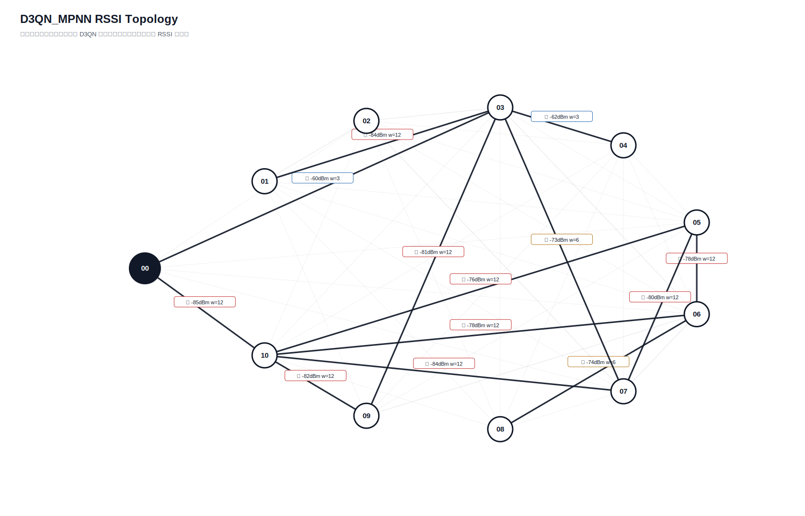

# D3QN_MPNN 真实硬件测试汇总报告

- 日志目录：`/home/sueiny/rk3506_linux6.1_v1.2.0/app/广播组网上位机/app/logs/d3qn_hw/第5次测试`
- 算法：`D3QN_MPNN`
- 推理策略：`纯D3QN，无Dijkstra fallback，无规则兜底`
- 目标：有效 SEND 平均点到点延时 `<220ms`，实际 ACK 丢包率 `<10%`；路由失败单独统计。
- Checkpoint：`/home/sueiny/rk3506_linux6.1_v1.2.0/app/广播组网上位机/app/checkpoints/d3qn_mpnn/latest.pt`
- 节点：`01, 02, 03, 04, 05, 06, 07, 08, 09, 10`
- 地址说明：CLI 按十六进制地址解析，因此目标 `10` 表示地址 `0x10`。
- 计划轮次：`180`，实际SEND：`180`，成功：`137`，ACK timeout：`43`，D3QN路由失败：`0`，实际丢包率：`23.89%`
- 端到端平均延时：`231.3ms`，P95：`1003.0ms`，最小/最大：`0.0ms` / `1304.5ms`
- 时延抖动均值：`295.0ms`，时延标准差：`317.9ms`
- D3QN 路由失败次数：`0`

## 拓扑图

## 测试结果

| 出发点 | 目标点 | 路径 | D3QN动作 | 成功/实际SEND | ACK timeout | 路由失败 | 丢包率 | 点到点平均 | P95 | 推理平均 | D3QN总耗时 | 重采 | 切换 | 最弱 RSSI |
|---|---|---|---:|---:|---:|---:|---:|---:|---:|---:|---:|---:|---:|---:|
| `01` | `02` | `00 -> 03 -> 01 -> 02` | `0` | `2/2` | `0` | `0` | `0.00%` | `50.0ms` | `100.1ms` | `48.9ms` | `98.9ms` | `0` | `2` | `-84` |
| `01` | `03` | `00 -> 03 -> 01 -> 03` | `0` | `0/2` | `2` | `0` | `100.00%` | `n/a` | `n/a` | `33.6ms` | `n/a` | `0` | `0` | `-84` |
| `01` | `04` | `00 -> 03 -> 01 -> 08 -> 04` | `1` | `2/2` | `0` | `0` | `0.00%` | `0.0ms` | `0.0ms` | `36.2ms` | `36.2ms` | `0` | `2` | `-84` |
| `01` | `05` | `00 -> 03 -> 01 -> 05` | `0` | `2/2` | `0` | `0` | `0.00%` | `100.2ms` | `200.4ms` | `29.9ms` | `130.1ms` | `0` | `0` | `-84` |
| `01` | `06` | `00 -> 03 -> 01 -> 06` | `0` | `1/2` | `1` | `0` | `50.00%` | `501.5ms` | `501.5ms` | `29.5ms` | `533.4ms` | `0` | `2` | `-84` |
| `01` | `07` | `00 -> 03 -> 01 -> 08 -> 07` | `2` | `2/2` | `0` | `0` | `0.00%` | `351.1ms` | `401.2ms` | `33.7ms` | `384.8ms` | `0` | `2` | `-84` |
| `01` | `08` | `00 -> 03 -> 01 -> 08` | `0` | `1/2` | `1` | `0` | `50.00%` | `401.3ms` | `401.3ms` | `33.7ms` | `440.0ms` | `0` | `2` | `-84` |
| `01` | `09` | `00 -> 03 -> 01 -> 09` | `0` | `1/2` | `1` | `0` | `50.00%` | `0.0ms` | `0.0ms` | `28.6ms` | `28.8ms` | `0` | `2` | `-84` |
| `01` | `10` | `00 -> 03 -> 01 -> 05 -> 10` | `2` | `1/2` | `1` | `0` | `50.00%` | `0.0ms` | `0.0ms` | `31.8ms` | `32.9ms` | `0` | `2` | `-84` |
| `02` | `01` | `00 -> 03 -> 02 -> 01` | `0` | `2/2` | `0` | `0` | `0.00%` | `100.2ms` | `200.3ms` | `31.0ms` | `131.2ms` | `0` | `2` | `-81` |
| `02` | `03` | `00 -> 03 -> 02 -> 04 -> 03` | `1` | `2/2` | `0` | `0` | `0.00%` | `200.4ms` | `400.7ms` | `33.3ms` | `233.7ms` | `0` | `0` | `-75` |
| `02` | `04` | `00 -> 03 -> 02 -> 04` | `0` | `2/2` | `0` | `0` | `0.00%` | `50.0ms` | `99.9ms` | `30.6ms` | `80.6ms` | `0` | `2` | `-75` |
| `02` | `05` | `00 -> 03 -> 02 -> 06 -> 05` | `1` | `1/2` | `1` | `0` | `50.00%` | `802.5ms` | `802.5ms` | `33.5ms` | `840.2ms` | `0` | `2` | `-81` |
| `02` | `06` | `00 -> 03 -> 02 -> 06` | `0` | `1/2` | `1` | `0` | `50.00%` | `902.8ms` | `902.8ms` | `32.2ms` | `937.0ms` | `0` | `2` | `-75` |
| `02` | `07` | `00 -> 03 -> 02 -> 07` | `1` | `2/2` | `0` | `0` | `0.00%` | `0.2ms` | `0.3ms` | `27.5ms` | `27.6ms` | `0` | `2` | `-83` |
| `02` | `08` | `00 -> 03 -> 02 -> 01 -> 08` | `3` | `2/2` | `0` | `0` | `0.00%` | `251.1ms` | `502.2ms` | `29.2ms` | `280.3ms` | `0` | `2` | `-81` |
| `02` | `09` | `00 -> 03 -> 02 -> 01 -> 09` | `2` | `2/2` | `0` | `0` | `0.00%` | `250.7ms` | `501.4ms` | `30.4ms` | `281.1ms` | `0` | `2` | `-84` |
| `02` | `10` | `00 -> 03 -> 02 -> 06 -> 10` | `2` | `1/2` | `1` | `0` | `50.00%` | `0.0ms` | `0.0ms` | `27.6ms` | `25.3ms` | `0` | `2` | `-80` |
| `03` | `01` | `00 -> 03 -> 01` | `0` | `0/2` | `2` | `0` | `100.00%` | `n/a` | `n/a` | `30.4ms` | `n/a` | `0` | `0` | `-84` |
| `03` | `02` | `00 -> 03 -> 04 -> 02` | `1` | `2/2` | `0` | `0` | `0.00%` | `0.0ms` | `0.0ms` | `32.2ms` | `32.2ms` | `0` | `0` | `-78` |
| `03` | `04` | `00 -> 03 -> 04` | `0` | `1/2` | `1` | `0` | `50.00%` | `694.0ms` | `694.0ms` | `30.0ms` | `724.7ms` | `0` | `0` | `-78` |
| `03` | `05` | `00 -> 03 -> 05` | `2` | `2/2` | `0` | `0` | `0.00%` | `501.5ms` | `1003.0ms` | `29.8ms` | `531.3ms` | `0` | `2` | `-60` |
| `03` | `06` | `00 -> 03 -> 08 -> 06` | `3` | `2/2` | `0` | `0` | `0.00%` | `100.3ms` | `200.7ms` | `26.8ms` | `127.1ms` | `0` | `0` | `-72` |
| `03` | `07` | `00 -> 03 -> 07` | `0` | `1/2` | `1` | `0` | `50.00%` | `400.6ms` | `400.6ms` | `28.5ms` | `432.4ms` | `0` | `0` | `-73` |
| `03` | `08` | `00 -> 03 -> 06 -> 08` | `2` | `2/2` | `0` | `0` | `0.00%` | `200.7ms` | `301.4ms` | `28.4ms` | `229.1ms` | `0` | `0` | `-74` |
| `03` | `09` | `00 -> 03 -> 02 -> 06 -> 09` | `3` | `2/2` | `0` | `0` | `0.00%` | `50.0ms` | `100.0ms` | `27.3ms` | `77.3ms` | `0` | `0` | `-78` |
| `03` | `10` | `00 -> 03 -> 06 -> 10` | `2` | `1/2` | `1` | `0` | `50.00%` | `0.0ms` | `0.0ms` | `28.1ms` | `28.3ms` | `0` | `2` | `-80` |
| `04` | `01` | `00 -> 03 -> 04 -> 08 -> 01` | `3` | `2/2` | `0` | `0` | `0.00%` | `50.2ms` | `100.2ms` | `28.2ms` | `78.4ms` | `0` | `2` | `-78` |
| `04` | `02` | `00 -> 03 -> 04 -> 02` | `0` | `1/2` | `1` | `0` | `50.00%` | `0.0ms` | `0.0ms` | `28.2ms` | `27.6ms` | `0` | `2` | `-78` |
| `04` | `03` | `00 -> 03 -> 04 -> 03` | `0` | `2/2` | `0` | `0` | `0.00%` | `752.5ms` | `1304.5ms` | `31.7ms` | `784.2ms` | `0` | `0` | `-78` |
| `04` | `05` | `00 -> 03 -> 04 -> 02 -> 05` | `1` | `2/2` | `0` | `0` | `0.00%` | `300.5ms` | `401.0ms` | `29.2ms` | `329.7ms` | `0` | `2` | `-81` |
| `04` | `06` | `00 -> 03 -> 04 -> 02 -> 06` | `1` | `2/2` | `0` | `0` | `0.00%` | `0.0ms` | `0.0ms` | `33.5ms` | `33.5ms` | `0` | `2` | `-78` |
| `04` | `07` | `00 -> 03 -> 04 -> 07` | `0` | `2/2` | `0` | `0` | `0.00%` | `551.2ms` | `701.8ms` | `28.9ms` | `580.0ms` | `0` | `2` | `-78` |
| `04` | `08` | `00 -> 03 -> 04 -> 07 -> 08` | `3` | `2/2` | `0` | `0` | `0.00%` | `200.5ms` | `400.9ms` | `34.7ms` | `235.1ms` | `0` | `2` | `-78` |
| `04` | `09` | `00 -> 03 -> 04 -> 09` | `0` | `2/2` | `0` | `0` | `0.00%` | `100.2ms` | `200.5ms` | `30.7ms` | `130.9ms` | `0` | `2` | `-78` |
| `04` | `10` | `00 -> 03 -> 04 -> 10` | `0` | `2/2` | `0` | `0` | `0.00%` | `1.4ms` | `2.8ms` | `30.6ms` | `32.0ms` | `0` | `2` | `-78` |
| `05` | `01` | `00 -> 05 -> 03 -> 01` | `1` | `2/2` | `0` | `0` | `0.00%` | `50.3ms` | `100.5ms` | `31.7ms` | `82.0ms` | `0` | `0` | `-84` |
| `05` | `02` | `00 -> 05 -> 02` | `1` | `0/2` | `2` | `0` | `100.00%` | `n/a` | `n/a` | `28.6ms` | `n/a` | `0` | `0` | `-82` |
| `05` | `03` | `00 -> 05 -> 04 -> 03` | `3` | `1/2` | `1` | `0` | `50.00%` | `199.5ms` | `199.5ms` | `28.6ms` | `229.6ms` | `0` | `2` | `-82` |
| `05` | `04` | `00 -> 05 -> 03 -> 04` | `1` | `1/2` | `1` | `0` | `50.00%` | `0.0ms` | `0.0ms` | `33.3ms` | `34.4ms` | `0` | `0` | `-82` |
| `05` | `06` | `00 -> 05 -> 06` | `0` | `1/2` | `1` | `0` | `50.00%` | `0.0ms` | `0.0ms` | `33.6ms` | `32.5ms` | `0` | `0` | `-82` |
| `05` | `07` | `00 -> 05 -> 10 -> 07` | `3` | `2/2` | `0` | `0` | `0.00%` | `0.0ms` | `0.0ms` | `28.5ms` | `28.5ms` | `0` | `0` | `-84` |
| `05` | `08` | `00 -> 05 -> 06 -> 08` | `1` | `1/2` | `1` | `0` | `50.00%` | `0.0ms` | `0.0ms` | `27.0ms` | `28.6ms` | `0` | `0` | `-82` |
| `05` | `09` | `00 -> 05 -> 09` | `0` | `1/2` | `1` | `0` | `50.00%` | `0.0ms` | `0.0ms` | `33.4ms` | `34.8ms` | `0` | `0` | `-82` |
| `05` | `10` | `00 -> 05 -> 10` | `0` | `0/2` | `2` | `0` | `100.00%` | `n/a` | `n/a` | `33.1ms` | `n/a` | `0` | `0` | `-82` |
| `06` | `01` | `00 -> 03 -> 06 -> 01` | `0` | `2/2` | `0` | `0` | `0.00%` | `50.1ms` | `100.2ms` | `29.7ms` | `79.8ms` | `0` | `2` | `-69` |
| `06` | `02` | `00 -> 03 -> 06 -> 02` | `0` | `1/2` | `1` | `0` | `50.00%` | `0.0ms` | `0.0ms` | `34.3ms` | `36.6ms` | `0` | `2` | `-69` |
| `06` | `03` | `00 -> 03 -> 06 -> 02 -> 03` | `2` | `1/2` | `1` | `0` | `50.00%` | `0.0ms` | `0.0ms` | `35.3ms` | `37.3ms` | `0` | `0` | `-73` |
| `06` | `04` | `00 -> 03 -> 06 -> 08 -> 04` | `1` | `1/2` | `1` | `0` | `50.00%` | `509.1ms` | `509.1ms` | `37.6ms` | `547.5ms` | `0` | `2` | `-74` |
| `06` | `05` | `00 -> 03 -> 06 -> 10 -> 05` | `2` | `2/2` | `0` | `0` | `0.00%` | `350.9ms` | `701.8ms` | `30.1ms` | `381.0ms` | `0` | `0` | `-80` |
| `06` | `07` | `00 -> 03 -> 06 -> 08 -> 07` | `2` | `2/2` | `0` | `0` | `0.00%` | `0.0ms` | `0.0ms` | `31.9ms` | `31.9ms` | `0` | `2` | `-74` |
| `06` | `08` | `00 -> 03 -> 06 -> 02 -> 08` | `3` | `2/2` | `0` | `0` | `0.00%` | `601.5ms` | `802.3ms` | `26.6ms` | `628.1ms` | `0` | `2` | `-72` |
| `06` | `09` | `00 -> 03 -> 06 -> 10 -> 09` | `2` | `2/2` | `0` | `0` | `0.00%` | `602.2ms` | `1204.4ms` | `27.4ms` | `629.6ms` | `0` | `2` | `-82` |
| `06` | `10` | `00 -> 03 -> 06 -> 05 -> 10` | `2` | `0/2` | `2` | `0` | `100.00%` | `n/a` | `n/a` | `29.5ms` | `n/a` | `0` | `2` | `-81` |
| `07` | `01` | `00 -> 03 -> 07 -> 02 -> 01` | `3` | `2/2` | `0` | `0` | `0.00%` | `150.6ms` | `301.1ms` | `26.9ms` | `177.5ms` | `0` | `2` | `-81` |
| `07` | `02` | `00 -> 03 -> 07 -> 02` | `0` | `0/2` | `2` | `0` | `100.00%` | `n/a` | `n/a` | `29.1ms` | `n/a` | `0` | `2` | `-76` |
| `07` | `03` | `00 -> 03 -> 07 -> 04 -> 03` | `1` | `2/2` | `0` | `0` | `0.00%` | `401.1ms` | `802.1ms` | `29.8ms` | `430.9ms` | `0` | `0` | `-73` |
| `07` | `04` | `00 -> 03 -> 07 -> 04` | `0` | `2/2` | `0` | `0` | `0.00%` | `0.0ms` | `0.0ms` | `30.9ms` | `30.9ms` | `0` | `2` | `-73` |
| `07` | `05` | `00 -> 03 -> 07 -> 05` | `0` | `2/2` | `0` | `0` | `0.00%` | `0.0ms` | `0.0ms` | `33.4ms` | `33.4ms` | `0` | `2` | `-73` |
| `07` | `06` | `00 -> 03 -> 07 -> 06` | `1` | `2/2` | `0` | `0` | `0.00%` | `651.5ms` | `1303.1ms` | `31.0ms` | `682.5ms` | `0` | `2` | `-78` |
| `07` | `08` | `00 -> 03 -> 07 -> 08` | `0` | `2/2` | `0` | `0` | `0.00%` | `196.7ms` | `300.6ms` | `28.2ms` | `224.9ms` | `0` | `2` | `-75` |
| `07` | `09` | `00 -> 03 -> 07 -> 01 -> 09` | `3` | `2/2` | `0` | `0` | `0.00%` | `0.0ms` | `0.0ms` | `33.5ms` | `33.5ms` | `0` | `2` | `-84` |
| `07` | `10` | `00 -> 03 -> 07 -> 10` | `1` | `1/2` | `1` | `0` | `50.00%` | `0.0ms` | `0.0ms` | `27.0ms` | `25.9ms` | `0` | `2` | `-73` |
| `08` | `01` | `00 -> 03 -> 08 -> 02 -> 01` | `1` | `2/2` | `0` | `0` | `0.00%` | `351.1ms` | `701.7ms` | `31.3ms` | `382.4ms` | `0` | `2` | `-81` |
| `08` | `02` | `00 -> 03 -> 08 -> 02` | `0` | `0/2` | `2` | `0` | `100.00%` | `n/a` | `n/a` | `29.3ms` | `n/a` | `0` | `2` | `-72` |
| `08` | `03` | `00 -> 03 -> 08 -> 02 -> 03` | `2` | `1/2` | `1` | `0` | `50.00%` | `1202.5ms` | `1202.5ms` | `30.7ms` | `1235.9ms` | `0` | `0` | `-73` |
| `08` | `04` | `00 -> 03 -> 08 -> 02 -> 04` | `2` | `2/2` | `0` | `0` | `0.00%` | `250.7ms` | `300.8ms` | `32.0ms` | `282.7ms` | `0` | `2` | `-72` |
| `08` | `05` | `00 -> 03 -> 08 -> 06 -> 05` | `3` | `2/2` | `0` | `0` | `0.00%` | `200.6ms` | `401.3ms` | `29.4ms` | `230.0ms` | `0` | `0` | `-81` |
| `08` | `06` | `00 -> 03 -> 08 -> 02 -> 06` | `1` | `2/2` | `0` | `0` | `0.00%` | `200.3ms` | `400.7ms` | `27.7ms` | `228.0ms` | `0` | `2` | `-74` |
| `08` | `07` | `00 -> 03 -> 08 -> 01 -> 07` | `1` | `2/2` | `0` | `0` | `0.00%` | `702.1ms` | `1203.8ms` | `26.5ms` | `728.6ms` | `0` | `2` | `-72` |
| `08` | `09` | `00 -> 03 -> 08 -> 01 -> 09` | `0` | `2/2` | `0` | `0` | `0.00%` | `104.4ms` | `208.9ms` | `27.9ms` | `132.4ms` | `0` | `2` | `-84` |
| `08` | `10` | `00 -> 03 -> 08 -> 04 -> 10` | `3` | `1/2` | `1` | `0` | `50.00%` | `501.6ms` | `501.6ms` | `29.5ms` | `530.5ms` | `0` | `2` | `-76` |
| `09` | `01` | `00 -> 03 -> 09 -> 01` | `0` | `2/2` | `0` | `0` | `0.00%` | `50.0ms` | `99.8ms` | `32.1ms` | `82.0ms` | `0` | `2` | `-81` |
| `09` | `02` | `00 -> 03 -> 09 -> 06 -> 02` | `2` | `1/2` | `1` | `0` | `50.00%` | `0.0ms` | `0.0ms` | `28.1ms` | `27.7ms` | `0` | `2` | `-81` |
| `09` | `03` | `00 -> 03 -> 09 -> 05 -> 03` | `2` | `2/2` | `0` | `0` | `0.00%` | `351.7ms` | `702.7ms` | `28.2ms` | `379.9ms` | `0` | `0` | `-81` |
| `09` | `04` | `00 -> 03 -> 09 -> 05 -> 04` | `2` | `1/2` | `1` | `0` | `50.00%` | `300.7ms` | `300.7ms` | `28.6ms` | `328.9ms` | `0` | `2` | `-81` |
| `09` | `05` | `00 -> 03 -> 09 -> 05` | `0` | `2/2` | `0` | `0` | `0.00%` | `602.2ms` | `1003.8ms` | `28.6ms` | `630.8ms` | `0` | `0` | `-81` |
| `09` | `06` | `00 -> 03 -> 09 -> 05 -> 06` | `1` | `2/2` | `0` | `0` | `0.00%` | `451.2ms` | `902.4ms` | `30.6ms` | `481.9ms` | `0` | `2` | `-81` |
| `09` | `07` | `00 -> 03 -> 09 -> 05 -> 07` | `0` | `2/2` | `0` | `0` | `0.00%` | `150.8ms` | `201.5ms` | `27.5ms` | `178.2ms` | `0` | `2` | `-81` |
| `09` | `08` | `00 -> 03 -> 09 -> 06 -> 08` | `0` | `2/2` | `0` | `0` | `0.00%` | `300.3ms` | `400.1ms` | `30.3ms` | `330.6ms` | `0` | `2` | `-81` |
| `09` | `10` | `00 -> 03 -> 09 -> 10` | `0` | `2/2` | `0` | `0` | `0.00%` | `351.0ms` | `401.1ms` | `29.8ms` | `380.8ms` | `0` | `2` | `-81` |
| `10` | `01` | `00 -> 10 -> 07 -> 03 -> 01` | `2` | `2/2` | `0` | `0` | `0.00%` | `350.5ms` | `399.8ms` | `29.7ms` | `380.3ms` | `0` | `0` | `-85` |
| `10` | `02` | `00 -> 10 -> 02` | `0` | `2/2` | `0` | `0` | `0.00%` | `301.0ms` | `301.3ms` | `30.0ms` | `331.1ms` | `0` | `0` | `-85` |
| `10` | `03` | `00 -> 10 -> 04 -> 03` | `3` | `2/2` | `0` | `0` | `0.00%` | `250.6ms` | `501.1ms` | `28.2ms` | `278.7ms` | `0` | `2` | `-85` |
| `10` | `04` | `00 -> 10 -> 04` | `0` | `2/2` | `0` | `0` | `0.00%` | `0.0ms` | `0.0ms` | `28.1ms` | `28.1ms` | `0` | `0` | `-85` |
| `10` | `05` | `00 -> 10 -> 05` | `0` | `2/2` | `0` | `0` | `0.00%` | `300.6ms` | `300.6ms` | `29.9ms` | `330.5ms` | `0` | `2` | `-85` |
| `10` | `06` | `00 -> 10 -> 05 -> 06` | `1` | `1/2` | `1` | `0` | `50.00%` | `300.9ms` | `300.9ms` | `32.3ms` | `331.5ms` | `0` | `0` | `-85` |
| `10` | `07` | `00 -> 10 -> 05 -> 07` | `1` | `0/2` | `2` | `0` | `100.00%` | `n/a` | `n/a` | `26.9ms` | `n/a` | `0` | `0` | `-85` |
| `10` | `08` | `00 -> 10 -> 06 -> 08` | `1` | `1/2` | `1` | `0` | `50.00%` | `0.5ms` | `0.5ms` | `27.2ms` | `27.7ms` | `0` | `0` | `-85` |
| `10` | `09` | `00 -> 10 -> 09` | `0` | `1/2` | `1` | `0` | `50.00%` | `0.2ms` | `0.2ms` | `30.5ms` | `28.7ms` | `0` | `0` | `-85` |

## 指标总结对比

| 指标 | 当前值 | 单位 | 说明 |
|---|---:|---|---|
| 算法计算延时 | `30.4ms` | ms | 上位机用 D3QN 算出路径的平均耗时 |
| 指令下发延时 | `231.3ms` | ms | 当前硬件无中间节点时间戳，用 SEND 到 ACK 总时延近似 |
| 端到端实际传输平均延时 | `231.3ms` | ms | 现有统计总 ACK 时延 |
| 全局平均丢包率 | `23.89%` | ratio | 总 timeout / 总发送 |
| D3QN 路由失败次数 | `0` | count | 无候选路径、checkpoint 缺失或模型输入不匹配 |
| 单路径平均跳数 | `3.2889` | hops | 各目标最终路径跳数平均值 |
| 平均单跳传输耗时 | `71.9ms` | ms/hop | 端到端平均延时 / 跳数折算 |
| RSSI 实时波动范围 | `25` | dB | 当前拓扑边 RSSI 最大值减最小值 |
| RSSI 标准差 | `5.3217` | dB | 当前拓扑边 RSSI 标准差 |
| 时延抖动均值 | `295.0ms` | ms | 相邻成功 ACK 延时差值均值 |
| 时延标准差 | `317.9ms` | ms | 成功 ACK 延时标准差 |

## 文件

- [`测试指标汇总.xlsx`](测试指标汇总.xlsx)
- [`拓扑图.txt`](拓扑图.txt)
- [`原始串口日志.log`](原始串口日志.log)
- `原始JSON数据/model_decisions.jsonl`
- `原始JSON数据/d3qn_state.json`

## 来源说明

| 来源 | 含义 |
|---|---|
| `real_rssi` | 由 RSSI_REQ 和 RSSI_REPORT 得到 |
| `real_ack` | 由真实 ACK 成功/timeout 统计得到 |
| `default` | 当前硬件不可直接测量，使用默认值占位 |
| `derived` | 由真实测试记录派生计算得到 |
| `derived_from_rssi` | 训练环境中容量、延时、丢包等不可测字段由真实 RSSI 分段派生 |
