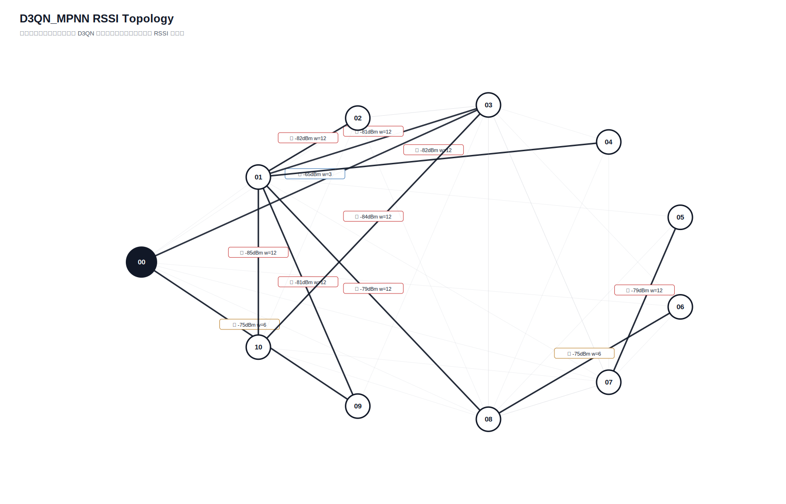

# D3QN_MPNN 真实硬件测试汇总报告

- 日志目录：`/home/sueiny/rk3506_linux6.1_v1.2.0/app/广播组网上位机/app/logs/d3qn_hw/第7次测试`
- 算法：`D3QN_MPNN`
- 推理策略：`纯D3QN，无Dijkstra fallback，无规则兜底`
- 目标：有效 SEND 平均点到点延时 `<220ms`，实际 ACK 丢包率 `<10%`；路由失败单独统计。
- Checkpoint：`/home/sueiny/rk3506_linux6.1_v1.2.0/app/广播组网上位机/app/checkpoints/d3qn_mpnn/latest.pt`
- 节点：`01, 02, 03, 04, 05, 06, 07, 08, 09, 10`
- 地址说明：CLI 按十六进制地址解析，因此目标 `10` 表示地址 `0x10`。
- 计划轮次：`180`，实际SEND：`180`，成功：`126`，ACK timeout：`54`，D3QN路由失败：`0`，实际丢包率：`30.00%`
- 端到端平均延时：`273.0ms`，P95：`1102.6ms`，最小/最大：`0.0ms` / `1404.5ms`
- 时延抖动均值：`307.5ms`，时延标准差：`337.7ms`
- D3QN 路由失败次数：`0`

## 拓扑图

## 测试结果

| 出发点 | 目标点 | 路径 | D3QN动作 | 成功/实际SEND | ACK timeout | 路由失败 | 丢包率 | 点到点平均 | P95 | 推理平均 | D3QN总耗时 | 重采 | 切换 | 最弱 RSSI |
|---|---|---|---:|---:|---:|---:|---:|---:|---:|---:|---:|---:|---:|---:|
| `01` | `02` | `00 -> 03 -> 01 -> 08 -> 02` | `3` | `1/2` | `1` | `0` | `50.00%` | `1302.9ms` | `1302.9ms` | `44.6ms` | `1365.9ms` | `0` | `2` | `-84` |
| `01` | `03` | `00 -> 03 -> 01 -> 03` | `0` | `2/2` | `0` | `0` | `0.00%` | `601.1ms` | `902.1ms` | `23.6ms` | `624.7ms` | `0` | `2` | `-84` |
| `01` | `04` | `00 -> 03 -> 01 -> 04` | `0` | `2/2` | `0` | `0` | `0.00%` | `49.8ms` | `99.7ms` | `21.8ms` | `71.6ms` | `0` | `2` | `-84` |
| `01` | `05` | `00 -> 03 -> 01 -> 08 -> 05` | `1` | `2/2` | `0` | `0` | `0.00%` | `250.4ms` | `500.7ms` | `22.5ms` | `272.9ms` | `0` | `2` | `-85` |
| `01` | `06` | `00 -> 03 -> 01 -> 08 -> 06` | `0` | `2/2` | `0` | `0` | `0.00%` | `200.5ms` | `400.9ms` | `19.6ms` | `220.1ms` | `0` | `2` | `-84` |
| `01` | `07` | `00 -> 03 -> 01 -> 07` | `1` | `0/2` | `2` | `0` | `100.00%` | `n/a` | `n/a` | `20.6ms` | `n/a` | `0` | `2` | `-84` |
| `01` | `08` | `00 -> 03 -> 01 -> 08` | `0` | `1/2` | `1` | `0` | `50.00%` | `92.6ms` | `92.6ms` | `22.5ms` | `117.8ms` | `0` | `2` | `-84` |
| `01` | `09` | `00 -> 03 -> 01 -> 09` | `0` | `2/2` | `0` | `0` | `0.00%` | `54.3ms` | `108.6ms` | `21.1ms` | `75.4ms` | `0` | `2` | `-84` |
| `01` | `10` | `00 -> 03 -> 01 -> 02 -> 10` | `1` | `2/2` | `0` | `0` | `0.00%` | `300.8ms` | `601.4ms` | `21.6ms` | `322.4ms` | `0` | `2` | `-84` |
| `02` | `01` | `00 -> 02 -> 10 -> 01` | `3` | `1/2` | `1` | `0` | `50.00%` | `0.0ms` | `0.0ms` | `22.5ms` | `23.8ms` | `0` | `0` | `-83` |
| `02` | `03` | `00 -> 02 -> 01 -> 03` | `2` | `2/2` | `0` | `0` | `0.00%` | `100.1ms` | `200.2ms` | `22.7ms` | `122.8ms` | `0` | `2` | `-83` |
| `02` | `04` | `00 -> 02 -> 03 -> 04` | `1` | `1/2` | `1` | `0` | `50.00%` | `0.0ms` | `0.0ms` | `20.3ms` | `18.1ms` | `0` | `0` | `-83` |
| `02` | `05` | `00 -> 02 -> 08 -> 05` | `3` | `1/2` | `1` | `0` | `50.00%` | `100.1ms` | `100.1ms` | `21.2ms` | `121.9ms` | `0` | `0` | `-85` |
| `02` | `06` | `00 -> 02 -> 01 -> 08 -> 06` | `3` | `1/2` | `1` | `0` | `50.00%` | `99.8ms` | `99.8ms` | `20.2ms` | `120.8ms` | `0` | `0` | `-83` |
| `02` | `07` | `00 -> 02 -> 01 -> 03 -> 07` | `2` | `1/2` | `1` | `0` | `50.00%` | `100.2ms` | `100.2ms` | `21.4ms` | `122.7ms` | `0` | `2` | `-83` |
| `02` | `08` | `00 -> 02 -> 08` | `1` | `0/2` | `2` | `0` | `100.00%` | `n/a` | `n/a` | `19.3ms` | `n/a` | `0` | `2` | `-83` |
| `02` | `09` | `00 -> 02 -> 03 -> 09` | `1` | `2/2` | `0` | `0` | `0.00%` | `0.0ms` | `0.0ms` | `22.5ms` | `22.5ms` | `0` | `2` | `-84` |
| `02` | `10` | `00 -> 02 -> 10` | `0` | `0/2` | `2` | `0` | `100.00%` | `n/a` | `n/a` | `18.5ms` | `n/a` | `0` | `0` | `-83` |
| `03` | `01` | `00 -> 03 -> 02 -> 01` | `2` | `2/2` | `0` | `0` | `0.00%` | `0.0ms` | `0.0ms` | `22.7ms` | `22.7ms` | `0` | `0` | `-82` |
| `03` | `02` | `00 -> 03 -> 02` | `0` | `2/2` | `0` | `0` | `0.00%` | `350.6ms` | `701.2ms` | `21.7ms` | `372.3ms` | `0` | `2` | `-76` |
| `03` | `04` | `00 -> 03 -> 07 -> 04` | `1` | `2/2` | `0` | `0` | `0.00%` | `100.2ms` | `200.4ms` | `20.7ms` | `120.9ms` | `0` | `0` | `-79` |
| `03` | `05` | `00 -> 03 -> 07 -> 05` | `0` | `2/2` | `0` | `0` | `0.00%` | `100.2ms` | `200.4ms` | `22.2ms` | `122.4ms` | `0` | `0` | `-79` |
| `03` | `06` | `00 -> 03 -> 08 -> 06` | `1` | `2/2` | `0` | `0` | `0.00%` | `250.5ms` | `500.8ms` | `20.2ms` | `270.7ms` | `0` | `2` | `-75` |
| `03` | `07` | `00 -> 03 -> 07` | `0` | `1/2` | `1` | `0` | `50.00%` | `201.7ms` | `201.7ms` | `21.1ms` | `222.3ms` | `0` | `2` | `-74` |
| `03` | `08` | `00 -> 03 -> 07 -> 08` | `1` | `0/2` | `2` | `0` | `100.00%` | `n/a` | `n/a` | `19.6ms` | `n/a` | `0` | `2` | `-78` |
| `03` | `09` | `00 -> 03 -> 09` | `0` | `2/2` | `0` | `0` | `0.00%` | `300.0ms` | `300.1ms` | `20.2ms` | `320.2ms` | `0` | `2` | `-84` |
| `03` | `10` | `00 -> 03 -> 07 -> 10` | `1` | `1/2` | `1` | `0` | `50.00%` | `0.0ms` | `0.0ms` | `22.5ms` | `22.2ms` | `0` | `0` | `-82` |
| `04` | `01` | `00 -> 03 -> 04 -> 01` | `0` | `1/2` | `1` | `0` | `50.00%` | `0.0ms` | `0.0ms` | `21.7ms` | `21.1ms` | `0` | `2` | `-76` |
| `04` | `02` | `00 -> 03 -> 04 -> 01 -> 02` | `0` | `2/2` | `0` | `0` | `0.00%` | `150.6ms` | `301.3ms` | `25.3ms` | `175.9ms` | `0` | `2` | `-76` |
| `04` | `03` | `00 -> 03 -> 04 -> 07 -> 03` | `1` | `2/2` | `0` | `0` | `0.00%` | `49.8ms` | `99.7ms` | `17.7ms` | `67.6ms` | `0` | `0` | `-76` |
| `04` | `05` | `00 -> 03 -> 04 -> 08 -> 05` | `2` | `2/2` | `0` | `0` | `0.00%` | `551.2ms` | `1102.4ms` | `22.1ms` | `573.3ms` | `0` | `2` | `-85` |
| `04` | `06` | `00 -> 03 -> 04 -> 08 -> 06` | `0` | `2/2` | `0` | `0` | `0.00%` | `350.9ms` | `401.0ms` | `20.7ms` | `371.6ms` | `0` | `2` | `-76` |
| `04` | `07` | `00 -> 03 -> 04 -> 07` | `0` | `1/2` | `1` | `0` | `50.00%` | `401.0ms` | `401.0ms` | `21.5ms` | `422.6ms` | `0` | `2` | `-76` |
| `04` | `08` | `00 -> 03 -> 04 -> 01 -> 08` | `2` | `2/2` | `0` | `0` | `0.00%` | `400.9ms` | `501.2ms` | `21.2ms` | `422.1ms` | `0` | `2` | `-79` |
| `04` | `09` | `00 -> 03 -> 04 -> 01 -> 09` | `0` | `1/2` | `1` | `0` | `50.00%` | `191.0ms` | `191.0ms` | `25.3ms` | `218.7ms` | `0` | `2` | `-81` |
| `04` | `10` | `00 -> 03 -> 04 -> 01 -> 10` | `0` | `1/2` | `1` | `0` | `50.00%` | `0.0ms` | `0.0ms` | `20.7ms` | `20.1ms` | `0` | `2` | `-85` |
| `05` | `01` | `00 -> 03 -> 07 -> 05 -> 01` | `0` | `1/2` | `1` | `0` | `50.00%` | `501.8ms` | `501.8ms` | `22.3ms` | `520.9ms` | `0` | `2` | `-79` |
| `05` | `02` | `00 -> 03 -> 07 -> 05 -> 08 -> 02` | `1` | `2/2` | `0` | `0` | `0.00%` | `505.5ms` | `601.9ms` | `23.2ms` | `528.7ms` | `0` | `2` | `-79` |
| `05` | `03` | `00 -> 03 -> 07 -> 05 -> 08 -> 03` | `1` | `2/2` | `0` | `0` | `0.00%` | `250.6ms` | `501.1ms` | `20.0ms` | `270.5ms` | `0` | `2` | `-79` |
| `05` | `04` | `00 -> 03 -> 07 -> 05 -> 08 -> 04` | `2` | `2/2` | `0` | `0` | `0.00%` | `150.3ms` | `300.6ms` | `20.7ms` | `171.0ms` | `0` | `2` | `-83` |
| `05` | `06` | `00 -> 03 -> 07 -> 05 -> 01 -> 08 -> 06` | `2` | `2/2` | `0` | `0` | `0.00%` | `150.3ms` | `300.4ms` | `18.9ms` | `169.2ms` | `0` | `2` | `-79` |
| `05` | `07` | `00 -> 03 -> 07 -> 05 -> 07` | `0` | `2/2` | `0` | `0` | `0.00%` | `601.4ms` | `1202.8ms` | `22.6ms` | `623.9ms` | `0` | `2` | `-79` |
| `05` | `08` | `00 -> 03 -> 07 -> 05 -> 08` | `0` | `2/2` | `0` | `0` | `0.00%` | `601.6ms` | `1102.6ms` | `21.0ms` | `622.6ms` | `0` | `2` | `-79` |
| `05` | `09` | `00 -> 03 -> 07 -> 05 -> 01 -> 09` | `0` | `2/2` | `0` | `0` | `0.00%` | `150.5ms` | `301.0ms` | `19.1ms` | `169.7ms` | `0` | `2` | `-81` |
| `05` | `10` | `00 -> 03 -> 07 -> 05 -> 08 -> 10` | `2` | `2/2` | `0` | `0` | `0.00%` | `752.4ms` | `1404.5ms` | `20.7ms` | `773.0ms` | `0` | `2` | `-84` |
| `06` | `01` | `00 -> 06 -> 08 -> 01` | `3` | `1/2` | `1` | `0` | `50.00%` | `601.4ms` | `601.4ms` | `22.7ms` | `622.4ms` | `0` | `0` | `-82` |
| `06` | `02` | `00 -> 06 -> 08 -> 03 -> 02` | `3` | `0/2` | `2` | `0` | `100.00%` | `n/a` | `n/a` | `20.2ms` | `n/a` | `0` | `2` | `-82` |
| `06` | `03` | `00 -> 06 -> 08 -> 03` | `1` | `0/2` | `2` | `0` | `100.00%` | `n/a` | `n/a` | `19.9ms` | `n/a` | `0` | `2` | `-82` |
| `06` | `04` | `00 -> 06 -> 08 -> 03 -> 04` | `3` | `1/2` | `1` | `0` | `50.00%` | `1211.7ms` | `1211.7ms` | `22.1ms` | `1233.0ms` | `0` | `0` | `-82` |
| `06` | `05` | `00 -> 06 -> 08 -> 05` | `0` | `2/2` | `0` | `0` | `0.00%` | `250.8ms` | `401.1ms` | `20.3ms` | `271.0ms` | `0` | `0` | `-85` |
| `06` | `07` | `00 -> 06 -> 08 -> 03 -> 07` | `2` | `2/2` | `0` | `0` | `0.00%` | `250.6ms` | `501.2ms` | `20.9ms` | `271.5ms` | `0` | `0` | `-82` |
| `06` | `08` | `00 -> 06 -> 08` | `0` | `1/2` | `1` | `0` | `50.00%` | `200.0ms` | `200.0ms` | `23.1ms` | `221.7ms` | `0` | `2` | `-82` |
| `06` | `09` | `00 -> 06 -> 08 -> 03 -> 09` | `2` | `2/2` | `0` | `0` | `0.00%` | `150.5ms` | `300.9ms` | `19.5ms` | `170.0ms` | `0` | `2` | `-84` |
| `06` | `10` | `00 -> 06 -> 08 -> 03 -> 10` | `3` | `0/2` | `2` | `0` | `100.00%` | `n/a` | `n/a` | `22.1ms` | `n/a` | `0` | `0` | `-84` |
| `07` | `01` | `00 -> 03 -> 07 -> 01` | `0` | `1/2` | `1` | `0` | `50.00%` | `100.0ms` | `100.0ms` | `22.9ms` | `124.7ms` | `0` | `2` | `-82` |
| `07` | `02` | `00 -> 03 -> 07 -> 01 -> 02` | `0` | `2/2` | `0` | `0` | `0.00%` | `200.2ms` | `400.4ms` | `20.9ms` | `221.1ms` | `0` | `2` | `-82` |
| `07` | `03` | `00 -> 03 -> 07 -> 03` | `0` | `0/2` | `2` | `0` | `100.00%` | `n/a` | `n/a` | `20.8ms` | `n/a` | `0` | `2` | `-74` |
| `07` | `04` | `00 -> 03 -> 07 -> 01 -> 04` | `2` | `2/2` | `0` | `0` | `0.00%` | `0.0ms` | `0.0ms` | `22.1ms` | `22.1ms` | `0` | `2` | `-82` |
| `07` | `05` | `00 -> 03 -> 07 -> 05` | `0` | `2/2` | `0` | `0` | `0.00%` | `501.1ms` | `501.1ms` | `21.5ms` | `522.6ms` | `0` | `2` | `-79` |
| `07` | `06` | `00 -> 03 -> 07 -> 08 -> 06` | `3` | `2/2` | `0` | `0` | `0.00%` | `450.7ms` | `500.7ms` | `22.5ms` | `473.2ms` | `0` | `2` | `-78` |
| `07` | `08` | `00 -> 03 -> 07 -> 08` | `1` | `0/2` | `2` | `0` | `100.00%` | `n/a` | `n/a` | `21.2ms` | `n/a` | `0` | `2` | `-78` |
| `07` | `09` | `00 -> 03 -> 07 -> 01 -> 09` | `1` | `1/2` | `1` | `0` | `50.00%` | `0.0ms` | `0.0ms` | `21.4ms` | `22.0ms` | `0` | `2` | `-82` |
| `07` | `10` | `00 -> 03 -> 07 -> 01 -> 10` | `2` | `1/2` | `1` | `0` | `50.00%` | `200.1ms` | `200.1ms` | `25.3ms` | `228.5ms` | `0` | `2` | `-85` |
| `08` | `01` | `00 -> 03 -> 08 -> 02 -> 01` | `2` | `0/2` | `2` | `0` | `100.00%` | `n/a` | `n/a` | `23.7ms` | `n/a` | `0` | `2` | `-82` |
| `08` | `02` | `00 -> 03 -> 08 -> 01 -> 02` | `3` | `2/2` | `0` | `0` | `0.00%` | `701.4ms` | `1402.9ms` | `22.3ms` | `723.8ms` | `0` | `2` | `-75` |
| `08` | `03` | `00 -> 03 -> 08 -> 07 -> 03` | `1` | `1/2` | `1` | `0` | `50.00%` | `0.0ms` | `0.0ms` | `22.5ms` | `23.9ms` | `0` | `2` | `-80` |
| `08` | `04` | `00 -> 03 -> 08 -> 07 -> 04` | `3` | `2/2` | `0` | `0` | `0.00%` | `100.0ms` | `199.9ms` | `19.9ms` | `119.9ms` | `0` | `2` | `-80` |
| `08` | `05` | `00 -> 03 -> 08 -> 05` | `0` | `2/2` | `0` | `0` | `0.00%` | `350.7ms` | `401.0ms` | `24.1ms` | `374.8ms` | `0` | `2` | `-85` |
| `08` | `06` | `00 -> 03 -> 08 -> 06` | `0` | `1/2` | `1` | `0` | `50.00%` | `300.4ms` | `300.4ms` | `22.6ms` | `322.7ms` | `0` | `2` | `-75` |
| `08` | `07` | `00 -> 03 -> 08 -> 07` | `1` | `2/2` | `0` | `0` | `0.00%` | `200.4ms` | `400.8ms` | `24.5ms` | `225.0ms` | `0` | `2` | `-80` |
| `08` | `09` | `00 -> 03 -> 08 -> 00 -> 09` | `2` | `1/2` | `1` | `0` | `50.00%` | `0.0ms` | `0.0ms` | `22.8ms` | `24.1ms` | `0` | `0` | `-75` |
| `08` | `10` | `00 -> 03 -> 08 -> 02 -> 10` | `2` | `1/2` | `1` | `0` | `50.00%` | `0.0ms` | `0.0ms` | `24.5ms` | `26.8ms` | `0` | `2` | `-80` |
| `09` | `01` | `00 -> 09 -> 03 -> 01` | `2` | `1/2` | `1` | `0` | `50.00%` | `400.7ms` | `400.7ms` | `22.1ms` | `423.3ms` | `0` | `2` | `-84` |
| `09` | `02` | `00 -> 09 -> 03 -> 02` | `3` | `1/2` | `1` | `0` | `50.00%` | `1204.5ms` | `1204.5ms` | `22.4ms` | `1228.6ms` | `0` | `2` | `-76` |
| `09` | `03` | `00 -> 09 -> 03` | `1` | `2/2` | `0` | `0` | `0.00%` | `651.6ms` | `902.0ms` | `21.4ms` | `673.0ms` | `0` | `2` | `-75` |
| `09` | `04` | `00 -> 09 -> 03 -> 04` | `2` | `1/2` | `1` | `0` | `50.00%` | `300.7ms` | `300.7ms` | `22.8ms` | `326.3ms` | `0` | `2` | `-76` |
| `09` | `05` | `00 -> 09 -> 01 -> 05` | `0` | `2/2` | `0` | `0` | `0.00%` | `49.9ms` | `99.8ms` | `23.2ms` | `73.1ms` | `0` | `2` | `-82` |
| `09` | `06` | `00 -> 09 -> 00 -> 03 -> 08 -> 06` | `2` | `0/2` | `2` | `0` | `100.00%` | `n/a` | `n/a` | `21.4ms` | `n/a` | `0` | `0` | `-75` |
| `09` | `07` | `00 -> 09 -> 03 -> 07` | `2` | `2/2` | `0` | `0` | `0.00%` | `0.0ms` | `0.0ms` | `21.2ms` | `21.2ms` | `0` | `2` | `-75` |
| `09` | `08` | `00 -> 09 -> 01 -> 08` | `3` | `2/2` | `0` | `0` | `0.00%` | `300.7ms` | `300.9ms` | `20.3ms` | `321.0ms` | `0` | `2` | `-79` |
| `09` | `10` | `00 -> 09 -> 01 -> 10` | `1` | `2/2` | `0` | `0` | `0.00%` | `200.4ms` | `400.8ms` | `22.0ms` | `222.4ms` | `0` | `2` | `-85` |
| `10` | `01` | `00 -> 03 -> 10 -> 02 -> 01` | `1` | `1/2` | `1` | `0` | `50.00%` | `0.0ms` | `0.0ms` | `21.4ms` | `21.0ms` | `0` | `2` | `-84` |
| `10` | `02` | `00 -> 03 -> 10 -> 02` | `0` | `2/2` | `0` | `0` | `0.00%` | `304.6ms` | `509.2ms` | `23.7ms` | `328.3ms` | `0` | `2` | `-84` |
| `10` | `03` | `00 -> 03 -> 10 -> 01 -> 03` | `3` | `1/2` | `1` | `0` | `50.00%` | `801.7ms` | `801.7ms` | `22.4ms` | `824.3ms` | `0` | `0` | `-84` |
| `10` | `04` | `00 -> 03 -> 10 -> 01 -> 04` | `0` | `2/2` | `0` | `0` | `0.00%` | `551.2ms` | `902.0ms` | `23.9ms` | `575.1ms` | `0` | `2` | `-84` |
| `10` | `05` | `00 -> 03 -> 10 -> 07 -> 05` | `1` | `2/2` | `0` | `0` | `0.00%` | `0.0ms` | `0.0ms` | `24.2ms` | `24.2ms` | `0` | `2` | `-84` |
| `10` | `06` | `00 -> 03 -> 10 -> 08 -> 06` | `0` | `2/2` | `0` | `0` | `0.00%` | `0.2ms` | `0.4ms` | `23.4ms` | `23.6ms` | `0` | `2` | `-84` |
| `10` | `07` | `00 -> 03 -> 10 -> 07` | `0` | `0/2` | `2` | `0` | `100.00%` | `n/a` | `n/a` | `24.0ms` | `n/a` | `0` | `2` | `-84` |
| `10` | `08` | `00 -> 03 -> 10 -> 01 -> 08` | `2` | `1/2` | `1` | `0` | `50.00%` | `400.9ms` | `400.9ms` | `20.8ms` | `421.8ms` | `0` | `2` | `-84` |
| `10` | `09` | `00 -> 03 -> 10 -> 01 -> 09` | `0` | `2/2` | `0` | `0` | `0.00%` | `301.0ms` | `401.7ms` | `24.9ms` | `325.9ms` | `0` | `2` | `-84` |

## 指标总结对比

| 指标 | 当前值 | 单位 | 说明 |
|---|---:|---|---|
| 算法计算延时 | `22.0ms` | ms | 上位机用 D3QN 算出路径的平均耗时 |
| 指令下发延时 | `273.0ms` | ms | 当前硬件无中间节点时间戳，用 SEND 到 ACK 总时延近似 |
| 端到端实际传输平均延时 | `273.0ms` | ms | 现有统计总 ACK 时延 |
| 全局平均丢包率 | `30.00%` | ratio | 总 timeout / 总发送 |
| D3QN 路由失败次数 | `0` | count | 无候选路径、checkpoint 缺失或模型输入不匹配 |
| 单路径平均跳数 | `3.5222` | hops | 各目标最终路径跳数平均值 |
| 平均单跳传输耗时 | `80.6ms` | ms/hop | 端到端平均延时 / 跳数折算 |
| RSSI 实时波动范围 | `20` | dB | 当前拓扑边 RSSI 最大值减最小值 |
| RSSI 标准差 | `4.3287` | dB | 当前拓扑边 RSSI 标准差 |
| 时延抖动均值 | `307.5ms` | ms | 相邻成功 ACK 延时差值均值 |
| 时延标准差 | `337.7ms` | ms | 成功 ACK 延时标准差 |

## 文件

- [`测试指标汇总.xlsx`](测试指标汇总.xlsx)
- [`拓扑图.txt`](拓扑图.txt)
- [`原始串口日志.log`](原始串口日志.log)
- `原始JSON数据/model_decisions.jsonl`
- `原始JSON数据/d3qn_state.json`

## 来源说明

| 来源 | 含义 |
|---|---|
| `real_rssi` | 由 RSSI_REQ 和 RSSI_REPORT 得到 |
| `real_ack` | 由真实 ACK 成功/timeout 统计得到 |
| `default` | 当前硬件不可直接测量，使用默认值占位 |
| `derived` | 由真实测试记录派生计算得到 |
| `derived_from_rssi` | 训练环境中容量、延时、丢包等不可测字段由真实 RSSI 分段派生 |
