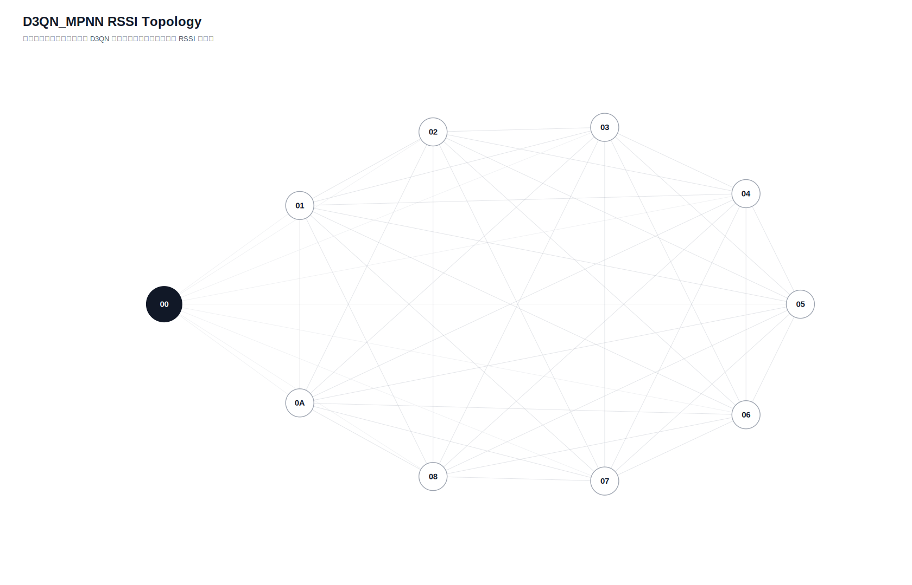

# D3QN_MPNN 真实硬件测试汇总报告

- 日志目录：`/home/sueiny/rk3506_linux6.1_v1.2.0/app/广播组网上位机/app/logs/d3qn_hw/第9次测试`
- 算法：`D3QN_MPNN`
- 推理策略：`纯D3QN，无Dijkstra fallback，无规则兜底`
- 目标：有效 SEND 平均点到点延时 `<220ms`，实际 ACK 丢包率 `<10%`；路由失败单独统计。
- Checkpoint：`/home/sueiny/rk3506_linux6.1_v1.2.0/app/广播组网上位机/app/checkpoints/d3qn_mpnn/latest.pt`
- 节点：`01, 02, 03, 04, 05, 06, 07, 08, 09, 0A`
- 地址说明：CLI 按十六进制地址解析，因此目标 `10` 表示地址 `0x10`。
- 计划轮次：`180`，实际SEND：`0`，成功：`0`，ACK timeout：`0`，D3QN路由失败：`180`，实际丢包率：`n/a`
- 端到端平均延时：`n/a`，P95：`n/a`，最小/最大：`n/a` / `n/a`
- 时延抖动均值：`n/a`，时延标准差：`n/a`
- D3QN 路由失败次数：`180`

## 拓扑图

## 测试结果

| 出发点 | 目标点 | 路径 | D3QN动作 | 成功/实际SEND | ACK timeout | 路由失败 | 丢包率 | 点到点平均 | P95 | 推理平均 | D3QN总耗时 | 重采 | 切换 | 最弱 RSSI |
|---|---|---|---:|---:|---:|---:|---:|---:|---:|---:|---:|---:|---:|---:|
| `01` | `02` | `` | `None` | `0/0` | `0` | `2` | `n/a` | `n/a` | `n/a` | `17.9ms` | `n/a` | `0` | `2` | `None` |
| `01` | `03` | `` | `None` | `0/0` | `0` | `2` | `n/a` | `n/a` | `n/a` | `23.0ms` | `n/a` | `0` | `2` | `None` |
| `01` | `04` | `` | `None` | `0/0` | `0` | `2` | `n/a` | `n/a` | `n/a` | `15.5ms` | `n/a` | `0` | `2` | `None` |
| `01` | `05` | `` | `None` | `0/0` | `0` | `2` | `n/a` | `n/a` | `n/a` | `15.7ms` | `n/a` | `0` | `2` | `None` |
| `01` | `06` | `` | `None` | `0/0` | `0` | `2` | `n/a` | `n/a` | `n/a` | `15.6ms` | `n/a` | `0` | `2` | `None` |
| `01` | `07` | `` | `None` | `0/0` | `0` | `2` | `n/a` | `n/a` | `n/a` | `16.9ms` | `n/a` | `0` | `2` | `None` |
| `01` | `08` | `` | `None` | `0/0` | `0` | `2` | `n/a` | `n/a` | `n/a` | `15.9ms` | `n/a` | `0` | `2` | `None` |
| `01` | `09` | `` | `None` | `0/0` | `0` | `2` | `n/a` | `n/a` | `n/a` | `16.0ms` | `n/a` | `0` | `2` | `None` |
| `01` | `0A` | `` | `None` | `0/0` | `0` | `2` | `n/a` | `n/a` | `n/a` | `16.4ms` | `n/a` | `0` | `2` | `None` |
| `02` | `01` | `` | `None` | `0/0` | `0` | `2` | `n/a` | `n/a` | `n/a` | `16.7ms` | `n/a` | `0` | `2` | `None` |
| `02` | `03` | `` | `None` | `0/0` | `0` | `2` | `n/a` | `n/a` | `n/a` | `15.9ms` | `n/a` | `0` | `2` | `None` |
| `02` | `04` | `` | `None` | `0/0` | `0` | `2` | `n/a` | `n/a` | `n/a` | `15.7ms` | `n/a` | `0` | `2` | `None` |
| `02` | `05` | `` | `None` | `0/0` | `0` | `2` | `n/a` | `n/a` | `n/a` | `15.8ms` | `n/a` | `0` | `2` | `None` |
| `02` | `06` | `` | `None` | `0/0` | `0` | `2` | `n/a` | `n/a` | `n/a` | `16.0ms` | `n/a` | `0` | `2` | `None` |
| `02` | `07` | `` | `None` | `0/0` | `0` | `2` | `n/a` | `n/a` | `n/a` | `16.3ms` | `n/a` | `0` | `2` | `None` |
| `02` | `08` | `` | `None` | `0/0` | `0` | `2` | `n/a` | `n/a` | `n/a` | `16.0ms` | `n/a` | `0` | `2` | `None` |
| `02` | `09` | `` | `None` | `0/0` | `0` | `2` | `n/a` | `n/a` | `n/a` | `23.3ms` | `n/a` | `0` | `2` | `None` |
| `02` | `0A` | `` | `None` | `0/0` | `0` | `2` | `n/a` | `n/a` | `n/a` | `16.3ms` | `n/a` | `0` | `2` | `None` |
| `03` | `01` | `` | `None` | `0/0` | `0` | `2` | `n/a` | `n/a` | `n/a` | `16.1ms` | `n/a` | `0` | `2` | `None` |
| `03` | `02` | `` | `None` | `0/0` | `0` | `2` | `n/a` | `n/a` | `n/a` | `18.6ms` | `n/a` | `0` | `2` | `None` |
| `03` | `04` | `` | `None` | `0/0` | `0` | `2` | `n/a` | `n/a` | `n/a` | `17.2ms` | `n/a` | `0` | `2` | `None` |
| `03` | `05` | `` | `None` | `0/0` | `0` | `2` | `n/a` | `n/a` | `n/a` | `16.0ms` | `n/a` | `0` | `2` | `None` |
| `03` | `06` | `` | `None` | `0/0` | `0` | `2` | `n/a` | `n/a` | `n/a` | `15.7ms` | `n/a` | `0` | `2` | `None` |
| `03` | `07` | `` | `None` | `0/0` | `0` | `2` | `n/a` | `n/a` | `n/a` | `15.4ms` | `n/a` | `0` | `2` | `None` |
| `03` | `08` | `` | `None` | `0/0` | `0` | `2` | `n/a` | `n/a` | `n/a` | `16.4ms` | `n/a` | `0` | `2` | `None` |
| `03` | `09` | `` | `None` | `0/0` | `0` | `2` | `n/a` | `n/a` | `n/a` | `16.0ms` | `n/a` | `0` | `2` | `None` |
| `03` | `0A` | `` | `None` | `0/0` | `0` | `2` | `n/a` | `n/a` | `n/a` | `16.9ms` | `n/a` | `0` | `2` | `None` |
| `04` | `01` | `` | `None` | `0/0` | `0` | `2` | `n/a` | `n/a` | `n/a` | `16.4ms` | `n/a` | `0` | `2` | `None` |
| `04` | `02` | `` | `None` | `0/0` | `0` | `2` | `n/a` | `n/a` | `n/a` | `15.7ms` | `n/a` | `0` | `2` | `None` |
| `04` | `03` | `` | `None` | `0/0` | `0` | `2` | `n/a` | `n/a` | `n/a` | `18.5ms` | `n/a` | `0` | `2` | `None` |
| `04` | `05` | `` | `None` | `0/0` | `0` | `2` | `n/a` | `n/a` | `n/a` | `16.1ms` | `n/a` | `0` | `2` | `None` |
| `04` | `06` | `` | `None` | `0/0` | `0` | `2` | `n/a` | `n/a` | `n/a` | `15.6ms` | `n/a` | `0` | `2` | `None` |
| `04` | `07` | `` | `None` | `0/0` | `0` | `2` | `n/a` | `n/a` | `n/a` | `16.0ms` | `n/a` | `0` | `2` | `None` |
| `04` | `08` | `` | `None` | `0/0` | `0` | `2` | `n/a` | `n/a` | `n/a` | `15.9ms` | `n/a` | `0` | `2` | `None` |
| `04` | `09` | `` | `None` | `0/0` | `0` | `2` | `n/a` | `n/a` | `n/a` | `16.0ms` | `n/a` | `0` | `2` | `None` |
| `04` | `0A` | `` | `None` | `0/0` | `0` | `2` | `n/a` | `n/a` | `n/a` | `16.3ms` | `n/a` | `0` | `2` | `None` |
| `05` | `01` | `` | `None` | `0/0` | `0` | `2` | `n/a` | `n/a` | `n/a` | `15.8ms` | `n/a` | `0` | `2` | `None` |
| `05` | `02` | `` | `None` | `0/0` | `0` | `2` | `n/a` | `n/a` | `n/a` | `16.6ms` | `n/a` | `0` | `2` | `None` |
| `05` | `03` | `` | `None` | `0/0` | `0` | `2` | `n/a` | `n/a` | `n/a` | `16.5ms` | `n/a` | `0` | `2` | `None` |
| `05` | `04` | `` | `None` | `0/0` | `0` | `2` | `n/a` | `n/a` | `n/a` | `15.7ms` | `n/a` | `0` | `2` | `None` |
| `05` | `06` | `` | `None` | `0/0` | `0` | `2` | `n/a` | `n/a` | `n/a` | `19.3ms` | `n/a` | `0` | `2` | `None` |
| `05` | `07` | `` | `None` | `0/0` | `0` | `2` | `n/a` | `n/a` | `n/a` | `16.4ms` | `n/a` | `0` | `2` | `None` |
| `05` | `08` | `` | `None` | `0/0` | `0` | `2` | `n/a` | `n/a` | `n/a` | `16.7ms` | `n/a` | `0` | `2` | `None` |
| `05` | `09` | `` | `None` | `0/0` | `0` | `2` | `n/a` | `n/a` | `n/a` | `15.8ms` | `n/a` | `0` | `2` | `None` |
| `05` | `0A` | `` | `None` | `0/0` | `0` | `2` | `n/a` | `n/a` | `n/a` | `16.3ms` | `n/a` | `0` | `2` | `None` |
| `06` | `01` | `` | `None` | `0/0` | `0` | `2` | `n/a` | `n/a` | `n/a` | `16.8ms` | `n/a` | `0` | `2` | `None` |
| `06` | `02` | `` | `None` | `0/0` | `0` | `2` | `n/a` | `n/a` | `n/a` | `16.3ms` | `n/a` | `0` | `2` | `None` |
| `06` | `03` | `` | `None` | `0/0` | `0` | `2` | `n/a` | `n/a` | `n/a` | `16.0ms` | `n/a` | `0` | `2` | `None` |
| `06` | `04` | `` | `None` | `0/0` | `0` | `2` | `n/a` | `n/a` | `n/a` | `15.8ms` | `n/a` | `0` | `2` | `None` |
| `06` | `05` | `` | `None` | `0/0` | `0` | `2` | `n/a` | `n/a` | `n/a` | `15.7ms` | `n/a` | `0` | `2` | `None` |
| `06` | `07` | `` | `None` | `0/0` | `0` | `2` | `n/a` | `n/a` | `n/a` | `19.0ms` | `n/a` | `0` | `2` | `None` |
| `06` | `08` | `` | `None` | `0/0` | `0` | `2` | `n/a` | `n/a` | `n/a` | `16.0ms` | `n/a` | `0` | `2` | `None` |
| `06` | `09` | `` | `None` | `0/0` | `0` | `2` | `n/a` | `n/a` | `n/a` | `16.6ms` | `n/a` | `0` | `2` | `None` |
| `06` | `0A` | `` | `None` | `0/0` | `0` | `2` | `n/a` | `n/a` | `n/a` | `20.9ms` | `n/a` | `0` | `2` | `None` |
| `07` | `01` | `` | `None` | `0/0` | `0` | `2` | `n/a` | `n/a` | `n/a` | `17.5ms` | `n/a` | `0` | `2` | `None` |
| `07` | `02` | `` | `None` | `0/0` | `0` | `2` | `n/a` | `n/a` | `n/a` | `16.3ms` | `n/a` | `0` | `2` | `None` |
| `07` | `03` | `` | `None` | `0/0` | `0` | `2` | `n/a` | `n/a` | `n/a` | `15.9ms` | `n/a` | `0` | `2` | `None` |
| `07` | `04` | `` | `None` | `0/0` | `0` | `2` | `n/a` | `n/a` | `n/a` | `15.4ms` | `n/a` | `0` | `2` | `None` |
| `07` | `05` | `` | `None` | `0/0` | `0` | `2` | `n/a` | `n/a` | `n/a` | `16.1ms` | `n/a` | `0` | `2` | `None` |
| `07` | `06` | `` | `None` | `0/0` | `0` | `2` | `n/a` | `n/a` | `n/a` | `15.9ms` | `n/a` | `0` | `2` | `None` |
| `07` | `08` | `` | `None` | `0/0` | `0` | `2` | `n/a` | `n/a` | `n/a` | `15.8ms` | `n/a` | `0` | `2` | `None` |
| `07` | `09` | `` | `None` | `0/0` | `0` | `2` | `n/a` | `n/a` | `n/a` | `18.8ms` | `n/a` | `0` | `2` | `None` |
| `07` | `0A` | `` | `None` | `0/0` | `0` | `2` | `n/a` | `n/a` | `n/a` | `15.7ms` | `n/a` | `0` | `2` | `None` |
| `08` | `01` | `` | `None` | `0/0` | `0` | `2` | `n/a` | `n/a` | `n/a` | `16.1ms` | `n/a` | `0` | `2` | `None` |
| `08` | `02` | `` | `None` | `0/0` | `0` | `2` | `n/a` | `n/a` | `n/a` | `16.6ms` | `n/a` | `0` | `2` | `None` |
| `08` | `03` | `` | `None` | `0/0` | `0` | `2` | `n/a` | `n/a` | `n/a` | `16.1ms` | `n/a` | `0` | `2` | `None` |
| `08` | `04` | `` | `None` | `0/0` | `0` | `2` | `n/a` | `n/a` | `n/a` | `17.6ms` | `n/a` | `0` | `2` | `None` |
| `08` | `05` | `` | `None` | `0/0` | `0` | `2` | `n/a` | `n/a` | `n/a` | `15.3ms` | `n/a` | `0` | `2` | `None` |
| `08` | `06` | `` | `None` | `0/0` | `0` | `2` | `n/a` | `n/a` | `n/a` | `15.7ms` | `n/a` | `0` | `2` | `None` |
| `08` | `07` | `` | `None` | `0/0` | `0` | `2` | `n/a` | `n/a` | `n/a` | `16.4ms` | `n/a` | `0` | `2` | `None` |
| `08` | `09` | `` | `None` | `0/0` | `0` | `2` | `n/a` | `n/a` | `n/a` | `16.0ms` | `n/a` | `0` | `2` | `None` |
| `08` | `0A` | `` | `None` | `0/0` | `0` | `2` | `n/a` | `n/a` | `n/a` | `15.9ms` | `n/a` | `0` | `2` | `None` |
| `09` | `01` | `` | `None` | `0/0` | `0` | `2` | `n/a` | `n/a` | `n/a` | `16.2ms` | `n/a` | `0` | `2` | `None` |
| `09` | `02` | `` | `None` | `0/0` | `0` | `2` | `n/a` | `n/a` | `n/a` | `15.8ms` | `n/a` | `0` | `2` | `None` |
| `09` | `03` | `` | `None` | `0/0` | `0` | `2` | `n/a` | `n/a` | `n/a` | `16.1ms` | `n/a` | `0` | `2` | `None` |
| `09` | `04` | `` | `None` | `0/0` | `0` | `2` | `n/a` | `n/a` | `n/a` | `15.5ms` | `n/a` | `0` | `2` | `None` |
| `09` | `05` | `` | `None` | `0/0` | `0` | `2` | `n/a` | `n/a` | `n/a` | `15.8ms` | `n/a` | `0` | `2` | `None` |
| `09` | `06` | `` | `None` | `0/0` | `0` | `2` | `n/a` | `n/a` | `n/a` | `16.0ms` | `n/a` | `0` | `2` | `None` |
| `09` | `07` | `` | `None` | `0/0` | `0` | `2` | `n/a` | `n/a` | `n/a` | `15.6ms` | `n/a` | `0` | `2` | `None` |
| `09` | `08` | `` | `None` | `0/0` | `0` | `2` | `n/a` | `n/a` | `n/a` | `16.2ms` | `n/a` | `0` | `2` | `None` |
| `09` | `0A` | `` | `None` | `0/0` | `0` | `2` | `n/a` | `n/a` | `n/a` | `15.8ms` | `n/a` | `0` | `2` | `None` |
| `0A` | `01` | `` | `None` | `0/0` | `0` | `2` | `n/a` | `n/a` | `n/a` | `16.2ms` | `n/a` | `0` | `2` | `None` |
| `0A` | `02` | `` | `None` | `0/0` | `0` | `2` | `n/a` | `n/a` | `n/a` | `15.7ms` | `n/a` | `0` | `2` | `None` |
| `0A` | `03` | `` | `None` | `0/0` | `0` | `2` | `n/a` | `n/a` | `n/a` | `16.2ms` | `n/a` | `0` | `2` | `None` |
| `0A` | `04` | `` | `None` | `0/0` | `0` | `2` | `n/a` | `n/a` | `n/a` | `15.8ms` | `n/a` | `0` | `2` | `None` |
| `0A` | `05` | `` | `None` | `0/0` | `0` | `2` | `n/a` | `n/a` | `n/a` | `15.6ms` | `n/a` | `0` | `2` | `None` |
| `0A` | `06` | `` | `None` | `0/0` | `0` | `2` | `n/a` | `n/a` | `n/a` | `15.6ms` | `n/a` | `0` | `2` | `None` |
| `0A` | `07` | `` | `None` | `0/0` | `0` | `2` | `n/a` | `n/a` | `n/a` | `16.3ms` | `n/a` | `0` | `2` | `None` |
| `0A` | `08` | `` | `None` | `0/0` | `0` | `2` | `n/a` | `n/a` | `n/a` | `15.8ms` | `n/a` | `0` | `2` | `None` |
| `0A` | `09` | `` | `None` | `0/0` | `0` | `2` | `n/a` | `n/a` | `n/a` | `15.5ms` | `n/a` | `0` | `2` | `None` |

## 指标总结对比

| 指标 | 当前值 | 单位 | 说明 |
|---|---:|---|---|
| 算法计算延时 | `16.4ms` | ms | 上位机用 D3QN 算出路径的平均耗时 |
| 指令下发延时 | `n/a` | ms | 当前硬件无中间节点时间戳，用 SEND 到 ACK 总时延近似 |
| 端到端实际传输平均延时 | `n/a` | ms | 现有统计总 ACK 时延 |
| 全局平均丢包率 | `n/a` | ratio | 总 timeout / 总发送 |
| D3QN 路由失败次数 | `180` | count | 无候选路径、checkpoint 缺失或模型输入不匹配 |
| 单路径平均跳数 | `0` | hops | 各目标最终路径跳数平均值 |
| 平均单跳传输耗时 | `n/a` | ms/hop | 端到端平均延时 / 跳数折算 |
| RSSI 实时波动范围 | `43` | dB | 当前拓扑边 RSSI 最大值减最小值 |
| RSSI 标准差 | `8.777` | dB | 当前拓扑边 RSSI 标准差 |
| 时延抖动均值 | `n/a` | ms | 相邻成功 ACK 延时差值均值 |
| 时延标准差 | `n/a` | ms | 成功 ACK 延时标准差 |

## 文件

- [`测试指标汇总.xlsx`](测试指标汇总.xlsx)
- [`拓扑图.txt`](拓扑图.txt)
- [`原始串口日志.log`](原始串口日志.log)
- `原始JSON数据/model_decisions.jsonl`
- `原始JSON数据/d3qn_state.json`

## 来源说明

| 来源 | 含义 |
|---|---|
| `real_rssi` | 由 RSSI_REQ 和 RSSI_REPORT 得到 |
| `real_ack` | 由真实 ACK 成功/timeout 统计得到 |
| `default` | 当前硬件不可直接测量，使用默认值占位 |
| `derived` | 由真实测试记录派生计算得到 |
| `derived_from_rssi` | 训练环境中容量、延时、丢包等不可测字段由真实 RSSI 分段派生 |
