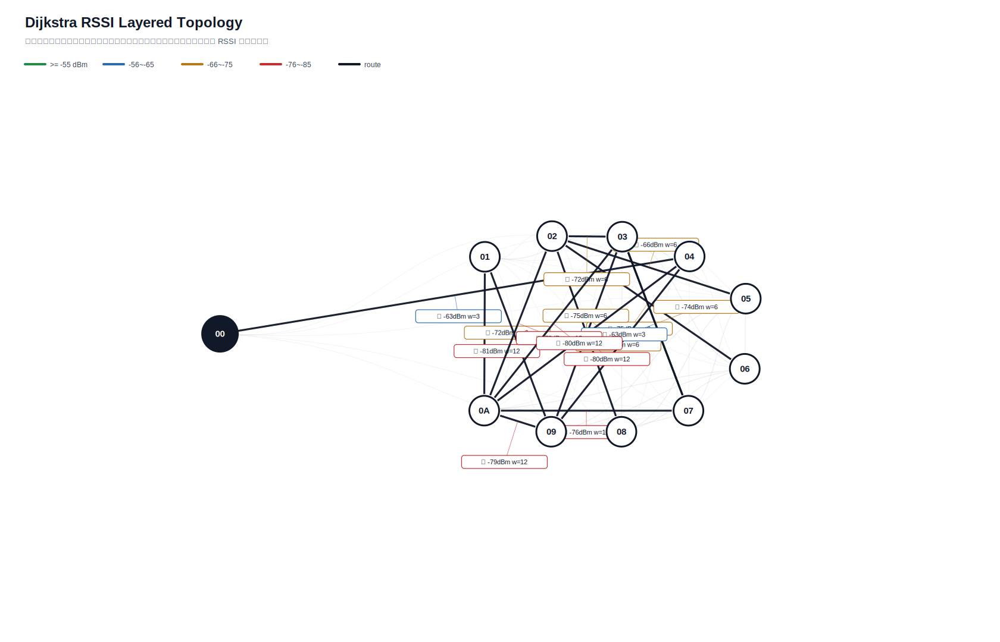

# Dijkstra 真实硬件测试汇总报告

- 生成时间：2026-06-01T21:09:04
- 日志目录：`/home/sueiny/rk3506_linux6.1_v1.2.0/app/广播组网上位机/app/logs/dijkstra_hw/第23次测试`
- 测试对象：网关 `00`，目标节点 `01, 02, 03, 04, 05, 06, 07, 08, 09, 0A`
- 地址说明：CLI 按十六进制地址解析，因此目标 `10` 表示地址 `0x10`。
- 丢包率目标：`<10%`，平均点到点延时目标：`<220ms`，ACK timeout：`2.0s`，是否达标：`否`
- 算法模式：`baseline_dijkstra`
- 最优参数组合：`interval=1.0s, rssi_requests=3, route_mode=baseline_dijkstra`
- 发包间隔：`1.0s`
- 计划轮次：`180`，实际SEND：`180`，成功：`138`，ACK timeout：`42`，路由不可达：`0`，实际丢包率：`23.33%`
- 总体成功 ACK 延时：平均 `124.3ms`，最小 `0.0ms`，最大 `1504.3ms`，P95 `601.3ms`

## 拓扑图

文本拓扑文件：[`拓扑图.txt`](拓扑图.txt)

Excel 汇总文件：[`测试指标汇总.xlsx`](测试指标汇总.xlsx)

## 测试结果

| 出发点 | 目标点 | 路径 | 成功/实际SEND | ACK timeout | 路由不可达 | 丢包率 | 点到点平均 | P95 | 网关到源 | 网关到目标 | 总延时 | 重采 | 最弱 RSSI |
|---|---|---|---:|---:|---:|---:|---:|---:|---:|---:|---:|---:|---:|
| `01` | `02` | `00 -> 03 -> 01 -> 02` | `2/2` | `0` | `0` | `0.00%` | `100.3ms` | `200.6ms` | `100.9ms` | `301.5ms` | `200.6ms` | `0` | `-84` |
| `01` | `03` | `00 -> 03` | `2/2` | `0` | `0` | `0.00%` | `250.6ms` | `501.3ms` | `100.9ms` | `602.2ms` | `501.3ms` | `0` | `-66` |
| `01` | `04` | `00 -> 03 -> 04` | `2/2` | `0` | `0` | `0.00%` | `150.2ms` | `300.5ms` | `502.5ms` | `100.6ms` | `0.0ms` | `0` | `-83` |
| `01` | `05` | `00 -> 03 -> 01 -> 06 -> 05` | `2/2` | `0` | `0` | `0.00%` | `301.3ms` | `301.6ms` | `100.9ms` | `401.9ms` | `301.0ms` | `0` | `-84` |
| `01` | `06` | `00 -> 03 -> 01 -> 02 -> 06` | `2/2` | `0` | `0` | `0.00%` | `551.4ms` | `601.3ms` | `100.9ms` | `702.2ms` | `601.3ms` | `0` | `-84` |
| `01` | `07` | `00 -> 03 -> 01 -> 09 -> 07` | `2/2` | `0` | `0` | `0.00%` | `50.3ms` | `100.5ms` | `100.8ms` | `201.3ms` | `100.5ms` | `0` | `-84` |
| `01` | `08` | `00 -> 03 -> 01 -> 02 -> 08` | `2/2` | `0` | `0` | `0.00%` | `0.3ms` | `0.3ms` | `201.1ms` | `201.4ms` | `0.3ms` | `0` | `-84` |
| `01` | `09` | `00 -> 03 -> 01 -> 09` | `2/2` | `0` | `0` | `0.00%` | `0.0ms` | `0.0ms` | `802.6ms` | `100.7ms` | `0.0ms` | `0` | `-84` |
| `01` | `0A` | `00 -> 03 -> 01 -> 02 -> 0A` | `0/2` | `2` | `0` | `100.00%` | `n/a` | `n/a` | `802.6ms` | `n/a` | `n/a` | `0` | `-84` |
| `02` | `01` | `00 -> 02 -> 03 -> 01` | `2/2` | `0` | `0` | `0.00%` | `0.0ms` | `0.1ms` | `301.8ms` | `100.9ms` | `0.0ms` | `0` | `-84` |
| `02` | `03` | `00 -> 02 -> 06 -> 03` | `1/2` | `1` | `0` | `50.00%` | `1504.3ms` | `1504.3ms` | `n/a` | `n/a` | `n/a` | `0` | `-81` |
| `02` | `04` | `00 -> 02 -> 03 -> 04` | `2/2` | `0` | `0` | `0.00%` | `99.3ms` | `198.7ms` | `201.2ms` | `200.9ms` | `0.0ms` | `0` | `-83` |
| `02` | `05` | `00 -> 02 -> 05` | `2/2` | `0` | `0` | `0.00%` | `102.6ms` | `200.8ms` | `201.0ms` | `401.8ms` | `200.8ms` | `0` | `-81` |
| `02` | `06` | `00 -> 02 -> 06` | `2/2` | `0` | `0` | `0.00%` | `50.2ms` | `100.2ms` | `100.9ms` | `101.2ms` | `0.3ms` | `0` | `-81` |
| `02` | `07` | `00 -> 02 -> 03 -> 07` | `2/2` | `0` | `0` | `0.00%` | `50.1ms` | `100.2ms` | `201.1ms` | `100.6ms` | `0.0ms` | `0` | `-81` |
| `02` | `08` | `00 -> 02 -> 08` | `2/2` | `0` | `0` | `0.00%` | `0.0ms` | `0.0ms` | `402.0ms` | `401.6ms` | `0.0ms` | `0` | `-81` |
| `02` | `09` | `00 -> 02 -> 03 -> 09` | `2/2` | `0` | `0` | `0.00%` | `50.1ms` | `100.2ms` | `201.5ms` | `101.0ms` | `0.0ms` | `0` | `-81` |
| `02` | `0A` | `00 -> 02 -> 03 -> 0A` | `0/2` | `2` | `0` | `100.00%` | `n/a` | `n/a` | `301.7ms` | `n/a` | `n/a` | `0` | `-81` |
| `03` | `01` | `00 -> 03 -> 01` | `1/2` | `1` | `0` | `50.00%` | `0.0ms` | `0.0ms` | `1203.4ms` | `401.7ms` | `0.0ms` | `0` | `-84` |
| `03` | `02` | `00 -> 03 -> 07 -> 08 -> 02` | `2/2` | `0` | `0` | `0.00%` | `250.2ms` | `400.6ms` | `201.6ms` | `301.4ms` | `99.8ms` | `0` | `-75` |
| `03` | `04` | `00 -> 03 -> 04` | `2/2` | `0` | `0` | `0.00%` | `0.1ms` | `0.1ms` | `201.2ms` | `201.3ms` | `0.1ms` | `0` | `-83` |
| `03` | `05` | `00 -> 03 -> 02 -> 05` | `2/2` | `0` | `0` | `0.00%` | `50.3ms` | `100.6ms` | `201.2ms` | `100.9ms` | `0.0ms` | `0` | `-72` |
| `03` | `06` | `00 -> 03 -> 02 -> 06` | `2/2` | `0` | `0` | `0.00%` | `0.0ms` | `0.0ms` | `502.2ms` | `100.7ms` | `0.0ms` | `0` | `-75` |
| `03` | `07` | `00 -> 03 -> 09 -> 07` | `2/2` | `0` | `0` | `0.00%` | `250.7ms` | `300.8ms` | `100.8ms` | `301.3ms` | `200.5ms` | `0` | `-72` |
| `03` | `08` | `00 -> 03 -> 02 -> 08` | `2/2` | `0` | `0` | `0.00%` | `100.7ms` | `201.3ms` | `201.1ms` | `402.5ms` | `201.3ms` | `0` | `-74` |
| `03` | `09` | `00 -> 03 -> 09` | `2/2` | `0` | `0` | `0.00%` | `49.9ms` | `99.9ms` | `201.1ms` | `201.0ms` | `0.0ms` | `0` | `-70` |
| `03` | `0A` | `00 -> 03 -> 02 -> 0A` | `0/2` | `2` | `0` | `100.00%` | `n/a` | `n/a` | `201.1ms` | `n/a` | `n/a` | `0` | `-80` |
| `04` | `01` | `00 -> 04 -> 03 -> 01` | `2/2` | `0` | `0` | `0.00%` | `50.3ms` | `100.6ms` | `2007.7ms` | `301.4ms` | `0.0ms` | `0` | `-84` |
| `04` | `02` | `00 -> 04 -> 03 -> 02` | `2/2` | `0` | `0` | `0.00%` | `0.0ms` | `0.0ms` | `401.7ms` | `201.3ms` | `0.0ms` | `0` | `-72` |
| `04` | `03` | `00 -> 04 -> 09 -> 03` | `1/2` | `1` | `0` | `50.00%` | `0.0ms` | `0.0ms` | `202.2ms` | `101.1ms` | `0.0ms` | `0` | `-75` |
| `04` | `05` | `00 -> 04 -> 05` | `2/2` | `0` | `0` | `0.00%` | `100.2ms` | `200.4ms` | `804.9ms` | `201.1ms` | `0.0ms` | `0` | `-76` |
| `04` | `06` | `00 -> 04 -> 06` | `2/2` | `0` | `0` | `0.00%` | `0.0ms` | `0.0ms` | `1204.3ms` | `100.9ms` | `0.0ms` | `0` | `-81` |
| `04` | `07` | `00 -> 04 -> 09 -> 07` | `2/2` | `0` | `0` | `0.00%` | `250.7ms` | `501.5ms` | `1404.6ms` | `101.0ms` | `0.0ms` | `0` | `-75` |
| `04` | `08` | `00 -> 04 -> 08` | `2/2` | `0` | `0` | `0.00%` | `0.0ms` | `0.0ms` | `301.1ms` | `201.2ms` | `0.0ms` | `0` | `-79` |
| `04` | `09` | `00 -> 04 -> 09` | `2/2` | `0` | `0` | `0.00%` | `401.1ms` | `802.3ms` | `1906.1ms` | `101.4ms` | `0.0ms` | `0` | `-75` |
| `04` | `0A` | `00 -> 04 -> 0A` | `0/2` | `2` | `0` | `100.00%` | `n/a` | `n/a` | `201.0ms` | `n/a` | `n/a` | `0` | `-80` |
| `05` | `01` | `00 -> 05 -> 03 -> 01` | `2/2` | `0` | `0` | `0.00%` | `200.2ms` | `400.3ms` | `301.4ms` | `100.8ms` | `0.0ms` | `0` | `-84` |
| `05` | `02` | `00 -> 05 -> 02` | `2/2` | `0` | `0` | `0.00%` | `50.1ms` | `100.1ms` | `203.1ms` | `100.9ms` | `0.0ms` | `0` | `-83` |
| `05` | `03` | `00 -> 05 -> 02 -> 03` | `2/2` | `0` | `0` | `0.00%` | `0.0ms` | `0.0ms` | `301.7ms` | `201.0ms` | `0.0ms` | `0` | `-83` |
| `05` | `04` | `00 -> 05 -> 02 -> 03 -> 04` | `2/2` | `0` | `0` | `0.00%` | `0.1ms` | `0.2ms` | `702.4ms` | `101.2ms` | `0.0ms` | `0` | `-83` |
| `05` | `06` | `00 -> 05 -> 02 -> 06` | `2/2` | `0` | `0` | `0.00%` | `0.0ms` | `0.0ms` | `301.2ms` | `201.1ms` | `0.0ms` | `0` | `-83` |
| `05` | `07` | `00 -> 05 -> 07` | `2/2` | `0` | `0` | `0.00%` | `350.9ms` | `701.8ms` | `301.4ms` | `1003.1ms` | `701.8ms` | `0` | `-83` |
| `05` | `08` | `00 -> 05 -> 02 -> 08` | `2/2` | `0` | `0` | `0.00%` | `50.2ms` | `100.3ms` | `502.0ms` | `100.6ms` | `0.0ms` | `0` | `-83` |
| `05` | `09` | `00 -> 05 -> 09` | `2/2` | `0` | `0` | `0.00%` | `100.1ms` | `200.2ms` | `201.1ms` | `100.8ms` | `0.0ms` | `0` | `-83` |
| `05` | `0A` | `00 -> 05 -> 02 -> 03 -> 0A` | `0/2` | `2` | `0` | `100.00%` | `n/a` | `n/a` | `202.7ms` | `n/a` | `n/a` | `0` | `-83` |
| `06` | `01` | `00 -> 04 -> 06 -> 03 -> 01` | `2/2` | `0` | `0` | `0.00%` | `0.0ms` | `0.0ms` | `201.2ms` | `100.6ms` | `0.0ms` | `0` | `-84` |
| `06` | `02` | `00 -> 04 -> 06 -> 02` | `2/2` | `0` | `0` | `0.00%` | `551.7ms` | `1103.3ms` | `702.6ms` | `101.4ms` | `0.0ms` | `0` | `-81` |
| `06` | `03` | `00 -> 04 -> 06 -> 03` | `2/2` | `0` | `0` | `0.00%` | `0.0ms` | `0.0ms` | `510.4ms` | `100.8ms` | `0.0ms` | `0` | `-81` |
| `06` | `04` | `00 -> 04` | `2/2` | `0` | `0` | `0.00%` | `200.7ms` | `401.3ms` | `201.0ms` | `100.7ms` | `0.0ms` | `0` | `-63` |
| `06` | `05` | `00 -> 04 -> 06 -> 02 -> 05` | `2/2` | `0` | `0` | `0.00%` | `150.6ms` | `301.1ms` | `100.7ms` | `100.7ms` | `0.0ms` | `0` | `-81` |
| `06` | `07` | `00 -> 04 -> 06 -> 03 -> 07` | `2/2` | `0` | `0` | `0.00%` | `250.7ms` | `400.8ms` | `200.9ms` | `301.4ms` | `100.5ms` | `0` | `-81` |
| `06` | `08` | `00 -> 04 -> 06 -> 05 -> 02 -> 08` | `2/2` | `0` | `0` | `0.00%` | `153.2ms` | `305.9ms` | `101.0ms` | `101.6ms` | `0.5ms` | `0` | `-81` |
| `06` | `09` | `00 -> 04 -> 06 -> 09` | `2/2` | `0` | `0` | `0.00%` | `400.9ms` | `801.8ms` | `101.3ms` | `903.1ms` | `801.8ms` | `0` | `-83` |
| `06` | `0A` | `00 -> 04 -> 06 -> 05 -> 02 -> 0A` | `0/2` | `2` | `0` | `100.00%` | `n/a` | `n/a` | `201.1ms` | `n/a` | `n/a` | `0` | `-81` |
| `07` | `01` | `00 -> 07 -> 03 -> 01` | `2/2` | `0` | `0` | `0.00%` | `50.0ms` | `99.9ms` | `201.1ms` | `100.8ms` | `0.0ms` | `0` | `-84` |
| `07` | `02` | `00 -> 07 -> 08 -> 02` | `2/2` | `0` | `0` | `0.00%` | `350.7ms` | `501.3ms` | `302.1ms` | `502.2ms` | `200.1ms` | `0` | `-76` |
| `07` | `03` | `00 -> 07 -> 03` | `2/2` | `0` | `0` | `0.00%` | `0.0ms` | `0.0ms` | `201.4ms` | `100.9ms` | `0.0ms` | `0` | `-76` |
| `07` | `04` | `00 -> 07 -> 03 -> 04` | `2/2` | `0` | `0` | `0.00%` | `0.0ms` | `0.0ms` | `402.0ms` | `201.0ms` | `0.0ms` | `0` | `-83` |
| `07` | `05` | `00 -> 07 -> 05` | `2/2` | `0` | `0` | `0.00%` | `0.0ms` | `0.0ms` | `301.9ms` | `201.0ms` | `0.0ms` | `0` | `-76` |
| `07` | `06` | `00 -> 07 -> 03 -> 02 -> 06` | `2/2` | `0` | `0` | `0.00%` | `0.0ms` | `0.0ms` | `301.4ms` | `100.8ms` | `0.0ms` | `0` | `-76` |
| `07` | `08` | `00 -> 07 -> 08` | `2/2` | `0` | `0` | `0.00%` | `50.1ms` | `100.2ms` | `301.2ms` | `100.7ms` | `0.0ms` | `0` | `-76` |
| `07` | `09` | `00 -> 07 -> 03 -> 09` | `1/2` | `1` | `0` | `50.00%` | `0.0ms` | `0.0ms` | `n/a` | `n/a` | `n/a` | `0` | `-76` |
| `07` | `0A` | `00 -> 07 -> 03 -> 0A` | `0/2` | `2` | `0` | `100.00%` | `n/a` | `n/a` | `301.4ms` | `n/a` | `n/a` | `0` | `-78` |
| `08` | `01` | `00 -> 08 -> 02 -> 03 -> 01` | `2/2` | `0` | `0` | `0.00%` | `0.0ms` | `0.0ms` | `301.0ms` | `101.1ms` | `0.0ms` | `0` | `-84` |
| `08` | `02` | `00 -> 08 -> 02` | `2/2` | `0` | `0` | `0.00%` | `100.3ms` | `200.7ms` | `301.3ms` | `301.2ms` | `0.0ms` | `0` | `-75` |
| `08` | `03` | `00 -> 08 -> 03` | `1/2` | `1` | `0` | `50.00%` | `0.0ms` | `0.0ms` | `301.3ms` | `200.9ms` | `0.0ms` | `0` | `-79` |
| `08` | `04` | `00 -> 08 -> 02 -> 03 -> 04` | `2/2` | `0` | `0` | `0.00%` | `100.0ms` | `199.9ms` | `301.8ms` | `501.7ms` | `199.9ms` | `0` | `-83` |
| `08` | `05` | `00 -> 08 -> 02 -> 05` | `2/2` | `0` | `0` | `0.00%` | `0.1ms` | `0.1ms` | `401.6ms` | `100.8ms` | `0.0ms` | `0` | `-75` |
| `08` | `06` | `00 -> 08 -> 02 -> 06` | `2/2` | `0` | `0` | `0.00%` | `0.0ms` | `0.0ms` | `301.2ms` | `201.2ms` | `0.0ms` | `0` | `-75` |
| `08` | `07` | `00 -> 08 -> 07` | `2/2` | `0` | `0` | `0.00%` | `100.5ms` | `201.1ms` | `201.0ms` | `402.1ms` | `201.1ms` | `0` | `-79` |
| `08` | `09` | `00 -> 08 -> 09` | `2/2` | `0` | `0` | `0.00%` | `0.0ms` | `0.0ms` | `301.2ms` | `101.3ms` | `0.0ms` | `0` | `-78` |
| `08` | `0A` | `00 -> 08 -> 02 -> 0A` | `0/2` | `2` | `0` | `100.00%` | `n/a` | `n/a` | `401.4ms` | `n/a` | `n/a` | `0` | `-80` |
| `09` | `01` | `00 -> 04 -> 09 -> 01` | `2/2` | `0` | `0` | `0.00%` | `100.4ms` | `200.8ms` | `301.3ms` | `201.1ms` | `0.0ms` | `0` | `-81` |
| `09` | `02` | `00 -> 04 -> 09 -> 03 -> 02` | `2/2` | `0` | `0` | `0.00%` | `100.3ms` | `200.7ms` | `100.8ms` | `301.5ms` | `200.7ms` | `0` | `-75` |
| `09` | `03` | `00 -> 04 -> 09 -> 07 -> 03` | `2/2` | `0` | `0` | `0.00%` | `348.3ms` | `391.8ms` | `102.8ms` | `407.6ms` | `304.8ms` | `0` | `-75` |
| `09` | `04` | `00 -> 04` | `1/2` | `1` | `0` | `50.00%` | `702.1ms` | `702.1ms` | `100.9ms` | `803.0ms` | `702.1ms` | `0` | `-63` |
| `09` | `05` | `00 -> 04 -> 09 -> 05` | `2/2` | `0` | `0` | `0.00%` | `0.0ms` | `0.0ms` | `1103.2ms` | `201.3ms` | `0.0ms` | `0` | `-77` |
| `09` | `06` | `00 -> 04 -> 09 -> 06` | `2/2` | `0` | `0` | `0.00%` | `150.4ms` | `300.9ms` | `100.8ms` | `401.6ms` | `300.9ms` | `0` | `-84` |
| `09` | `07` | `00 -> 04 -> 09 -> 03 -> 07` | `2/2` | `0` | `0` | `0.00%` | `301.0ms` | `501.4ms` | `100.9ms` | `201.4ms` | `100.5ms` | `0` | `-75` |
| `09` | `08` | `00 -> 04 -> 09 -> 07 -> 08` | `2/2` | `0` | `0` | `0.00%` | `0.0ms` | `0.0ms` | `1404.7ms` | `301.6ms` | `0.0ms` | `0` | `-75` |
| `09` | `0A` | `00 -> 04 -> 09 -> 01 -> 0A` | `0/2` | `2` | `0` | `100.00%` | `n/a` | `n/a` | `100.8ms` | `n/a` | `n/a` | `0` | `-81` |
| `0A` | `01` | `00 -> 04 -> 0A -> 09 -> 01` | `0/2` | `2` | `0` | `100.00%` | `n/a` | `n/a` | `n/a` | `n/a` | `n/a` | `0` | `-81` |
| `0A` | `02` | `00 -> 04 -> 0A -> 03 -> 02` | `0/2` | `2` | `0` | `100.00%` | `n/a` | `n/a` | `n/a` | `n/a` | `n/a` | `0` | `-80` |
| `0A` | `03` | `00 -> 04 -> 0A -> 07 -> 03` | `0/2` | `2` | `0` | `100.00%` | `n/a` | `n/a` | `n/a` | `n/a` | `n/a` | `0` | `-80` |
| `0A` | `04` | `00 -> 04` | `0/2` | `2` | `0` | `100.00%` | `n/a` | `n/a` | `n/a` | `n/a` | `n/a` | `0` | `-63` |
| `0A` | `05` | `00 -> 04 -> 0A -> 02 -> 05` | `0/2` | `2` | `0` | `100.00%` | `n/a` | `n/a` | `n/a` | `n/a` | `n/a` | `0` | `-80` |
| `0A` | `06` | `00 -> 04 -> 0A -> 02 -> 06` | `0/2` | `2` | `0` | `100.00%` | `n/a` | `n/a` | `n/a` | `n/a` | `n/a` | `0` | `-80` |
| `0A` | `07` | `00 -> 04 -> 0A -> 03 -> 07` | `0/2` | `2` | `0` | `100.00%` | `n/a` | `n/a` | `n/a` | `n/a` | `n/a` | `0` | `-80` |
| `0A` | `08` | `00 -> 04 -> 0A -> 02 -> 08` | `0/2` | `2` | `0` | `100.00%` | `n/a` | `n/a` | `n/a` | `n/a` | `n/a` | `0` | `-80` |
| `0A` | `09` | `00 -> 04 -> 0A -> 03 -> 09` | `0/2` | `2` | `0` | `100.00%` | `n/a` | `n/a` | `n/a` | `n/a` | `n/a` | `0` | `-80` |

## 指标总结对比

| 指标 | 当前值 | 单位 | 说明 |
|---|---:|---|---|
| 算法计算延时 | `0.8ms` | ms | 网关/上位机算出 Dijkstra 路由路径的耗时 |
| 指令下发延时 | `124.3ms` | ms | 当前硬件无中间节点时间戳，第一版用 SEND 到 ACK 总延时近似记录 |
| 端到端实际传输平均延时 | `124.3ms` | ms | 现有统计总 ACK 时延 |
| 全局平均丢包率 | `23.33%` | ratio | 总 timeout / 总发送 |
| 单路径平均跳数 | `3.7` | hops | 各目标最终路径跳数平均值 |
| 平均单跳传输耗时 | `41.4ms` | ms/hop | 端到端平均延时 / 跳数折算 |
| RSSI 实时波动范围 | `22` | dB | 当前拓扑边 RSSI 最大值减最小值 |
| RSSI 标准差 | `5.2702` | dB | 当前拓扑边 RSSI 标准差 |
| 时延抖动均值 | `193.1ms` | ms | 相邻成功 ACK 延时差值均值 |
| 时延标准差 | `232.0ms` | ms | 成功 ACK 延时标准差 |

## 完整指标汇总

| 出发点 | 目标点 | 路径 | 算法计算延时 | 指令下发延时 | 端到端实际传输平均延时 | 节点丢包率 | 全局平均丢包率 | 路由跳数 | 单路径平均跳数 | 平均单跳传输耗时 | RSSI 实时波动 | 时延抖动变化 |
|---|---|---|---:|---:|---:|---:|---:|---:|---:|---:|---|---|
| `01` | `02` | `00 -> 03 -> 01 -> 02` | `0.8ms` | `100.3ms` | `100.3ms` | `0.00%` | `23.33%` | `3` | `3.7` | `33.4ms` | `min -85 / max -63 / range 22dB / std 5.2702` | `节点 294.2ms / 全局 193.1ms` |
| `01` | `03` | `00 -> 03` | `0.8ms` | `250.6ms` | `250.6ms` | `0.00%` | `23.33%` | `1` | `3.7` | `250.6ms` | `min -85 / max -63 / range 22dB / std 5.2702` | `节点 290.6ms / 全局 193.1ms` |
| `01` | `04` | `00 -> 03 -> 04` | `0.8ms` | `150.2ms` | `150.2ms` | `0.00%` | `23.33%` | `2` | `3.7` | `75.1ms` | `min -85 / max -63 / range 22dB / std 5.2702` | `节点 157.4ms / 全局 193.1ms` |
| `01` | `05` | `00 -> 03 -> 01 -> 06 -> 05` | `0.8ms` | `301.3ms` | `301.3ms` | `0.00%` | `23.33%` | `4` | `3.7` | `75.3ms` | `min -85 / max -63 / range 22dB / std 5.2702` | `节点 113.2ms / 全局 193.1ms` |
| `01` | `06` | `00 -> 03 -> 01 -> 02 -> 06` | `0.8ms` | `551.4ms` | `551.4ms` | `0.00%` | `23.33%` | `4` | `3.7` | `137.8ms` | `min -85 / max -63 / range 22dB / std 5.2702` | `节点 66.8ms / 全局 193.1ms` |
| `01` | `07` | `00 -> 03 -> 01 -> 09 -> 07` | `0.8ms` | `50.3ms` | `50.3ms` | `0.00%` | `23.33%` | `4` | `3.7` | `12.6ms` | `min -85 / max -63 / range 22dB / std 5.2702` | `节点 247.4ms / 全局 193.1ms` |
| `01` | `08` | `00 -> 03 -> 01 -> 02 -> 08` | `0.8ms` | `0.3ms` | `0.3ms` | `0.00%` | `23.33%` | `4` | `3.7` | `0.1ms` | `min -85 / max -63 / range 22dB / std 5.2702` | `节点 94.3ms / 全局 193.1ms` |
| `01` | `09` | `00 -> 03 -> 01 -> 09` | `0.8ms` | `0.0ms` | `0.0ms` | `0.00%` | `23.33%` | `3` | `3.7` | `0.0ms` | `min -85 / max -63 / range 22dB / std 5.2702` | `节点 286.3ms / 全局 193.1ms` |
| `01` | `0A` | `00 -> 03 -> 01 -> 02 -> 0A` | `0.8ms` | `n/a` | `n/a` | `100.00%` | `23.33%` | `4` | `3.7` | `n/a` | `min -85 / max -63 / range 22dB / std 5.2702` | `节点 n/a / 全局 193.1ms` |
| `02` | `01` | `00 -> 02 -> 03 -> 01` | `0.8ms` | `0.0ms` | `0.0ms` | `0.00%` | `23.33%` | `3` | `3.7` | `0.0ms` | `min -85 / max -63 / range 22dB / std 5.2702` | `节点 114.5ms / 全局 193.1ms` |
| `02` | `03` | `00 -> 02 -> 06 -> 03` | `0.8ms` | `1504.3ms` | `1504.3ms` | `50.00%` | `23.33%` | `3` | `3.7` | `501.4ms` | `min -85 / max -63 / range 22dB / std 5.2702` | `节点 290.6ms / 全局 193.1ms` |
| `02` | `04` | `00 -> 02 -> 03 -> 04` | `0.8ms` | `99.3ms` | `99.3ms` | `0.00%` | `23.33%` | `3` | `3.7` | `33.1ms` | `min -85 / max -63 / range 22dB / std 5.2702` | `节点 157.4ms / 全局 193.1ms` |
| `02` | `05` | `00 -> 02 -> 05` | `0.8ms` | `102.6ms` | `102.6ms` | `0.00%` | `23.33%` | `2` | `3.7` | `51.3ms` | `min -85 / max -63 / range 22dB / std 5.2702` | `节点 113.2ms / 全局 193.1ms` |
| `02` | `06` | `00 -> 02 -> 06` | `0.8ms` | `50.2ms` | `50.2ms` | `0.00%` | `23.33%` | `2` | `3.7` | `25.1ms` | `min -85 / max -63 / range 22dB / std 5.2702` | `节点 66.8ms / 全局 193.1ms` |
| `02` | `07` | `00 -> 02 -> 03 -> 07` | `0.8ms` | `50.1ms` | `50.1ms` | `0.00%` | `23.33%` | `3` | `3.7` | `16.7ms` | `min -85 / max -63 / range 22dB / std 5.2702` | `节点 247.4ms / 全局 193.1ms` |
| `02` | `08` | `00 -> 02 -> 08` | `0.8ms` | `0.0ms` | `0.0ms` | `0.00%` | `23.33%` | `2` | `3.7` | `0.0ms` | `min -85 / max -63 / range 22dB / std 5.2702` | `节点 94.3ms / 全局 193.1ms` |
| `02` | `09` | `00 -> 02 -> 03 -> 09` | `0.8ms` | `50.1ms` | `50.1ms` | `0.00%` | `23.33%` | `3` | `3.7` | `16.7ms` | `min -85 / max -63 / range 22dB / std 5.2702` | `节点 286.3ms / 全局 193.1ms` |
| `02` | `0A` | `00 -> 02 -> 03 -> 0A` | `0.8ms` | `n/a` | `n/a` | `100.00%` | `23.33%` | `3` | `3.7` | `n/a` | `min -85 / max -63 / range 22dB / std 5.2702` | `节点 n/a / 全局 193.1ms` |
| `03` | `01` | `00 -> 03 -> 01` | `0.8ms` | `0.0ms` | `0.0ms` | `50.00%` | `23.33%` | `2` | `3.7` | `0.0ms` | `min -85 / max -63 / range 22dB / std 5.2702` | `节点 114.5ms / 全局 193.1ms` |
| `03` | `02` | `00 -> 03 -> 07 -> 08 -> 02` | `0.8ms` | `250.2ms` | `250.2ms` | `0.00%` | `23.33%` | `4` | `3.7` | `62.5ms` | `min -85 / max -63 / range 22dB / std 5.2702` | `节点 294.2ms / 全局 193.1ms` |
| `03` | `04` | `00 -> 03 -> 04` | `0.8ms` | `0.1ms` | `0.1ms` | `0.00%` | `23.33%` | `2` | `3.7` | `0.0ms` | `min -85 / max -63 / range 22dB / std 5.2702` | `节点 157.4ms / 全局 193.1ms` |
| `03` | `05` | `00 -> 03 -> 02 -> 05` | `0.8ms` | `50.3ms` | `50.3ms` | `0.00%` | `23.33%` | `3` | `3.7` | `16.8ms` | `min -85 / max -63 / range 22dB / std 5.2702` | `节点 113.2ms / 全局 193.1ms` |
| `03` | `06` | `00 -> 03 -> 02 -> 06` | `0.8ms` | `0.0ms` | `0.0ms` | `0.00%` | `23.33%` | `3` | `3.7` | `0.0ms` | `min -85 / max -63 / range 22dB / std 5.2702` | `节点 66.8ms / 全局 193.1ms` |
| `03` | `07` | `00 -> 03 -> 09 -> 07` | `0.8ms` | `250.7ms` | `250.7ms` | `0.00%` | `23.33%` | `3` | `3.7` | `83.6ms` | `min -85 / max -63 / range 22dB / std 5.2702` | `节点 247.4ms / 全局 193.1ms` |
| `03` | `08` | `00 -> 03 -> 02 -> 08` | `0.8ms` | `100.7ms` | `100.7ms` | `0.00%` | `23.33%` | `3` | `3.7` | `33.6ms` | `min -85 / max -63 / range 22dB / std 5.2702` | `节点 94.3ms / 全局 193.1ms` |
| `03` | `09` | `00 -> 03 -> 09` | `0.8ms` | `49.9ms` | `49.9ms` | `0.00%` | `23.33%` | `2` | `3.7` | `25.0ms` | `min -85 / max -63 / range 22dB / std 5.2702` | `节点 286.3ms / 全局 193.1ms` |
| `03` | `0A` | `00 -> 03 -> 02 -> 0A` | `0.8ms` | `n/a` | `n/a` | `100.00%` | `23.33%` | `3` | `3.7` | `n/a` | `min -85 / max -63 / range 22dB / std 5.2702` | `节点 n/a / 全局 193.1ms` |
| `04` | `01` | `00 -> 04 -> 03 -> 01` | `0.8ms` | `50.3ms` | `50.3ms` | `0.00%` | `23.33%` | `3` | `3.7` | `16.8ms` | `min -85 / max -63 / range 22dB / std 5.2702` | `节点 114.5ms / 全局 193.1ms` |
| `04` | `02` | `00 -> 04 -> 03 -> 02` | `0.8ms` | `0.0ms` | `0.0ms` | `0.00%` | `23.33%` | `3` | `3.7` | `0.0ms` | `min -85 / max -63 / range 22dB / std 5.2702` | `节点 294.2ms / 全局 193.1ms` |
| `04` | `03` | `00 -> 04 -> 09 -> 03` | `0.8ms` | `0.0ms` | `0.0ms` | `50.00%` | `23.33%` | `3` | `3.7` | `0.0ms` | `min -85 / max -63 / range 22dB / std 5.2702` | `节点 290.6ms / 全局 193.1ms` |
| `04` | `05` | `00 -> 04 -> 05` | `0.8ms` | `100.2ms` | `100.2ms` | `0.00%` | `23.33%` | `2` | `3.7` | `50.1ms` | `min -85 / max -63 / range 22dB / std 5.2702` | `节点 113.2ms / 全局 193.1ms` |
| `04` | `06` | `00 -> 04 -> 06` | `0.8ms` | `0.0ms` | `0.0ms` | `0.00%` | `23.33%` | `2` | `3.7` | `0.0ms` | `min -85 / max -63 / range 22dB / std 5.2702` | `节点 66.8ms / 全局 193.1ms` |
| `04` | `07` | `00 -> 04 -> 09 -> 07` | `0.8ms` | `250.7ms` | `250.7ms` | `0.00%` | `23.33%` | `3` | `3.7` | `83.6ms` | `min -85 / max -63 / range 22dB / std 5.2702` | `节点 247.4ms / 全局 193.1ms` |
| `04` | `08` | `00 -> 04 -> 08` | `0.8ms` | `0.0ms` | `0.0ms` | `0.00%` | `23.33%` | `2` | `3.7` | `0.0ms` | `min -85 / max -63 / range 22dB / std 5.2702` | `节点 94.3ms / 全局 193.1ms` |
| `04` | `09` | `00 -> 04 -> 09` | `0.8ms` | `401.1ms` | `401.1ms` | `0.00%` | `23.33%` | `2` | `3.7` | `200.6ms` | `min -85 / max -63 / range 22dB / std 5.2702` | `节点 286.3ms / 全局 193.1ms` |
| `04` | `0A` | `00 -> 04 -> 0A` | `0.8ms` | `n/a` | `n/a` | `100.00%` | `23.33%` | `2` | `3.7` | `n/a` | `min -85 / max -63 / range 22dB / std 5.2702` | `节点 n/a / 全局 193.1ms` |
| `05` | `01` | `00 -> 05 -> 03 -> 01` | `0.8ms` | `200.2ms` | `200.2ms` | `0.00%` | `23.33%` | `3` | `3.7` | `66.7ms` | `min -85 / max -63 / range 22dB / std 5.2702` | `节点 114.5ms / 全局 193.1ms` |
| `05` | `02` | `00 -> 05 -> 02` | `0.8ms` | `50.1ms` | `50.1ms` | `0.00%` | `23.33%` | `2` | `3.7` | `25.0ms` | `min -85 / max -63 / range 22dB / std 5.2702` | `节点 294.2ms / 全局 193.1ms` |
| `05` | `03` | `00 -> 05 -> 02 -> 03` | `0.8ms` | `0.0ms` | `0.0ms` | `0.00%` | `23.33%` | `3` | `3.7` | `0.0ms` | `min -85 / max -63 / range 22dB / std 5.2702` | `节点 290.6ms / 全局 193.1ms` |
| `05` | `04` | `00 -> 05 -> 02 -> 03 -> 04` | `0.8ms` | `0.1ms` | `0.1ms` | `0.00%` | `23.33%` | `4` | `3.7` | `0.0ms` | `min -85 / max -63 / range 22dB / std 5.2702` | `节点 157.4ms / 全局 193.1ms` |
| `05` | `06` | `00 -> 05 -> 02 -> 06` | `0.8ms` | `0.0ms` | `0.0ms` | `0.00%` | `23.33%` | `3` | `3.7` | `0.0ms` | `min -85 / max -63 / range 22dB / std 5.2702` | `节点 66.8ms / 全局 193.1ms` |
| `05` | `07` | `00 -> 05 -> 07` | `0.8ms` | `350.9ms` | `350.9ms` | `0.00%` | `23.33%` | `2` | `3.7` | `175.4ms` | `min -85 / max -63 / range 22dB / std 5.2702` | `节点 247.4ms / 全局 193.1ms` |
| `05` | `08` | `00 -> 05 -> 02 -> 08` | `0.8ms` | `50.2ms` | `50.2ms` | `0.00%` | `23.33%` | `3` | `3.7` | `16.7ms` | `min -85 / max -63 / range 22dB / std 5.2702` | `节点 94.3ms / 全局 193.1ms` |
| `05` | `09` | `00 -> 05 -> 09` | `0.8ms` | `100.1ms` | `100.1ms` | `0.00%` | `23.33%` | `2` | `3.7` | `50.0ms` | `min -85 / max -63 / range 22dB / std 5.2702` | `节点 286.3ms / 全局 193.1ms` |
| `05` | `0A` | `00 -> 05 -> 02 -> 03 -> 0A` | `0.8ms` | `n/a` | `n/a` | `100.00%` | `23.33%` | `4` | `3.7` | `n/a` | `min -85 / max -63 / range 22dB / std 5.2702` | `节点 n/a / 全局 193.1ms` |
| `06` | `01` | `00 -> 04 -> 06 -> 03 -> 01` | `0.8ms` | `0.0ms` | `0.0ms` | `0.00%` | `23.33%` | `4` | `3.7` | `0.0ms` | `min -85 / max -63 / range 22dB / std 5.2702` | `节点 114.5ms / 全局 193.1ms` |
| `06` | `02` | `00 -> 04 -> 06 -> 02` | `0.8ms` | `551.7ms` | `551.7ms` | `0.00%` | `23.33%` | `3` | `3.7` | `183.9ms` | `min -85 / max -63 / range 22dB / std 5.2702` | `节点 294.2ms / 全局 193.1ms` |
| `06` | `03` | `00 -> 04 -> 06 -> 03` | `0.8ms` | `0.0ms` | `0.0ms` | `0.00%` | `23.33%` | `3` | `3.7` | `0.0ms` | `min -85 / max -63 / range 22dB / std 5.2702` | `节点 290.6ms / 全局 193.1ms` |
| `06` | `04` | `00 -> 04` | `0.8ms` | `200.7ms` | `200.7ms` | `0.00%` | `23.33%` | `1` | `3.7` | `200.7ms` | `min -85 / max -63 / range 22dB / std 5.2702` | `节点 157.4ms / 全局 193.1ms` |
| `06` | `05` | `00 -> 04 -> 06 -> 02 -> 05` | `0.8ms` | `150.6ms` | `150.6ms` | `0.00%` | `23.33%` | `4` | `3.7` | `37.6ms` | `min -85 / max -63 / range 22dB / std 5.2702` | `节点 113.2ms / 全局 193.1ms` |
| `06` | `07` | `00 -> 04 -> 06 -> 03 -> 07` | `0.8ms` | `250.7ms` | `250.7ms` | `0.00%` | `23.33%` | `4` | `3.7` | `62.7ms` | `min -85 / max -63 / range 22dB / std 5.2702` | `节点 247.4ms / 全局 193.1ms` |
| `06` | `08` | `00 -> 04 -> 06 -> 05 -> 02 -> 08` | `0.8ms` | `153.2ms` | `153.2ms` | `0.00%` | `23.33%` | `5` | `3.7` | `30.6ms` | `min -85 / max -63 / range 22dB / std 5.2702` | `节点 94.3ms / 全局 193.1ms` |
| `06` | `09` | `00 -> 04 -> 06 -> 09` | `0.8ms` | `400.9ms` | `400.9ms` | `0.00%` | `23.33%` | `3` | `3.7` | `133.6ms` | `min -85 / max -63 / range 22dB / std 5.2702` | `节点 286.3ms / 全局 193.1ms` |
| `06` | `0A` | `00 -> 04 -> 06 -> 05 -> 02 -> 0A` | `0.8ms` | `n/a` | `n/a` | `100.00%` | `23.33%` | `5` | `3.7` | `n/a` | `min -85 / max -63 / range 22dB / std 5.2702` | `节点 n/a / 全局 193.1ms` |
| `07` | `01` | `00 -> 07 -> 03 -> 01` | `0.8ms` | `50.0ms` | `50.0ms` | `0.00%` | `23.33%` | `3` | `3.7` | `16.7ms` | `min -85 / max -63 / range 22dB / std 5.2702` | `节点 114.5ms / 全局 193.1ms` |
| `07` | `02` | `00 -> 07 -> 08 -> 02` | `0.8ms` | `350.7ms` | `350.7ms` | `0.00%` | `23.33%` | `3` | `3.7` | `116.9ms` | `min -85 / max -63 / range 22dB / std 5.2702` | `节点 294.2ms / 全局 193.1ms` |
| `07` | `03` | `00 -> 07 -> 03` | `0.8ms` | `0.0ms` | `0.0ms` | `0.00%` | `23.33%` | `2` | `3.7` | `0.0ms` | `min -85 / max -63 / range 22dB / std 5.2702` | `节点 290.6ms / 全局 193.1ms` |
| `07` | `04` | `00 -> 07 -> 03 -> 04` | `0.8ms` | `0.0ms` | `0.0ms` | `0.00%` | `23.33%` | `3` | `3.7` | `0.0ms` | `min -85 / max -63 / range 22dB / std 5.2702` | `节点 157.4ms / 全局 193.1ms` |
| `07` | `05` | `00 -> 07 -> 05` | `0.8ms` | `0.0ms` | `0.0ms` | `0.00%` | `23.33%` | `2` | `3.7` | `0.0ms` | `min -85 / max -63 / range 22dB / std 5.2702` | `节点 113.2ms / 全局 193.1ms` |
| `07` | `06` | `00 -> 07 -> 03 -> 02 -> 06` | `0.8ms` | `0.0ms` | `0.0ms` | `0.00%` | `23.33%` | `4` | `3.7` | `0.0ms` | `min -85 / max -63 / range 22dB / std 5.2702` | `节点 66.8ms / 全局 193.1ms` |
| `07` | `08` | `00 -> 07 -> 08` | `0.8ms` | `50.1ms` | `50.1ms` | `0.00%` | `23.33%` | `2` | `3.7` | `25.1ms` | `min -85 / max -63 / range 22dB / std 5.2702` | `节点 94.3ms / 全局 193.1ms` |
| `07` | `09` | `00 -> 07 -> 03 -> 09` | `0.8ms` | `0.0ms` | `0.0ms` | `50.00%` | `23.33%` | `3` | `3.7` | `0.0ms` | `min -85 / max -63 / range 22dB / std 5.2702` | `节点 286.3ms / 全局 193.1ms` |
| `07` | `0A` | `00 -> 07 -> 03 -> 0A` | `0.8ms` | `n/a` | `n/a` | `100.00%` | `23.33%` | `3` | `3.7` | `n/a` | `min -85 / max -63 / range 22dB / std 5.2702` | `节点 n/a / 全局 193.1ms` |
| `08` | `01` | `00 -> 08 -> 02 -> 03 -> 01` | `0.8ms` | `0.0ms` | `0.0ms` | `0.00%` | `23.33%` | `4` | `3.7` | `0.0ms` | `min -85 / max -63 / range 22dB / std 5.2702` | `节点 114.5ms / 全局 193.1ms` |
| `08` | `02` | `00 -> 08 -> 02` | `0.8ms` | `100.3ms` | `100.3ms` | `0.00%` | `23.33%` | `2` | `3.7` | `50.2ms` | `min -85 / max -63 / range 22dB / std 5.2702` | `节点 294.2ms / 全局 193.1ms` |
| `08` | `03` | `00 -> 08 -> 03` | `0.8ms` | `0.0ms` | `0.0ms` | `50.00%` | `23.33%` | `2` | `3.7` | `0.0ms` | `min -85 / max -63 / range 22dB / std 5.2702` | `节点 290.6ms / 全局 193.1ms` |
| `08` | `04` | `00 -> 08 -> 02 -> 03 -> 04` | `0.8ms` | `100.0ms` | `100.0ms` | `0.00%` | `23.33%` | `4` | `3.7` | `25.0ms` | `min -85 / max -63 / range 22dB / std 5.2702` | `节点 157.4ms / 全局 193.1ms` |
| `08` | `05` | `00 -> 08 -> 02 -> 05` | `0.8ms` | `0.1ms` | `0.1ms` | `0.00%` | `23.33%` | `3` | `3.7` | `0.0ms` | `min -85 / max -63 / range 22dB / std 5.2702` | `节点 113.2ms / 全局 193.1ms` |
| `08` | `06` | `00 -> 08 -> 02 -> 06` | `0.8ms` | `0.0ms` | `0.0ms` | `0.00%` | `23.33%` | `3` | `3.7` | `0.0ms` | `min -85 / max -63 / range 22dB / std 5.2702` | `节点 66.8ms / 全局 193.1ms` |
| `08` | `07` | `00 -> 08 -> 07` | `0.8ms` | `100.5ms` | `100.5ms` | `0.00%` | `23.33%` | `2` | `3.7` | `50.3ms` | `min -85 / max -63 / range 22dB / std 5.2702` | `节点 247.4ms / 全局 193.1ms` |
| `08` | `09` | `00 -> 08 -> 09` | `0.8ms` | `0.0ms` | `0.0ms` | `0.00%` | `23.33%` | `2` | `3.7` | `0.0ms` | `min -85 / max -63 / range 22dB / std 5.2702` | `节点 286.3ms / 全局 193.1ms` |
| `08` | `0A` | `00 -> 08 -> 02 -> 0A` | `0.8ms` | `n/a` | `n/a` | `100.00%` | `23.33%` | `3` | `3.7` | `n/a` | `min -85 / max -63 / range 22dB / std 5.2702` | `节点 n/a / 全局 193.1ms` |
| `09` | `01` | `00 -> 04 -> 09 -> 01` | `0.8ms` | `100.4ms` | `100.4ms` | `0.00%` | `23.33%` | `3` | `3.7` | `33.5ms` | `min -85 / max -63 / range 22dB / std 5.2702` | `节点 114.5ms / 全局 193.1ms` |
| `09` | `02` | `00 -> 04 -> 09 -> 03 -> 02` | `0.8ms` | `100.3ms` | `100.3ms` | `0.00%` | `23.33%` | `4` | `3.7` | `25.1ms` | `min -85 / max -63 / range 22dB / std 5.2702` | `节点 294.2ms / 全局 193.1ms` |
| `09` | `03` | `00 -> 04 -> 09 -> 07 -> 03` | `0.8ms` | `348.3ms` | `348.3ms` | `0.00%` | `23.33%` | `4` | `3.7` | `87.1ms` | `min -85 / max -63 / range 22dB / std 5.2702` | `节点 290.6ms / 全局 193.1ms` |
| `09` | `04` | `00 -> 04` | `0.8ms` | `702.1ms` | `702.1ms` | `50.00%` | `23.33%` | `1` | `3.7` | `702.1ms` | `min -85 / max -63 / range 22dB / std 5.2702` | `节点 157.4ms / 全局 193.1ms` |
| `09` | `05` | `00 -> 04 -> 09 -> 05` | `0.8ms` | `0.0ms` | `0.0ms` | `0.00%` | `23.33%` | `3` | `3.7` | `0.0ms` | `min -85 / max -63 / range 22dB / std 5.2702` | `节点 113.2ms / 全局 193.1ms` |
| `09` | `06` | `00 -> 04 -> 09 -> 06` | `0.8ms` | `150.4ms` | `150.4ms` | `0.00%` | `23.33%` | `3` | `3.7` | `50.1ms` | `min -85 / max -63 / range 22dB / std 5.2702` | `节点 66.8ms / 全局 193.1ms` |
| `09` | `07` | `00 -> 04 -> 09 -> 03 -> 07` | `0.8ms` | `301.0ms` | `301.0ms` | `0.00%` | `23.33%` | `4` | `3.7` | `75.2ms` | `min -85 / max -63 / range 22dB / std 5.2702` | `节点 247.4ms / 全局 193.1ms` |
| `09` | `08` | `00 -> 04 -> 09 -> 07 -> 08` | `0.8ms` | `0.0ms` | `0.0ms` | `0.00%` | `23.33%` | `4` | `3.7` | `0.0ms` | `min -85 / max -63 / range 22dB / std 5.2702` | `节点 94.3ms / 全局 193.1ms` |
| `09` | `0A` | `00 -> 04 -> 09 -> 01 -> 0A` | `0.8ms` | `n/a` | `n/a` | `100.00%` | `23.33%` | `4` | `3.7` | `n/a` | `min -85 / max -63 / range 22dB / std 5.2702` | `节点 n/a / 全局 193.1ms` |
| `0A` | `01` | `00 -> 04 -> 0A -> 09 -> 01` | `0.8ms` | `n/a` | `n/a` | `100.00%` | `23.33%` | `4` | `3.7` | `n/a` | `min -85 / max -63 / range 22dB / std 5.2702` | `节点 114.5ms / 全局 193.1ms` |
| `0A` | `02` | `00 -> 04 -> 0A -> 03 -> 02` | `0.8ms` | `n/a` | `n/a` | `100.00%` | `23.33%` | `4` | `3.7` | `n/a` | `min -85 / max -63 / range 22dB / std 5.2702` | `节点 294.2ms / 全局 193.1ms` |
| `0A` | `03` | `00 -> 04 -> 0A -> 07 -> 03` | `0.8ms` | `n/a` | `n/a` | `100.00%` | `23.33%` | `4` | `3.7` | `n/a` | `min -85 / max -63 / range 22dB / std 5.2702` | `节点 290.6ms / 全局 193.1ms` |
| `0A` | `04` | `00 -> 04` | `0.8ms` | `n/a` | `n/a` | `100.00%` | `23.33%` | `1` | `3.7` | `n/a` | `min -85 / max -63 / range 22dB / std 5.2702` | `节点 157.4ms / 全局 193.1ms` |
| `0A` | `05` | `00 -> 04 -> 0A -> 02 -> 05` | `0.8ms` | `n/a` | `n/a` | `100.00%` | `23.33%` | `4` | `3.7` | `n/a` | `min -85 / max -63 / range 22dB / std 5.2702` | `节点 113.2ms / 全局 193.1ms` |
| `0A` | `06` | `00 -> 04 -> 0A -> 02 -> 06` | `0.8ms` | `n/a` | `n/a` | `100.00%` | `23.33%` | `4` | `3.7` | `n/a` | `min -85 / max -63 / range 22dB / std 5.2702` | `节点 66.8ms / 全局 193.1ms` |
| `0A` | `07` | `00 -> 04 -> 0A -> 03 -> 07` | `0.8ms` | `n/a` | `n/a` | `100.00%` | `23.33%` | `4` | `3.7` | `n/a` | `min -85 / max -63 / range 22dB / std 5.2702` | `节点 247.4ms / 全局 193.1ms` |
| `0A` | `08` | `00 -> 04 -> 0A -> 02 -> 08` | `0.8ms` | `n/a` | `n/a` | `100.00%` | `23.33%` | `4` | `3.7` | `n/a` | `min -85 / max -63 / range 22dB / std 5.2702` | `节点 94.3ms / 全局 193.1ms` |
| `0A` | `09` | `00 -> 04 -> 0A -> 03 -> 09` | `0.8ms` | `n/a` | `n/a` | `100.00%` | `23.33%` | `4` | `3.7` | `n/a` | `min -85 / max -63 / range 22dB / std 5.2702` | `节点 286.3ms / 全局 193.1ms` |

## 路径指标

| 目标点 | 路由跳数 | 单路径丢包率 | 平均单跳传输耗时 | 时延抖动 | RSSI 均值 | 最弱 RSSI |
|---|---:|---:|---:|---:|---:|---:|
| `02` | `3` | `0.00%` | `33.4ms` | `294.2ms` | `-75` | `-84` |
| `03` | `1` | `0.00%` | `250.6ms` | `290.6ms` | `-66` | `-66` |
| `04` | `2` | `0.00%` | `75.1ms` | `157.4ms` | `-74.5` | `-83` |
| `05` | `4` | `0.00%` | `75.3ms` | `113.2ms` | `-73` | `-84` |
| `06` | `4` | `0.00%` | `137.8ms` | `66.8ms` | `-75` | `-84` |
| `07` | `4` | `0.00%` | `12.6ms` | `247.4ms` | `-73.5` | `-84` |
| `08` | `4` | `0.00%` | `0.1ms` | `94.3ms` | `-74.75` | `-84` |
| `09` | `3` | `0.00%` | `0.0ms` | `286.3ms` | `-74` | `-84` |
| `0A` | `4` | `100.00%` | `n/a` | `n/a` | `-76.25` | `-84` |
| `01` | `3` | `0.00%` | `0.0ms` | `114.5ms` | `-78.3333` | `-84` |
| `03` | `3` | `50.00%` | `501.4ms` | `290.6ms` | `-77.3333` | `-81` |
| `04` | `3` | `0.00%` | `33.1ms` | `157.4ms` | `-78` | `-83` |
| `05` | `2` | `0.00%` | `51.3ms` | `113.2ms` | `-73.5` | `-81` |
| `06` | `2` | `0.00%` | `25.1ms` | `66.8ms` | `-78` | `-81` |
| `07` | `3` | `0.00%` | `16.7ms` | `247.4ms` | `-75` | `-81` |
| `08` | `2` | `0.00%` | `0.0ms` | `94.3ms` | `-77.5` | `-81` |
| `09` | `3` | `0.00%` | `16.7ms` | `286.3ms` | `-73.6667` | `-81` |
| `0A` | `3` | `100.00%` | `n/a` | `n/a` | `-76.3333` | `-81` |
| `01` | `2` | `50.00%` | `0.0ms` | `114.5ms` | `-75` | `-84` |
| `02` | `4` | `0.00%` | `62.5ms` | `294.2ms` | `-72.5` | `-75` |
| `04` | `2` | `0.00%` | `0.0ms` | `157.4ms` | `-74.5` | `-83` |
| `05` | `3` | `0.00%` | `16.8ms` | `113.2ms` | `-68` | `-72` |
| `06` | `3` | `0.00%` | `0.0ms` | `66.8ms` | `-71` | `-75` |
| `07` | `3` | `0.00%` | `83.6ms` | `247.4ms` | `-69.3333` | `-72` |
| `08` | `3` | `0.00%` | `33.6ms` | `94.3ms` | `-70.6667` | `-74` |
| `09` | `2` | `0.00%` | `25.0ms` | `286.3ms` | `-68` | `-70` |
| `0A` | `3` | `100.00%` | `n/a` | `n/a` | `-72.6667` | `-80` |
| `01` | `3` | `0.00%` | `16.8ms` | `114.5ms` | `-71` | `-84` |
| `02` | `3` | `0.00%` | `0.0ms` | `294.2ms` | `-67` | `-72` |
| `03` | `3` | `50.00%` | `0.0ms` | `290.6ms` | `-69.3333` | `-75` |
| `05` | `2` | `0.00%` | `50.1ms` | `113.2ms` | `-69.5` | `-76` |
| `06` | `2` | `0.00%` | `0.0ms` | `66.8ms` | `-72` | `-81` |
| `07` | `3` | `0.00%` | `83.6ms` | `247.4ms` | `-70` | `-75` |
| `08` | `2` | `0.00%` | `0.0ms` | `94.3ms` | `-71` | `-79` |
| `09` | `2` | `0.00%` | `200.6ms` | `286.3ms` | `-69` | `-75` |
| `0A` | `2` | `100.00%` | `n/a` | `n/a` | `-71.5` | `-80` |
| `01` | `3` | `0.00%` | `66.7ms` | `114.5ms` | `-83` | `-84` |
| `02` | `2` | `0.00%` | `25.0ms` | `294.2ms` | `-76` | `-83` |
| `03` | `3` | `0.00%` | `0.0ms` | `290.6ms` | `-74` | `-83` |
| `04` | `4` | `0.00%` | `0.0ms` | `157.4ms` | `-76.25` | `-83` |
| `06` | `3` | `0.00%` | `0.0ms` | `66.8ms` | `-75.6667` | `-83` |
| `07` | `2` | `0.00%` | `175.4ms` | `247.4ms` | `-82.5` | `-83` |
| `08` | `3` | `0.00%` | `16.7ms` | `94.3ms` | `-75.3333` | `-83` |
| `09` | `2` | `0.00%` | `50.0ms` | `286.3ms` | `-83` | `-83` |
| `0A` | `4` | `100.00%` | `n/a` | `n/a` | `-75` | `-83` |
| `01` | `4` | `0.00%` | `0.0ms` | `114.5ms` | `-76` | `-84` |
| `02` | `3` | `0.00%` | `183.9ms` | `294.2ms` | `-73.3333` | `-81` |
| `03` | `3` | `0.00%` | `0.0ms` | `290.6ms` | `-73.3333` | `-81` |
| `04` | `1` | `0.00%` | `200.7ms` | `157.4ms` | `-63` | `-63` |
| `05` | `4` | `0.00%` | `37.6ms` | `113.2ms` | `-71.5` | `-81` |
| `07` | `4` | `0.00%` | `62.7ms` | `247.4ms` | `-73.5` | `-81` |
| `08` | `5` | `0.00%` | `30.6ms` | `94.3ms` | `-71.2` | `-81` |
| `09` | `3` | `0.00%` | `133.6ms` | `286.3ms` | `-75.6667` | `-83` |
| `0A` | `5` | `100.00%` | `n/a` | `n/a` | `-72.4` | `-81` |
| `01` | `3` | `0.00%` | `16.7ms` | `114.5ms` | `-74.3333` | `-84` |
| `02` | `3` | `0.00%` | `116.9ms` | `294.2ms` | `-75.3333` | `-76` |
| `03` | `2` | `0.00%` | `0.0ms` | `290.6ms` | `-69.5` | `-76` |
| `04` | `3` | `0.00%` | `0.0ms` | `157.4ms` | `-74` | `-83` |
| `05` | `2` | `0.00%` | `0.0ms` | `113.2ms` | `-76` | `-76` |
| `06` | `4` | `0.00%` | `0.0ms` | `66.8ms` | `-71.5` | `-76` |
| `08` | `2` | `0.00%` | `25.1ms` | `94.3ms` | `-75.5` | `-76` |
| `09` | `3` | `50.00%` | `0.0ms` | `286.3ms` | `-69.6667` | `-76` |
| `0A` | `3` | `100.00%` | `n/a` | `n/a` | `-72.3333` | `-78` |
| `01` | `4` | `0.00%` | `0.0ms` | `114.5ms` | `-75.5` | `-84` |
| `02` | `2` | `0.00%` | `50.2ms` | `294.2ms` | `-74` | `-75` |
| `03` | `2` | `50.00%` | `0.0ms` | `290.6ms` | `-76` | `-79` |
| `04` | `4` | `0.00%` | `25.0ms` | `157.4ms` | `-75.25` | `-83` |
| `05` | `3` | `0.00%` | `0.0ms` | `113.2ms` | `-71.3333` | `-75` |
| `06` | `3` | `0.00%` | `0.0ms` | `66.8ms` | `-74.3333` | `-75` |
| `07` | `2` | `0.00%` | `50.3ms` | `247.4ms` | `-76` | `-79` |
| `09` | `2` | `0.00%` | `0.0ms` | `286.3ms` | `-75.5` | `-78` |
| `0A` | `3` | `100.00%` | `n/a` | `n/a` | `-76` | `-80` |
| `01` | `3` | `0.00%` | `33.5ms` | `114.5ms` | `-73` | `-81` |
| `02` | `4` | `0.00%` | `25.1ms` | `294.2ms` | `-70` | `-75` |
| `03` | `4` | `0.00%` | `87.1ms` | `290.6ms` | `-68.25` | `-75` |
| `04` | `1` | `50.00%` | `702.1ms` | `157.4ms` | `-63` | `-63` |
| `05` | `3` | `0.00%` | `0.0ms` | `113.2ms` | `-71.6667` | `-77` |
| `06` | `3` | `0.00%` | `50.1ms` | `66.8ms` | `-74` | `-84` |
| `07` | `4` | `0.00%` | `75.2ms` | `247.4ms` | `-70.5` | `-75` |
| `08` | `4` | `0.00%` | `0.0ms` | `94.3ms` | `-71.25` | `-75` |
| `0A` | `4` | `100.00%` | `n/a` | `n/a` | `-72.75` | `-81` |
| `01` | `4` | `100.00%` | `n/a` | `114.5ms` | `-75.75` | `-81` |
| `02` | `4` | `100.00%` | `n/a` | `294.2ms` | `-73.75` | `-80` |
| `03` | `4` | `100.00%` | `n/a` | `290.6ms` | `-70.5` | `-80` |
| `04` | `1` | `100.00%` | `n/a` | `157.4ms` | `-63` | `-63` |
| `05` | `4` | `100.00%` | `n/a` | `113.2ms` | `-71.75` | `-80` |
| `06` | `4` | `100.00%` | `n/a` | `66.8ms` | `-74` | `-80` |
| `07` | `4` | `100.00%` | `n/a` | `247.4ms` | `-74.25` | `-80` |
| `08` | `4` | `100.00%` | `n/a` | `94.3ms` | `-73.75` | `-80` |
| `09` | `4` | `100.00%` | `n/a` | `286.3ms` | `-73.25` | `-80` |

来源说明：

| 来源 | 含义 |
|---|---|
| `real_ack` | 由真实 ACK 成功/timeout 统计得到 |
| `real_ack_latency` | 由 SEND 写入到 ACK 接收的真实时间差计算得到 |
| `real_rssi` | 由 RSSI_REQ 返回的 RSSI_REPORT 得到 |
| `derived` | 由真实测试记录派生计算得到 |
| `default` | 当前硬件不可直接测量，使用默认值占位 |

## 关键测试参数

| 参数 | 当前值 |
|---|---|
| 串口 | `/dev/ttyUSB0` |
| 波特率 | `115200` |
| 串口格式 | `8N1` |
| DTR / RTS | `False` / `False` |
| RSSI 命令 | `RSSI_REQ` |
| SEND 格式 | `SEND <dst> <path_len> <path...> <hex_payload>` |
| ACK 格式 | `ACK <dst> <seq>` |
| Payload | `AABBCC`，`3` bytes |
| 每节点轮数 | `2` |
| ACK timeout | `2.0s` |
| 命令间隔 | `1.0s` |
| 启动等待 | `20.0s` |
| RSSI 采集窗口 | `8.0s` |
| RSSI_REQ 次数 | `3` |
| 路由模式 | `baseline_dijkstra` |

## 路由参数

| 参数 | 当前值 |
|---|---|
| 算法 | `dijkstra` |
| 算法模式 | `baseline_dijkstra` |
| 网关 | `00` |
| 边方向 | `src_to_neighbor` |
| 图展示方式 | `undirected visual presentation; routing calculation keeps directed src_to_neighbor edges` |
| 下发路径格式 | `SEND <dst> <path_len> <addr0> ... <payload>` |
| 节点路由保存策略 | `nodes do not store a fixed gateway route; paths are task-scoped` |

RSSI 权重规则：

| RSSI 范围 | Dijkstra 权重 |
|---|---:|
| `>= -55` | `1` |
| `-56 ~ -65` | `3` |
| `-66 ~ -75` | `6` |
| `-76 ~ -85` | `12` |
| `< -85` | 不参与路由 |

可靠模式权重规则：

| RSSI 范围 | reliable_dijkstra_v1 权重 |
|---|---:|
| `>= -55` | `1 + 0.5 hop penalty` |
| `-56 ~ -65` | `3 + 0.5 hop penalty` |
| `-66 ~ -75` | `6 + 0.5 hop penalty` |
| `-76 ~ -80` | `16 + 0.5 hop penalty` |
| `-81 ~ -85` | `32 + 0.5 hop penalty` |
| `< -85` | 不参与路由 |

## 当前广播与扫描参数

| 参数 | 当前值 |
|---|---|
| 广播模式 | `SLE_ANNOUNCE_MODE_NONCONN_SCANABLE` |
| 广播角色 | `SLE_ANNOUNCE_ROLE_T_CAN_NEGO` |
| 广播等级 | `SLE_ANNOUNCE_LEVEL_NORMAL` |
| 广播信道图 | `0x07` |
| 广播间隔 min/max | `0xC8` / `0xC8`，源码注释约 `25ms` |
| 实际广播功率 | `20` |
| 宏定义广播功率 | `14` |
| Scan response TX power 字段 | `20` |
| 单次广播窗口 | `125ms` |
| RSSI 周期上报间隔 | `5000ms` |
| RSSI 聚合窗口 | `200ms` |
| 扫描采集窗口 | `3000ms` |
| 邻居超时 | `15000ms` |
| 去重超时 | `2000ms` |
| Worker sleep | `50ms` |
| 扫描 interval/window | `160` / `48` |
| 扫描 PHY / type | `1` / `0` |

## 结论

本轮测试完成，总发送 `180` 次，成功 `138` 次，总丢包率 `23.33%`。丢包偏高节点为 `01:0A`(100.00%, 最弱 RSSI `-84`), `02:03`(50.00%, 最弱 RSSI `-81`), `02:0A`(100.00%, 最弱 RSSI `-81`), `03:01`(50.00%, 最弱 RSSI `-84`), `03:0A`(100.00%, 最弱 RSSI `-80`), `04:03`(50.00%, 最弱 RSSI `-75`), `04:0A`(100.00%, 最弱 RSSI `-80`), `05:0A`(100.00%, 最弱 RSSI `-83`), `06:0A`(100.00%, 最弱 RSSI `-81`), `07:09`(50.00%, 最弱 RSSI `-76`), `07:0A`(100.00%, 最弱 RSSI `-78`), `08:03`(50.00%, 最弱 RSSI `-79`), `08:0A`(100.00%, 最弱 RSSI `-80`), `09:04`(50.00%, 最弱 RSSI `-63`), `09:0A`(100.00%, 最弱 RSSI `-81`), `0A:01`(100.00%, 最弱 RSSI `-81`), `0A:02`(100.00%, 最弱 RSSI `-80`), `0A:03`(100.00%, 最弱 RSSI `-80`), `0A:04`(100.00%, 最弱 RSSI `-63`), `0A:05`(100.00%, 最弱 RSSI `-80`), `0A:06`(100.00%, 最弱 RSSI `-80`), `0A:07`(100.00%, 最弱 RSSI `-80`), `0A:08`(100.00%, 最弱 RSSI `-80`), `0A:09`(100.00%, 最弱 RSSI `-80`)。相对稳定节点为 `02/03/04/05/06/07/08/09/01/04/05/06/07/08/09/02/04/05/06/07/08/09/01/02/05/06/07/08/09/01/02/03/04/06/07/08/09/01/02/03/04/05/07/08/09/01/02/03/04/05/06/08/01/02/04/05/06/07/09/01/02/03/05/06/07/08`，丢包率不高于 `15.00%`。
