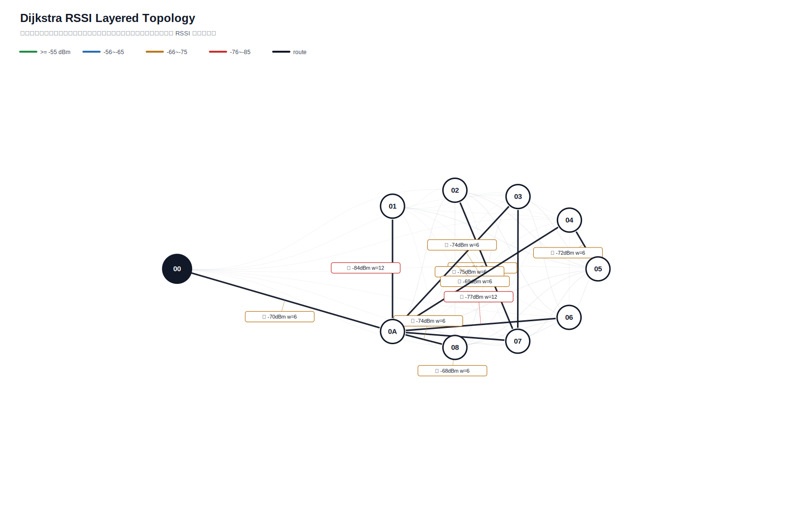

# Dijkstra 真实硬件测试汇总报告

- 生成时间：2026-06-02T00:34:52
- 日志目录：`/home/sueiny/rk3506_linux6.1_v1.2.0/app/广播组网上位机/app/logs/dijkstra_hw/第29次测试`
- 测试对象：网关 `00`，目标节点 `01, 02, 03, 04, 05, 06, 07, 08, 09, 0A`
- 地址说明：CLI 按十六进制地址解析，因此目标 `10` 表示地址 `0x10`。
- 丢包率目标：`<10%`，平均点到点延时目标：`<220ms`，ACK timeout：`2.0s`，是否达标：`否`
- 算法模式：`baseline_dijkstra`
- 最优参数组合：`interval=1.0s, rssi_requests=3, route_mode=baseline_dijkstra`
- 发包间隔：`1.0s`
- 计划轮次：`180`，实际SEND：`144`，成功：`129`，ACK timeout：`15`，路由不可达：`36`，实际丢包率：`10.42%`
- 总体成功 ACK 延时：平均 `135.4ms`，最小 `0.0ms`，最大 `1506.7ms`，P95 `503.7ms`

## 拓扑图

文本拓扑文件：[`拓扑图.txt`](拓扑图.txt)

Excel 汇总文件：[`测试指标汇总.xlsx`](测试指标汇总.xlsx)

## 测试结果

| 出发点 | 目标点 | 路径 | 成功/实际SEND | ACK timeout | 路由不可达 | 丢包率 | 点到点平均 | P95 | 网关到源 | 网关到目标 | 总延时 | 重采 | 最弱 RSSI |
|---|---|---|---:|---:|---:|---:|---:|---:|---:|---:|---:|---:|---:|
| `01` | `02` | `00 -> 04 -> 01 -> 02` | `2/2` | `0` | `0` | `0.00%` | `0.0ms` | `0.0ms` | `201.5ms` | `100.9ms` | `0.0ms` | `0` | `-82` |
| `01` | `03` | `00 -> 04 -> 01 -> 03` | `2/2` | `0` | `0` | `0.00%` | `250.8ms` | `401.3ms` | `301.9ms` | `402.2ms` | `100.3ms` | `0` | `-82` |
| `01` | `04` | `00 -> 04` | `2/2` | `0` | `0` | `0.00%` | `2.9ms` | `5.8ms` | `502.1ms` | `100.8ms` | `0.0ms` | `0` | `-67` |
| `01` | `05` | `00 -> 04 -> 01 -> 05` | `2/2` | `0` | `0` | `0.00%` | `0.0ms` | `0.0ms` | `1006.8ms` | `101.4ms` | `0.0ms` | `0` | `-82` |
| `01` | `06` | `00 -> 04 -> 01 -> 05 -> 06` | `2/2` | `0` | `0` | `0.00%` | `905.5ms` | `1408.7ms` | `100.8ms` | `503.0ms` | `402.3ms` | `0` | `-82` |
| `01` | `07` | `00 -> 04 -> 01 -> 02 -> 07` | `2/2` | `0` | `0` | `0.00%` | `150.7ms` | `200.7ms` | `100.7ms` | `301.4ms` | `200.7ms` | `0` | `-82` |
| `01` | `08` | `00 -> 04 -> 01 -> 08` | `2/2` | `0` | `0` | `0.00%` | `150.8ms` | `301.6ms` | `100.8ms` | `402.4ms` | `301.6ms` | `0` | `-82` |
| `01` | `09` | `` | `0/0` | `0` | `2` | `n/a` | `n/a` | `n/a` | `n/a` | `n/a` | `n/a` | `0` | `None` |
| `01` | `0A` | `00 -> 04 -> 01 -> 0A` | `2/2` | `0` | `0` | `0.00%` | `50.5ms` | `101.0ms` | `1404.8ms` | `100.7ms` | `0.0ms` | `0` | `-82` |
| `02` | `01` | `00 -> 02 -> 03 -> 0A -> 01` | `1/2` | `1` | `0` | `50.00%` | `0.0ms` | `0.0ms` | `603.7ms` | `100.7ms` | `0.0ms` | `0` | `-84` |
| `02` | `03` | `00 -> 02 -> 07 -> 03` | `1/2` | `1` | `0` | `50.00%` | `0.0ms` | `0.0ms` | `1911.7ms` | `101.0ms` | `0.0ms` | `0` | `-83` |
| `02` | `04` | `00 -> 02 -> 03 -> 0A -> 04` | `2/2` | `0` | `0` | `0.00%` | `0.0ms` | `0.0ms` | `101.0ms` | `100.8ms` | `0.0ms` | `0` | `-83` |
| `02` | `05` | `00 -> 02 -> 05` | `1/2` | `1` | `0` | `50.00%` | `0.0ms` | `0.0ms` | `n/a` | `n/a` | `n/a` | `0` | `-83` |
| `02` | `06` | `00 -> 02 -> 05 -> 06` | `1/2` | `1` | `0` | `50.00%` | `0.0ms` | `0.0ms` | `1905.9ms` | `303.6ms` | `0.0ms` | `0` | `-83` |
| `02` | `07` | `00 -> 02 -> 07` | `2/2` | `0` | `0` | `0.00%` | `51.3ms` | `99.9ms` | `302.3ms` | `402.2ms` | `99.9ms` | `0` | `-83` |
| `02` | `08` | `00 -> 02 -> 06 -> 08` | `2/2` | `0` | `0` | `0.00%` | `0.0ms` | `0.0ms` | `401.7ms` | `100.7ms` | `0.0ms` | `0` | `-83` |
| `02` | `09` | `` | `0/0` | `0` | `2` | `n/a` | `n/a` | `n/a` | `n/a` | `n/a` | `n/a` | `0` | `None` |
| `02` | `0A` | `00 -> 02 -> 03 -> 0A` | `2/2` | `0` | `0` | `0.00%` | `0.0ms` | `0.0ms` | `804.1ms` | `101.0ms` | `0.0ms` | `0` | `-83` |
| `03` | `01` | `00 -> 03 -> 0A -> 04 -> 01` | `0/2` | `2` | `0` | `100.00%` | `n/a` | `n/a` | `n/a` | `n/a` | `n/a` | `0` | `-82` |
| `03` | `02` | `00 -> 03 -> 0A -> 05 -> 02` | `2/2` | `0` | `0` | `0.00%` | `551.9ms` | `802.3ms` | `100.9ms` | `402.4ms` | `301.5ms` | `0` | `-73` |
| `03` | `04` | `00 -> 03 -> 07 -> 0A -> 04` | `2/2` | `0` | `0` | `0.00%` | `149.9ms` | `299.9ms` | `402.8ms` | `401.8ms` | `0.0ms` | `0` | `-78` |
| `03` | `05` | `00 -> 03 -> 05` | `2/2` | `0` | `0` | `0.00%` | `853.1ms` | `1506.7ms` | `403.1ms` | `602.6ms` | `199.5ms` | `0` | `-76` |
| `03` | `06` | `00 -> 03 -> 07 -> 02 -> 06` | `1/2` | `1` | `0` | `50.00%` | `0.0ms` | `0.0ms` | `1103.5ms` | `303.3ms` | `0.0ms` | `0` | `-75` |
| `03` | `07` | `00 -> 03 -> 07` | `2/2` | `0` | `0` | `0.00%` | `451.3ms` | `902.7ms` | `502.7ms` | `1405.4ms` | `902.7ms` | `0` | `-70` |
| `03` | `08` | `00 -> 03 -> 0A -> 08` | `2/2` | `0` | `0` | `0.00%` | `200.6ms` | `401.2ms` | `101.2ms` | `502.4ms` | `401.2ms` | `0` | `-74` |
| `03` | `09` | `` | `0/0` | `0` | `2` | `n/a` | `n/a` | `n/a` | `n/a` | `n/a` | `n/a` | `0` | `None` |
| `03` | `0A` | `00 -> 03 -> 07 -> 0A` | `1/2` | `1` | `0` | `50.00%` | `402.0ms` | `402.0ms` | `101.2ms` | `503.1ms` | `402.0ms` | `0` | `-78` |
| `04` | `01` | `00 -> 04 -> 01` | `2/2` | `0` | `0` | `0.00%` | `0.0ms` | `0.0ms` | `502.6ms` | `100.8ms` | `0.0ms` | `0` | `-82` |
| `04` | `02` | `00 -> 04 -> 05 -> 02` | `2/2` | `0` | `0` | `0.00%` | `0.0ms` | `0.0ms` | `402.1ms` | `101.2ms` | `0.0ms` | `0` | `-72` |
| `04` | `03` | `00 -> 04 -> 03` | `2/2` | `0` | `0` | `0.00%` | `0.0ms` | `0.0ms` | `301.2ms` | `100.7ms` | `0.0ms` | `0` | `-67` |
| `04` | `05` | `00 -> 04 -> 0A -> 05` | `2/2` | `0` | `0` | `0.00%` | `200.6ms` | `300.8ms` | `301.4ms` | `401.7ms` | `100.4ms` | `0` | `-73` |
| `04` | `06` | `00 -> 04 -> 05 -> 06` | `2/2` | `0` | `0` | `0.00%` | `0.0ms` | `0.0ms` | `1003.5ms` | `100.8ms` | `0.0ms` | `0` | `-72` |
| `04` | `07` | `00 -> 04 -> 03 -> 07` | `2/2` | `0` | `0` | `0.00%` | `150.3ms` | `200.5ms` | `502.2ms` | `602.3ms` | `100.1ms` | `0` | `-70` |
| `04` | `08` | `00 -> 04 -> 08` | `2/2` | `0` | `0` | `0.00%` | `200.2ms` | `400.4ms` | `401.6ms` | `201.9ms` | `0.0ms` | `0` | `-79` |
| `04` | `09` | `` | `0/0` | `0` | `2` | `n/a` | `n/a` | `n/a` | `n/a` | `n/a` | `n/a` | `0` | `None` |
| `04` | `0A` | `00 -> 04 -> 0A` | `2/2` | `0` | `0` | `0.00%` | `0.0ms` | `0.0ms` | `1405.7ms` | `101.2ms` | `0.0ms` | `0` | `-67` |
| `05` | `01` | `00 -> 05 -> 01` | `2/2` | `0` | `0` | `0.00%` | `0.0ms` | `0.0ms` | `1505.8ms` | `100.9ms` | `0.0ms` | `0` | `-85` |
| `05` | `02` | `00 -> 05 -> 02` | `2/2` | `0` | `0` | `0.00%` | `0.3ms` | `0.7ms` | `602.1ms` | `100.8ms` | `0.0ms` | `0` | `-75` |
| `05` | `03` | `00 -> 05 -> 03` | `2/2` | `0` | `0` | `0.00%` | `0.0ms` | `0.0ms` | `201.3ms` | `102.7ms` | `0.0ms` | `0` | `-75` |
| `05` | `04` | `00 -> 05 -> 03 -> 0A -> 04` | `2/2` | `0` | `0` | `0.00%` | `150.4ms` | `300.8ms` | `1205.7ms` | `100.7ms` | `0.0ms` | `0` | `-75` |
| `05` | `06` | `00 -> 05 -> 02 -> 06` | `1/2` | `1` | `0` | `50.00%` | `1405.3ms` | `1405.3ms` | `100.7ms` | `1506.0ms` | `1405.3ms` | `0` | `-75` |
| `05` | `07` | `00 -> 05 -> 07` | `1/2` | `1` | `0` | `50.00%` | `0.0ms` | `0.0ms` | `403.0ms` | `201.4ms` | `0.0ms` | `0` | `-82` |
| `05` | `08` | `00 -> 05 -> 06 -> 08` | `2/2` | `0` | `0` | `0.00%` | `0.0ms` | `0.0ms` | `301.8ms` | `101.2ms` | `0.0ms` | `0` | `-75` |
| `05` | `09` | `` | `0/0` | `0` | `2` | `n/a` | `n/a` | `n/a` | `n/a` | `n/a` | `n/a` | `0` | `None` |
| `05` | `0A` | `00 -> 05 -> 0A` | `2/2` | `0` | `0` | `0.00%` | `250.9ms` | `301.6ms` | `100.8ms` | `402.3ms` | `301.6ms` | `0` | `-79` |
| `06` | `01` | `00 -> 06 -> 05 -> 01` | `2/2` | `0` | `0` | `0.00%` | `0.0ms` | `0.0ms` | `201.3ms` | `201.3ms` | `0.0ms` | `0` | `-85` |
| `06` | `02` | `00 -> 06 -> 02` | `2/2` | `0` | `0` | `0.00%` | `0.0ms` | `0.1ms` | `402.1ms` | `402.2ms` | `0.1ms` | `0` | `-78` |
| `06` | `03` | `00 -> 06 -> 03` | `2/2` | `0` | `0` | `0.00%` | `0.0ms` | `0.0ms` | `502.1ms` | `301.1ms` | `0.0ms` | `0` | `-78` |
| `06` | `04` | `00 -> 06 -> 0A -> 04` | `2/2` | `0` | `0` | `0.00%` | `0.0ms` | `0.0ms` | `301.3ms` | `201.0ms` | `0.0ms` | `0` | `-78` |
| `06` | `05` | `00 -> 06 -> 02 -> 05` | `1/2` | `1` | `0` | `50.00%` | `0.0ms` | `0.0ms` | `502.3ms` | `100.6ms` | `0.0ms` | `0` | `-78` |
| `06` | `07` | `00 -> 06 -> 02 -> 07` | `2/2` | `0` | `0` | `0.00%` | `50.2ms` | `100.3ms` | `301.3ms` | `201.3ms` | `0.0ms` | `0` | `-78` |
| `06` | `08` | `00 -> 06 -> 08` | `2/2` | `0` | `0` | `0.00%` | `0.0ms` | `0.0ms` | `303.9ms` | `101.3ms` | `0.0ms` | `0` | `-78` |
| `06` | `09` | `` | `0/0` | `0` | `2` | `n/a` | `n/a` | `n/a` | `n/a` | `n/a` | `n/a` | `0` | `None` |
| `06` | `0A` | `00 -> 06 -> 0A` | `2/2` | `0` | `0` | `0.00%` | `0.0ms` | `0.0ms` | `302.3ms` | `101.2ms` | `0.0ms` | `0` | `-78` |
| `07` | `01` | `00 -> 07 -> 03 -> 0A -> 01` | `2/2` | `0` | `0` | `0.00%` | `0.0ms` | `0.0ms` | `100.9ms` | `100.9ms` | `0.0ms` | `0` | `-84` |
| `07` | `02` | `00 -> 07 -> 02` | `2/2` | `0` | `0` | `0.00%` | `50.7ms` | `100.3ms` | `401.8ms` | `402.8ms` | `1.1ms` | `0` | `-77` |
| `07` | `03` | `00 -> 07 -> 03` | `2/2` | `0` | `0` | `0.00%` | `0.0ms` | `0.0ms` | `402.1ms` | `101.1ms` | `0.0ms` | `0` | `-77` |
| `07` | `04` | `00 -> 07 -> 03 -> 0A -> 04` | `2/2` | `0` | `0` | `0.00%` | `50.2ms` | `100.3ms` | `405.8ms` | `201.6ms` | `0.0ms` | `0` | `-77` |
| `07` | `05` | `00 -> 07 -> 02 -> 05` | `2/2` | `0` | `0` | `0.00%` | `49.2ms` | `98.3ms` | `304.4ms` | `101.4ms` | `0.0ms` | `0` | `-77` |
| `07` | `06` | `00 -> 07 -> 02 -> 06` | `2/2` | `0` | `0` | `0.00%` | `50.0ms` | `99.9ms` | `302.5ms` | `402.5ms` | `99.9ms` | `0` | `-77` |
| `07` | `08` | `00 -> 07 -> 08` | `2/2` | `0` | `0` | `0.00%` | `100.6ms` | `201.2ms` | `201.3ms` | `402.5ms` | `201.2ms` | `0` | `-80` |
| `07` | `09` | `` | `0/0` | `0` | `2` | `n/a` | `n/a` | `n/a` | `n/a` | `n/a` | `n/a` | `0` | `None` |
| `07` | `0A` | `00 -> 07 -> 03 -> 0A` | `2/2` | `0` | `0` | `0.00%` | `0.4ms` | `0.7ms` | `402.6ms` | `101.1ms` | `0.0ms` | `0` | `-77` |
| `08` | `01` | `00 -> 08 -> 0A -> 04 -> 01` | `2/2` | `0` | `0` | `0.00%` | `501.5ms` | `1003.0ms` | `2006.3ms` | `201.0ms` | `0.0ms` | `0` | `-82` |
| `08` | `02` | `00 -> 08 -> 0A -> 05 -> 02` | `2/2` | `0` | `0` | `0.00%` | `251.9ms` | `503.7ms` | `403.6ms` | `101.3ms` | `0.0ms` | `0` | `-79` |
| `08` | `03` | `00 -> 08 -> 03` | `1/2` | `1` | `0` | `50.00%` | `502.1ms` | `502.1ms` | `n/a` | `n/a` | `n/a` | `0` | `-79` |
| `08` | `04` | `00 -> 08 -> 0A -> 04` | `1/2` | `1` | `0` | `50.00%` | `0.6ms` | `0.6ms` | `n/a` | `n/a` | `n/a` | `0` | `-79` |
| `08` | `05` | `00 -> 08 -> 0A -> 05` | `2/2` | `0` | `0` | `0.00%` | `100.4ms` | `200.9ms` | `301.8ms` | `301.4ms` | `0.0ms` | `0` | `-79` |
| `08` | `06` | `00 -> 08 -> 0A -> 05 -> 06` | `1/2` | `1` | `0` | `50.00%` | `0.0ms` | `0.0ms` | `303.7ms` | `201.4ms` | `0.0ms` | `0` | `-79` |
| `08` | `07` | `00 -> 08 -> 07` | `2/2` | `0` | `0` | `0.00%` | `150.3ms` | `300.5ms` | `704.1ms` | `103.8ms` | `0.0ms` | `0` | `-79` |
| `08` | `09` | `` | `0/0` | `0` | `2` | `n/a` | `n/a` | `n/a` | `n/a` | `n/a` | `n/a` | `0` | `None` |
| `08` | `0A` | `00 -> 08 -> 03 -> 0A` | `1/2` | `1` | `0` | `50.00%` | `501.6ms` | `501.6ms` | `100.7ms` | `602.3ms` | `501.6ms` | `0` | `-79` |
| `09` | `01` | `` | `0/0` | `0` | `2` | `n/a` | `n/a` | `n/a` | `n/a` | `n/a` | `n/a` | `0` | `None` |
| `09` | `02` | `` | `0/0` | `0` | `2` | `n/a` | `n/a` | `n/a` | `n/a` | `n/a` | `n/a` | `0` | `None` |
| `09` | `03` | `` | `0/0` | `0` | `2` | `n/a` | `n/a` | `n/a` | `n/a` | `n/a` | `n/a` | `0` | `None` |
| `09` | `04` | `` | `0/0` | `0` | `2` | `n/a` | `n/a` | `n/a` | `n/a` | `n/a` | `n/a` | `0` | `None` |
| `09` | `05` | `` | `0/0` | `0` | `2` | `n/a` | `n/a` | `n/a` | `n/a` | `n/a` | `n/a` | `0` | `None` |
| `09` | `06` | `` | `0/0` | `0` | `2` | `n/a` | `n/a` | `n/a` | `n/a` | `n/a` | `n/a` | `0` | `None` |
| `09` | `07` | `` | `0/0` | `0` | `2` | `n/a` | `n/a` | `n/a` | `n/a` | `n/a` | `n/a` | `0` | `None` |
| `09` | `08` | `` | `0/0` | `0` | `2` | `n/a` | `n/a` | `n/a` | `n/a` | `n/a` | `n/a` | `0` | `None` |
| `09` | `0A` | `` | `0/0` | `0` | `2` | `n/a` | `n/a` | `n/a` | `n/a` | `n/a` | `n/a` | `0` | `None` |
| `0A` | `01` | `00 -> 0A -> 01` | `2/2` | `0` | `0` | `0.00%` | `0.0ms` | `0.0ms` | `304.0ms` | `101.2ms` | `0.0ms` | `0` | `-84` |
| `0A` | `02` | `00 -> 0A -> 07 -> 02` | `2/2` | `0` | `0` | `0.00%` | `353.0ms` | `404.1ms` | `100.8ms` | `402.8ms` | `302.0ms` | `0` | `-75` |
| `0A` | `03` | `00 -> 0A -> 03` | `2/2` | `0` | `0` | `0.00%` | `48.0ms` | `96.0ms` | `302.1ms` | `302.0ms` | `0.0ms` | `0` | `-70` |
| `0A` | `04` | `00 -> 0A -> 04` | `2/2` | `0` | `0` | `0.00%` | `150.5ms` | `300.9ms` | `101.2ms` | `402.1ms` | `300.9ms` | `0` | `-74` |
| `0A` | `05` | `00 -> 0A -> 04 -> 05` | `2/2` | `0` | `0` | `0.00%` | `150.5ms` | `301.0ms` | `401.2ms` | `201.2ms` | `0.0ms` | `0` | `-74` |
| `0A` | `06` | `00 -> 0A -> 06` | `2/2` | `0` | `0` | `0.00%` | `250.6ms` | `401.1ms` | `201.5ms` | `301.7ms` | `100.2ms` | `0` | `-77` |
| `0A` | `07` | `00 -> 0A -> 03 -> 07` | `2/2` | `0` | `0` | `0.00%` | `250.7ms` | `300.3ms` | `401.4ms` | `602.4ms` | `201.0ms` | `0` | `-70` |
| `0A` | `08` | `00 -> 0A -> 08` | `2/2` | `0` | `0` | `0.00%` | `48.8ms` | `97.5ms` | `203.9ms` | `301.3ms` | `97.5ms` | `0` | `-74` |
| `0A` | `09` | `` | `0/0` | `0` | `2` | `n/a` | `n/a` | `n/a` | `n/a` | `n/a` | `n/a` | `0` | `None` |

## 指标总结对比

| 指标 | 当前值 | 单位 | 说明 |
|---|---:|---|---|
| 算法计算延时 | `0.6ms` | ms | 网关/上位机算出 Dijkstra 路由路径的耗时 |
| 指令下发延时 | `135.4ms` | ms | 当前硬件无中间节点时间戳，第一版用 SEND 到 ACK 总延时近似记录 |
| 端到端实际传输平均延时 | `135.4ms` | ms | 现有统计总 ACK 时延 |
| 全局平均丢包率 | `10.42%` | ratio | 总 timeout / 总发送 |
| 单路径平均跳数 | `1.9` | hops | 各目标最终路径跳数平均值 |
| 平均单跳传输耗时 | `60.6ms` | ms/hop | 端到端平均延时 / 跳数折算 |
| RSSI 实时波动范围 | `25` | dB | 当前拓扑边 RSSI 最大值减最小值 |
| RSSI 标准差 | `5.4544` | dB | 当前拓扑边 RSSI 标准差 |
| 时延抖动均值 | `215.6ms` | ms | 相邻成功 ACK 延时差值均值 |
| 时延标准差 | `273.3ms` | ms | 成功 ACK 延时标准差 |

## 完整指标汇总

| 出发点 | 目标点 | 路径 | 算法计算延时 | 指令下发延时 | 端到端实际传输平均延时 | 节点丢包率 | 全局平均丢包率 | 路由跳数 | 单路径平均跳数 | 平均单跳传输耗时 | RSSI 实时波动 | 时延抖动变化 |
|---|---|---|---:|---:|---:|---:|---:|---:|---:|---:|---|---|
| `01` | `02` | `00 -> 04 -> 01 -> 02` | `0.6ms` | `0.0ms` | `0.0ms` | `0.00%` | `10.42%` | `3` | `1.9` | `0.0ms` | `min -85 / max -60 / range 25dB / std 5.4544` | `节点 221.2ms / 全局 215.6ms` |
| `01` | `03` | `00 -> 04 -> 01 -> 03` | `0.6ms` | `250.8ms` | `250.8ms` | `0.00%` | `10.42%` | `3` | `1.9` | `83.6ms` | `min -85 / max -60 / range 25dB / std 5.4544` | `节点 108.1ms / 全局 215.6ms` |
| `01` | `04` | `00 -> 04` | `0.6ms` | `2.9ms` | `2.9ms` | `0.00%` | `10.42%` | `1` | `1.9` | `2.9ms` | `min -85 / max -60 / range 25dB / std 5.4544` | `节点 122.1ms / 全局 215.6ms` |
| `01` | `05` | `00 -> 04 -> 01 -> 05` | `0.6ms` | `0.0ms` | `0.0ms` | `0.00%` | `10.42%` | `3` | `1.9` | `0.0ms` | `min -85 / max -60 / range 25dB / std 5.4544` | `节点 339.7ms / 全局 215.6ms` |
| `01` | `06` | `00 -> 04 -> 01 -> 05 -> 06` | `0.6ms` | `905.5ms` | `905.5ms` | `0.00%` | `10.42%` | `4` | `1.9` | `226.4ms` | `min -85 / max -60 / range 25dB / std 5.4544` | `节点 465.6ms / 全局 215.6ms` |
| `01` | `07` | `00 -> 04 -> 01 -> 02 -> 07` | `0.6ms` | `150.7ms` | `150.7ms` | `0.00%` | `10.42%` | `4` | `1.9` | `37.7ms` | `min -85 / max -60 / range 25dB / std 5.4544` | `节点 250.1ms / 全局 215.6ms` |
| `01` | `08` | `00 -> 04 -> 01 -> 08` | `0.6ms` | `150.8ms` | `150.8ms` | `0.00%` | `10.42%` | `3` | `1.9` | `50.3ms` | `min -85 / max -60 / range 25dB / std 5.4544` | `节点 127.0ms / 全局 215.6ms` |
| `01` | `09` | `` | `0.6ms` | `n/a` | `n/a` | `n/a` | `10.42%` | `0` | `1.9` | `n/a` | `min -85 / max -60 / range 25dB / std 5.4544` | `节点 n/a / 全局 215.6ms` |
| `01` | `0A` | `00 -> 04 -> 01 -> 0A` | `0.6ms` | `50.5ms` | `50.5ms` | `0.00%` | `10.42%` | `3` | `1.9` | `16.8ms` | `min -85 / max -60 / range 25dB / std 5.4544` | `节点 154.7ms / 全局 215.6ms` |
| `02` | `01` | `00 -> 02 -> 03 -> 0A -> 01` | `0.6ms` | `0.0ms` | `0.0ms` | `50.00%` | `10.42%` | `4` | `1.9` | `0.0ms` | `min -85 / max -60 / range 25dB / std 5.4544` | `节点 167.2ms / 全局 215.6ms` |
| `02` | `03` | `00 -> 02 -> 07 -> 03` | `0.6ms` | `0.0ms` | `0.0ms` | `50.00%` | `10.42%` | `3` | `1.9` | `0.0ms` | `min -85 / max -60 / range 25dB / std 5.4544` | `节点 108.1ms / 全局 215.6ms` |
| `02` | `04` | `00 -> 02 -> 03 -> 0A -> 04` | `0.6ms` | `0.0ms` | `0.0ms` | `0.00%` | `10.42%` | `4` | `1.9` | `0.0ms` | `min -85 / max -60 / range 25dB / std 5.4544` | `节点 122.1ms / 全局 215.6ms` |
| `02` | `05` | `00 -> 02 -> 05` | `0.6ms` | `0.0ms` | `0.0ms` | `50.00%` | `10.42%` | `2` | `1.9` | `0.0ms` | `min -85 / max -60 / range 25dB / std 5.4544` | `节点 339.7ms / 全局 215.6ms` |
| `02` | `06` | `00 -> 02 -> 05 -> 06` | `0.6ms` | `0.0ms` | `0.0ms` | `50.00%` | `10.42%` | `3` | `1.9` | `0.0ms` | `min -85 / max -60 / range 25dB / std 5.4544` | `节点 465.6ms / 全局 215.6ms` |
| `02` | `07` | `00 -> 02 -> 07` | `0.6ms` | `51.3ms` | `51.3ms` | `0.00%` | `10.42%` | `2` | `1.9` | `25.6ms` | `min -85 / max -60 / range 25dB / std 5.4544` | `节点 250.1ms / 全局 215.6ms` |
| `02` | `08` | `00 -> 02 -> 06 -> 08` | `0.6ms` | `0.0ms` | `0.0ms` | `0.00%` | `10.42%` | `3` | `1.9` | `0.0ms` | `min -85 / max -60 / range 25dB / std 5.4544` | `节点 127.0ms / 全局 215.6ms` |
| `02` | `09` | `` | `0.6ms` | `n/a` | `n/a` | `n/a` | `10.42%` | `0` | `1.9` | `n/a` | `min -85 / max -60 / range 25dB / std 5.4544` | `节点 n/a / 全局 215.6ms` |
| `02` | `0A` | `00 -> 02 -> 03 -> 0A` | `0.6ms` | `0.0ms` | `0.0ms` | `0.00%` | `10.42%` | `3` | `1.9` | `0.0ms` | `min -85 / max -60 / range 25dB / std 5.4544` | `节点 154.7ms / 全局 215.6ms` |
| `03` | `01` | `00 -> 03 -> 0A -> 04 -> 01` | `0.6ms` | `n/a` | `n/a` | `100.00%` | `10.42%` | `4` | `1.9` | `n/a` | `min -85 / max -60 / range 25dB / std 5.4544` | `节点 167.2ms / 全局 215.6ms` |
| `03` | `02` | `00 -> 03 -> 0A -> 05 -> 02` | `0.6ms` | `551.9ms` | `551.9ms` | `0.00%` | `10.42%` | `4` | `1.9` | `138.0ms` | `min -85 / max -60 / range 25dB / std 5.4544` | `节点 221.2ms / 全局 215.6ms` |
| `03` | `04` | `00 -> 03 -> 07 -> 0A -> 04` | `0.6ms` | `149.9ms` | `149.9ms` | `0.00%` | `10.42%` | `4` | `1.9` | `37.5ms` | `min -85 / max -60 / range 25dB / std 5.4544` | `节点 122.1ms / 全局 215.6ms` |
| `03` | `05` | `00 -> 03 -> 05` | `0.6ms` | `853.1ms` | `853.1ms` | `0.00%` | `10.42%` | `2` | `1.9` | `426.6ms` | `min -85 / max -60 / range 25dB / std 5.4544` | `节点 339.7ms / 全局 215.6ms` |
| `03` | `06` | `00 -> 03 -> 07 -> 02 -> 06` | `0.6ms` | `0.0ms` | `0.0ms` | `50.00%` | `10.42%` | `4` | `1.9` | `0.0ms` | `min -85 / max -60 / range 25dB / std 5.4544` | `节点 465.6ms / 全局 215.6ms` |
| `03` | `07` | `00 -> 03 -> 07` | `0.6ms` | `451.3ms` | `451.3ms` | `0.00%` | `10.42%` | `2` | `1.9` | `225.7ms` | `min -85 / max -60 / range 25dB / std 5.4544` | `节点 250.1ms / 全局 215.6ms` |
| `03` | `08` | `00 -> 03 -> 0A -> 08` | `0.6ms` | `200.6ms` | `200.6ms` | `0.00%` | `10.42%` | `3` | `1.9` | `66.9ms` | `min -85 / max -60 / range 25dB / std 5.4544` | `节点 127.0ms / 全局 215.6ms` |
| `03` | `09` | `` | `0.6ms` | `n/a` | `n/a` | `n/a` | `10.42%` | `0` | `1.9` | `n/a` | `min -85 / max -60 / range 25dB / std 5.4544` | `节点 n/a / 全局 215.6ms` |
| `03` | `0A` | `00 -> 03 -> 07 -> 0A` | `0.6ms` | `402.0ms` | `402.0ms` | `50.00%` | `10.42%` | `3` | `1.9` | `134.0ms` | `min -85 / max -60 / range 25dB / std 5.4544` | `节点 154.7ms / 全局 215.6ms` |
| `04` | `01` | `00 -> 04 -> 01` | `0.6ms` | `0.0ms` | `0.0ms` | `0.00%` | `10.42%` | `2` | `1.9` | `0.0ms` | `min -85 / max -60 / range 25dB / std 5.4544` | `节点 167.2ms / 全局 215.6ms` |
| `04` | `02` | `00 -> 04 -> 05 -> 02` | `0.6ms` | `0.0ms` | `0.0ms` | `0.00%` | `10.42%` | `3` | `1.9` | `0.0ms` | `min -85 / max -60 / range 25dB / std 5.4544` | `节点 221.2ms / 全局 215.6ms` |
| `04` | `03` | `00 -> 04 -> 03` | `0.6ms` | `0.0ms` | `0.0ms` | `0.00%` | `10.42%` | `2` | `1.9` | `0.0ms` | `min -85 / max -60 / range 25dB / std 5.4544` | `节点 108.1ms / 全局 215.6ms` |
| `04` | `05` | `00 -> 04 -> 0A -> 05` | `0.6ms` | `200.6ms` | `200.6ms` | `0.00%` | `10.42%` | `3` | `1.9` | `66.9ms` | `min -85 / max -60 / range 25dB / std 5.4544` | `节点 339.7ms / 全局 215.6ms` |
| `04` | `06` | `00 -> 04 -> 05 -> 06` | `0.6ms` | `0.0ms` | `0.0ms` | `0.00%` | `10.42%` | `3` | `1.9` | `0.0ms` | `min -85 / max -60 / range 25dB / std 5.4544` | `节点 465.6ms / 全局 215.6ms` |
| `04` | `07` | `00 -> 04 -> 03 -> 07` | `0.6ms` | `150.3ms` | `150.3ms` | `0.00%` | `10.42%` | `3` | `1.9` | `50.1ms` | `min -85 / max -60 / range 25dB / std 5.4544` | `节点 250.1ms / 全局 215.6ms` |
| `04` | `08` | `00 -> 04 -> 08` | `0.6ms` | `200.2ms` | `200.2ms` | `0.00%` | `10.42%` | `2` | `1.9` | `100.1ms` | `min -85 / max -60 / range 25dB / std 5.4544` | `节点 127.0ms / 全局 215.6ms` |
| `04` | `09` | `` | `0.6ms` | `n/a` | `n/a` | `n/a` | `10.42%` | `0` | `1.9` | `n/a` | `min -85 / max -60 / range 25dB / std 5.4544` | `节点 n/a / 全局 215.6ms` |
| `04` | `0A` | `00 -> 04 -> 0A` | `0.6ms` | `0.0ms` | `0.0ms` | `0.00%` | `10.42%` | `2` | `1.9` | `0.0ms` | `min -85 / max -60 / range 25dB / std 5.4544` | `节点 154.7ms / 全局 215.6ms` |
| `05` | `01` | `00 -> 05 -> 01` | `0.6ms` | `0.0ms` | `0.0ms` | `0.00%` | `10.42%` | `2` | `1.9` | `0.0ms` | `min -85 / max -60 / range 25dB / std 5.4544` | `节点 167.2ms / 全局 215.6ms` |
| `05` | `02` | `00 -> 05 -> 02` | `0.6ms` | `0.3ms` | `0.3ms` | `0.00%` | `10.42%` | `2` | `1.9` | `0.2ms` | `min -85 / max -60 / range 25dB / std 5.4544` | `节点 221.2ms / 全局 215.6ms` |
| `05` | `03` | `00 -> 05 -> 03` | `0.6ms` | `0.0ms` | `0.0ms` | `0.00%` | `10.42%` | `2` | `1.9` | `0.0ms` | `min -85 / max -60 / range 25dB / std 5.4544` | `节点 108.1ms / 全局 215.6ms` |
| `05` | `04` | `00 -> 05 -> 03 -> 0A -> 04` | `0.6ms` | `150.4ms` | `150.4ms` | `0.00%` | `10.42%` | `4` | `1.9` | `37.6ms` | `min -85 / max -60 / range 25dB / std 5.4544` | `节点 122.1ms / 全局 215.6ms` |
| `05` | `06` | `00 -> 05 -> 02 -> 06` | `0.6ms` | `1405.3ms` | `1405.3ms` | `50.00%` | `10.42%` | `3` | `1.9` | `468.4ms` | `min -85 / max -60 / range 25dB / std 5.4544` | `节点 465.6ms / 全局 215.6ms` |
| `05` | `07` | `00 -> 05 -> 07` | `0.6ms` | `0.0ms` | `0.0ms` | `50.00%` | `10.42%` | `2` | `1.9` | `0.0ms` | `min -85 / max -60 / range 25dB / std 5.4544` | `节点 250.1ms / 全局 215.6ms` |
| `05` | `08` | `00 -> 05 -> 06 -> 08` | `0.6ms` | `0.0ms` | `0.0ms` | `0.00%` | `10.42%` | `3` | `1.9` | `0.0ms` | `min -85 / max -60 / range 25dB / std 5.4544` | `节点 127.0ms / 全局 215.6ms` |
| `05` | `09` | `` | `0.6ms` | `n/a` | `n/a` | `n/a` | `10.42%` | `0` | `1.9` | `n/a` | `min -85 / max -60 / range 25dB / std 5.4544` | `节点 n/a / 全局 215.6ms` |
| `05` | `0A` | `00 -> 05 -> 0A` | `0.6ms` | `250.9ms` | `250.9ms` | `0.00%` | `10.42%` | `2` | `1.9` | `125.4ms` | `min -85 / max -60 / range 25dB / std 5.4544` | `节点 154.7ms / 全局 215.6ms` |
| `06` | `01` | `00 -> 06 -> 05 -> 01` | `0.6ms` | `0.0ms` | `0.0ms` | `0.00%` | `10.42%` | `3` | `1.9` | `0.0ms` | `min -85 / max -60 / range 25dB / std 5.4544` | `节点 167.2ms / 全局 215.6ms` |
| `06` | `02` | `00 -> 06 -> 02` | `0.6ms` | `0.0ms` | `0.0ms` | `0.00%` | `10.42%` | `2` | `1.9` | `0.0ms` | `min -85 / max -60 / range 25dB / std 5.4544` | `节点 221.2ms / 全局 215.6ms` |
| `06` | `03` | `00 -> 06 -> 03` | `0.6ms` | `0.0ms` | `0.0ms` | `0.00%` | `10.42%` | `2` | `1.9` | `0.0ms` | `min -85 / max -60 / range 25dB / std 5.4544` | `节点 108.1ms / 全局 215.6ms` |
| `06` | `04` | `00 -> 06 -> 0A -> 04` | `0.6ms` | `0.0ms` | `0.0ms` | `0.00%` | `10.42%` | `3` | `1.9` | `0.0ms` | `min -85 / max -60 / range 25dB / std 5.4544` | `节点 122.1ms / 全局 215.6ms` |
| `06` | `05` | `00 -> 06 -> 02 -> 05` | `0.6ms` | `0.0ms` | `0.0ms` | `50.00%` | `10.42%` | `3` | `1.9` | `0.0ms` | `min -85 / max -60 / range 25dB / std 5.4544` | `节点 339.7ms / 全局 215.6ms` |
| `06` | `07` | `00 -> 06 -> 02 -> 07` | `0.6ms` | `50.2ms` | `50.2ms` | `0.00%` | `10.42%` | `3` | `1.9` | `16.7ms` | `min -85 / max -60 / range 25dB / std 5.4544` | `节点 250.1ms / 全局 215.6ms` |
| `06` | `08` | `00 -> 06 -> 08` | `0.6ms` | `0.0ms` | `0.0ms` | `0.00%` | `10.42%` | `2` | `1.9` | `0.0ms` | `min -85 / max -60 / range 25dB / std 5.4544` | `节点 127.0ms / 全局 215.6ms` |
| `06` | `09` | `` | `0.6ms` | `n/a` | `n/a` | `n/a` | `10.42%` | `0` | `1.9` | `n/a` | `min -85 / max -60 / range 25dB / std 5.4544` | `节点 n/a / 全局 215.6ms` |
| `06` | `0A` | `00 -> 06 -> 0A` | `0.6ms` | `0.0ms` | `0.0ms` | `0.00%` | `10.42%` | `2` | `1.9` | `0.0ms` | `min -85 / max -60 / range 25dB / std 5.4544` | `节点 154.7ms / 全局 215.6ms` |
| `07` | `01` | `00 -> 07 -> 03 -> 0A -> 01` | `0.6ms` | `0.0ms` | `0.0ms` | `0.00%` | `10.42%` | `4` | `1.9` | `0.0ms` | `min -85 / max -60 / range 25dB / std 5.4544` | `节点 167.2ms / 全局 215.6ms` |
| `07` | `02` | `00 -> 07 -> 02` | `0.6ms` | `50.7ms` | `50.7ms` | `0.00%` | `10.42%` | `2` | `1.9` | `25.3ms` | `min -85 / max -60 / range 25dB / std 5.4544` | `节点 221.2ms / 全局 215.6ms` |
| `07` | `03` | `00 -> 07 -> 03` | `0.6ms` | `0.0ms` | `0.0ms` | `0.00%` | `10.42%` | `2` | `1.9` | `0.0ms` | `min -85 / max -60 / range 25dB / std 5.4544` | `节点 108.1ms / 全局 215.6ms` |
| `07` | `04` | `00 -> 07 -> 03 -> 0A -> 04` | `0.6ms` | `50.2ms` | `50.2ms` | `0.00%` | `10.42%` | `4` | `1.9` | `12.5ms` | `min -85 / max -60 / range 25dB / std 5.4544` | `节点 122.1ms / 全局 215.6ms` |
| `07` | `05` | `00 -> 07 -> 02 -> 05` | `0.6ms` | `49.2ms` | `49.2ms` | `0.00%` | `10.42%` | `3` | `1.9` | `16.4ms` | `min -85 / max -60 / range 25dB / std 5.4544` | `节点 339.7ms / 全局 215.6ms` |
| `07` | `06` | `00 -> 07 -> 02 -> 06` | `0.6ms` | `50.0ms` | `50.0ms` | `0.00%` | `10.42%` | `3` | `1.9` | `16.7ms` | `min -85 / max -60 / range 25dB / std 5.4544` | `节点 465.6ms / 全局 215.6ms` |
| `07` | `08` | `00 -> 07 -> 08` | `0.6ms` | `100.6ms` | `100.6ms` | `0.00%` | `10.42%` | `2` | `1.9` | `50.3ms` | `min -85 / max -60 / range 25dB / std 5.4544` | `节点 127.0ms / 全局 215.6ms` |
| `07` | `09` | `` | `0.6ms` | `n/a` | `n/a` | `n/a` | `10.42%` | `0` | `1.9` | `n/a` | `min -85 / max -60 / range 25dB / std 5.4544` | `节点 n/a / 全局 215.6ms` |
| `07` | `0A` | `00 -> 07 -> 03 -> 0A` | `0.6ms` | `0.4ms` | `0.4ms` | `0.00%` | `10.42%` | `3` | `1.9` | `0.1ms` | `min -85 / max -60 / range 25dB / std 5.4544` | `节点 154.7ms / 全局 215.6ms` |
| `08` | `01` | `00 -> 08 -> 0A -> 04 -> 01` | `0.6ms` | `501.5ms` | `501.5ms` | `0.00%` | `10.42%` | `4` | `1.9` | `125.4ms` | `min -85 / max -60 / range 25dB / std 5.4544` | `节点 167.2ms / 全局 215.6ms` |
| `08` | `02` | `00 -> 08 -> 0A -> 05 -> 02` | `0.6ms` | `251.9ms` | `251.9ms` | `0.00%` | `10.42%` | `4` | `1.9` | `63.0ms` | `min -85 / max -60 / range 25dB / std 5.4544` | `节点 221.2ms / 全局 215.6ms` |
| `08` | `03` | `00 -> 08 -> 03` | `0.6ms` | `502.1ms` | `502.1ms` | `50.00%` | `10.42%` | `2` | `1.9` | `251.0ms` | `min -85 / max -60 / range 25dB / std 5.4544` | `节点 108.1ms / 全局 215.6ms` |
| `08` | `04` | `00 -> 08 -> 0A -> 04` | `0.6ms` | `0.6ms` | `0.6ms` | `50.00%` | `10.42%` | `3` | `1.9` | `0.2ms` | `min -85 / max -60 / range 25dB / std 5.4544` | `节点 122.1ms / 全局 215.6ms` |
| `08` | `05` | `00 -> 08 -> 0A -> 05` | `0.6ms` | `100.4ms` | `100.4ms` | `0.00%` | `10.42%` | `3` | `1.9` | `33.5ms` | `min -85 / max -60 / range 25dB / std 5.4544` | `节点 339.7ms / 全局 215.6ms` |
| `08` | `06` | `00 -> 08 -> 0A -> 05 -> 06` | `0.6ms` | `0.0ms` | `0.0ms` | `50.00%` | `10.42%` | `4` | `1.9` | `0.0ms` | `min -85 / max -60 / range 25dB / std 5.4544` | `节点 465.6ms / 全局 215.6ms` |
| `08` | `07` | `00 -> 08 -> 07` | `0.6ms` | `150.3ms` | `150.3ms` | `0.00%` | `10.42%` | `2` | `1.9` | `75.1ms` | `min -85 / max -60 / range 25dB / std 5.4544` | `节点 250.1ms / 全局 215.6ms` |
| `08` | `09` | `` | `0.6ms` | `n/a` | `n/a` | `n/a` | `10.42%` | `0` | `1.9` | `n/a` | `min -85 / max -60 / range 25dB / std 5.4544` | `节点 n/a / 全局 215.6ms` |
| `08` | `0A` | `00 -> 08 -> 03 -> 0A` | `0.6ms` | `501.6ms` | `501.6ms` | `50.00%` | `10.42%` | `3` | `1.9` | `167.2ms` | `min -85 / max -60 / range 25dB / std 5.4544` | `节点 154.7ms / 全局 215.6ms` |
| `09` | `01` | `` | `0.6ms` | `n/a` | `n/a` | `n/a` | `10.42%` | `0` | `1.9` | `n/a` | `min -85 / max -60 / range 25dB / std 5.4544` | `节点 167.2ms / 全局 215.6ms` |
| `09` | `02` | `` | `0.6ms` | `n/a` | `n/a` | `n/a` | `10.42%` | `0` | `1.9` | `n/a` | `min -85 / max -60 / range 25dB / std 5.4544` | `节点 221.2ms / 全局 215.6ms` |
| `09` | `03` | `` | `0.6ms` | `n/a` | `n/a` | `n/a` | `10.42%` | `0` | `1.9` | `n/a` | `min -85 / max -60 / range 25dB / std 5.4544` | `节点 108.1ms / 全局 215.6ms` |
| `09` | `04` | `` | `0.6ms` | `n/a` | `n/a` | `n/a` | `10.42%` | `0` | `1.9` | `n/a` | `min -85 / max -60 / range 25dB / std 5.4544` | `节点 122.1ms / 全局 215.6ms` |
| `09` | `05` | `` | `0.6ms` | `n/a` | `n/a` | `n/a` | `10.42%` | `0` | `1.9` | `n/a` | `min -85 / max -60 / range 25dB / std 5.4544` | `节点 339.7ms / 全局 215.6ms` |
| `09` | `06` | `` | `0.6ms` | `n/a` | `n/a` | `n/a` | `10.42%` | `0` | `1.9` | `n/a` | `min -85 / max -60 / range 25dB / std 5.4544` | `节点 465.6ms / 全局 215.6ms` |
| `09` | `07` | `` | `0.6ms` | `n/a` | `n/a` | `n/a` | `10.42%` | `0` | `1.9` | `n/a` | `min -85 / max -60 / range 25dB / std 5.4544` | `节点 250.1ms / 全局 215.6ms` |
| `09` | `08` | `` | `0.6ms` | `n/a` | `n/a` | `n/a` | `10.42%` | `0` | `1.9` | `n/a` | `min -85 / max -60 / range 25dB / std 5.4544` | `节点 127.0ms / 全局 215.6ms` |
| `09` | `0A` | `` | `0.6ms` | `n/a` | `n/a` | `n/a` | `10.42%` | `0` | `1.9` | `n/a` | `min -85 / max -60 / range 25dB / std 5.4544` | `节点 154.7ms / 全局 215.6ms` |
| `0A` | `01` | `00 -> 0A -> 01` | `0.6ms` | `0.0ms` | `0.0ms` | `0.00%` | `10.42%` | `2` | `1.9` | `0.0ms` | `min -85 / max -60 / range 25dB / std 5.4544` | `节点 167.2ms / 全局 215.6ms` |
| `0A` | `02` | `00 -> 0A -> 07 -> 02` | `0.6ms` | `353.0ms` | `353.0ms` | `0.00%` | `10.42%` | `3` | `1.9` | `117.7ms` | `min -85 / max -60 / range 25dB / std 5.4544` | `节点 221.2ms / 全局 215.6ms` |
| `0A` | `03` | `00 -> 0A -> 03` | `0.6ms` | `48.0ms` | `48.0ms` | `0.00%` | `10.42%` | `2` | `1.9` | `24.0ms` | `min -85 / max -60 / range 25dB / std 5.4544` | `节点 108.1ms / 全局 215.6ms` |
| `0A` | `04` | `00 -> 0A -> 04` | `0.6ms` | `150.5ms` | `150.5ms` | `0.00%` | `10.42%` | `2` | `1.9` | `75.2ms` | `min -85 / max -60 / range 25dB / std 5.4544` | `节点 122.1ms / 全局 215.6ms` |
| `0A` | `05` | `00 -> 0A -> 04 -> 05` | `0.6ms` | `150.5ms` | `150.5ms` | `0.00%` | `10.42%` | `3` | `1.9` | `50.2ms` | `min -85 / max -60 / range 25dB / std 5.4544` | `节点 339.7ms / 全局 215.6ms` |
| `0A` | `06` | `00 -> 0A -> 06` | `0.6ms` | `250.6ms` | `250.6ms` | `0.00%` | `10.42%` | `2` | `1.9` | `125.3ms` | `min -85 / max -60 / range 25dB / std 5.4544` | `节点 465.6ms / 全局 215.6ms` |
| `0A` | `07` | `00 -> 0A -> 03 -> 07` | `0.6ms` | `250.7ms` | `250.7ms` | `0.00%` | `10.42%` | `3` | `1.9` | `83.6ms` | `min -85 / max -60 / range 25dB / std 5.4544` | `节点 250.1ms / 全局 215.6ms` |
| `0A` | `08` | `00 -> 0A -> 08` | `0.6ms` | `48.8ms` | `48.8ms` | `0.00%` | `10.42%` | `2` | `1.9` | `24.4ms` | `min -85 / max -60 / range 25dB / std 5.4544` | `节点 127.0ms / 全局 215.6ms` |
| `0A` | `09` | `` | `0.6ms` | `n/a` | `n/a` | `n/a` | `10.42%` | `0` | `1.9` | `n/a` | `min -85 / max -60 / range 25dB / std 5.4544` | `节点 n/a / 全局 215.6ms` |

## 路径指标

| 目标点 | 路由跳数 | 单路径丢包率 | 平均单跳传输耗时 | 时延抖动 | RSSI 均值 | 最弱 RSSI |
|---|---:|---:|---:|---:|---:|---:|
| `02` | `3` | `0.00%` | `0.0ms` | `221.2ms` | `-74.3333` | `-82` |
| `03` | `3` | `0.00%` | `83.6ms` | `108.1ms` | `-76` | `-82` |
| `04` | `1` | `0.00%` | `2.9ms` | `122.1ms` | `-67` | `-67` |
| `05` | `3` | `0.00%` | `0.0ms` | `339.7ms` | `-73` | `-82` |
| `06` | `4` | `0.00%` | `226.4ms` | `465.6ms` | `-72` | `-82` |
| `07` | `4` | `0.00%` | `37.7ms` | `250.1ms` | `-74.5` | `-82` |
| `08` | `3` | `0.00%` | `50.3ms` | `127.0ms` | `-76` | `-82` |
| `09` | `0` | `n/a` | `n/a` | `n/a` | `n/a` | `None` |
| `0A` | `3` | `0.00%` | `16.8ms` | `154.7ms` | `-75` | `-82` |
| `01` | `4` | `50.00%` | `0.0ms` | `167.2ms` | `-76.75` | `-84` |
| `03` | `3` | `50.00%` | `0.0ms` | `108.1ms` | `-74.3333` | `-83` |
| `04` | `4` | `0.00%` | `0.0ms` | `122.1ms` | `-74.25` | `-83` |
| `05` | `2` | `50.00%` | `0.0ms` | `339.7ms` | `-75` | `-83` |
| `06` | `3` | `50.00%` | `0.0ms` | `465.6ms` | `-73` | `-83` |
| `07` | `2` | `0.00%` | `25.6ms` | `250.1ms` | `-79` | `-83` |
| `08` | `3` | `0.00%` | `0.0ms` | `127.0ms` | `-76` | `-83` |
| `09` | `0` | `n/a` | `n/a` | `n/a` | `n/a` | `None` |
| `0A` | `3` | `0.00%` | `0.0ms` | `154.7ms` | `-74.3333` | `-83` |
| `01` | `4` | `100.00%` | `n/a` | `167.2ms` | `-73.5` | `-82` |
| `02` | `4` | `0.00%` | `138.0ms` | `221.2ms` | `-69.25` | `-73` |
| `04` | `4` | `0.00%` | `37.5ms` | `122.1ms` | `-72.5` | `-78` |
| `05` | `2` | `0.00%` | `426.6ms` | `339.7ms` | `-72` | `-76` |
| `06` | `4` | `50.00%` | `0.0ms` | `465.6ms` | `-71.75` | `-75` |
| `07` | `2` | `0.00%` | `225.7ms` | `250.1ms` | `-69` | `-70` |
| `08` | `3` | `0.00%` | `66.9ms` | `127.0ms` | `-70.6667` | `-74` |
| `09` | `0` | `n/a` | `n/a` | `n/a` | `n/a` | `None` |
| `0A` | `3` | `50.00%` | `134.0ms` | `154.7ms` | `-72` | `-78` |
| `01` | `2` | `0.00%` | `0.0ms` | `167.2ms` | `-74.5` | `-82` |
| `02` | `3` | `0.00%` | `0.0ms` | `221.2ms` | `-68.3333` | `-72` |
| `03` | `2` | `0.00%` | `0.0ms` | `108.1ms` | `-65` | `-67` |
| `05` | `3` | `0.00%` | `66.9ms` | `339.7ms` | `-66.6667` | `-73` |
| `06` | `3` | `0.00%` | `0.0ms` | `465.6ms` | `-69.3333` | `-72` |
| `07` | `3` | `0.00%` | `50.1ms` | `250.1ms` | `-66.6667` | `-70` |
| `08` | `2` | `0.00%` | `100.1ms` | `127.0ms` | `-73` | `-79` |
| `09` | `0` | `n/a` | `n/a` | `n/a` | `n/a` | `None` |
| `0A` | `2` | `0.00%` | `0.0ms` | `154.7ms` | `-63.5` | `-67` |
| `01` | `2` | `0.00%` | `0.0ms` | `167.2ms` | `-80` | `-85` |
| `02` | `2` | `0.00%` | `0.2ms` | `221.2ms` | `-70.5` | `-75` |
| `03` | `2` | `0.00%` | `0.0ms` | `108.1ms` | `-74` | `-75` |
| `04` | `4` | `0.00%` | `37.6ms` | `122.1ms` | `-73` | `-75` |
| `06` | `3` | `50.00%` | `468.4ms` | `465.6ms` | `-71.6667` | `-75` |
| `07` | `2` | `50.00%` | `0.0ms` | `250.1ms` | `-78.5` | `-82` |
| `08` | `3` | `0.00%` | `0.0ms` | `127.0ms` | `-71.6667` | `-75` |
| `09` | `0` | `n/a` | `n/a` | `n/a` | `n/a` | `None` |
| `0A` | `2` | `0.00%` | `125.4ms` | `154.7ms` | `-77` | `-79` |
| `01` | `3` | `0.00%` | `0.0ms` | `167.2ms` | `-78.3333` | `-85` |
| `02` | `2` | `0.00%` | `0.0ms` | `221.2ms` | `-75` | `-78` |
| `03` | `2` | `0.00%` | `0.0ms` | `108.1ms` | `-78` | `-78` |
| `04` | `3` | `0.00%` | `0.0ms` | `122.1ms` | `-76` | `-78` |
| `05` | `3` | `50.00%` | `0.0ms` | `339.7ms` | `-72.3333` | `-78` |
| `07` | `3` | `0.00%` | `16.7ms` | `250.1ms` | `-75` | `-78` |
| `08` | `2` | `0.00%` | `0.0ms` | `127.0ms` | `-74.5` | `-78` |
| `09` | `0` | `n/a` | `n/a` | `n/a` | `n/a` | `None` |
| `0A` | `2` | `0.00%` | `0.0ms` | `154.7ms` | `-77` | `-78` |
| `01` | `4` | `0.00%` | `0.0ms` | `167.2ms` | `-74` | `-84` |
| `02` | `2` | `0.00%` | `25.3ms` | `221.2ms` | `-76` | `-77` |
| `03` | `2` | `0.00%` | `0.0ms` | `108.1ms` | `-71` | `-77` |
| `04` | `4` | `0.00%` | `12.5ms` | `122.1ms` | `-71.5` | `-77` |
| `05` | `3` | `0.00%` | `16.4ms` | `339.7ms` | `-73` | `-77` |
| `06` | `3` | `0.00%` | `16.7ms` | `465.6ms` | `-75.3333` | `-77` |
| `08` | `2` | `0.00%` | `50.3ms` | `127.0ms` | `-78.5` | `-80` |
| `09` | `0` | `n/a` | `n/a` | `n/a` | `n/a` | `None` |
| `0A` | `3` | `0.00%` | `0.1ms` | `154.7ms` | `-70.6667` | `-77` |
| `01` | `4` | `0.00%` | `125.4ms` | `167.2ms` | `-77.25` | `-82` |
| `02` | `4` | `0.00%` | `63.0ms` | `221.2ms` | `-73` | `-79` |
| `03` | `2` | `50.00%` | `251.0ms` | `108.1ms` | `-78.5` | `-79` |
| `04` | `3` | `50.00%` | `0.2ms` | `122.1ms` | `-75.6667` | `-79` |
| `05` | `3` | `0.00%` | `33.5ms` | `339.7ms` | `-75.3333` | `-79` |
| `06` | `4` | `50.00%` | `0.0ms` | `465.6ms` | `-73.75` | `-79` |
| `07` | `2` | `0.00%` | `75.1ms` | `250.1ms` | `-79` | `-79` |
| `09` | `0` | `n/a` | `n/a` | `n/a` | `n/a` | `None` |
| `0A` | `3` | `50.00%` | `167.2ms` | `154.7ms` | `-75.6667` | `-79` |
| `01` | `0` | `n/a` | `n/a` | `167.2ms` | `n/a` | `None` |
| `02` | `0` | `n/a` | `n/a` | `221.2ms` | `n/a` | `None` |
| `03` | `0` | `n/a` | `n/a` | `108.1ms` | `n/a` | `None` |
| `04` | `0` | `n/a` | `n/a` | `122.1ms` | `n/a` | `None` |
| `05` | `0` | `n/a` | `n/a` | `339.7ms` | `n/a` | `None` |
| `06` | `0` | `n/a` | `n/a` | `465.6ms` | `n/a` | `None` |
| `07` | `0` | `n/a` | `n/a` | `250.1ms` | `n/a` | `None` |
| `08` | `0` | `n/a` | `n/a` | `127.0ms` | `n/a` | `None` |
| `0A` | `0` | `n/a` | `n/a` | `154.7ms` | `n/a` | `None` |
| `01` | `2` | `0.00%` | `0.0ms` | `167.2ms` | `-77` | `-84` |
| `02` | `3` | `0.00%` | `117.7ms` | `221.2ms` | `-71` | `-75` |
| `03` | `2` | `0.00%` | `24.0ms` | `108.1ms` | `-69.5` | `-70` |
| `04` | `2` | `0.00%` | `75.2ms` | `122.1ms` | `-72` | `-74` |
| `05` | `3` | `0.00%` | `50.2ms` | `339.7ms` | `-72` | `-74` |
| `06` | `2` | `0.00%` | `125.3ms` | `465.6ms` | `-73.5` | `-77` |
| `07` | `3` | `0.00%` | `83.6ms` | `250.1ms` | `-69.6667` | `-70` |
| `08` | `2` | `0.00%` | `24.4ms` | `127.0ms` | `-72` | `-74` |
| `09` | `0` | `n/a` | `n/a` | `n/a` | `n/a` | `None` |

来源说明：

| 来源 | 含义 |
|---|---|
| `real_ack` | 由真实 ACK 成功/timeout 统计得到 |
| `real_ack_latency` | 由 SEND 写入到 ACK 接收的真实时间差计算得到 |
| `real_rssi` | 由 RSSI_REQ 返回的 RSSI_REPORT 得到 |
| `derived` | 由真实测试记录派生计算得到 |
| `default` | 当前硬件不可直接测量，使用默认值占位 |

## 关键测试参数

| 参数 | 当前值 |
|---|---|
| 串口 | `/dev/ttyUSB0` |
| 波特率 | `115200` |
| 串口格式 | `8N1` |
| DTR / RTS | `False` / `False` |
| RSSI 命令 | `RSSI_REQ` |
| SEND 格式 | `SEND <dst> <path_len> <path...> <hex_payload>` |
| ACK 格式 | `ACK <dst> <seq>` |
| Payload | `AABBCC`，`3` bytes |
| 每节点轮数 | `2` |
| ACK timeout | `2.0s` |
| 命令间隔 | `1.0s` |
| 启动等待 | `20.0s` |
| RSSI 采集窗口 | `8.0s` |
| RSSI_REQ 次数 | `3` |
| 路由模式 | `baseline_dijkstra` |

## 路由参数

| 参数 | 当前值 |
|---|---|
| 算法 | `dijkstra` |
| 算法模式 | `baseline_dijkstra` |
| 网关 | `00` |
| 边方向 | `src_to_neighbor` |
| 图展示方式 | `undirected visual presentation; routing calculation keeps directed src_to_neighbor edges` |
| 下发路径格式 | `SEND <dst> <path_len> <addr0> ... <payload>` |
| 节点路由保存策略 | `nodes do not store a fixed gateway route; paths are task-scoped` |

RSSI 权重规则：

| RSSI 范围 | Dijkstra 权重 |
|---|---:|
| `>= -55` | `1` |
| `-56 ~ -65` | `3` |
| `-66 ~ -75` | `6` |
| `-76 ~ -85` | `12` |
| `< -85` | 不参与路由 |

可靠模式权重规则：

| RSSI 范围 | reliable_dijkstra_v1 权重 |
|---|---:|
| `>= -55` | `1 + 0.5 hop penalty` |
| `-56 ~ -65` | `3 + 0.5 hop penalty` |
| `-66 ~ -75` | `6 + 0.5 hop penalty` |
| `-76 ~ -80` | `16 + 0.5 hop penalty` |
| `-81 ~ -85` | `32 + 0.5 hop penalty` |
| `< -85` | 不参与路由 |

## 当前广播与扫描参数

| 参数 | 当前值 |
|---|---|
| 广播模式 | `SLE_ANNOUNCE_MODE_NONCONN_SCANABLE` |
| 广播角色 | `SLE_ANNOUNCE_ROLE_T_CAN_NEGO` |
| 广播等级 | `SLE_ANNOUNCE_LEVEL_NORMAL` |
| 广播信道图 | `0x07` |
| 广播间隔 min/max | `0xC8` / `0xC8`，源码注释约 `25ms` |
| 实际广播功率 | `20` |
| 宏定义广播功率 | `14` |
| Scan response TX power 字段 | `20` |
| 单次广播窗口 | `125ms` |
| RSSI 周期上报间隔 | `5000ms` |
| RSSI 聚合窗口 | `200ms` |
| 扫描采集窗口 | `3000ms` |
| 邻居超时 | `15000ms` |
| 去重超时 | `2000ms` |
| Worker sleep | `50ms` |
| 扫描 interval/window | `160` / `48` |
| 扫描 PHY / type | `1` / `0` |

## 结论

本轮测试完成，总发送 `144` 次，成功 `129` 次，总丢包率 `10.42%`。丢包偏高节点为 `02:01`(50.00%, 最弱 RSSI `-84`), `02:03`(50.00%, 最弱 RSSI `-83`), `02:05`(50.00%, 最弱 RSSI `-83`), `02:06`(50.00%, 最弱 RSSI `-83`), `03:01`(100.00%, 最弱 RSSI `-82`), `03:06`(50.00%, 最弱 RSSI `-75`), `03:0A`(50.00%, 最弱 RSSI `-78`), `05:06`(50.00%, 最弱 RSSI `-75`), `05:07`(50.00%, 最弱 RSSI `-82`), `06:05`(50.00%, 最弱 RSSI `-78`), `08:03`(50.00%, 最弱 RSSI `-79`), `08:04`(50.00%, 最弱 RSSI `-79`), `08:06`(50.00%, 最弱 RSSI `-79`), `08:0A`(50.00%, 最弱 RSSI `-79`)。相对稳定节点为 `02/03/04/05/06/07/08/0A/04/07/08/0A/02/04/05/07/08/01/02/03/05/06/07/08/0A/01/02/03/04/08/0A/01/02/03/04/07/08/0A/01/02/03/04/05/06/08/0A/01/02/05/07/01/02/03/04/05/06/07/08`，丢包率不高于 `15.00%`。
